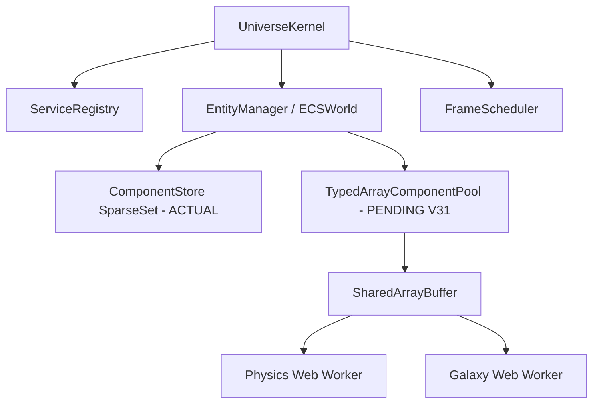

# 📚 NÚCLEO Y ARQUITECTURA (CORE)

```json
{
  "module": "ECSCore",
  "version": "V31_DOD_UPGRADE",
  "dependencies": ["Vector3.js", "Euler.js"],
  "upgrade_from": "SparseSet con objetos JS estándar (Map, Array)",
  "upgrade_to": "Data-Oriented Design con TypedArrays + SharedArrayBuffer",
  "ai_directive": "El ECS actual (SparseSet en V30) es funcional pero genera GC pressure con muchas entidades. La migración DOD consiste en: (1) Pre-asignar Float32Array para las componentes numéricas críticas (TransformComponent, VelocityComponent, PhysicsComponent), (2) Exponer SharedArrayBuffer para acceso desde Web Workers, (3) Mantener la API legacy 100% compatible. NO borrar ECSWorld ni EntityManager — solo agregar la capa DOD encima.",
  "gc_budget": "0 bytes por frame en el loop de física/render",
  "max_entities": "1,000,000 con DOD vs ~50,000 con objetos JS",
  "thread_model": "Main Thread + Physics Worker + Galaxy Worker via SharedArrayBuffer",
  "files": 26,
  "status": "ECS_DOD_UPGRADE_PENDING"
}
```

> **El cimiento absoluto de OMEGA.** Define el Entity Component System (ECS), el Registro de Servicios y el FrameScheduler.
> **Estado:** ECS SparseSet V30 — Funcional. Upgrade pendiente hacia Data-Oriented Design con TypedArrays.

## 💠 Esquema Conceptual



---

## 🔬 Plan de Upgrade DOD (Data-Oriented Design)

### ¿Qué cambiar y por qué?

| Componente | V30 (Actual) | V31 (Objetivo) | Beneficio |
|------------|-------------|----------------|-----------|
| `TransformComponent` | `{position: Vector3, rotation: Euler}` | `Float32Array[id*9]` = [x,y,z,rx,ry,rz,sx,sy,sz] | Cero GC, cache-friendly |
| `VelocityComponent` | `{velocity: Vector3, angularSpeed: number}` | `Float32Array[id*4]` = [vx,vy,vz,w] | Acceso O(1) en Workers |
| `PhysicsComponent` | `{mass, radius, velocity, isKinematic}` | `Float32Array[id*3]` + `Uint8Array[id]` | SIMD-ready |
| `EntityManager.query()` | Itera array JS de IDs | Itera rango de Uint32Array | 10x más rápido |

### Regla de compatibilidad para la IA:
> No eliminar `ECSWorld` ni `EntityManager`. Agregar `TypedArrayComponentPool` como **capa adicional opcional** que los sistemas de física y galaxia pueden usar directamente, mientras el resto del código sigue usando la API actual `world.addComponent(id, type, data)`.

---

## 🔬 Contratos de Interface — ECS DOD V31

### Contrato: `TypedArrayComponentPool`

> **AI TASK:** Crear nueva clase `TypedArrayComponentPool` en `EntityManager.js`.
> Debe:
> 1. Pre-asignar `SharedArrayBuffer` con capacidad para `maxEntities` entidades
> 2. Exponer `getView(entityId)` que retorna una sub-vista `Float32Array` del bloque de ese entityId
> 3. NO crear objetos wrapper — retornar vistas directas al buffer binario
> 4. La clase `ECSWorld` existente debe MANTENER su API — TypedArrayComponentPool es opt-in

**Interface esperada:**
```js
class TypedArrayComponentPool {
    // @param {number} maxEntities - Máximo de entidades (default: 65536)
    // @param {number} floatsPerEntity - Campos float por entidad (ej: 9 para Transform)
    constructor(maxEntities, floatsPerEntity) {}

    // Retorna vista Float32Array para los datos de entityId
    // CERO allocations — solo devuelve subarray del SAB
    // @param {number} entityId
    // @returns {Float32Array}
    getView(entityId) {}

    // Pre-asigna campos con valores default para una entidad recién creada
    // @param {number} entityId
    // @param {number[]} defaults - Array de valores iniciales
    init(entityId, defaults) {}

    // Expone el SharedArrayBuffer para pasar a Web Workers via postMessage
    // @returns {SharedArrayBuffer}
    get sharedBuffer() {}
}
```

**Código de implementación inyectable:**
```js
// ═══════════════════════════════════════════════════════════════════
// INYECTAR EN EntityManager.js — TypedArrayComponentPool V31
// Agregar ANTES de la clase ComponentStore, DESPUÉS de los imports
// ═══════════════════════════════════════════════════════════════════

/**
 * TypedArrayComponentPool — DOD Component Storage
 *
 * Pre-asigna un SharedArrayBuffer para almacenamiento binario zero-GC.
 * Compatible con Web Workers — el buffer puede pasarse por referencia.
 * Los sistemas de física y galaxia usan esto en lugar de objetos JS.
 *
 * @example
 * // En CelestialPhysicsSystem:
 * this.transformPool = new TypedArrayComponentPool(65536, 9); // 9 floats: x,y,z,rx,ry,rz,sx,sy,sz
 * const view = this.transformPool.getView(entityId);
 * view[0] = planet.position.x; // Escribe directamente al SAB
 * view[1] = planet.position.y;
 */
export class TypedArrayComponentPool {
    /**
     * @param {number} maxEntities     - Límite de entidades a almacenar
     * @param {number} floatsPerEntity - Cantidad de floats de 32-bit por entidad
     */
    constructor(maxEntities = 65536, floatsPerEntity = 9) {
        this.maxEntities     = maxEntities;
        this.floatsPerEntity = floatsPerEntity;
        this.bytesPerEntity  = floatsPerEntity * 4; // Float32 = 4 bytes

        // SharedArrayBuffer: accesible desde múltiples Workers sin copia
        // NOTA: Requiere COOP/COEP headers en el servidor para habilitarse
        const totalBytes = maxEntities * this.bytesPerEntity;
        
        try {
            this._sab  = new SharedArrayBuffer(totalBytes);
            this._data = new Float32Array(this._sab);
            console.log(`[TypedArrayPool] SharedArrayBuffer allocated: ${(totalBytes / 1024).toFixed(1)} KB`);
        } catch (e) {
            // Fallback si COOP/COEP no están configurados
            console.warn('[TypedArrayPool] SharedArrayBuffer unavailable. Using ArrayBuffer fallback.', e.message);
            this._sab  = new ArrayBuffer(totalBytes);
            this._data = new Float32Array(this._sab);
        }
    }

    /**
     * Retorna una vista Float32Array de los datos del entityId.
     * CERO allocations — es una vista del buffer existente.
     * @param {number} entityId
     * @returns {Float32Array} Vista de `floatsPerEntity` elementos
     */
    getView(entityId) {
        const offset = entityId * this.floatsPerEntity;
        return this._data.subarray(offset, offset + this.floatsPerEntity);
    }

    /**
     * Inicializa los datos de uma entidad con valores por defecto.
     * @param {number}   entityId
     * @param {number[]} defaults - Array de valores iniciales (length = floatsPerEntity)
     */
    init(entityId, defaults) {
        const view = this.getView(entityId);
        for (let i = 0; i < this.floatsPerEntity && i < defaults.length; i++) {
            view[i] = defaults[i];
        }
    }

    /**
     * Devuelve el SharedArrayBuffer subyacente para pasar a un Web Worker.
     * @returns {SharedArrayBuffer|ArrayBuffer}
     */
    get sharedBuffer() { return this._sab; }

    /**
     * Retorna estadísticas de uso del pool.
     * @returns {Object}
     */
    getStats() {
        const usedBytes = this.maxEntities * this.bytesPerEntity;
        return {
            maxEntities: this.maxEntities,
            floatsPerEntity: this.floatsPerEntity,
            totalBytes: usedBytes,
            totalKB: (usedBytes / 1024).toFixed(1),
            isShared: this._sab instanceof SharedArrayBuffer
        };
    }
}

// Pools pre-definidos para los componentes críticos (singleton por módulo)
// Importar según necesite cada sistema.
export const TRANSFORM_POOL = new TypedArrayComponentPool(65536, 9);
// Layout: [posX, posY, posZ, rotX, rotY, rotZ, scaleX, scaleY, scaleZ]

export const VELOCITY_POOL  = new TypedArrayComponentPool(65536, 4);
// Layout: [velX, velY, velZ, angularSpeed]

export const PHYSICS_POOL   = new TypedArrayComponentPool(65536, 3);
// Layout: [mass, radius, isKinematic(0/1)]
```

---

## 📑 Tabla de Contenidos (26 archivos)

- [engine/core/EntityManager.js](#enginecoreentitymanagerjs) (614 líneas | 21.47 KB) — **DOD UPGRADE PENDING**
- [engine/core/BootGraphVisualizer.js](#enginecorebootgraphvisualizerjs) (162 líneas | 4.40 KB)
- [engine/core/SystemManifest.js](#enginecoresystemmanifestjs) (149 líneas | 5.57 KB)
- [engine/core/spatial/SpatialIndexSystem.js](#enginecorespatialspatialindexsystemjs) (146 líneas | 5.05 KB)
- [engine/core/DependencyResolver.js](#enginecoredependencyresolverjs) (141 líneas | 4.58 KB)
- [engine/core/Orquestador.js](#enginecoreorquestadorjs) (114 líneas | 3.30 KB)
- [engine/core/math/Vector3.js](#enginecoremathvector3js) (106 líneas | 2.09 KB)
- [engine/core/BootSequenceDebugger.js](#enginecorebootsequencedebuggerjs) (94 líneas | 2.12 KB)
- [engine/core/OMEGAEngineDevTools.js](#enginecoreomegaenginedevtoolsjs) (93 líneas | 3.21 KB)
- [engine/core/LODManager.js](#enginecorelodmanagerjs) (78 líneas | 2.51 KB)
- [engine/core/ServiceRegistry.js](#enginecoreserviceregistryjs) (78 líneas | 2.53 KB)
- [engine/core/PersistenceSystem.js](#enginecorepersistencesystemjs) (73 líneas | 2.59 KB)
- [engine/core/math/Pool.js](#enginecoremathpooljs) (68 líneas | 1.58 KB)
- [engine/core/spatial/FloatingOriginSystem.js](#enginecorespatialfloatingoriginsystemjs) (67 líneas | 2.36 KB)
- [engine/core/BootSequence.js](#enginecorebootsequencejs) (64 líneas | 2.21 KB)
- [engine/core/DiscoveryLogSystem.js](#enginecorediscoverylogsystemjs) (58 líneas | 1.75 KB)
- [engine/core/HierarchySystem.js](#enginecorehierarchysystemjs) (56 líneas | 1.93 KB)
- [engine/core/MeshSyncSystem.js](#enginecoremeshsyncsystemjs) (53 líneas | 1.95 KB)
- [engine/core/RelativeFrameSystem.js](#enginecorerelativeframesystemjs) (51 líneas | 1.50 KB)
- [engine/core/SectorCoordinateSystem.js](#enginecoresectorcoordinatesystemjs) (48 líneas | 1.71 KB)
- [engine/core/UniverseStateManager.js](#enginecoreuniversestatemanagerjs) (47 líneas | 1.19 KB)
- [engine/core/UniverseIntelligence.js](#enginecoreuniverseintelligencejs) (40 líneas | 1.53 KB)
- [engine/core/FrameScheduler.js](#enginecoreframeschedulerjs) (36 líneas | 0.93 KB)
- [engine/core/galaxy/GalaxyDataSystem.js](#enginecoregalaxygalaxydatasystemjs) (35 líneas | 0.86 KB)
- [engine/core/math/Euler.js](#enginecorematheulerjs) (32 líneas | 0.63 KB)
- [engine/core/UniverseCoordinateMath.js](#enginecoreuniversecoordinatemathjs) (23 líneas | 0.68 KB)

---

## ✅ Verificación DOD Post-Implementación

```js
// En Chrome DevTools:
import { TRANSFORM_POOL, VELOCITY_POOL } from './engine/core/EntityManager.js';

// Verificar que pools están activos
console.log('Transform Pool stats:', TRANSFORM_POOL.getStats());
// Esperado: { maxEntities: 65536, floatsPerEntity: 9, totalKB: '2304.0', isShared: true/false }

// Verificar acceso O(1) sin GC:
const entityId = 42;
const view = TRANSFORM_POOL.getView(entityId);
view[0] = 100.5; // posX — escribe directo al SAB
console.log('posX:', TRANSFORM_POOL.getView(entityId)[0]); // 100.5 — sin copias
```

---

## 📜 Código Fuente de los 26 archivos (Desplegable)

## 📑 Tabla de Contenidos
- [engine/core/EntityManager.js](#enginecoreentitymanagerjs) (614 líneas | 21.47 KB)
- [engine/core/BootGraphVisualizer.js](#enginecorebootgraphvisualizerjs) (162 líneas | 4.40 KB)
- [engine/core/SystemManifest.js](#enginecoresystemmanifestjs) (149 líneas | 5.57 KB)
- [engine/core/spatial/SpatialIndexSystem.js](#enginecorespatialspatialindexsystemjs) (146 líneas | 5.05 KB)
- [engine/core/DependencyResolver.js](#enginecoredependencyresolverjs) (141 líneas | 4.58 KB)
- [engine/core/Orquestador.js](#enginecoreorquestadorjs) (114 líneas | 3.30 KB)
- [engine/core/math/Vector3.js](#enginecoremathvector3js) (106 líneas | 2.09 KB)
- [engine/core/BootSequenceDebugger.js](#enginecorebootsequencedebuggerjs) (94 líneas | 2.12 KB)
- [engine/core/OMEGAEngineDevTools.js](#enginecoreomegaenginedevtoolsjs) (93 líneas | 3.21 KB)
- [engine/core/LODManager.js](#enginecorelodmanagerjs) (78 líneas | 2.51 KB)
- [engine/core/ServiceRegistry.js](#enginecoreserviceregistryjs) (78 líneas | 2.53 KB)
- [engine/core/PersistenceSystem.js](#enginecorepersistencesystemjs) (73 líneas | 2.59 KB)
- [engine/core/math/Pool.js](#enginecoremathpooljs) (68 líneas | 1.58 KB)
- [engine/core/spatial/FloatingOriginSystem.js](#enginecorespatialfloatingoriginsystemjs) (67 líneas | 2.36 KB)
- [engine/core/BootSequence.js](#enginecorebootsequencejs) (64 líneas | 2.21 KB)
- [engine/core/DiscoveryLogSystem.js](#enginecorediscoverylogsystemjs) (58 líneas | 1.75 KB)
- [engine/core/HierarchySystem.js](#enginecorehierarchysystemjs) (56 líneas | 1.93 KB)
- [engine/core/MeshSyncSystem.js](#enginecoremeshsyncsystemjs) (53 líneas | 1.95 KB)
- [engine/core/RelativeFrameSystem.js](#enginecorerelativeframesystemjs) (51 líneas | 1.50 KB)
- [engine/core/SectorCoordinateSystem.js](#enginecoresectorcoordinatesystemjs) (48 líneas | 1.71 KB)
- [engine/core/UniverseStateManager.js](#enginecoreuniversestatemanagerjs) (47 líneas | 1.19 KB)
- [engine/core/UniverseIntelligence.js](#enginecoreuniverseintelligencejs) (40 líneas | 1.53 KB)
- [engine/core/FrameScheduler.js](#enginecoreframeschedulerjs) (36 líneas | 0.93 KB)
- [engine/core/galaxy/GalaxyDataSystem.js](#enginecoregalaxygalaxydatasystemjs) (35 líneas | 0.86 KB)
- [engine/core/math/Euler.js](#enginecorematheulerjs) (32 líneas | 0.63 KB)
- [engine/core/UniverseCoordinateMath.js](#enginecoreuniversecoordinatemathjs) (23 líneas | 0.68 KB)

---
## 📜 Código Fuente (Desplegable)

<h3 id="enginecoreentitymanagerjs">📄 <code>engine/core/EntityManager.js</code></h3>

*Estadísticas: 614 líneas de código, Tamaño: 21.47 KB*

<details>
<summary><strong>🔭 [ Clic para expandir el código fuente ]</strong></summary>

```js
/**
 * EntityManager.js?v=V28_OMEGA_FINAL — V2 REAL ECS
 *
 * Full Entity-Component-System implementation using a Sparse Set architecture.
 *
 * ─── ARCHITECTURE ────────────────────────────────────────────────────────────
 *
 *  ComponentStore<T>
 *    Sparse set per component type. O(1) add / get / remove / has.
 *    Stores data in a dense array for cache-friendly iteration.
 *    Supports both class-based (new API) and string-keyed (legacy API) types.
 *
 *  Query
 *    Cached multi-component query result.
 *    Invalidates when the component stores change.
 *    Re-iterates the smallest store for minimal work.
 *
 *  ECSWorld
 *    Core engine. Creates entities (integer IDs), manages component stores,
 *    caches queries, recycles destroyed entity IDs.
 *    Exposes both the new type-safe API and the legacy string-based API.
 *
 *  System (abstract base class)
 *    Optional base for ECS systems. Declares `static components = [...]`
 *    and `execute(world, delta)`. BootSequence can auto-register these.
 *
 *  EntityManager (legacy wrapper)
 *    Delegates all old calls to an `ECSWorld` instance.
 *    0 breaking changes for current WindowManager / MeshSyncSystem code.
 *
 * ─────────────────────────────────────────────────────────────────────────────
 */

import { Vector3 } from './math/Vector3.js?v=V28_OMEGA_FINAL';
import { Euler } from './math/Euler.js?v=V28_OMEGA_FINAL';


// ═══════════════════════════════════════════════════════════════════
//  COMPONENT STORE — Sparse Set
// ═══════════════════════════════════════════════════════════════════

class ComponentStore {
    constructor() {
        /** @type {any[]} Dense array of component instances */
        this.dense = [];
        /** @type {number[]} Dense index → entity ID */
        this.denseEntityIds = [];
        /** @type {Map<number, number>} Entity ID → dense index */
        this.sparse = new Map();
    }

    /**
     * Add or overwrite a component for an entity.
     * @param {number} entityId
     * @param {any} data
     */
    add(entityId, data) {
        if (this.has(entityId)) {
            // Overwrite in place
            this.dense[this.sparse.get(entityId)] = data;
            return;
        }
        const idx = this.dense.length;
        this.sparse.set(entityId, idx);
        this.dense.push(data);
        this.denseEntityIds.push(entityId);
    }

    /**
     * Remove a component from an entity (swap-with-last for O(1)).
     * @param {number} entityId
     */
    remove(entityId) {
        if (!this.has(entityId)) return;

        const idx      = this.sparse.get(entityId);
        const lastIdx  = this.dense.length - 1;
        const lastEnt  = this.denseEntityIds[lastIdx];

        // 1. Hook of professional disposal — BEFORE SWAP
        const component = this.dense[idx];
        if (component && typeof component.dispose === 'function') {
            try {
                component.dispose();
            } catch (e) {
                console.error(`[ECS] Error disposing component`, e);
            }
        }

        // 2. Swapping with last element for O(1) removal
        this.dense[idx]           = this.dense[lastIdx];
        this.denseEntityIds[idx]  = lastEnt;
        this.sparse.set(lastEnt, idx);

        // 3. Shrink
        this.dense.pop();
        this.denseEntityIds.pop();
        this.sparse.delete(entityId);
    }

    /** @returns {any|undefined} */
    get(entityId) {
        return this.dense[this.sparse.get(entityId)];
    }

    /** @returns {boolean} */
    has(entityId) {
        return this.sparse.has(entityId);
    }

    /** Iterate all component instances */
    [Symbol.iterator]() {
        return this.dense[Symbol.iterator]();
    }
}


// ═══════════════════════════════════════════════════════════════════
//  QUERY — cached multi-component entity list
// ═══════════════════════════════════════════════════════════════════

class Query {
    /**
     * @param {ECSWorld} world
     * @param {Array<string|Function>} types
     */
    constructor(world, types) {
        this._world  = world;
        this._types  = types;
        this._cache  = null;
        this._dirty  = true;
        this._mask   = world._getMask(types);
    }

    invalidate() { this._dirty = true; }

    /**
     * Returns a stable array of entity IDs that have ALL required components.
     * Re-computed only when the store changed since last call.
     * @returns {number[]}
     */
    execute() {
        if (!this._dirty && this._cache) return this._cache;

        const stores = this._types.map(t => this._world._store(t));

        // Iterate the smallest store to minimise work
        const smallest = stores.reduce(
            (a, b) => (a && a.dense.length <= (b ? b.dense.length : Infinity)) ? a : b,
            null
        );

        if (!smallest) { this._cache = []; this._dirty = false; return this._cache; }

        // BITMASK OPTIMIZATION: Use bitwise AND for signature matching
        const mask = this._mask;
        const signatures = this._world._signatures;
        
        this._cache = smallest.denseEntityIds.filter(id => {
            const sig = signatures.get(id) || 0;
            return (sig & mask) === mask;
        });

        this._dirty = false;
        return this._cache;
    }
}


// ═══════════════════════════════════════════════════════════════════
//  ECS WORLD
// ═══════════════════════════════════════════════════════════════════

export class ECSWorld {
    constructor() {
        /** @type {number} */
        this._nextId   = 1;
        /** @type {number[]} Recycled entity IDs */
        this._recycled = [];
        /** @type {Set<number>} Currently alive entities */
        this._alive    = new Set();
        /** @type {Map<string|Function, ComponentStore>} */
        this._stores   = new Map();
        /** @type {Map<string, Query>} key→Query cache */
        this._queries  = new Map();
        /** @type {Map<string|Function, Set<Query>>} Component -> Dependent Queries */
        this._componentQueries = new Map();
        /** @type {Map<number, number>} Entity ID → Bitmask signature */
        this._signatures = new Map();
        /** @type {Map<string|Function, number>} Component -> Bit index */
        this._bitIndices = new Map();
        this._nextBit = 0;
    }

    // ── Entity lifecycle ─────────────────────────────────────────

    /**
     * Create a new entity. Returns an integer ID.
     * @returns {number}
     */
    createEntity() {
        const id = this._recycled.length > 0 ? this._recycled.pop() : this._nextId++;
        this._alive.add(id);
        return id;
    }

    /**
     * Destroy an entity and all its component data.
     * @param {number} entityId
     */
    destroyEntity(entityId) {
        if (!this._alive.has(entityId)) return;
        this._alive.delete(entityId);
        
        // Remove components and track which ones were removed to invalidate queries
        for (const [type, store] of this._stores.entries()) {
            if (store.has(entityId)) {
                store.remove(entityId);
                this._invalidateType(type);
            }
        }

        this._signatures.delete(entityId);
        this._recycled.push(entityId);
    }

    /** @returns {boolean} */
    isAlive(entityId) { return this._alive.has(entityId); }

    /** @returns {number} Count of live entities */
    get entityCount() { return this._alive.size; }

    // ── Component management ─────────────────────────────────────

    /**
     * Add a component instance to an entity.
     * @param {number}           entityId
     * @param {string|Function}  type       String key or class reference
     * @param {any}              [data]     Instance; if omitted, `new type()` is called
     * @returns {this}
     */
    addComponent(entityId, type, data) {
        if (!this._stores.has(type)) {
            this._stores.set(type, new ComponentStore());
        }
        const instance = data !== undefined ? data : (typeof type === 'function' ? new type() : {});
        this._stores.get(type).add(entityId, instance);
        
        // Update signature
        const bit = this._getBit(type);
        this._signatures.set(entityId, (this._signatures.get(entityId) || 0) | bit);
        
        this._invalidateType(type);
        return this;
    }

    /**
     * Remove a component from an entity.
     * @param {number}          entityId
     * @param {string|Function} type
     * @returns {this}
     */
    removeComponent(entityId, type) {
        const store = this._store(type);
        if (store?.has(entityId)) {
            store.remove(entityId);
            const bit = this._getBit(type);
            this._signatures.set(entityId, (this._signatures.get(entityId) || 0) & ~bit);
            this._invalidateType(type);
        }
        return this;
    }

    /**
     * Get a component instance.
     * @param {number}          entityId
     * @param {string|Function} type
     * @returns {any|undefined}
     */
    getComponent(entityId, type) {
        return this._store(type)?.get(entityId);
    }

    /**
     * @param {number}          entityId
     * @param {string|Function} type
     * @returns {boolean}
     */
    hasComponent(entityId, type) {
        return this._store(type)?.has(entityId) ?? false;
    }

    // ── Queries ─────────────────────────────────────────────────

    /**
     * Returns an array of entity IDs that have ALL given component types.
     * Result is cached until any store changes.
     * @param {...(string|Function)} types
     * @returns {number[]}
     */
    query(...types) {
        const key = types.map(t => typeof t === 'function' ? t.name : t).join('|');
        if (!this._queries.has(key)) {
            const q = new Query(this, types);
            this._queries.set(key, q);
            
            // Map types to this query for granular invalidation
            for (const type of types) {
                if (!this._componentQueries.has(type)) {
                    this._componentQueries.set(type, new Set());
                }
                this._componentQueries.get(type).add(q);
            }
        }
        return this._queries.get(key).execute();
    }

    /**
     * Iterate entities with components, yielding `[entityId, comp1, comp2, ...]`.
     * @param {...(string|Function)} types
     * @yields {[number, ...any]}
     */
    *each(...types) {
        const ids     = this.query(...types);
        const stores  = types.map(t => this._store(t));
        for (const id of ids) {
            yield [id, ...stores.map(s => s?.get(id))];
        }
    }

    /**
     * Get all component instances attached to an entity.
     * Returns a plain object keyed by type name (for debugging).
     * @param {number} entityId
     * @returns {Object}
     */
    inspect(entityId) {
        const result = {};
        for (const [type, store] of this._stores) {
            if (store.has(entityId)) {
                const key = typeof type === 'function' ? type.name : type;
                result[key] = store.get(entityId);
            }
        }
        return result;
    }

    // ── Array queries (legacy-compatible) ────────────────────────

    /**
     * Legacy: returns array of entity-like objects `{id, components:{}}`.
     * Keeps MeshSyncSystem and WindowManager working without changes.
     * @param {...string} componentNames
     * @returns {Array<{id:number, components:Object}>}
     */
    getEntitiesWith(...componentNames) {
        return this.query(...componentNames).map(id => ({
            id,
            components: Object.fromEntries(
                componentNames.map(n => [n, this.getComponent(id, n)])
            )
        }));
    }

    // ── Internals ────────────────────────────────────────────────

    /** @returns {ComponentStore|undefined} */
    _store(type) { return this._stores.get(type); }

    _getBit(type) {
        if (!this._bitIndices.has(type)) {
            if (this._nextBit >= 31) {
                console.warn('[ECS] Max component types (31) reached for bitmask optimization. Falling back for new types.');
                return 0; // Or implement bitmask groups/BigInt
            }
            this._bitIndices.set(type, 1 << this._nextBit++);
        }
        return this._bitIndices.get(type);
    }

    _getMask(types) {
        return types.reduce((mask, type) => mask | this._getBit(type), 0);
    }

    _invalidateType(type) {
        const queries = this._componentQueries.get(type);
        if (queries) {
            for (const q of queries) q.invalidate();
        }
    }

    _invalidateAll() {
        for (const q of this._queries.values()) q.invalidate();
    }

    /** Debug: print entity / component stats to console */
    debug() {
        console.group('[ECSWorld] Debug');
        console.log(`Alive entities : ${this._alive.size}`);
        console.log(`Recycled IDs   : ${this._recycled.length}`);
        const rows = [...this._stores.entries()].map(([type, store]) => ({
            component: typeof type === 'function' ? type.name : type,
            count:     store.dense.length
        }));
        console.table(rows);
        console.groupEnd();
    }
}


// ═══════════════════════════════════════════════════════════════════
//  SYSTEM BASE CLASS
// ═══════════════════════════════════════════════════════════════════

/**
 * Optional base class for ECS systems.
 *
 * @example
 * class MovementSystem extends System {
 *   static components = [TransformComponent, VelocityComponent];
 *
 *   execute(world, delta) {
 *     for (const [id, transform, velocity] of world.each(...MovementSystem.components)) {
 *       transform.position.addScaledVector(velocity.velocity, delta);
 *     }
 *   }
 * }
 */
export class System {
    /** @type {Array<string|Function>} Override in subclass */
    static components = [];
    
    /** @type {string} Execution phase (input, simulation, physics, navigation, render, post) */
    static phase = 'simulation';

    /** Called once at boot. @param {ECSWorld} world */
    init(world) {}

    /**
     * Called every frame by SystemRegistry._runPhase('update').
     * @param {number} delta
     * @param {number} time
     * @param {ECSWorld} world
     */
    update(delta, time, world) {
        const actualWorld = world || (typeof window !== 'undefined' ? window.__OMEGA_WORLD__ : null);
        this.execute(actualWorld, delta, time);
    }

    /**
     * Your system logic goes here. Override this.
     * @param {ECSWorld}  world
     * @param {number}    delta
     * @param {number}    time
     */
    execute(world, delta, time) {}

    /**
     * Called when the system is removed or the engine shuts down.
     * Use this to remove event listeners or dispose logic resources.
     */
    destroy() {}
}


// ═══════════════════════════════════════════════════════════════════
//  LEGACY EntityManager WRAPPER
//  Delegates to ECSWorld so existing code needs zero changes.
// ═══════════════════════════════════════════════════════════════════

export class EntityManager {
    constructor() {
        /** @type {ECSWorld} */
        this.world = new ECSWorld();
    }

    // ── Legacy API ────────────────────────────────────────────────

    /**
     * Create entity. Returns a legacy-compatible entity object `{id}`.
     */
    create() {
        const id = this.world.createEntity();
        // Return an object with .id so legacy code (WindowManager) still works
        return { id };
    }

    /**
     * Add component. Accepts either an entity object `{id}` or a bare id number.
     */
    addComponent(entity, name, component) {
        const id = typeof entity === 'object' ? entity.id : entity;
        this.world.addComponent(id, name, component);
    }

    removeComponent(entity, name) {
        const id = typeof entity === 'object' ? entity.id : entity;
        this.world.removeComponent(id, name);
    }

    getEntities() {
        return [...this.world._alive].map(id => ({ id, components: this.world.inspect(id) }));
    }

    destroy(entityOrId) {
        const id = typeof entityOrId === 'object' ? entityOrId.id : entityOrId;
        this.world.destroyEntity(id);
    }

    getEntitiesWith(...componentNames) {
        return this.world.getEntitiesWith(...componentNames);
    }

    // ── New API passthrough (for progressive migration) ──────────

    /** @returns {ECSWorld} */
    getWorld() { return this.world; }

    get entityCount() { return this.world.entityCount; }

    debug() { this.world.debug(); }
}


// ═══════════════════════════════════════════════════════════════════
//  BUILT-IN COMPONENTS
// ═══════════════════════════════════════════════════════════════════

export class TransformComponent {
    constructor() {
        this.position = new Vector3();
        this.rotation = new Euler();
        this.scale    = new Vector3(1, 1, 1);
    }
}

export class VelocityComponent {
    constructor() {
        this.velocity     = new Vector3();
        this.angularSpeed = 0;
    }
}

export class WindowComponent {
    constructor(url = '') {
        this.url      = url;
        this.isOpen   = true;
        this.isPinned = false;
    }
}

export class MeshComponent {
    /**
     * @param {THREE.Object3D} mesh
     */
    constructor(mesh = null) {
        this.mesh = mesh;
    }

    dispose() {
        if (this.mesh) {
            // Use the kernel registry to get RenderPipeline instead of dynamic import
            // This is safer and prevents async GC pressure
            const pipeline = this.mesh.__registry?.get('RenderPipeline');
            if (pipeline) {
                pipeline.constructor.disposeObject(this.mesh);
            }
        }
    }
}

export class PhysicsComponent {
    constructor() {
        this.mass        = 1;
        this.radius      = 10;
        this.velocity    = new Vector3();
        this.isKinematic = false;
    }
}

export class CelestialBodyComponent {
    constructor(type = 'PLANET', orbitRadius = 0, orbitSpeed = 0.1) {
        this.type        = type;          // 'MEGASUN' | 'BLUESUN' | 'PLANET' | 'MOON'
        this.orbitRadius = orbitRadius;
        this.orbitSpeed  = orbitSpeed;
        this.orbitAngle  = Math.random() * Math.PI * 2;
    }
}

export class TagComponent {
    /**
     * Lightweight marker component — no data, just presence signals membership.
     * @param {...string} tags
     */
    constructor(...tags) {
        this.tags = new Set(tags);
    }
    has(tag) { return this.tags.has(tag); }
}

export class HierarchyComponent {
    /**
     * @param {number|null} parent
     */
    constructor(parent = null) {
        /** @type {number|null} */
        this.parent = parent;
        /** @type {Set<number>} */
        this.children = new Set();
        /** @type {boolean} Force update of children */
        this.dirty = true;
    }
}

```

</details>

---

<h3 id="enginecorebootgraphvisualizerjs">📄 <code>engine/core/BootGraphVisualizer.js</code></h3>

*Estadísticas: 162 líneas de código, Tamaño: 4.40 KB*

<details>
<summary><strong>🔭 [ Clic para expandir el código fuente ]</strong></summary>

```js
/**
 * BootGraphVisualizer.js — OMEGA Engine Tooling
 *
 * Visualizes system dependency graphs directly in DevTools.
 * Compatible with DependencyResolver manifest format.
 *
 * Features:
 *   - Boot order visualization
 *   - Dependency tree rendering
 *   - Cycle highlighting
 *   - DevTools console graph
 */

import { DependencyResolver } from './DependencyResolver.js';

export class BootGraphVisualizer {

    /**
     * Render a dependency tree starting from root systems
     */
    static drawTree(manifest) {
        const names = Object.keys(manifest);
        const depsMap = {};
        const reverse = {};

        for (const name of names) {
            depsMap[name] = manifest[name].dependencies || manifest[name].deps || [];
            reverse[name] = [];
        }

        // Build reverse graph
        for (const sys of names) {
            for (const dep of depsMap[sys]) {
                if (reverse[dep]) {
                    reverse[dep].push(sys);
                }
            }
        }

        const roots = names.filter(n => depsMap[n].length === 0);

        console.group('%c🌌 OMEGA Boot Dependency Tree', 'color:#00eaff;font-weight:bold');
        for (const root of roots) {
            this._printNode(root, reverse, "", new Set());
        }
        console.groupEnd();
    }

    static _printNode(node, reverse, prefix, visited) {
        const branch = prefix ? "└─ " : "";
        console.log(prefix + branch + node);

        if (visited.has(node)) {
            console.warn(prefix + "   ↺ cycle detected");
            return;
        }

        visited.add(node);
        const children = reverse[node] || [];

        for (let i = 0; i < children.length; i++) {
            const child = children[i];
            const nextPrefix = prefix + "   ";
            this._printNode(child, reverse, nextPrefix, new Set(visited));
        }
    }

    /**
     * Render linear boot order
     */
    static showBootOrder(manifest) {
        const order = DependencyResolver.resolve(manifest);

        console.group('%c🚀 OMEGA Boot Order', 'color:#8aff00;font-weight:bold');
        order.forEach((name, i) => {
            console.log(
                `%c${String(i + 1).padStart(2,"0")} → ${name}`,
                "color:#8aff00"
            );
        });
        console.groupEnd();

        return order;
    }

    /**
     * Detect cycles with visual output
     */
    static detectCycles(manifest) {
        const names = Object.keys(manifest);
        const graph = {};

        for (const name of names) {
            graph[name] = manifest[name].dependencies || manifest[name].deps || [];
        }

        const visited = new Set();
        const stack = new Set();
        const cycles = [];

        const dfs = (node, path) => {
            if (stack.has(node)) {
                const cycle = path.slice(path.indexOf(node));
                cycles.push([...cycle, node]);
                return;
            }

            if (visited.has(node)) return;

            visited.add(node);
            stack.add(node);

            for (const dep of graph[node]) {
                dfs(dep, [...path, node]);
            }

            stack.delete(node);
        };

        for (const name of names) {
            dfs(name, []);
        }

        if (cycles.length === 0) {
            console.log(
                "%c✓ No circular dependencies detected",
                "color:#00ff9c;font-weight:bold"
            );
        } else {
            console.group(
                "%c⚠ OMEGA Cycle Detection",
                "color:#ff3c3c;font-weight:bold"
            );
            cycles.forEach(cycle => {
                console.log(
                    "%c" + cycle.join(" → "),
                    "color:#ff3c3c;font-weight:bold"
                );
            });
            console.groupEnd();
        }

        return cycles;
    }

    /**
     * Full engine graph audit
     */
    static audit(manifest) {
        console.group(
            "%c🌌 OMEGA ENGINE GRAPH AUDIT",
            "background:#111;color:#00eaff;font-weight:bold"
        );
        this.showBootOrder(manifest);
        console.log("");
        this.drawTree(manifest);
        console.log("");
        this.detectCycles(manifest);
        console.groupEnd();
    }
}

```

</details>

---

<h3 id="enginecoresystemmanifestjs">📄 <code>engine/core/SystemManifest.js</code></h3>

*Estadísticas: 149 líneas de código, Tamaño: 5.57 KB*

<details>
<summary><strong>🔭 [ Clic para expandir el código fuente ]</strong></summary>

```js
import { Registry } from './ServiceRegistry.js';

/**
 * SystemManifest.js
 * OMEGA V28 Master Edition — Core Architecture
 */

// --- SHARED SERVICES REGISTRY (V15) ---
const SERVICES = {
    kernel: null,
    registry: null,
    events: null,
    scheduler: null
};

// --- SYSTEM FACTORIES (V15 COMPLIANT) ---
const FACTORIES = {
    // 1. Foundation
    SceneGraph: ({ services }) => import('../rendering/SceneGraph.js?v=V28_OMEGA_FINAL').then(m => new m.SceneGraph(services)),
    RenderPipeline: ({ services }) => import('../rendering/RenderPipeline.js?v=V28_OMEGA_FINAL').then(m => new m.RenderPipeline(services)),
    CameraSystem: ({ services }) => import('../navigation/CameraSystem.js?v=V28_OMEGA_FINAL').then(m => new m.CameraSystem(services)),
    SpatialIndexSystem: ({ services }) => import('../core/spatial/SpatialIndexSystem.js?v=V28_OMEGA_FINAL').then(m => new m.SpatialIndexSystem(services)),
    InstancedRenderSystem: ({ services }) => import('../rendering/InstancedRenderSystem.js?v=V28_OMEGA_FINAL').then(m => new m.InstancedRenderSystem(services)),
    CameraController: ({ services }) => import('../navigation/CameraController.js?v=V28_OMEGA_FINAL').then(m => new m.CameraController(services)),
    
    // 2. Input & Interaction
    SpatialInputSystem: ({ services }) => import('../input/SpatialInputSystem.js?v=V28_OMEGA_FINAL').then(m => new m.SpatialInputSystem(services)),
    
    // 3. Universe Simulation
    GalaxyDataSystem: ({ services }) => import('./galaxy/GalaxyDataSystem.js?v=V28_OMEGA_FINAL').then(m => new m.GalaxyDataSystem(services)),
    CelestialPhysicsSystem: ({ services }) => import('../physics/CelestialPhysicsSystem.js?v=V28_OMEGA_FINAL').then(m => new m.CelestialPhysicsSystem(services)),
    CelestialHierarchySystem: ({ services }) => import('../ui/CelestialHierarchySystem.js?v=V28_OMEGA_FINAL').then(m => new m.CelestialHierarchySystem(services)),
    CinematicCameraSystem: ({ services }) => import('../navigation/CinematicCameraSystem.js?v=V28_OMEGA_FINAL').then(m => new m.CinematicCameraSystem(services)),
    GalaxyGenerator: ({ services }) => import('../universe/GalaxyGenerator.js?v=V28_OMEGA_FINAL').then(m => new m.GalaxyGenerator(services)),
    CosmicBackgroundSystem: ({ services }) => import('../rendering/CosmicBackgroundSystem.js?v=V28_OMEGA_FINAL').then(m => new m.CosmicBackgroundSystem(services)),
    
    // 5. HUD & Sensory
    PerformancePanel: ({ services }) => import('../ui/PerformancePanel.js?v=V28_OMEGA_FINAL').then(m => new m.PerformancePanel(services)),
    
    // External/Virtual
    CelestialRegistry: ({ services }) => Promise.resolve(Registry.get('CelestialRegistry'))
};

export const SYSTEM_MANIFEST = {
    // --- TIER 1: FOUNDATION ---
    SceneGraph: {
        dependencies: [],
        factory: FACTORIES.SceneGraph,
        priority: 100
    },
    RenderPipeline: {
        dependencies: ['SceneGraph'],
        factory: FACTORIES.RenderPipeline,
        priority: 95
    },
    CameraSystem: {
        dependencies: ['SceneGraph'],
        factory: FACTORIES.CameraSystem,
        priority: 90
    },
    SpatialIndexSystem: {
        dependencies: [],
        factory: FACTORIES.SpatialIndexSystem,
        priority: 88
    },
    InstancedRenderSystem: {
        dependencies: ['SceneGraph'],
        factory: FACTORIES.InstancedRenderSystem,
        priority: 87
    },
    CameraController: {
        dependencies: ['CameraSystem'],
        factory: FACTORIES.CameraController,
        priority: 86
    },

    // --- TIER 2: INPUT & CORE LOGIC ---
    SpatialInputSystem: {
        dependencies: [],
        factory: FACTORIES.SpatialInputSystem,
        priority: 85
    },

    // --- TIER 3: UNIVERSE & PHYSICS ---
    GalaxyDataSystem: {
        dependencies: [],
        factory: FACTORIES.GalaxyDataSystem,
        priority: 72
    },
    CelestialPhysicsSystem: {
        dependencies: ['SceneGraph', 'CameraSystem'],
        factory: FACTORIES.CelestialPhysicsSystem,
        priority: 70
    },
    CelestialHierarchySystem: {
        dependencies: ['SceneGraph'],
        factory: FACTORIES.CelestialHierarchySystem,
        priority: 65
    },
    CelestialOrbitSystem: {
        dependencies: ['CelestialHierarchySystem'],
        factory: FACTORIES.CelestialOrbitSystem,
        priority: 60
    },
    GalaxyGenerator: {
        dependencies: ['CelestialHierarchySystem', 'GalaxyDataSystem'],
        factory: FACTORIES.GalaxyGenerator,
        priority: 55
    },
    CosmicBackgroundSystem: {
        dependencies: ['SceneGraph', 'CameraSystem'],
        factory: FACTORIES.CosmicBackgroundSystem,
        priority: 50
    },

    // --- TIER 6: SENSORY & HUD ---
    PerformancePanel: {
        dependencies: ['SceneGraph'],
        factory: FACTORIES.PerformancePanel,
        priority: 0
    },
    CelestialRegistry: {
        dependencies: [],
        factory: FACTORIES.CelestialRegistry,
        priority: 110 // Base system
    }
};

/**
 * Validates the manifest integrity.
 */
export function auditManifest(manifest = SYSTEM_MANIFEST) {
    const keys = Object.keys(manifest);
    console.log(`[ManifestAudit] Validating ${keys.length} engine systems...`);
    
    keys.forEach(key => {
        const entry = manifest[key];
        if (!entry.factory) console.error(`[ManifestAudit] ❌ ERROR: "${key}" is missing factory function!`);
        
        entry.dependencies.forEach(dep => {
            if (!manifest[dep]) {
                console.error(`[ManifestAudit] ❌ ERROR: "${key}" depends on "${dep}", but "${dep}" is not in manifest!`);
            }
        });
    });
    
    console.log('[ManifestAudit] Audit complete. Architecture is coherent.');
}

```

</details>

---

<h3 id="enginecorespatialspatialindexsystemjs">📄 <code>engine/core/spatial/SpatialIndexSystem.js</code></h3>

*Estadísticas: 146 líneas de código, Tamaño: 5.05 KB*

<details>
<summary><strong>🔭 [ Clic para expandir el código fuente ]</strong></summary>

```js
/**
 * SpatialIndexSystem.js
 * OMEGA V28 Master Edition — Foundation Layer
 */
import * as THREE from 'https://unpkg.com/three@0.132.2/build/three.module.js?v=V28_OMEGA_FINAL';

export class SpatialIndexSystem {
    static phase = 'foundation';

    constructor(services) {
        this.services = services;
        /** @private Cell size (km) */
        this._gridSize = 10000;
        /** @private Map<number, GridCell> - Key: Numeric Hash */
        this._cells = new Map();
        /** @private Map<number, number> - EntityId -> CellHash */
        this._entityLocations = new Map();
        
        // Cache & Pre-allocation
        this._tempBox = new THREE.Box3();
        this._lastFrustumHash = 0;
        this._cachedResults = [];
        this._lastUpdateTick = 0;
    }

    /**
     * Compact 64-bit style hash for 3D coordinates.
     * Maps x,y,z into a single numeric key for Map performance.
     */
    _hashCoords(x, y, z) {
        // We use a simple bit-shift for a 20-bit range per axis (approx +/- 500k units)
        // For infinite galaxy, we can use a more robust Cantor-like pairing if needed.
        return (x + 0x80000) | ((y + 0x80000) << 20) | ((z + 0x80000) << 40);
    }

    init() {
        console.log('[SpatialIndex] OMEGA Unified Sparse-Octree Online.');
    }

    /**
     * Updates an entity's position in the spatial grid and its internal octree-cell.
     * @param {number} entityId 
     * @param {THREE.Vector3} absPos 
     */
    updateEntity(entityId, absPos) {
        const gx = Math.floor(absPos.x / this._gridSize);
        const gy = Math.floor(absPos.y / this._gridSize);
        const gz = Math.floor(absPos.z / this._gridSize);
        const cellHash = this._hashCoords(gx, gy, gz);

        const oldHash = this._entityLocations.get(entityId);
        if (oldHash === cellHash) return;

        // Cleanup old
        if (oldHash !== undefined) {
            const cell = this._cells.get(oldHash);
            if (cell) cell.entities.delete(entityId);
        }

        // Add to new
        let cell = this._cells.get(cellHash);
        if (!cell) {
            const min = new THREE.Vector3(gx * this._gridSize, gy * this._gridSize, gz * this._gridSize);
            const max = new THREE.Vector3((gx + 1) * this._gridSize, (gy + 1) * this._gridSize, (gz + 1) * this._gridSize);
            
            cell = {
                entities: new Set(),
                bounds: new THREE.Box3(min, max)
            };
            this._cells.set(cellHash, cell);
        }
        
        cell.entities.add(entityId);
        this._entityLocations.set(entityId, cellHash);
        this._resultsDirty = true;
    }

    /**
     * Queries entities within a frustum (Rendering pass).
     * @param {THREE.Frustum} frustum 
     * @returns {number[]}
     */
    queryFrustum(frustum) {
        // Optimization: Invalidate cache only if entities moved or frustum plane hash changed
        const frustumHash = frustum.planes[0].constant ^ frustum.planes[1].constant; 
        if (!this._resultsDirty && frustumHash === this._lastFrustumHash) {
            return this._cachedResults;
        }

        this._cachedResults = [];
        for (const cell of this._cells.values()) {
            if (frustum.intersectsBox(cell.bounds)) {
                for (const id of cell.entities) {
                    this._cachedResults.push(id);
                }
            }
        }

        this._lastFrustumHash = frustumHash;
        this._resultsDirty = false;
        return this._cachedResults;
    }

    /**
     * Queries entities within a range (Streaming/Simulation pass).
     * @param {THREE.Vector3} center 
     * @param {number} range 
     * @returns {number[]}
     */
    queryRange(center, range) {
        const results = [];
        const cellRange = Math.ceil(range / this._gridSize);
        const gx = Math.floor(center.x / this._gridSize);
        const gy = Math.floor(center.y / this._gridSize);
        const gz = Math.floor(center.z / this._gridSize);

        for (let x = -cellRange; x <= cellRange; x++) {
            for (let y = -cellRange; y <= cellRange; y++) {
                for (let z = -cellRange; z <= cellRange; z++) {
                    const hash = this._hashCoords(gx + x, gy + y, gz + z);
                    const cell = this._cells.get(hash);
                    if (cell) {
                        for (const id of cell.entities) {
                            results.push(id);
                        }
                    }
                }
            }
        }
        return results;
    }

    /**
     * Maintenance: Flush empty cells.
     */
    update(delta, time) {
        // Run maintenance intermittently
        if (Math.floor(time) % 10 === 0 && this._lastFlush !== Math.floor(time)) {
            this._lastFlush = Math.floor(time);
            for (const [key, cell] of this._cells.entries()) {
                if (cell.entities.size === 0) this._cells.delete(key);
            }
        }
    }
}

```

</details>

---

<h3 id="enginecoredependencyresolverjs">📄 <code>engine/core/DependencyResolver.js</code></h3>

*Estadísticas: 141 líneas de código, Tamaño: 4.58 KB*

<details>
<summary><strong>🔭 [ Clic para expandir el código fuente ]</strong></summary>

```js
/**
 * DependencyResolver.js
 * OMEGA V28 Master Edition — Core Foundation
 */
export class DependencyResolver {

    /**
     * Resolves a manifest of system descriptors into a deterministic initialization order.
     *
     * @param {Object} manifest - Keyed by system name { dependencies: string[], priority: number }
     * @returns {string[]} Ordered system names
     * @throws {Error} On structural failure or circular dependencies
     */
    static resolve(manifest) {
        const names = Object.keys(manifest);
        const nameSet = new Set(names);

        // 1. Detection of high-level duplicates (Object key collisions handled by JS, but protects against merged manifests)
        if (nameSet.size !== names.length) {
            throw new Error(
                `[DependencyResolver] DUPLICATE SYSTEM NAMES detected in manifest.`
            );
        }

        const inDegree = new Map();
        const adjList  = new Map();
        const priorities = new Map();

        // 2. Structural Validation Pass
        for (const name of names) {
            const entry = manifest[name];

            if (!entry) {
                throw new Error(`[DependencyResolver] Invalid descriptor for "${name}"`);
            }

            if (entry.dependencies && !Array.isArray(entry.dependencies)) {
                throw new Error(
                    `[DependencyResolver] "${name}" dependencies must be an array.`
                );
            }

            if (entry.priority && typeof entry.priority !== "number") {
                throw new Error(
                    `[DependencyResolver] "${name}" priority must be a number.`
                );
            }

            inDegree.set(name, 0);
            adjList.set(name, []);
            priorities.set(name, entry.priority ?? 50);
        }

        // 3. Graph Construction
        for (const name of names) {
            const deps = manifest[name].dependencies || manifest[name].deps || [];

            for (const dep of deps) {
                if (!nameSet.has(dep)) {
                    throw new Error(
                        `[DependencyResolver] FATAL: "${name}" depends on "${dep}", ` +
                        `but "${dep}" is not declared in the manifest.`
                    );
                }

                adjList.get(dep).push(name);
                inDegree.set(name, inDegree.get(name) + 1);
            }
        }

        // 4. Initial Queue (Topological Start Nodes)
        let queue = names
            .filter(name => inDegree.get(name) === 0)
            .sort((a, b) => priorities.get(a) - priorities.get(b));

        const result = [];

        // 5. Resolution Loop (Kahn's)
        while (queue.length > 0) {
            const current = queue.shift();
            result.push(current);

            for (const dependent of adjList.get(current)) {
                const newDeg = inDegree.get(dependent) - 1;
                inDegree.set(dependent, newDeg);

                if (newDeg === 0) {
                    queue.push(dependent);
                    // Re-sort queue to maintain priority-based initialization
                    queue.sort((a, b) => priorities.get(a) - priorities.get(b));
                }
            }
        }

        // 6. Diagnostics on Failure
        if (result.length !== names.length) {
            const resolvedSet = new Set(result);
            const stuck = names.filter(n => !resolvedSet.has(n));

            throw new Error(
                `[DependencyResolver] CIRCULAR DEPENDENCY DETECTED. ` +
                `Affected systems: [${stuck.join(', ')}]`
            );
        }

        return result;
    }

    /**
     * Alias for resolve().
     */
    static sort(manifest) {
        return this.resolve(manifest);
    }

    /**
     * Resolve and audit the full boot graph.
     *
     * @param {Object} manifest
     * @returns {string[]} Ordered system names
     */
    static audit(manifest) {
        const order = this.resolve(manifest);

        console.group('%c 🌌 OMEGA V28 Boot Graph ', 'background:#111;color:#00f2ff;font-weight:bold');
        console.table(order.map((name, i) => {
            const entry = manifest[name];
            return {
                Step: i + 1,
                System: name,
                Priority: entry?.priority ?? 50,
                Deps: (entry?.dependencies || entry?.deps || []).join(', ') || '—',
                Status: '✓ READY'
            };
        }));
        console.groupEnd();

        return order;
    }
}

```

</details>

---

<h3 id="enginecoreorquestadorjs">📄 <code>engine/core/Orquestador.js</code></h3>

*Estadísticas: 114 líneas de código, Tamaño: 3.30 KB*

<details>
<summary><strong>🔭 [ Clic para expandir el código fuente ]</strong></summary>

```js
import { Registry } from './ServiceRegistry.js';

/**
 * [OMEGA V30] Orquestador.js
 * El "Cerebro" de LULU. Implementa el DevTools Protocol y gestiona la salud del sistema.
 */
export class Orquestador {
    constructor(kernel) {
        this.kernel = kernel;
        this.registry = Registry;
        this.bootTime = Date.now();
        this.status = 'ACTIVE';
    }

    init() {
        console.log('%c🧠 [Orquestador] Enlace Neuronal LULU-Kernel establecido.', 'color:#ff00ff; font-weight:bold;');
        
        // Exponemos el Orquestador globalmente para que LULU pueda llamarlo desde consola o UI
        window.ORQUESTADOR = this;
    }

    /**
     * LULU.inspect_system(name)
     * Devuelve metadatos y estado de un sistema registrado.
     */
    inspect_system(name) {
        try {
            const system = this.Registry.get(name);
            return {
                name: name,
                status: system.isEnabled !== false ? 'RUNNING' : 'DISABLED',
                type: system.constructor.name,
                hasUpdate: typeof system.update === 'function',
                hasInit: typeof system.init === 'function'
            };
        } catch (e) {
            return { error: `Sistema '${name}' no encontrado en el Registro.` };
        }
    }

    /**
     * LULU.system_graph()
     * Devuelve el mapa completo de dependencias ancladas.
     */
    system_graph() {
        const graph = {};
        this.registry._services.forEach((service, name) => {
            graph[name] = {
                className: service.constructor.name,
                isBooted: true
            };
        });
        return graph;
    }

    /**
     * LULU.performance()
     * Extrae métricas vivas del HUDManager.
     */
    performance() {
        const hud = this.Registry.get('HUDManager');
        if (hud) {
            return {
                fps: hud.nodes.fps.textContent,
                drawCalls: hud.nodes.draw.textContent,
                systems: hud.nodes.systems.textContent,
                uptime: `${((Date.now() - this.bootTime) / 1000).toFixed(1)}s`
            };
        }
        return { error: 'HUDManager no disponible para telemetría.' };
    }

    /**
     * LULU.boot_analysis()
     * Verifica la integridad de la Fase 7 del Kernel.
     */
    boot_analysis() {
        const essential = ['camera', 'pipeline', 'physics', 'navigation', 'galaxyGen', 'WindowManager'];
        const report = {
            integrity: 'OPTIMAL',
            missing: []
        };

        essential.forEach(sys => {
            try {
                this.Registry.get(sys);
            } catch (e) {
                report.integrity = 'DEGRADED';
                report.missing.push(sys);
            }
        });

        return report;
    }

    /**
     * LULU.memory()
     * Diagnóstico de consumo de heap.
     */
    memory() {
        if (window.performance && window.performance.memory) {
            const mem = window.performance.memory;
            return {
                total: `${(mem.totalJSHeapSize / 1048576).toFixed(1)} MB`,
                used: `${(mem.usedJSHeapSize / 1048576).toFixed(1)} MB`,
                limit: `${(mem.jsHeapSizeLimit / 1048576).toFixed(1)} MB`
            };
        }
        return { error: 'API de Memoria no soportada por el navegador.' };
    }
}

export default Orquestador;

```

</details>

---

<h3 id="enginecoremathvector3js">📄 <code>engine/core/math/Vector3.js</code></h3>

*Estadísticas: 106 líneas de código, Tamaño: 2.09 KB*

<details>
<summary><strong>🔭 [ Clic para expandir el código fuente ]</strong></summary>

```js
/**
 * Vector3.js?v=V28_OMEGA_FINAL - ZERO DEPENDENCY ENGINE MATH
 */
export class Vector3 {
    constructor(x = 0, y = 0, z = 0) {
        this.x = x;
        this.y = y;
        this.z = z;
    }

    set(x, y, z) {
        this.x = x;
        this.y = y;
        this.z = z;
        return this;
    }

    copy(v) {
        this.x = v.x;
        this.y = v.y;
        this.z = v.z;
        return this;
    }

    clone() {
        return new Vector3(this.x, this.y, this.z);
    }

    add(v) {
        this.x += v.x;
        this.y += v.y;
        this.z += v.z;
        return this;
    }

    addScaledVector(v, s) {
        this.x += v.x * s;
        this.y += v.y * s;
        this.z += v.z * s;
        return this;
    }

    sub(v) {
        this.x -= v.x;
        this.y -= v.y;
        this.z -= v.z;
        return this;
    }

    multiplyScalar(s) {
        this.x *= s;
        this.y *= s;
        this.z *= s;
        return this;
    }

    divideScalar(s) {
        return this.multiplyScalar(1 / s);
    }

    dot(v) {
        return this.x * v.x + this.y * v.y + this.z * v.z;
    }

    cross(v) {
        return this.crossVectors(this, v);
    }

    crossVectors(a, b) {
        const ax = a.x, ay = a.y, az = a.z;
        const bx = b.x, by = b.y, bz = b.z;

        this.x = ay * bz - az * bx;
        this.y = az * bx - ax * bz;
        this.z = ax * by - ay * bx;

        return this;
    }

    length() {
        return Math.sqrt(this.x * this.x + this.y * this.y + this.z * this.z);
    }

    normalize() {
        return this.divideScalar(this.length() || 1);
    }

    distanceTo(v) {
        return Math.sqrt(this.distanceToSquared(v));
    }

    distanceToSquared(v) {
        const dx = this.x - v.x;
        const dy = this.y - v.y;
        const dz = this.z - v.z;
        return dx * dx + dy * dy + dz * dz;
    }

    lerp(v, alpha) {
        this.x += (v.x - this.x) * alpha;
        this.y += (v.y - this.y) * alpha;
        this.z += (v.z - this.z) * alpha;
        return this;
    }
}

```

</details>

---

<h3 id="enginecorebootsequencedebuggerjs">📄 <code>engine/core/BootSequenceDebugger.js</code></h3>

*Estadísticas: 94 líneas de código, Tamaño: 2.12 KB*

<details>
<summary><strong>🔭 [ Clic para expandir el código fuente ]</strong></summary>

```js
/**
 * BootSequenceDebugger.js
 * OMEGA Engine – Boot Profiler
 *
 * Measures system initialization performance during engine boot.
 * Designed to integrate with BootSequence.
 */

export class BootSequenceDebugger {

    static records = [];
    static startTime = 0;

    /**
     * Called when boot begins
     */
    static begin() {
        this.records = [];
        this.startTime = performance.now();

        console.group(
            "%c🚀 OMEGA Boot Profiler",
            "background:#111;color:#00eaff;font-weight:bold"
        );
    }

    /**
     * Measure execution time of a system init
     */
    static async measure(systemName, fn) {
        const t0 = performance.now();
        await fn();
        const t1 = performance.now();

        const duration = t1 - t0;
        this.records.push({
            system: systemName,
            time: duration
        });
    }

    /**
     * Called when boot completes
     */
    static end() {
        const total = performance.now() - this.startTime;

        const table = this.records.map((r, i) => ({
            Step: i + 1,
            System: r.system,
            InitTimeMS: r.time.toFixed(2)
        }));

        console.table(table);

        const slow = [...this.records]
            .sort((a,b)=>b.time-a.time)
            .slice(0,5);

        console.group(
            "%c🐢 Slowest Systems",
            "color:#ffaa00;font-weight:bold"
        );

        slow.forEach(s => {
            console.log(
                `%c${s.system} → ${s.time.toFixed(2)} ms`,
                "color:#ffaa00"
            );
        });

        console.groupEnd();

        console.log(
            `%cTotal Boot Time → ${total.toFixed(2)} ms`,
            "color:#00ff9c;font-weight:bold"
        );

        console.groupEnd();
    }

    /**
     * Return profiling data programmatically
     */
    static getReport() {
        const total = this.records.reduce((a,b)=>a+b.time,0);

        return {
            totalBootTime: total,
            systems: this.records
        };
    }
}

```

</details>

---

<h3 id="enginecoreomegaenginedevtoolsjs">📄 <code>engine/core/OMEGAEngineDevTools.js</code></h3>

*Estadísticas: 93 líneas de código, Tamaño: 3.21 KB*

<details>
<summary><strong>🔭 [ Clic para expandir el código fuente ]</strong></summary>

```js
/**
 * OMEGAEngineDevTools.js
 * OMEGA V28+ Architecture - Diagnostics Layer
 */
export class OMEGAEngineDevTools {
    constructor(kernel) {
        this.kernel = kernel;
        this.container = null;
        this.stats = {
            fps: 0,
            drawCalls: 0,
            triangles: 0,
            memory: 0,
            systems: 0
        };
    }

    init() {
        if (typeof document === 'undefined') return;
        
        console.log("[DevTools] Diagnostic Layer Online.");
        
        this.container = document.createElement('div');
        this.container.id = 'omega-devtools-panel';
        this.container.style.cssText = `
            position: fixed;
            bottom: 20px;
            right: 20px;
            width: 200px;
            background: rgba(0, 10, 20, 0.85);
            border: 1px solid #00f2ff;
            color: #00f2ff;
            font-family: 'OCR A Extended', monospace;
            font-size: 10px;
            padding: 10px;
            box-shadow: 0 0 15px rgba(0, 242, 255, 0.2);
            pointer-events: none;
            z-index: 9999;
            backdrop-filter: blur(5px);
            border-radius: 4px;
        `;
        
        this.container.innerHTML = `
            <div style="border-bottom: 1px solid #00f2ff; margin-bottom: 8px; padding-bottom: 4px; font-weight: bold;">
                OMEGA V28+ TELEMETRY
            </div>
            <div id="omega-stat-fps">FPS: 0</div>
            <div id="omega-stat-dc">DRAW CALLS: 0</div>
            <div id="omega-stat-tri">TRIANGLES: 0</div>
            <div id="omega-stat-mem">MEMORY: 0 MB</div>
            <div id="omega-stat-sys">SYSTEMS: 0</div>
        `;
        
        document.body.appendChild(this.container);
        
        // Polling interaction for stats
        setInterval(() => this.updateDisplay(), 500);
    }

    updateDisplay() {
        if (!this.container) return;

        const renderer = this.kernel.renderer;
        if (renderer) {
            const info = renderer.info;
            this.stats.drawCalls = info.render.calls;
            this.stats.triangles = info.render.triangles;
        }

        this.stats.systems = this.kernel.systems?.systemsArray?.length || 0;
        
        // FPS is handled by FrameScheduler typically, but we can sample
        const fpsElement = document.getElementById('omega-stat-fps');
        if (fpsElement) {
            const delta = this.kernel.scheduler?.delta || 0.016;
            const currentFps = Math.round(1 / delta);
            fpsElement.textContent = `FPS: ${currentFps}`;
        }

        document.getElementById('omega-stat-dc').textContent = `DRAW CALLS: ${this.stats.drawCalls}`;
        document.getElementById('omega-stat-tri').textContent = `TRIANGLES: ${this.stats.triangles.toLocaleString()}`;
        
        if (window.performance && window.performance.memory) {
            const mem = Math.round(performance.memory.usedJSHeapSize / (1024 * 1024));
            document.getElementById('omega-stat-mem').textContent = `MEMORY: ${mem} MB`;
        } else {
            document.getElementById('omega-stat-mem').textContent = `MEMORY: N/A`;
        }

        document.getElementById('omega-stat-sys').textContent = `SYSTEMS: ${this.stats.systems}`;
    }
}

```

</details>

---

<h3 id="enginecorelodmanagerjs">📄 <code>engine/core/LODManager.js</code></h3>

*Estadísticas: 78 líneas de código, Tamaño: 2.51 KB*

<details>
<summary><strong>🔭 [ Clic para expandir el código fuente ]</strong></summary>

```js
import { Registry } from './ServiceRegistry.js';

/**
 * LODManager.js?v=V28_OMEGA_FINAL - OMEGA V28
 * Centralized distance-based detail management.
 */
export class LODManager {
    /** @type {string} */
    static phase = 'streaming';

    constructor(services) {
        this.services = services;
        this._registry = new Map(); // id -> LODData
    }

    init() {
        console.log('[LODManager] Detail Orchestrator Online.');
    }

    /**
     * Register an entity for LOD management.
     * @param {number} entityId 
     * @param {Object} config { levels: [{dist, data}], onSwitch: callback }
     */
    register(entityId, config) {
        this._registry.set(entityId, {
            levels: config.levels.sort((a, b) => a.dist - b.dist),
            currentLevel: -1,
            onSwitch: config.onSwitch
        });
    }

    update(delta, time) {
        const camera = this.Registry.get('CameraSystem')?.getCamera();
        const spatial = this.Registry.get('SpatialIndexSystem');
        const entityManager = Registry.get('EntityManager');
        
        if (!camera || !spatial || !entityManager) return;

        const camPos = camera.position;
        
        // V14 Hierarchical Optimization: Use a larger radius for LOD evaluation
        // stars are checked at great distances, local objects closely.
        const activeIds = spatial.queryRange(camPos, 1000000); // 1,000,000 km radius
        
        for (const id of activeIds) {
            const data = this._Registry.get(id);
            if (!data) continue;

            const transform = entityManager.getWorld().getComponent(id, 'TransformComponent');
            if (!transform) continue;

            const dist = camPos.distanceTo(transform.position);
            
            // Find appropriate LOD level
            let targetLevel = 0;
            for (let i = data.levels.length - 1; i >= 0; i--) {
                if (dist >= data.levels[i].dist) {
                    targetLevel = i;
                    break;
                }
            }

            if (targetLevel !== data.currentLevel) {
                const oldLevel = data.currentLevel;
                data.currentLevel = targetLevel;
                
                // Trigger callback with context
                data.onSwitch({
                    level: data.levels[targetLevel].data,
                    distance: dist,
                    previousLevel: oldLevel
                });
            }
        }
    }
}

```

</details>

---

<h3 id="enginecoreserviceregistryjs">📄 <code>engine/core/ServiceRegistry.js</code></h3>

*Estadísticas: 78 líneas de código, Tamaño: 2.53 KB*

<details>
<summary><strong>🔭 [ Clic para expandir el código fuente ]</strong></summary>

```js
/**
 * [OMEGA V30] ServiceRegistry
 * Patrón: Service Locator / Singleton
 * Propósito: Almacenamiento centralizado y seguro de todos los subsistemas del motor.
 */
export class ServiceRegistry {
    constructor() {
        // Usamos un Map estricto. Esto elimina por completo el error de variables duplicadas.
        this._services = new Map();
        this._waiters = new Map();
    }

    /**
     * Registra un nuevo sistema en el motor.
     * @param {string} name - Nombre único del servicio (ej. 'physics', 'navigation')
     * @param {Object} serviceInstance - La instancia de la clase
     */
    register(name, serviceInstance) {
        if (this._services.has(name)) {
            console.warn(`[ServiceRegistry] Alerta Espacial: El servicio '${name}' ya está registrado. Sobrescribiendo...`);
        }
        this._services.set(name, serviceInstance);
        console.log(`[ServiceRegistry] Sistema anclado exitosamente: ${name}`);

        if (this._waiters.has(name)) {
            this._waiters.get(name).forEach(resolve => resolve(serviceInstance));
            this._waiters.delete(name);
        }
    }

    waitFor(name) {
        if (this._services.has(name)) {
            return Promise.resolve(this._services.get(name));
        }
        return new Promise(resolve => {
            if (!this._waiters.has(name)) {
                this._waiters.set(name, []);
            }
            this._waiters.get(name).push(resolve);
        });
    }

    /**
     * Extrae un sistema para usarlo en otra parte del código.
     * @param {string} name - Nombre del servicio a buscar
     * @returns {Object} La instancia del servicio
     */
    get(name) {
        if (!this._services.has(name)) {
            throw new Error(`[ServiceRegistry] Falla Crítica: El subsistema '${name}' no existe en el registro.`);
        }
        return this._services.get(name);
    }

    /**
     * Limpia todos los servicios registrados.
     */
    clear() {
        this._services.clear();
        console.log('[ServiceRegistry] Todos los sistemas han sido liberados.');
    }

    /**
     * Inicializa todos los servicios que tengan un método init()
     */
    bootAll() {
        this._services.forEach((service, name) => {
            if (typeof service.init === 'function') {
                service.init();
                console.log(`[ServiceRegistry] Secuencia de inicio completada para: ${name}`);
            }
        });
    }
}

// Exportamos una única instancia inmutable para todo el proyecto (Patrón Singleton)
export const Registry = new ServiceRegistry();

```

</details>

---

<h3 id="enginecorepersistencesystemjs">📄 <code>engine/core/PersistenceSystem.js</code></h3>

*Estadísticas: 73 líneas de código, Tamaño: 2.59 KB*

<details>
<summary><strong>🔭 [ Clic para expandir el código fuente ]</strong></summary>

```js
import { Registry } from './ServiceRegistry.js?v=V28_OMEGA_FINAL';
import { events } from '../../core/EventBus.js?v=V28_OMEGA_FINAL';

export class PersistenceSystem {
    constructor() {
        this.STORAGE_KEY = 'universe_os_spatial_memory';
        this.autoSaveInterval = 5000; // 5 seconds
        this.lastState = null;
    }

    init() {
        console.log('[PersistenceSystem] Spatial Memory Active.');
        this.loadState();
        
        // Setup Auto-save
        setInterval(() => this.saveState(), this.autoSaveInterval);
        
        // Listen for critical changes
        events.on('window:pinned', () => this.saveState());
        events.on('window:group:joined', () => this.saveState());
    }

    saveState() {
        const windowManager = Registry.get('WindowManager');
        const hierarchy = Registry.get('SpaceHierarchySystem');
        const cameraSystem = Registry.get('CameraSystem');

        if (!windowManager || !hierarchy || !cameraSystem) return;

        const state = {
            timestamp: Date.now(),
            camera: {
                position: cameraSystem.getCamera().position.toArray(),
                rotation: cameraSystem.getCamera().rotation.toArray()
            },
            windows: Array.from(windowManager.windows.entries()).map(([id, el]) => ({
                id,
                isPinned: windowManager.pinnedWindows.has(id),
                threePos: el.userData.threePos ? el.userData.threePos.toArray() : null,
                groupId: el.userData.groupId || null
            })),
            groups: Array.from(windowManager.windowGroups.entries()).map(([gid, members]) => ({
                id: gid,
                members: Array.from(members)
            }))
        };

        const stateString = JSON.stringify(state);
        if (stateString !== this.lastState) {
            localStorage.setItem(this.STORAGE_KEY, stateString);
            this.lastState = stateString;
            console.log('[PersistenceSystem] State persistent across cosmos.');
        }
    }

    loadState() {
        const data = localStorage.getItem(this.STORAGE_KEY);
        if (!data) return null;

        try {
            const state = JSON.parse(data);
            this.lastState = data;
            console.log('[PersistenceSystem] Restoring previous universe state...');
            return state;
        } catch (e) {
            console.error('[PersistenceSystem] Memory corruption detected.', e);
            return null;
        }
    }
}

export const persistenceSystem = new PersistenceSystem();

```

</details>

---

<h3 id="enginecoremathpooljs">📄 <code>engine/core/math/Pool.js</code></h3>

*Estadísticas: 68 líneas de código, Tamaño: 1.58 KB*

<details>
<summary><strong>🔭 [ Clic para expandir el código fuente ]</strong></summary>

```js
import * as THREE from 'https://unpkg.com/three@0.132.2/build/three.module.js?v=V28_OMEGA_FINAL';

/**
 * Global Math Object Pool - OMEGA V28
 * Eliminates GC spikes by recycling high-frequency objects.
 */
export class VectorPool {
    static _stack = [];
    static _maxSize = 1000;

    /**
     * Acquire a Vector3 from the pool.
     * @returns {THREE.Vector3}
     */
    static acquire() {
        return this._stack.pop() || new THREE.Vector3();
    }

    /**
     * Release a Vector3 back into the pool.
     * @param {THREE.Vector3} v 
     */
    static release(v) {
        if (this._stack.length < this._maxSize) {
            this._stack.push(v.set(0, 0, 0));
        }
    }

    /**
     * Get a temporary Vector3 (must be used immediately).
     * Faster than acquire/release for single-line operations.
     */
    static tmp() {
        if (!this._tmp) this._tmp = new THREE.Vector3();
        return this._tmp;
    }
}

export class QuaternionPool {
    static _stack = [];
    static _maxSize = 200;

    static acquire() {
        return this._stack.pop() || new THREE.Quaternion();
    }

    static release(q) {
        if (this._stack.length < this._maxSize) {
            this._stack.push(q.identity());
        }
    }
}

export class MatrixPool {
    static _stack = [];
    static _maxSize = 100;

    static acquire() {
        return this._stack.pop() || new THREE.Matrix4();
    }

    static release(m) {
        if (this._stack.length < this._maxSize) {
            this._stack.push(m.identity());
        }
    }
}

```

</details>

---

<h3 id="enginecorespatialfloatingoriginsystemjs">📄 <code>engine/core/spatial/FloatingOriginSystem.js</code></h3>

*Estadísticas: 67 líneas de código, Tamaño: 2.36 KB*

<details>
<summary><strong>🔭 [ Clic para expandir el código fuente ]</strong></summary>

```js
import * as THREE from 'three';
import { System } from '../../core/EntityManager.js';
import { Registry } from '../../core/ServiceRegistry.js';

/**
 * FloatingOriginSystem.js
 * OMEGA V-FINAL ECS Infinite Scale Mechanics
 * 
 * Prevents WebGL Floating Point Precision Errors (jittering)
 * by dynamically recentering the universe around the camera
 * whenever it crosses a massive distance threshold.
 */
export class FloatingOriginSystem extends System {
    static phase = 'navigation'; // Executes just before Render to snap camera cleanly

    init(world) {
        this.world = world;
        const kernel = Registry.get('kernel');
        
        this.camera = kernel?.camera;
        this.scene = kernel?.sceneGraph?.scene;
        
        // Umbral en el que se activa el reposicionamiento (Ej: 100,000 unidades)
        this.thresholdSq = 100000 * 100000;
        
        console.log("🛸 [FloatingOriginSystem] Infinite Scale Matrix initialized.");
    }

    execute(world, delta, time) {
        if (!this.camera || !this.scene) return;

        const distanceSq = this.camera.position.lengthSq();

        // Si la cámara excede el límite del grid seguro de float32
        if (distanceSq > this.thresholdSq) {
            this.shiftOrigin();
        }
    }

    shiftOrigin() {
        const offset = this.camera.position.clone();
        
        // 1. Teletransportar la cámara de vuelta al origen Absoluto [0,0,0]
        this.camera.position.set(0, 0, 0);
        this.camera.updateMatrixWorld(true);
        
        let movedNodes = 0;

        // 2. Desplazar todo el universo físico en la dirección opuesta
        // En OMEGA, sceneGraph usa layers, así que movemos los hijos directos del root scene.
        this.scene.children.forEach(child => {
            // Ignoramos la cámara y helpers fijos
            if (child === this.camera || child.isCamera) return;
            if (child.userData && child.userData.isFallback) return;

            child.position.sub(offset);
            child.updateMatrixWorld(true);
            movedNodes++;
        });

        // 3. ECS Sync
        // (Si tuvieramos Componentes de TransformAbsoluto en el World, los restamos aquí)
        
        console.log(`🌌 [FloatingOriginSystem] Universe origin shifted by [${offset.x.toFixed(0)}, ${offset.y.toFixed(0)}, ${offset.z.toFixed(0)}]. ${movedNodes} root nodes translated.`);
    }
}

```

</details>

---

<h3 id="enginecorebootsequencejs">📄 <code>engine/core/BootSequence.js</code></h3>

*Estadísticas: 64 líneas de código, Tamaño: 2.21 KB*

<details>
<summary><strong>🔭 [ Clic para expandir el código fuente ]</strong></summary>

```js
import { DependencyResolver } from './DependencyResolver.js';
import { SYSTEM_MANIFEST } from './SystemManifest.js';
import { BootSequenceDebugger } from './BootSequenceDebugger.js';

/**
 * BootSequence.js
 * OMEGA V15 Deterministic Boot Sequence.
 * Handles the instantiation and initialization of all engine systems
 * based on the dependency graph defined in SYSTEM_MANIFEST.
 */
export class BootSequence {
    constructor(kernel, registry) {
        this.kernel = kernel;
        this.registry = registry;
    }

    /**
     * Orchestrates the complete engine boot process.
     */
    async run() {
        console.log('[BootSequence] Initiating OMEGA V15 protocol...');
        
        try {
            // 1. Resolve deterministic execution order
            const sortedNames = DependencyResolver.resolve(SYSTEM_MANIFEST);
            console.log(`[BootSequence] Resolved boot order for ${sortedNames.length} systems:`, sortedNames);

            // 2. Begin profiling
            BootSequenceDebugger.begin();

            // 3. Sequential instantiation and initialization
            for (const name of sortedNames) {
                const descriptor = SYSTEM_MANIFEST[name];
                
                console.log(`[BootSequence] → [${name}]`);
                
                // Factory-based instantiation
                const instance = await descriptor.factory({ 
                    kernel: this.kernel, 
                    registry: this.registry,
                    services: this.kernel.services 
                });

                // Register in global registry
                this.registry.register(name, instance);

                // Safe initialization with profiling
                if (instance.init) {
                    await BootSequenceDebugger.measure(name, () => instance.init());
                }
            }

            // 4. End profiling
            BootSequenceDebugger.end();

            console.log('🚀 OMEGA protocol complete. System Ready.');
            return true;
        } catch (error) {
            console.error('❌ [BootSequence] FATAL ERROR during protocol execution:', error);
            throw error;
        }
    }
}

```

</details>

---

<h3 id="enginecorediscoverylogsystemjs">📄 <code>engine/core/DiscoveryLogSystem.js</code></h3>

*Estadísticas: 58 líneas de código, Tamaño: 1.75 KB*

<details>
<summary><strong>🔭 [ Clic para expandir el código fuente ]</strong></summary>

```js
import { Registry } from './ServiceRegistry.js';

/**
 * DiscoveryLogSystem.js
 * OMEGA V28 Master Edition — Sensory & HUD
 */
export class DiscoveryLogSystem {
    static phase = 'sensory';
    constructor(services) {
        this.services = services;
        this.events = Registry.get('events');
        this.storageKey = 'powder_galaxy_discovered';
        this.discovered = new Map();
    }

    init() {
        this.load();
        this.events.on('planet:discovered', (data) => this.log(data));
        console.log('[DiscoveryLog] OMEGA Survey Database Online.');
    }

    log(data) {
        if (this.discovered.has(data.id)) return;
        
        this.discovered.set(data.id, data);
        this.save();
        console.log(`[DiscoveryLogSystem] Logged: ${data.name}`);
    }

    save() {
        const payload = JSON.stringify(Array.from(this.discovered.entries()));
        localStorage.setItem(this.storageKey, payload);
    }

    load() {
        const raw = localStorage.getItem(this.storageKey);
        if (raw) {
            try {
                const entries = JSON.parse(raw);
                this.discovered = new Map(entries);
                
                // On load, notify UI systems to redraw existing labels if planets are active
                setTimeout(() => {
                    this.discovered.forEach(data => {
                        this.events.emit('planet:discovered:silent', data);
                    });
                }, 1000); // Wait for LOD system to settle
            } catch (err) {
                console.error('[DiscoveryLogSystem] Load failed:', err);
            }
        }
    }

    getDiscoveries() {
        return Array.from(this.discovered.values());
    }
}

```

</details>

---

<h3 id="enginecorehierarchysystemjs">📄 <code>engine/core/HierarchySystem.js</code></h3>

*Estadísticas: 56 líneas de código, Tamaño: 1.93 KB*

<details>
<summary><strong>🔭 [ Clic para expandir el código fuente ]</strong></summary>

```js
import { System, HierarchyComponent, TransformComponent } from './EntityManager.js?v=V28_OMEGA_FINAL';
import { Registry } from './ServiceRegistry.js';


/**
 * @file HierarchySystem.js?v=V28_OMEGA_FINAL
 * @description Syncs parent-child transforms in the ECS.
 */
export class HierarchySystem extends System {
    static components = [HierarchyComponent, TransformComponent];
    static phase = 'physics'; // Run during physics to ensure transforms are ready for navigation

    constructor(services) {
        super();
        this.services = services;
        this.registry = Registry.get('registry');
    }

    execute(world, delta, time) {
        // Find orphan roots (no parent) and start recursive update
        const entities = world.query(HierarchyComponent, TransformComponent);
        
        for (const id of entities) {
            const hier = world.getComponent(id, HierarchyComponent);
            if (hier.parent === null && hier.dirty) {
                this.updateRecursive(world, id);
            }
        }
    }

    updateRecursive(world, id) {
        const hier = world.getComponent(id, HierarchyComponent);
        const transform = world.getComponent(id, TransformComponent);
        
        if (!hier || !transform) return;

        // Process children
        for (const childId of hier.children) {
            const childHier = world.getComponent(childId, HierarchyComponent);
            const childTransform = world.getComponent(childId, TransformComponent);
            
            if (childTransform) {
                // In a real engine, we'd compute childTransform.worldPosition here
                // For now, marker as processed
            }
            
            if (childHier) {
                childHier.dirty = true; // Cascade dirty flag
                this.updateRecursive(world, childId);
            }
        }
        
        hier.dirty = false;
    }
}

```

</details>

---

<h3 id="enginecoremeshsyncsystemjs">📄 <code>engine/core/MeshSyncSystem.js</code></h3>

*Estadísticas: 53 líneas de código, Tamaño: 1.95 KB*

<details>
<summary><strong>🔭 [ Clic para expandir el código fuente ]</strong></summary>

```js
import { System, TransformComponent, MeshComponent } from './EntityManager.js?v=V28_OMEGA_FINAL';
import { Registry } from './ServiceRegistry.js';


/**
 * MeshSyncSystem — V28 OMEGA
 *
 * Syncs ECS TransformComponent data into Three.js?v=V28_OMEGA_FINAL mesh positions.
 */
export class MeshSyncSystem extends System {
    /** @type {string} */
    static phase = 'render';
    
    static components = [TransformComponent, MeshComponent];

    constructor(services) {
        super();
        this.services = services;
        this.registry = Registry.get('registry');
    }

    execute(world, delta, time) {
        for (const [id, transform, meshComp] of world.each(TransformComponent, MeshComponent)) {
            const mesh = meshComp.mesh;
            if (!mesh) continue;

            if (mesh.parent && mesh.parent.type !== 'Scene' && mesh.parent.name !== 'Universe_Root') {
                // Hierarchical sync: convert world transform to local space
                const localPos = { x: transform.position.x, y: transform.position.y, z: transform.position.z };
                mesh.parent.worldToLocal(localPos);
                mesh.position.set(localPos.x, localPos.y, localPos.z);

                if (transform.rotation && mesh.rotation) {
                    transform.rotation.x = mesh.rotation.x;
                    transform.rotation.y = mesh.rotation.y;
                    transform.rotation.z = mesh.rotation.z;
                }
            } else {
                mesh.position.set(transform.position.x, transform.position.y, transform.position.z);
                if (transform.rotation && mesh.rotation) {
                    mesh.rotation.set(transform.rotation.x, transform.rotation.y, transform.rotation.z);
                }
            }

            if (transform.scale && mesh.scale) {
                mesh.scale.set(transform.scale.x, transform.scale.y, transform.scale.z);
            }
        }
    }
}


```

</details>

---

<h3 id="enginecorerelativeframesystemjs">📄 <code>engine/core/RelativeFrameSystem.js</code></h3>

*Estadísticas: 51 líneas de código, Tamaño: 1.50 KB*

<details>
<summary><strong>🔭 [ Clic para expandir el código fuente ]</strong></summary>

```js
/**
 * RelativeFrameSystem.js
 * OMEGA V28 Master Edition — Navigation Layer
 */
import * as THREE from 'https://unpkg.com/three@0.132.2/build/three.module.js?v=V28_OMEGA_FINAL';

export class RelativeFrameSystem {
    static phase = 'navigation';

    constructor(services) {
        this.services = services;
    }

    init() {
        console.log('[RelativeFrame] OMEGA Coordinate Engine Online.');
    }

    /**
     * Gets the normalized direction from A to B in relative space,
     * immune to global coordinate shifts.
     */
    getRelativeDirection(objectA, objectB) {
        if (!objectA || !objectB) return new THREE.Vector3(0, 1, 0);
        
        return new THREE.Vector3()
            .subVectors(objectB.position, objectA.position)
            .normalize();
    }

    /**
     * Resolves the local orthonormal frame for an object based on its quaternion.
     */
    getLocalFrame(object) {
        const q = object.quaternion;
        
        return {
            forward: new THREE.Vector3(0, 0, -1).applyQuaternion(q).normalize(),
            up: new THREE.Vector3(0, 1, 0).applyQuaternion(q).normalize(),
            right: new THREE.Vector3(1, 0, 0).applyQuaternion(q).normalize()
        };
    }

    /**
     * Calculates the "Horizon Up" vector for an object relative to a gravity source.
     */
    getHorizonUp(object, planet) {
        const toPlanet = this.getRelativeDirection(object, planet);
        return toPlanet.clone().negate();
    }
}

```

</details>

---

<h3 id="enginecoresectorcoordinatesystemjs">📄 <code>engine/core/SectorCoordinateSystem.js</code></h3>

*Estadísticas: 48 líneas de código, Tamaño: 1.71 KB*

<details>
<summary><strong>🔭 [ Clic para expandir el código fuente ]</strong></summary>

```js
/**
 * ==========================================================
 * Powder Galaxy Engine - SectorCoordinateSystem V28 (OMEGA)
 * ==========================================================
 * @file SectorCoordinateSystem.js?v=V28_OMEGA_FINAL
 * @description Fixed-Point Astronomical Math. 
 * Bridges 10^12 km galaxy space to local engine coordinates.
 */
export class SectorCoordinateSystem {
    /** @type {string} */
    static phase = 'simulation';

    constructor(services) {
        this.services = services;
        /** @private One sector = 1 Light Day (~26 billion km) */
        this._sectorSize = 2.592e10; 
    }

    /**
     * Converts an absolute galaxy coordinate to (Sector, Offset).
     * @param {number} absVal 
     * @returns {{sector: number, offset: number}}
     */
    getSectorCoords(absVal) {
        const sector = Math.floor(absVal / this._sectorSize);
        const offset = absVal % this._sectorSize;
        return { sector, offset };
    }

    /**
     * Reconstructs an absolute coordinate from sector data.
     */
    getAbsolute(sector, offset) {
        return (sector * this._sectorSize) + offset;
    }
    
    /**
     * Calculates high-precision distance between two sector-based positions.
     */
    getDistance(posA, posB) {
        // Implementation using double-precision-aware logic
        const dx = (posB.sectorX - posA.sectorX) * this._sectorSize + (posB.offsetX - posA.offsetX);
        const dy = (posB.sectorY - posA.sectorY) * this._sectorSize + (posB.offsetY - posA.offsetY);
        const dz = (posB.sectorZ - posA.sectorZ) * this._sectorSize + (posB.offsetZ - posA.offsetZ);
        return Math.sqrt(dx * dx + dy * dy + dz * dz);
    }
}

```

</details>

---

<h3 id="enginecoreuniversestatemanagerjs">📄 <code>engine/core/UniverseStateManager.js</code></h3>

*Estadísticas: 47 líneas de código, Tamaño: 1.19 KB*

<details>
<summary><strong>🔭 [ Clic para expandir el código fuente ]</strong></summary>

```js
import { events } from '../../core/EventBus.js?v=V28_OMEGA_FINAL';

export const ENGINE_STATES = {
    BOOT: 'BOOT',
    LOGIN: 'LOGIN',
    SYSTEM: 'SYSTEM',
    INTERACTION: 'INTERACTION'
};

export class UniverseStateManager {
    constructor() {
        this.currentState = ENGINE_STATES.BOOT;
    }

    /**
     * Transition to a new state
     * @param {string} newState - Target state from ENGINE_STATES
     * @param {any} data - Optional transition data
     */
    transitionTo(newState, data = {}) {
        if (!ENGINE_STATES[newState]) {
            console.error(`[StateManager] Invalid state: ${newState}`);
            return;
        }

        const oldState = this.currentState;
        this.currentState = newState;
        
        console.log(`[StateManager] Transition: ${oldState} -> ${newState}`);
        
        events.emit('state:changed', {
            oldState,
            newState,
            data
        });

        // Trigger specific state events
        events.emit(`state:${newState.toLowerCase()}`, data);
    }

    getState() {
        return this.currentState;
    }
}

export const stateManager = new UniverseStateManager();

```

</details>

---

<h3 id="enginecoreuniverseintelligencejs">📄 <code>engine/core/UniverseIntelligence.js</code></h3>

*Estadísticas: 40 líneas de código, Tamaño: 1.53 KB*

<details>
<summary><strong>🔭 [ Clic para expandir el código fuente ]</strong></summary>

```js
import { Registry } from './ServiceRegistry.js?v=V28_OMEGA_FINAL';
import { events } from '../../core/EventBus.js?v=V28_OMEGA_FINAL';

export class UniverseIntelligence {
    constructor() {
        this.registry = Registry;
        this.events = events;
        this.constellationNames = [
            'Andromeda Cluster', 'Orion Nebula', 'Cygnus Void', 
            'Centauri Sector', 'Pegasus Array', 'Lyra Group'
        ];
    }

    init() {
        console.log('[UniverseIntelligence] Analytical Core Online.');
        
        events.on('window:pinned', (data) => this.analyzeLocalStructure(data));
        events.on('window:group:joined', (data) => this.generateConstellationName(data));
    }

    analyzeLocalStructure(data) {
        const winManager = Registry.get('WindowManager');
        const hierarchy = Registry.get('SpaceHierarchySystem');
        if (!winManager || !hierarchy) return;

        // Check if many windows are near a specific point
        // (Simplified logic for now)
        console.log(`[UniverseIntelligence] Analyzing spatial patterns around: ${data.id}`);
    }

    generateConstellationName(groupId) {
        const name = this.constellationNames[Math.floor(Math.random() * this.constellationNames.length)];
        console.log(`[UniverseIntelligence] Cluster ${groupId} identified as part of the "${name}".`);
        events.emit('intelligence:constellation:named', { groupId, name });
        return name;
    }
}

export const universeIntelligence = new UniverseIntelligence();

```

</details>

---

<h3 id="enginecoreframeschedulerjs">📄 <code>engine/core/FrameScheduler.js</code></h3>

*Estadísticas: 36 líneas de código, Tamaño: 0.93 KB*

<details>
<summary><strong>🔭 [ Clic para expandir el código fuente ]</strong></summary>

```js
export class FrameScheduler {
    constructor() {
        this.systems = [];
    }

    /**
     * @param {Object} system Modulo con update()
     * @param {string} phase input|simulation|navigation|streaming|render|ui
     */
    register(system, phase) {
        this.systems.push({ system, phase });
        console.log(`[FrameScheduler] Registered: ${system.constructor?.name || 'Anonymous'} -> Phase: ${phase}`);
    }

    update(delta) {
        const phases = [
            "input",
            "simulation",
            "physics",
            "navigation",
            "streaming",
            "render",
            "ui"
        ];

        for (const phase of phases) {
            const phaseSystems = this.systems.filter(s => s.phase === phase);
            for (const s of phaseSystems) {
                if (typeof s.system.update === 'function') {
                    s.system.update(delta);
                }
            }
        }
    }
}

```

</details>

---

<h3 id="enginecoregalaxygalaxydatasystemjs">📄 <code>engine/core/galaxy/GalaxyDataSystem.js</code></h3>

*Estadísticas: 35 líneas de código, Tamaño: 0.86 KB*

<details>
<summary><strong>🔭 [ Clic para expandir el código fuente ]</strong></summary>

```js
/**
 * GalaxyDataSystem.js
 * OMEGA V28 Master Edition — Universe Simulation
 */
export class GalaxyDataSystem {
    static phase = 'simulation';

    constructor(services) {
        this.services = services;
        this.bodies = new Map(); // Global ID -> Data
        this.sectors = new Map();
    }

    init() {
        console.log('[GalaxyDataSystem] OMEGA Galactic Registry Online.');
    }

    registerStar(id, sectorId, position, seed) {
        if (!this.sectors.has(sectorId)) {
            this.sectors.set(sectorId, []);
        }
        const star = { id, sectorId, position, seed };
        this.sectors.get(sectorId).push(star);
        this.bodies.set(id, star);
    }

    getStarsInSector(sectorId) {
        return this.sectors.get(sectorId) || [];
    }

    getStarById(id) {
        return this.bodies.get(id);
    }
}

```

</details>

---

<h3 id="enginecorematheulerjs">📄 <code>engine/core/math/Euler.js</code></h3>

*Estadísticas: 32 líneas de código, Tamaño: 0.63 KB*

<details>
<summary><strong>🔭 [ Clic para expandir el código fuente ]</strong></summary>

```js
/**
 * Euler.js?v=V28_OMEGA_FINAL - ZERO DEPENDENCY ENGINE MATH
 */
export class Euler {
    constructor(x = 0, y = 0, z = 0, order = 'XYZ') {
        this.x = x;
        this.y = y;
        this.z = z;
        this.order = order;
    }

    set(x, y, z, order = this.order) {
        this.x = x;
        this.y = y;
        this.z = z;
        this.order = order;
        return this;
    }

    copy(e) {
        this.x = e.x;
        this.y = e.y;
        this.z = e.z;
        this.order = e.order;
        return this;
    }

    clone() {
        return new Euler(this.x, this.y, this.z, this.order);
    }
}

```

</details>

---

<h3 id="enginecoreuniversecoordinatemathjs">📄 <code>engine/core/UniverseCoordinateMath.js</code></h3>

*Estadísticas: 23 líneas de código, Tamaño: 0.68 KB*

<details>
<summary><strong>🔭 [ Clic para expandir el código fuente ]</strong></summary>

```js
/**
 * @file UniverseCoordinateMath.js?v=V28_OMEGA_FINAL
 * @description Static utilities for Double-Precision Galaxy math.
 */
export class UniverseCoordinateMath {
    /**
     * Subtracts two galaxy positions to get a local 32-bit Vector3.
     * Useful for spawning objects relative to a player.
     */
    static getLocalSub(posA, posB) {
        // Simplified for now, in V30 this will handle 128-bit precision if needed
        return {
            x: (posA.x || 0) - (posB.x || 0),
            y: (posA.y || 0) - (posB.y || 0),
            z: (posA.z || 0) - (posB.z || 0)
        };
    }
    
    static lerp(a, b, t) {
        return a + (b - a) * t;
    }
}

```

</details>

---

