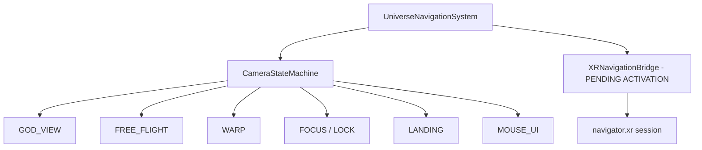
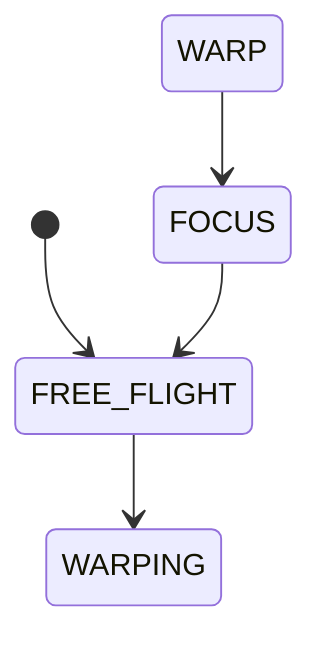

# 📚 NAVEGACIÓN ESTELAR (NAVIGATION)

```json
{
  "module": "NavigationCore",
  "version": "V31_STABLE_XR_READY",
  "dependencies": ["THREE.js", "ServiceRegistry.js", "EntityManager.js", "SpatialInputSystem.js"],
  "upgrade_from": "FSM cámara con estados: GOD_VIEW, WARP, FREE_FLIGHT, FOCUS, MOUSE_UI",
  "upgrade_to": "FSM estable + XRNavigationBridge activado para WebXR + PhysicalFlightSystem mejorado",
  "ai_directive": "Sistema de navegación ESTABLE en V30. No modificar los estados FSM existentes. Para acciones puntuales: (1) Activar XRNavigationBridge conectando al XRSystem del pipeline de render, (2) Agregar haptic feedback en XR controllers al entrar a gravedad/atmósfera, (3) Mejorar PhysicalFlightSystem con inercia y drag vectorial en lugar de frenado global.",
  "states_fsm": ["GOD_VIEW", "FREE_FLIGHT", "WARP", "FOCUS", "LANDING", "MOUSE_UI", "CINEMATIC"],
  "files": 22,
  "status": "STABLE",
  "webxr_bridge": "XRNavigationBridge.js presente — pendiente de activación"
}
```

> **Máquina de Estados de Cámara (FSM)** — Controla God View, Warp Cinematográfico, Free Flight y First Person.
> **Estado:** STABLE V30. WebXR bridge presente pero no activado. Mejoras de inercia de vuelo opcionales.

## 💠 Esquema Conceptual



---

> Máquina de Estados de Cámara (FSM) que controla God View, Warp Cinematográfico y First Person.

## 💠 Esquema Conceptual


## 📑 Tabla de Contenidos
- [engine/navigation/UniverseNavigationSystem.js](#enginenavigationuniversenavigationsystemjs) (1688 líneas | 61.34 KB)
- [engine/navigation/states/FreeFlightState.js](#enginenavigationstatesfreeflightstatejs) (165 líneas | 5.94 KB)
- [engine/navigation/states/FocusState.js](#enginenavigationstatesfocusstatejs) (127 líneas | 4.12 KB)
- [engine/navigation/FloatingOriginSystem.js](#enginenavigationfloatingoriginsystemjs) (112 líneas | 4.07 KB)
- [engine/navigation/AimRaySystem.js](#enginenavigationaimraysystemjs) (111 líneas | 3.67 KB)
- [engine/navigation/HyperspaceSystem.js](#enginenavigationhyperspacesystemjs) (93 líneas | 3.15 KB)
- [engine/navigation/CinematicCameraSystem.js](#enginenavigationcinematiccamerasystemjs) (86 líneas | 2.38 KB)
- [engine/navigation/states/WarpState.js](#enginenavigationstateswarpstatejs) (84 líneas | 2.87 KB)
- [engine/navigation/TravelStateMachine.js](#enginenavigationtravelstatemachinejs) (83 líneas | 3.02 KB)
- [engine/navigation/NavigationSystem.js](#enginenavigationnavigationsystemjs) (81 líneas | 2.69 KB)
- [engine/navigation/CameraStateMachine.js](#enginenavigationcamerastatemachinejs) (77 líneas | 2.34 KB)
- [engine/navigation/LandingSystem.js](#enginenavigationlandingsystemjs) (76 líneas | 2.45 KB)
- [engine/navigation/WarpSystem.js](#enginenavigationwarpsystemjs) (65 líneas | 1.79 KB)
- [engine/navigation/CameraController.js](#enginenavigationcameracontrollerjs) (64 líneas | 1.71 KB)
- [engine/navigation/ThirdPersonCameraSystem.js](#enginenavigationthirdpersoncamerasystemjs) (62 líneas | 2.13 KB)
- [engine/navigation/PawnOrientationSystem.js](#enginenavigationpawnorientationsystemjs) (56 líneas | 1.89 KB)
- [engine/navigation/XRNavigationBridge.js](#enginenavigationxrnavigationbridgejs) (49 líneas | 1.59 KB)
- [engine/navigation/SectorFrameSystem.js](#enginenavigationsectorframesystemjs) (45 líneas | 1.51 KB)
- [engine/navigation/PhysicalFlightSystem.js](#enginenavigationphysicalflightsystemjs) (41 líneas | 1.20 KB)
- [engine/navigation/CameraSystem.js](#enginenavigationcamerasystemjs) (37 líneas | 1.14 KB)
- [engine/navigation/PawnController.js](#enginenavigationpawncontrollerjs) (35 líneas | 0.81 KB)
- [engine/navigation/StubSystems.js](#enginenavigationstubsystemsjs) (28 líneas | 0.77 KB)

---
## 📜 Código Fuente (Desplegable)

<h3 id="enginenavigationuniversenavigationsystemjs">📄 <code>engine/navigation/UniverseNavigationSystem.js</code></h3>

*Estadísticas: 1688 líneas de código, Tamaño: 61.34 KB*

<details>
<summary><strong>🔭 [ Clic para expandir el código fuente ]</strong></summary>

```js
import * as THREE from 'three';
import { gsap } from 'gsap';
import { TrackballControls } from 'three/examples/jsm/controls/TrackballControls.js';

import { CameraStateMachine } from './CameraStateMachine.js';
import { FreeFlightState }    from './states/FreeFlightState.js';
import { WarpState }          from './states/WarpState.js';
import { FocusState }         from './states/FocusState.js';

export const CAMERA_STATES = Object.freeze({
    FREE_FLIGHT: 'FREE_FLIGHT',
    MOUSE_UI: 'MOUSE_UI',
    WARPING: 'WARPING',
    WORLD_FOCUS: 'WORLD_FOCUS',
    STELARYI: 'STELARYI',
    SOLAR_SYSTEM: 'SOLAR_SYSTEM',
    FIRST_PERSON_WALK: 'FIRST_PERSON_WALK',
    MAP_MODE: 'MAP_MODE'
});

export const CAMERA_MODES = CAMERA_STATES;

const FLIGHT_KEYS = new Set([
    'KeyW',
    'KeyA',
    'KeyS',
    'KeyD',
    'Space',
    'ShiftLeft',
    'ShiftRight'
]);

export class UniverseNavigationSystem {
    constructor(camera, scene, domElement = null) {
        this.camera = camera;
        this.scene = scene;
        this.domElement = domElement || document.getElementById('pg-renderer') || document.body;
        this.renderPhase = 'navigation';

        this.renderPhase = 'navigation';

        this.defaultFov = camera.fov;
        this.targetFov = this.defaultFov;
        this.focusFov = 110;
        this.warpKickFov = 140;
        this.baseOrbitDistance = 40;
        this.damping = 5.0;

        this.focusTarget = null;
        this.focusDistance = this.baseOrbitDistance;
        this.focusOffsetDirection = new THREE.Vector3(1, 0.4, 1).normalize();
        this.focusOrbitRotation = new THREE.Quaternion();
        
        this.historyStack = [];
        this.trackballUp = new THREE.Vector3(0, 1, 0);
        
        this.isOrbitDragging = false;
        this.orbitDeltaX = 0;
        this.orbitDeltaY = 0;

        // Solar system mode: manages linear row and reorder control.
        this.solarSystemMode = 'creation';
        this.solarSystemAnchor = null;
        this.solarSystemMasses = [];
        this.solarSystemSelectedIndex = -1;
        this.solarSystemSelected = null;
        this.solarSystemOriginalTransforms = new Map();

        this.freeFlightSpeed = 220;
        this.acceleration = 20;
        this.drag = 14;
        this.lookSensitivity = 0.0018;

        // Adaptive viewport tuning
        this.minFov = 45;
        this.maxFov = 84;
        this.portraitFov = 58;
        this.landscapeFov = 65;

        this.shakeActive = false;
        this.wallpaperTween = null;

        this.cameraRig = new THREE.Object3D();
        this.cameraRig.name = 'CameraRig';
        this.cameraRig.rotation.order = 'YXZ';
        this.cameraRig.position.copy(camera.position);
        this.cameraRig.quaternion.copy(camera.quaternion);

        this.cameraShakeRig = new THREE.Object3D();
        this.cameraShakeRig.name = 'CameraShakeRig';

        this.cameraMount = new THREE.Object3D();
        this.cameraMount.name = 'CameraMount';

        this.cameraRig.add(this.cameraShakeRig);
        this.cameraShakeRig.add(this.cameraMount);
        this.scene.add(this.cameraRig);

        const rigEuler = new THREE.Euler().setFromQuaternion(this.cameraRig.quaternion, 'YXZ');
        this.pitch = rigEuler.x;
        this.yaw = rigEuler.y;

        this.keys = new Set();
        this.velocity = new THREE.Vector3();
        this.inputVector = new THREE.Vector3();
        this.targetVelocity = new THREE.Vector3();
        this.frameDisplacement = new THREE.Vector3();
        this.worldUp = new THREE.Vector3(0, 1, 0);
        this.localXAxis = new THREE.Vector3(1, 0, 0);
        this.localYAxis = new THREE.Vector3(0, 1, 0);

        this.worldTarget = new THREE.Vector3();
        this.desiredRigPosition = new THREE.Vector3();
        this.warpPosition = new THREE.Vector3();
        this.followPosition = new THREE.Vector3();
        this.followQuaternion = new THREE.Quaternion();
        this.targetQuaternion = new THREE.Quaternion();
        this.warpQuaternion = new THREE.Quaternion();
        this.wallpaperQuaternion = new THREE.Quaternion();
        this.warpStartPosition = new THREE.Vector3();
        this.warpStartQuaternion = new THREE.Quaternion();
        this.lookMatrix = new THREE.Matrix4();
        this.objectScale = new THREE.Vector3();
        this.bounds = new THREE.Box3();
        this.boundsSize = new THREE.Vector3();
        this.lookYawQuaternion = new THREE.Quaternion();
        this.lookPitchQuaternion = new THREE.Quaternion();
        this.warpProgress = { value: 0 };
        this.warpTween = null;
        this.warpDuration = 2.0;
        this.stelaryiFov = 38;
        this.stelaryiOrbitLevels = 3;
        this.stelaryiAnchor = null;
        this.stelaryiPlanets = [];
        this.stelaryiSystemCenter = new THREE.Vector3();
        this.stelaryiTargetPosition = new THREE.Vector3();
        this.stelaryiRigPosition = new THREE.Vector3();
        this.stelaryiLookTarget = new THREE.Vector3();
        this.stelaryiViewRadial = new THREE.Vector3();
        this.stelaryiViewTangent = new THREE.Vector3();
        this.stelaryiViewNormal = new THREE.Vector3();
        this.stelaryiPlanetPosition = new THREE.Vector3();
        this.stelaryiSnapshot = {
            active: false,
            anchorLabel: 'Sin masa',
            anchorState: 'Selecciona una masa para organizar el universo.',
            levels: [[], [], []]
        };

        // --- INJECTION: CAMERA STATE MACHINE ---
        this.fsm = new CameraStateMachine(this);
        this.fsm.registerState(CAMERA_STATES.FREE_FLIGHT, new FreeFlightState());
        this.fsm.registerState(CAMERA_STATE.WARP, new WarpState());
        this.fsm.registerState(CAMERA_STATE.FOCUS, new FocusState());
        
        // Replaced Proxy: Routing now happens natively inside the prototype setMode.
        
        this.fsm.changeState(CAMERA_STATES.FREE_FLIGHT);

        this.onKeyDown = this.onKeyDown.bind(this);
        this.onKeyUp = this.onKeyUp.bind(this);
        this.onMouseMove = this.onMouseMove.bind(this);
        this.onWheel = this.onWheel.bind(this);
        this.onPointerLockChange = this.onPointerLockChange.bind(this);

        window.addEventListener('keydown', this.onKeyDown, false);
        window.addEventListener('keyup', this.onKeyUp, false);
        window.addEventListener('mousemove', this.onMouseMove, { passive: true });
        window.addEventListener('wheel', this.onWheel, { passive: true });
        window.addEventListener('pointerdown', this.onPointerDown.bind(this), { passive: true });
        window.addEventListener('pointerup', this.onPointerUp.bind(this), { passive: true });
        document.addEventListener('pointerlockchange', this.onPointerLockChange, false);

        this.domElement.addEventListener('click', () => {
            if (this.state === CAMERA_STATES.STELARYI) {
                this.resumeFreeFlight({ requestPointerLock: false });
            } else if (this.state === CAMERA_STATES.FIRST_PERSON_WALK && document.pointerLockElement !== this.domElement) {
                // El único modo que aún necesita Pointer Lock es la Primera Persona Clásica
                this.requestPointerLock();
            }
        }, { passive: true });

        this._initGodModeControls();
        
        // FASE 4: Unification Navigation Pipeline
        const events = window.Registry?.get('events');
        if (events) {
            events.on('PLANET_SELECTED', ({ object }) => this.setMode(CAMERA_STATES.WARPING, { targetObject: object }));
            events.on('SATELLITE_SELECTED', ({ object }) => this.focusObject(object));
        }
    }

    _initGodModeControls() {
        this.godControls = new TrackballControls(this.camera, this.domElement);

        this.godControls.rotateSpeed = 2.5;
        this.godControls.zoomSpeed = 1.2;

        // Panning inhabilitado: Mantenemos la órbita estricta.
        this.godControls.noZoom = false;
        this.godControls.noPan = true;

        this.godControls.staticMoving = false; 
        this.godControls.dynamicDampingFactor = 0.08; 

        // God View Matrix: Ambos clics actúan como pivotes orbitales (Rotación en ancla).
        this.godControls.mouseButtons = {
            LEFT: THREE.MOUSE.ROTATE,
            MIDDLE: THREE.MOUSE.DOLLY,
            RIGHT: THREE.MOUSE.ROTATE
        };

        this.godControls.enabled = false; 
        
        this._dynamicTargetPos = new THREE.Vector3(); 
        this._previousTargetPos = new THREE.Vector3(); 
    }

    setMode(nextState, options = {}) {
        const {
            clearFocus = nextState !== CAMERA_STATES.WORLD_FOCUS && nextState !== CAMERA_STATES.WARPING && nextState !== CAMERA_STATES.STELARYI,
            requestPointerLock = false,
            force = false
        } = options;

        if (this.state === CAMERA_STATES.WARPING && nextState !== CAMERA_STATES.WARPING && !force) {
            return false;
        }

        if (clearFocus) {
            this.focusTarget = null;
        }

        // Enrutar al FSM si el estado está modernizado
        if (this.fsm && ['FREE_FLIGHT', 'WARPING', 'WORLD_FOCUS'].includes(nextState)) {
             // Limpieza ruda de animaciones GSAP heredadas sobre el rig para evitar terremotos
             if (typeof gsap !== 'undefined') {
                 gsap.killTweensOf(this.cameraRig.position);
                 gsap.killTweensOf(this.cameraRig.quaternion);
             }
             this.fsm.changeState(nextState, options);
        } else {
             // Fallback al sistema legado
             this._applyState(nextState);
        }

        if (nextState === CAMERA_STATES.FREE_FLIGHT) {
            this._killWallpaperDrift();
            this._killMotionTweens();
            this._stopWarpShake();
            this._syncRigEulerFromQuaternion();
            this._setFov(this.defaultFov, 0.45, 'power2.out');
            if (requestPointerLock) {
                this.requestPointerLock();
            }
            return true;
        }

        if (nextState === CAMERA_STATES.MOUSE_UI) {
            this.velocity.set(0, 0, 0);
            this._killWallpaperDrift();
            this._killMotionTweens();
            this._stopWarpShake();
            this._setFov(this.defaultFov, 0.35, 'power2.out');
            if (document.pointerLockElement === this.domElement) {
                document.exitPointerLock?.();
            }
            return true;
        }

        if (nextState === CAMERA_STATES.WARPING) {
            this.velocity.set(0, 0, 0);
            this._killWallpaperDrift();
            if (document.pointerLockElement === this.domElement) {
                document.exitPointerLock?.();
            }
            return true;
        }

        if (nextState === CAMERA_STATES.STELARYI) {
            this.velocity.set(0, 0, 0);
            this._killWallpaperDrift();
            if (document.pointerLockElement === this.domElement) {
                document.exitPointerLock?.();
            }
            return true;
        }

        if (nextState === CAMERA_STATES.WORLD_FOCUS) {
            this.velocity.set(0, 0, 0);
            if (document.pointerLockElement === this.domElement) {
                document.exitPointerLock?.();
            }
            if (this.focusTarget && this.godControls) {
                this.focusTarget.getWorldPosition(this._dynamicTargetPos);
                
                // Initialize offset context
                this.godControls.target.copy(this._dynamicTargetPos);
                if (!this._previousTargetPos) this._previousTargetPos = new THREE.Vector3();
                this._previousTargetPos.copy(this._dynamicTargetPos);
                
                // Muro físico anti-colisión: la cámara no podrá atravesar el mundo
                let collisionRadius = 1;
                if (this.focusTarget.geometry) {
                    if (!this.focusTarget.geometry.boundingSphere) this.focusTarget.geometry.computeBoundingSphere();
                    collisionRadius = this.focusTarget.geometry.boundingSphere.radius;
                }
                const worldScale = Math.max(this.focusTarget.scale.x, this.focusTarget.scale.y, this.focusTarget.scale.z);
                this.godControls.minDistance = collisionRadius * worldScale * 1.05; // 5% de margen sobre el nivel del suelo

                this.godControls.enabled = true;
            }
        }

        if (nextState !== CAMERA_STATES.WORLD_FOCUS && this.godControls) {
            this.godControls.enabled = false;
        }

        return true;
    }

    requestPointerLock() {
        if (!this.domElement.requestPointerLock) {
            return;
        }

        const attemptLock = () => {
            try {
                const result = this.domElement.requestPointerLock({ unadjustedMovement: true });
                if (result && typeof result.then === 'function') {
                    result.catch((err) => {
                        console.warn('[UniverseNavigationSystem] Pointer lock request failed:', err);
                        if (err instanceof DOMException && err.name === 'SecurityError') {
                            setTimeout(attemptLock, 120);
                        }
                    });
                }
            } catch (err) {
                console.warn('[UniverseNavigationSystem] Pointer lock request threw:', err);
                if (err instanceof DOMException && err.name === 'SecurityError') {
                    setTimeout(attemptLock, 120);
                }
            }
        };

        attemptLock();
    }

    enterMouseUIMode() {
        this.setMode(CAMERA_STATES.MOUSE_UI);
    }

    resumeFreeFlight(options = {}) {
        this.setMode(CAMERA_STATES.FREE_FLIGHT, {
            requestPointerLock: options.requestPointerLock !== false
        });
    }

    toggleStelaryi(preferredTarget = null) {
        if (this.state === CAMERA_STATES.WARPING) {
            return false;
        }

        if (this.state === CAMERA_STATES.STELARYI) {
            if (this.focusTarget) {
                this.setMode(CAMERA_STATES.WORLD_FOCUS, {
                    clearFocus: false,
                    force: true
                });
                this._setFov(this.defaultFov, 0.6, 'power2.out');
                return true;
            }

            this.enterMouseUIMode();
            return true;
        }

        const anchor = this._resolveStelaryiTarget(preferredTarget || this.focusTarget);
        if (!anchor) {
            return false;
        }

        this.focusTarget = anchor;
        this.stelaryiAnchor = anchor;
        this._collectStelaryiPlanets();
        this._updateStelaryiSolution();
        this._updateStelaryiSnapshot();

        this.setMode(CAMERA_STATES.STELARYI, {
            clearFocus: false,
            force: true
        });

        this._killMotionTweens();
        this._stopWarpShake();
        this._syncRigEulerFromQuaternion();

        gsap.to(this.cameraRig.position, {
            x: this.stelaryiRigPosition.x,
            y: this.stelaryiRigPosition.y,
            z: this.stelaryiRigPosition.z,
            duration: 1.1,
            ease: 'expo.out'
        });

        gsap.to(this.cameraRig.quaternion, {
            x: this.targetQuaternion.x,
            y: this.targetQuaternion.y,
            z: this.targetQuaternion.z,
            w: this.targetQuaternion.w,
            duration: 1.1,
            ease: 'expo.out',
            onUpdate: () => this.cameraRig.quaternion.normalize()
        });

        this._setFov(this.stelaryiFov, 0.85, 'power3.out');
        return true;
    }

    flyToTarget(targetObject, distanceOffset = 30, completionEventName = null) {
        if (this.state === CAMERA_STATES.WARPING || !targetObject) return;
        this.setMode(CAMERA_STATES.WARPING, { force: true });

        const targetPos = new THREE.Vector3();
        targetObject.getWorldPosition(targetPos);

        const offset = new THREE.Vector3(1, 0.5, 1).normalize().multiplyScalar(distanceOffset);
        const finalPos = targetPos.clone().add(offset);

        gsap.to(this.cameraRig.position, {
            x: finalPos.x,
            y: finalPos.y,
            z: finalPos.z,
            duration: 1.8,
            ease: 'power3.inOut'
        });

        const lookMatrix = new THREE.Matrix4().lookAt(finalPos, targetPos, this.cameraRig.up);
        const targetQuat = new THREE.Quaternion().setFromRotationMatrix(lookMatrix);

        gsap.to(this.cameraRig.quaternion, {
            x: targetQuat.x,
            y: targetQuat.y,
            z: targetQuat.z,
            w: targetQuat.w,
            duration: 1.8,
            ease: 'power3.inOut',
            onComplete: () => {
                this.focusTarget = targetObject;
                this.setMode(CAMERA_STATES.WORLD_FOCUS, { clearFocus: false, force: true });

                if (completionEventName) {
                    window.dispatchEvent(new CustomEvent(completionEventName, { detail: { target: targetObject } }));
                }
            }
        });
    }

    pushCurrentState() {
        if (this.state !== CAMERA_STATES.WARPING) {
            this.historyStack.push({
                state: this.state,
                position: this.cameraRig.position.clone(),
                quaternion: this.cameraRig.quaternion.clone(),
                focusTarget: this.focusTarget,
                fov: this.targetFov
            });
            console.log(`[UniverseNavigationSystem] State saved. Stack size: ${this.historyStack.length}`);
        }
    }

    popState() {
        if (this.historyStack.length === 0 || this.state === CAMERA_STATES.WARPING) return;
        
        const previous = this.historyStack.pop();
        this.focusTarget = null; // Clear to prevent update hooks from interfering
        
        this.setMode(CAMERA_STATES.WARPING, { force: true });
        this._killMotionTweens();
        
        this.warpStartPosition.copy(this.cameraRig.position);
        this.warpStartQuaternion.copy(this.cameraRig.quaternion);
        
        this.desiredRigPosition.copy(previous.position);
        this.warpQuaternion.copy(previous.quaternion);

        this.warpProgress.value = 0;
        
        if (this.warpTween) this.warpTween.kill();
        this.warpTween = gsap.to(this.warpProgress, {
            value: 1,
            duration: 1.5,
            ease: 'power3.inOut',
            onComplete: () => {
                this.warpTween = null;
                this.focusTarget = previous.focusTarget;
                this.targetFov = previous.fov || this.defaultFov;
                this.setMode(previous.state, { force: true });
                console.log(`[UniverseNavigationSystem] Restored to ${previous.state}`);
            }
        });
    }

    doSolarSystemMode() {
        return this.toggleSolarSystem();
    }

    toggleSolarSystem(preferredTarget = null) {
        if (this.state === CAMERA_STATES.SOLAR_SYSTEM) {
            this._exitSolarSystem();
            const target = this.focusTarget;
            // this.setMode(CAMERA_STATES.MOUSE_UI, { clearFocus: false, force: true }); // Removed based on instruction
            if (target) {
                this.focusObject(target); // Changed from setMode to focusObject
            } else { // Added to handle case where focusTarget is null
                this.setMode(CAMERA_STATES.MOUSE_UI, { clearFocus: false, force: true }); // Fallback to MOUSE_UI if no target
            }
            return true;
        }

        const anchor = this._resolveSolarSystemTarget(preferredTarget || this.focusTarget);
        if (!anchor) {
            return false;
        }

        this.solarSystemAnchor = anchor;
        this.focusTarget = anchor;
        this._collectSolarSystemMasses();

        if (!this.solarSystemMasses.length) {
            return false;
        }

        this.solarSystemMode = 'creation';
        this.solarSystemSelectedIndex = 0;
        this.solarSystemSelected = this.solarSystemMasses[0];

        this._layoutSolarSystem(this.solarSystemMode);
        this._updateSolarSystemSnapshot();

        this.setMode(CAMERA_STATES.SOLAR_SYSTEM, { clearFocus: false, force: true });
        this._setFov(52, 0.8, 'power2.out');

        return true;
    }

    _resolveSolarSystemTarget(target) {
        return target || null;
    }

    _collectSolarSystemMasses() {
        this.solarSystemMasses = [];
        this.solarSystemOriginalTransforms.clear();

        let orderCounter = 0;

        this.scene.traverse((object) => {
            if (!object.userData?.isMass) {
                return;
            }

            orderCounter += 1;
            if (object.userData.creationOrder == null) {
                object.userData.creationOrder = orderCounter;
            }
            if (object.userData.priority == null) {
                object.userData.priority = 100 + orderCounter;
            }

            this.solarSystemOriginalTransforms.set(object, {
                parent: object.parent,
                position: object.position.clone(),
                quaternion: object.quaternion.clone(),
                scale: object.scale.clone()
            });

            this.solarSystemMasses.push(object);
        });
    }

    _layoutSolarSystem(orderBy = 'creation') {
        if (!this.solarSystemMasses.length || !this.scene) return;

        const snapshot = [...this.solarSystemMasses];

        snapshot.sort((a, b) => {
            if (orderBy === 'priority') {
                const pa = a.userData?.priority ?? 0;
                const pb = b.userData?.priority ?? 0;
                if (pa !== pb) return pa - pb;
                return (a.userData?.creationOrder ?? 0) - (b.userData?.creationOrder ?? 0);
            }
            const ca = a.userData?.creationOrder ?? 0;
            const cb = b.userData?.creationOrder ?? 0;
            return ca - cb;
        });

        this.solarSystemMasses = snapshot;

        const anchorPos = new THREE.Vector3();
        if (this.solarSystemAnchor) {
            this.solarSystemAnchor.getWorldPosition(anchorPos);
        }

        const count = snapshot.length;
        const spacing = 70;

        for (let i = 0; i < count; i++) {
            const target = snapshot[i];
            const lineOffset = (i - (count - 1) / 2) * spacing;

            const worldTarget = new THREE.Vector3(
                anchorPos.x + lineOffset,
                anchorPos.y,
                anchorPos.z - 160
            );

            this.scene.attach(target);
            target.position.copy(worldTarget);
            target.quaternion.identity();

            if (i === this.solarSystemSelectedIndex) {
                target.scale.setScalar(1.15);
            } else {
                target.scale.setScalar(1.0);
            }
        }
    }

    _exitSolarSystem() {
        if (!this.solarSystemMasses.length) return;

        for (const target of this.solarSystemMasses) {
            const original = this.solarSystemOriginalTransforms.get(target);
            if (!original) continue;

            original.parent.attach(target);
            target.position.copy(original.position);
            target.quaternion.copy(original.quaternion);
            target.scale.copy(original.scale);
        }

        this.solarSystemMasses = [];
        this.solarSystemSelected = null;
        this.solarSystemSelectedIndex = -1;
        this.solarSystemAnchor = null;
        this.solarSystemOriginalTransforms.clear();
    }

    _shiftSolarSystemSelection(offset) {
        if (!this.solarSystemMasses.length) return;

        const maxIndex = this.solarSystemMasses.length - 1;
        this.solarSystemSelectedIndex = Math.min(maxIndex, Math.max(0, this.solarSystemSelectedIndex + offset));
        this.solarSystemSelected = this.solarSystemMasses[this.solarSystemSelectedIndex];
        this._layoutSolarSystem(this.solarSystemMode);
        this._updateSolarSystemSnapshot();
    }

    _moveSelectedSolarMass(direction) {
        if (!this.solarSystemSelected || !this.solarSystemMasses.length) return;

        const from = this.solarSystemSelectedIndex;
        const to = Math.min(this.solarSystemMasses.length - 1, Math.max(0, from + direction));
        if (from === to) return;

        const item = this.solarSystemMasses.splice(from, 1)[0];
        this.solarSystemMasses.splice(to, 0, item);
        this.solarSystemSelectedIndex = to;
        this._layoutSolarSystem(this.solarSystemMode);
        this._updateSolarSystemSnapshot();
    }

    _toggleSolarSystemSort() {
        this.solarSystemMode = this.solarSystemMode === 'creation' ? 'priority' : 'creation';
        this._layoutSolarSystem(this.solarSystemMode);
        this._updateSolarSystemSnapshot();
    }

    _updateSolarSystemSnapshot() {
        this.solarSystemSnapshot = {
            active: this.state === CAMERA_STATES.SOLAR_SYSTEM,
            mode: this.solarSystemMode,
            anchorLabel: this.solarSystemAnchor?.userData?.label || this.solarSystemAnchor?.name || 'Sin masa',
            selected: this.solarSystemSelected?.userData?.label || this.solarSystemSelected?.name || 'Ninguno',
            size: this.solarSystemMasses.length
        };
    }

    getSolarSystemSnapshot() {
        return this.solarSystemSnapshot || {
            active: false,
            mode: 'creation',
            anchorLabel: 'Sin masa',
            selected: 'Ninguno',
            size: 0
        };
    }

    updateSolarSystemTracking() {
        if (!this.solarSystemSelected) return;

        const worldTarget = new THREE.Vector3();
        this.solarSystemSelected.getWorldPosition(worldTarget);

        this.desiredRigPosition
            .copy(worldTarget)
            .add(new THREE.Vector3(0, 30, 90));

        this.cameraRig.position.lerp(this.desiredRigPosition, 0.18);

        this._computeLookQuaternion(this.targetQuaternion, this.cameraRig.position, worldTarget);
        this.cameraRig.quaternion.slerp(this.targetQuaternion, 0.18);
        this._syncRigEulerFromQuaternion();
    }

    unfocusObject() {
        this.focusTarget = null;
        
        // AAA DELEGATION: Liberar el Avatar Control
        const pawnController = window.Registry?.get('pawnController');
        if (pawnController) pawnController.setPawn(null);
        
        const aimRay = window.Registry?.get('aimRay');
        if (aimRay) aimRay.showReticle(false);

        // Mantener la cámara en su posición actual al salir de órbita
        this.cameraRig.position.copy(this.camera.position);
        this.cameraRig.quaternion.copy(this.camera.quaternion);
        this._syncRigEulerFromQuaternion();
        
        this.setMode(CAMERA_STATES.FREE_FLIGHT, { requestPointerLock: false, force: true });
        
        if (this.godControls) {
            this.godControls.enabled = false;
        }
        
        if (this.historyStack.length > 0) {
            this.historyStack.pop(); // Clear the pre-orbit position so we don't warp back to spawn
        }
    }

    focusObject(object) {
        if (!object || this.state === CAMERA_STATES.WARPING) {
            return;
        }

        if (this.state === CAMERA_STATES.MAP_MODE) {
            const physics = window.Registry?.get('kernel')?.physicsSystem;
            if (physics && physics.restoreFromMapMode) {
                physics.restoreFromMapMode();
            }
            if (this._mapModeRotationTween) this._mapModeRotationTween.kill();
        }

        this.pushCurrentState();

        this.focusTarget = object;
        this.focusDistance = this._computeFocusDistance(object);
        
        // AAA TPS Integration: Immediately convert selected mass into the Avatar Sandbox Pawn
        const pawnController = window.Registry?.get('pawnController');
        if (pawnController) {
            pawnController.setPawn(object);
        }
        
        const aimRay = window.Registry?.get('aimRay');
        if (aimRay) {
            aimRay.showReticle(true);
        }
        
        // Deshabilitar controles Trackball para dejarle toda la autoridad de rotación a la masa y TPSCamera
        if (this.godControls) {
            this.godControls.enabled = false;
        }
        
        // Calculate offset direction using Vectors (ArcBall approach)
        const targetWorldPos = new THREE.Vector3();
        this.focusTarget.getWorldPosition(targetWorldPos);
        
        const currentOffset = new THREE.Vector3().subVectors(this.cameraRig.position, targetWorldPos);
        if (currentOffset.lengthSq() > 0.001) {
            currentOffset.normalize();
        } else {
            currentOffset.set(1, 0.4, 1).normalize();
        }
        
        this.focusOffsetDirection.copy(currentOffset);
        
        // Reset absolute trackball 'Up' alignment for a predictable warp approach
        this.trackballUp.copy(this.cameraRig.up).normalize();
        if (this.trackballUp.lengthSq() < 0.001) this.trackballUp.set(0,1,0);

        this._updateFocusSolution();

        this.setMode(CAMERA_STATES.WARPING, {
            clearFocus: false,
            force: true
        });

        this._killMotionTweens();
        this._stopWarpShake();
        this._syncRigEulerFromQuaternion();

        this.warpStartPosition.copy(this.cameraRig.position);
        this.warpStartQuaternion.copy(this.cameraRig.quaternion);
        this.warpProgress.value = 0;

        this.warpFOV();
        this.moveRig();
    }

    enterWallpaperMode() {
        if (this.state === CAMERA_STATES.WARPING) {
            return;
        }

        this.focusTarget = null;
        this.setMode(CAMERA_STATES.MOUSE_UI);
        this._killMotionTweens();
        this._killWallpaperDrift();

        const vantagePosition = new THREE.Vector3(500, 400, 1200);
        const sunPosition = new THREE.Vector3(0, 0, 0);
        this._computeLookQuaternion(this.wallpaperQuaternion, vantagePosition, sunPosition);

        this.wallpaperTween = gsap.to(this.cameraRig.position, {
            x: vantagePosition.x,
            y: vantagePosition.y,
            z: vantagePosition.z,
            duration: 5.2,
            ease: 'expo.inOut',
            onComplete: () => {
                this._startCinematicDrift();
            }
        });

        gsap.to(this.cameraRig.quaternion, {
            x: this.wallpaperQuaternion.x,
            y: this.wallpaperQuaternion.y,
            z: this.wallpaperQuaternion.z,
            w: this.wallpaperQuaternion.w,
            duration: 5.2,
            ease: 'expo.inOut',
            onUpdate: () => this.cameraRig.quaternion.normalize()
        });

        this._setFov(45, 2.6, 'expo.inOut');
    }

    warpFOV() {
        gsap.killTweensOf(this.camera);
        gsap.to(this.camera, {
            fov: this.warpKickFov,
            duration: 0.3,
            ease: 'power4.out',
            onUpdate: () => this.camera.updateProjectionMatrix(),
            onComplete: () => {
                gsap.to(this.camera, {
                    fov: this.focusFov,
                    duration: 0.7,
                    ease: 'power2.out',
                    onUpdate: () => this.camera.updateProjectionMatrix()
                });
            }
        });
    }

    moveRig() {
        this._startWarpShake();
        if (this.warpTween) {
            this.warpTween.kill();
        }

        this.warpTween = gsap.to(this.warpProgress, {
            value: 1,
            duration: this.warpDuration,
            ease: 'expo.inOut',
            onComplete: () => {
                this.warpTween = null;
                this.setMode(CAMERA_STATES.WORLD_FOCUS, {
                    clearFocus: false,
                    force: true
                });
                this.endWarp();
            }
        });
    }
    
    enterFirstPersonWalk(targetMass) {
        if (!targetMass) return;
        
        console.log("[Navigation] Transitioning to First Person Walk on:", targetMass.name);
        this.focusTarget = targetMass;
        
        // Fija la posición inicial cerca de la superficie
        const planetRadius = targetMass.geometry?.boundingSphere?.radius || 1;
        this.focusDistance = planetRadius + 2.0;

        this.setMode(CAMERA_STATES.FIRST_PERSON_WALK, {
            clearFocus: false,
            requestPointerLock: true
        });
    }

    endWarp() {
        this._stopWarpShake();
        gsap.killTweensOf(this.camera);
        gsap.to(this.camera, {
            fov: this.defaultFov,
            duration: 1.2,
            ease: 'elastic.out(1, 0.4)',
            onUpdate: () => this.camera.updateProjectionMatrix(),
            onComplete: () => {
                const appId = this.focusTarget?.userData?.appId || this.focusTarget?.userData?.appName;
                const nodeType = this.focusTarget?.userData?.nodeType || 'unknown';
                if (appId) {
                    window.dispatchEvent(new CustomEvent('WARP_FLIGHT_COMPLETE', {
                        detail: {
                            appId,
                            nodeType,
                            label: this.focusTarget?.userData?.label || this.focusTarget?.userData?.appName || this.focusTarget?.name || appId
                        }
                    }));
                }
            }
        });
    }

    onPointerLockChange() {
        const isLocked = document.pointerLockElement === this.domElement;

        if (isLocked) {
            // Allows both FREE_FLIGHT and WORLD_FOCUS to use pointer lock
            if (this.state !== CAMERA_STATES.FREE_FLIGHT && this.state !== CAMERA_STATES.WORLD_FOCUS) {
                this.setMode(CAMERA_STATES.FREE_FLIGHT, {
                    requestPointerLock: false,
                    force: true
                });
            }
            return;
        }

        if (this.state === CAMERA_STATES.FREE_FLIGHT) {
            this.setMode(CAMERA_STATES.MOUSE_UI, { requestPointerLock: false });
        }
    }

    onWheel(event) {
        // High-Resolution Telescope Zoom for FPS Walk AND Focus modes
        if (this.state === CAMERA_STATES.FIRST_PERSON_WALK) {
            // Modify FOV instead of physical distance
            const zoomDir = Math.sign(event.deltaY);
            const fovStep = 8.0;
            this.targetFov = Math.max(10, Math.min(75, this.targetFov + zoomDir * fovStep));
        } else if (this.state === CAMERA_STATES.WORLD_FOCUS) {
            // Modificamos focusDistance en WORLD_FOCUS
            const fovStep = event.deltaY > 0 ? 1.2 : 0.8;
            this.focusDistance *= fovStep;
        }
    }

    onPointerDown(event) {
        if (this._isTypingTarget(event.target) || this.state === CAMERA_STATES.WARPING) return;

        if (this.state === CAMERA_STATES.WORLD_FOCUS) return;
        if (event.button === 0) {
            this.isOrbitDragging = true;
        }
    }

    onPointerUp(event) {
        if (this.state === CAMERA_STATES.WORLD_FOCUS) return;
        if (event.button === 0) {
            this.isOrbitDragging = false;
        }
    }

    onMouseMove(event) {
        if (this.state === CAMERA_STATES.WORLD_FOCUS) return;
        
        const isLocked = document.pointerLockElement === this.domElement;

        if (this.state !== CAMERA_STATES.FREE_FLIGHT || !isLocked) {
            return;
        }

        const yawDelta = -event.movementX * this.lookSensitivity;
        const pitchDelta = -event.movementY * this.lookSensitivity;

        this.lookYawQuaternion.setFromAxisAngle(this.localYAxis, yawDelta);
        this.lookPitchQuaternion.setFromAxisAngle(this.localXAxis, pitchDelta);

        this.cameraRig.quaternion.multiply(this.lookYawQuaternion);
        this.cameraRig.quaternion.multiply(this.lookPitchQuaternion);
        this.cameraRig.quaternion.normalize();
        this._syncRigEulerFromQuaternion();
    }

    onKeyDown(event) {
        if (this._isTypingTarget(event.target)) return;

        if (FLIGHT_KEYS.has(event.code)) {
            event.preventDefault();
        }
        
        // El nuevo Map Mode de inventario espacial se bindea a la tecla TAB
        if (event.code === 'Tab') {
            event.preventDefault(); // Prevenir navegacion de interfaz
            
            if (this.state === CAMERA_STATES.MAP_MODE) {
                this.exitMapMode();
                return;
            }
            if (this.state === CAMERA_STATES.WORLD_FOCUS) {
                this.enterMapMode();
                return;
            }
            return;
        }

        this.keys.add(event.code);

        // ESC vuelve a ser el botón Home rápido universal (unfocus / escape UI)
        if (event.code === 'Escape') {
            const gm = window.Registry?.get('GameMenuSystem');
            if (gm && gm.isOpen) {
                gm.close();
                return;
            }
            
            const spawner = window.Registry?.get('luluSpawner');
            if (spawner && spawner.editingBody) {
                const uiMenu = document.getElementById('lulu-modeler-panel');
                if (uiMenu) {
                    uiMenu.style.transition = 'opacity 0.2s, transform 0.2s';
                    uiMenu.style.opacity = '0';
                    uiMenu.style.transform = 'scale(0.9)';
                    setTimeout(() => uiMenu.remove(), 200);
                    return; // 1st ESC: Hide menu, keep object
                } else {
                    spawner.exitEditMode(false); // 2nd ESC: Drop object
                    return;
                }
            }

            if (this.state === CAMERA_STATES.MAP_MODE) {
                this.exitMapMode();
                return;
            }
            if (this.state === CAMERA_STATES.SOLAR_SYSTEM) {
                this.toggleSolarSystem();
                return;
            }
            if (this.state === CAMERA_STATES.WORLD_FOCUS || this.state === CAMERA_STATES.STELARYI) {
                this.unfocusObject();
                return;
            }
            if (this.historyStack.length > 0) {
                this.popState();
            } else {
                window.dispatchEvent(new CustomEvent('PG:TOGGLE_GAME_MENU'));
            }
            return;
        }

        if (this.state === CAMERA_STATES.SOLAR_SYSTEM) {
            if (event.code === 'ArrowLeft') {
                this._shiftSolarSystemSelection(-1);
                return;
            }
            if (event.code === 'ArrowRight') {
                this._shiftSolarSystemSelection(1);
                return;
            }
            if (event.code === 'KeyA') {
                this._moveSelectedSolarMass(-1);
                return;
            }
            if (event.code === 'KeyD') {
                this._moveSelectedSolarMass(1);
                return;
            }
            if (event.code === 'KeyS') {
                this._toggleSolarSystemSort();
                return;
            }
        }

        if (!FLIGHT_KEYS.has(event.code)) return;

        if (this.state === CAMERA_STATES.MOUSE_UI) {
            this.resumeFreeFlight();
        }
    }

    onKeyUp(event) {
        this.keys.delete(event.code);
    }

    enterMapMode() {
        if (!this.focusTarget) return;
        this.pushCurrentState();
        this.setMode(CAMERA_STATES.MAP_MODE, { clearFocus: false, force: true });
        
        if (this.godControls) this.godControls.enabled = false;
        
        // Animación cinemática: girar 180° dando la espalda al mundo para ver el universo
        this._mapModeRotationTween = gsap.to(this.cameraRig.rotation, {
            y: this.cameraRig.rotation.y + Math.PI,
            duration: 1.8,
            ease: "power2.inOut"
        });
        
        const physics = window.Registry?.get('kernel')?.physicsSystem;
        if (physics && physics.arrangeInMapMode) {
            physics.arrangeInMapMode(this.cameraRig, this.focusTarget);
        }
    }

    exitMapMode() {
        if (this.state !== CAMERA_STATES.MAP_MODE) return;
        
        const physics = window.Registry?.get('kernel')?.physicsSystem;
        if (physics && physics.restoreFromMapMode) {
            physics.restoreFromMapMode();
        }
        
        if (this._mapModeRotationTween) this._mapModeRotationTween.kill();
        
        // Restaurar giro 180
        gsap.to(this.cameraRig.rotation, {
            y: this.cameraRig.rotation.y - Math.PI,
            duration: 1.5,
            ease: "power2.inOut",
            onComplete: () => {
                if (this.historyStack.length > 0) {
                    const previous = this.historyStack.pop();
                    this.setMode(previous.state, { force: true, clearFocus: false });
                    // Habilitar controles si regresamos a WORLD_FOCUS
                    if (previous.state === CAMERA_STATES.WORLD_FOCUS && this.godControls) {
                        this.godControls.enabled = true;
                    }
                } else {
                    this.unfocusObject();
                }
            }
        });
    }

    update(deltaTime = 0) {
        const delta = Math.min(Math.max(deltaTime, 0), 0.05);

        // Keep camera projection aligned with viewport changes.
        this._adaptFOVByAspect();

        // --------------------------------------------------
        // NEW CAMERA STATE MACHINE (FSM DELEGATION)
        // --------------------------------------------------
        if (this.state === CAMERA_STATES.FREE_FLIGHT || 
            this.state === CAMERA_STATES.WARPING || 
            this.state === CAMERA_STATES.WORLD_FOCUS) {
            
            // Allow the dedicated FSM state modules to drive the Rig and Camera directly
            this.fsm.update(delta);
            
            // Critical Matrix Refresh: El rig acaba de moverse, debemos forzar a ThreeJS 
            // a actualizar su Local y World matrix para todo el árbol descendiente ANTES de leerlo.
            this.cameraRig.updateMatrixWorld(true);
            
            this.cameraMount.getWorldPosition(this.followPosition);
            this.cameraMount.getWorldQuaternion(this.followQuaternion);
            
            if (this.state === CAMERA_STATES.FREE_FLIGHT || this.state === CAMERA_STATES.WARPING) {
                // Sincronismo 1:1 rígido e instantáneo contra el root (cameraRig) en estos modos para evitar drifts
                this.camera.position.copy(this.cameraRig.position);
                this.camera.quaternion.copy(this.cameraRig.quaternion);
            } else {
                // Interpolación suave final de cámara (Ej: WorldFocus usa Mount para offset base)
                const lerpFactor = 1 - Math.exp(-this.damping * delta);
                this.camera.position.lerp(this.followPosition, lerpFactor);
                this.camera.quaternion.slerp(this.followQuaternion, lerpFactor);
            }
            
            // Apply FOV and return exclusively bypassing the old logic
            if (Math.abs(this.camera.fov - this.targetFov) > 0.1) {
                this.camera.fov = THREE.MathUtils.lerp(this.camera.fov, this.targetFov, delta * 10);
                this.camera.updateProjectionMatrix();
            }
            return;
        }

        // --------------------------------------------------
        // LEGACY STATES FALLBACK
        // --------------------------------------------------
        switch (this.state) {
        case CAMERA_STATES.FIRST_PERSON_WALK:
            this.updateFirstPersonWalk(delta);
            break;
        case CAMERA_STATES.STELARYI:
            this.updateStelaryiTracking();
            break;
        case CAMERA_STATES.SOLAR_SYSTEM:
            this.updateSolarSystemTracking();
            break;
        case CAMERA_STATES.MOUSE_UI:
        default:
            break;
        }

        this._guardTransforms();

        this.cameraMount.updateMatrixWorld(true);
        this.cameraMount.getWorldPosition(this.followPosition);
        this.cameraMount.getWorldQuaternion(this.followQuaternion);

        if (this.state === CAMERA_STATES.FIRST_PERSON_WALK) {
            this.camera.position.copy(this.followPosition);
            this.camera.quaternion.copy(this.followQuaternion);
        } else {
            const lerpFactor = 1 - Math.exp(-this.damping * delta);
            this.camera.position.lerp(this.followPosition, lerpFactor);
            this.camera.quaternion.slerp(this.followQuaternion, lerpFactor);
        }

        // Apply smooth telescope FOV 
        if (Math.abs(this.camera.fov - this.targetFov) > 0.1) {
            this.camera.fov = THREE.MathUtils.lerp(this.camera.fov, this.targetFov, delta * 10);
            this.camera.updateProjectionMatrix();
        }
    }

    updateFreeFlight(deltaTime) {
        this.inputVector.set(
            (this.keys.has('KeyD') ? 1 : 0) - (this.keys.has('KeyA') ? 1 : 0),
            (this.keys.has('Space') ? 1 : 0) - ((this.keys.has('ShiftLeft') || this.keys.has('ShiftRight')) ? 1 : 0),
            (this.keys.has('KeyS') ? 1 : 0) - (this.keys.has('KeyW') ? 1 : 0)
        );

        if (this.inputVector.lengthSq() > 0) {
            this.inputVector.normalize().multiplyScalar(this.freeFlightSpeed);
        }

        this.targetVelocity.copy(this.inputVector);
        this.velocity.lerp(this.targetVelocity, 1 - Math.exp(-this.acceleration * deltaTime));

        if (this.inputVector.lengthSq() === 0) {
            this.velocity.multiplyScalar(Math.exp(-this.drag * deltaTime));
        }

        this.frameDisplacement.copy(this.velocity).multiplyScalar(deltaTime);

        this.cameraRig.translateX(this.frameDisplacement.x);
        this.cameraRig.translateY(this.frameDisplacement.y);
        this.cameraRig.translateZ(this.frameDisplacement.z);
    }

    updateDynamicTracking(deltaTime) {
        // AAA DELEGATION: If a Pawn is actively being controlled, ThirdPersonCameraSystem and PawnOrientationSystem
        // take absolute mechanical precedence via FrameScheduler. Do not collide equations.
        const pawnController = window.Registry?.get('pawnController');
        if (pawnController && pawnController.getPawn()) {
            this._syncRigEulerFromQuaternion();
            return;
        }

        if (this.state === CAMERA_STATES.WORLD_FOCUS && this.focusTarget && this.godControls?.enabled) {
            
            // 1. Extraer la nueva posición del planeta (si está en traslación)
            this.focusTarget.getWorldPosition(this._dynamicTargetPos);

            // 1.5 Compensar traslación planetaria: Mover la cámara la misma distancia que se movió la masa
            if (this._previousTargetPos) {
                const deltaPos = new THREE.Vector3().subVectors(this._dynamicTargetPos, this._previousTargetPos);
                this.camera.position.add(deltaPos);
            }
            this._previousTargetPos.copy(this._dynamicTargetPos); // Actualizar base para el siguiente frame

            // Restablecer ancla estricta al centro de la masa (Anti-paneo)
            this.godControls.target.copy(this._dynamicTargetPos);

            // 2. NATIVE WASD ORBITING
            let orbitX = 0;
            let orbitY = 0;
            if (this.keys.has('KeyA') || this.keys.has('ArrowLeft')) orbitX -= 1;
            if (this.keys.has('KeyD') || this.keys.has('ArrowRight')) orbitX += 1;
            if (this.keys.has('KeyW') || this.keys.has('ArrowUp')) orbitY += 1;
            if (this.keys.has('KeyS') || this.keys.has('ArrowDown')) orbitY -= 1;

            if (orbitX !== 0 || orbitY !== 0) {
                const speed = 1.8 * deltaTime;
                const offset = new THREE.Vector3().subVectors(this.camera.position, this.godControls.target);
                const spherical = new THREE.Spherical().setFromVector3(offset);
                
                spherical.theta -= orbitX * speed;
                spherical.phi -= orbitY * speed;
                spherical.phi = Math.max(0.01, Math.min(Math.PI - 0.01, spherical.phi));
                
                offset.setFromSpherical(spherical);
                this.camera.position.copy(this.godControls.target).add(offset);
            }

            // 3. Calcular la inercia y aplicar la matriz final a la cámara
            this.godControls.update();

            // Sincronizar el rig para transiciones consistentes al salir de la órbita
            this.cameraRig.position.copy(this.camera.position);
            this.cameraRig.quaternion.copy(this.camera.quaternion);
            this._syncRigEulerFromQuaternion();
        }
    }

    updateFirstPersonWalk(delta) {
        if (!this.focusTarget) return;

        // Movimiento WASD sobre la superficie planetaria
        const speed = 15.0 * delta;
        
        if (this.keys) {
            if (this.keys.has('KeyA')) this.cameraRig.translateX(-speed);
            if (this.keys.has('KeyD')) this.cameraRig.translateX(speed);
            if (this.keys.has('KeyW')) this.cameraRig.translateZ(-speed);
            if (this.keys.has('KeyS')) this.cameraRig.translateZ(speed);
        }

        // Restricción Vectorial Estricta (Gravedad / Suelo) sin raycaster
        const planetPos = new THREE.Vector3();
        this.focusTarget.getWorldPosition(planetPos);
        
        const planetRadius = this.focusTarget.geometry?.boundingSphere?.radius || 1;
        const playerHeight = 2.0;

        const centerToRig = new THREE.Vector3().subVectors(this.cameraRig.position, planetPos);
        const currentDistance = centerToRig.length();
        const targetDistance = Math.max(currentDistance, planetRadius + playerHeight);

        // Fija la posición usando álgebra vectorial estricta
        centerToRig.normalize().multiplyScalar(targetDistance);
        this.cameraRig.position.copy(planetPos).add(centerToRig);

        // Alineación al up normal del planeta opcional para que no te vayas volando,
        // Pero el mouse mira libremente
        // El FPS puro requiere que el Rig tenga LookQuat libre, lo cual ya hace `onMouseMove` si isLocked
    }

    updateStelaryiTracking() {
        if (!this.focusTarget || !this.focusTarget.parent) {
            return;
        }

        this._updateStelaryiSolution();
        this.cameraRig.position.lerp(this.stelaryiRigPosition, 0.16);
        this.cameraRig.quaternion.slerp(this.targetQuaternion, 0.18);
        this._updateStelaryiSnapshot();
        this._syncRigEulerFromQuaternion();
    }

    updateWarping() {
        const t = this.warpProgress.value;
        
        if (this.focusTarget && this.focusTarget.parent) {
            this._updateFocusSolution();
            this.cameraRig.position.copy(this.warpStartPosition).lerp(this.desiredRigPosition, t);
            
            this._computeLookQuaternion(this.warpQuaternion, this.cameraRig.position, this.worldTarget);
            if (this.warpStartQuaternion.dot(this.warpQuaternion) < 0) {
                this.warpQuaternion.x *= -1;
                this.warpQuaternion.y *= -1;
                this.warpQuaternion.z *= -1;
                this.warpQuaternion.w *= -1;
            }
        } else {
            // Reversing via popState, simple direct lerp
            this.cameraRig.position.copy(this.warpStartPosition).lerp(this.desiredRigPosition, t);
            if (this.warpStartQuaternion.dot(this.warpQuaternion) < 0) {
                this.warpQuaternion.x *= -1;
                this.warpQuaternion.y *= -1;
                this.warpQuaternion.z *= -1;
                this.warpQuaternion.w *= -1;
            }
        }

        this.cameraRig.quaternion.copy(this.warpStartQuaternion).slerp(this.warpQuaternion, t);
        this._syncRigEulerFromQuaternion();
    }

    onWheel(event) {
        if (this._isTypingTarget(event.target)) return;

        // Escalar sensibilidad del scroll
        const zoomDelta = event.deltaY * 0.35;

        if (this.state === CAMERA_STATES.WORLD_FOCUS || this.state === CAMERA_STATES.SOLAR_SYSTEM) {
            // Zoom físico (acercar la cámara a la masa)
            this.focusDistance = Math.max(15, this.focusDistance + zoomDelta);
        } else if (this.state === CAMERA_STATES.MOUSE_UI) {
            // Zoom óptico (FOV) ideal para el menú de inicio / wallpaper
            gsap.killTweensOf(this.camera, "fov"); 
            const fovShift = event.deltaY > 0 ? 4 : -4;
            this.camera.fov = THREE.MathUtils.clamp(this.camera.fov + fovShift, 10, 140);
            this.camera.updateProjectionMatrix();
        }
    }

    dispose() {
        window.removeEventListener('keydown', this.onKeyDown, false);
        window.removeEventListener('keyup', this.onKeyUp, false);
        window.removeEventListener('mousemove', this.onMouseMove, false);
        window.removeEventListener('wheel', this.onWheel, false);
        window.removeEventListener('pointerdown', this.onPointerDown);
        window.removeEventListener('pointerup', this.onPointerUp);
        document.removeEventListener('pointerlockchange', this.onPointerLockChange, false);
    }

    _applyState(nextState) {
        this.state = nextState;
        this.mode = nextState;
        this.stelaryiSnapshot.active = nextState === CAMERA_STATES.STELARYI;
        this.solarSystemSnapshot = this.solarSystemSnapshot || {};
        this.solarSystemSnapshot.active = nextState === CAMERA_STATES.SOLAR_SYSTEM;
    }

    _updateFocusSolution() {
        this.focusTarget.getWorldPosition(this.worldTarget);
        this.desiredRigPosition
            .copy(this.focusOffsetDirection)
            .multiplyScalar(this.focusDistance)
            .add(this.worldTarget);
    }

    _computeFocusDistance(object) {
        if (object.geometry) {
            object.geometry.computeBoundingSphere();
            const radius = object.geometry.boundingSphere?.radius || 1;
            object.getWorldScale(this.objectScale);
            const scale = Math.max(this.objectScale.x, this.objectScale.y, this.objectScale.z);
            return Math.max(this.baseOrbitDistance, radius * scale * 3.5);
        }

        this.bounds.setFromObject(object);
        if (this.bounds.isEmpty()) {
            return this.baseOrbitDistance;
        }

        this.bounds.getSize(this.boundsSize);
        return Math.max(this.baseOrbitDistance, this.boundsSize.length() * 0.75);
    }

    getStelaryiSnapshot() {
        return this.stelaryiSnapshot;
    }

    _collectStelaryiPlanets() {
        this.stelaryiPlanets.length = 0;

        this.scene.traverse((object) => {
            if (
                object.userData?.isMass ||
                object.userData?.nodeType === 'planet' ||
                object.userData?.nodeType === 'star' ||
                object.userData?.isApp
            ) {
                this.stelaryiPlanets.push(object);
            }
        });
    }

    _updateStelaryiSolution() {
        this.focusTarget.getWorldPosition(this.stelaryiTargetPosition);

        const systemRoot = this._findSystemRoot(this.focusTarget);
        if (systemRoot) {
            systemRoot.getWorldPosition(this.stelaryiSystemCenter);
        } else {
            this.stelaryiSystemCenter.set(0, 0, 0);
        }

        this.stelaryiViewRadial.copy(this.stelaryiTargetPosition).sub(this.stelaryiSystemCenter);
        if (this.stelaryiViewRadial.lengthSq() < 0.0001) {
            this.stelaryiViewRadial.set(1, 0, 0);
        }
        this.stelaryiViewRadial.normalize();

        this.stelaryiViewNormal.copy(this.worldUp);
        this.stelaryiViewTangent.crossVectors(this.stelaryiViewNormal, this.stelaryiViewRadial);
        if (this.stelaryiViewTangent.lengthSq() < 0.0001) {
            this.stelaryiViewTangent.set(0, 0, 1);
        }
        this.stelaryiViewTangent.normalize();
        this.stelaryiViewNormal.crossVectors(this.stelaryiViewRadial, this.stelaryiViewTangent).normalize();

        const anchorScale = this._computeFocusDistance(this.focusTarget);
        const sideInset = Math.max(18, anchorScale * 0.62);
        const depth = Math.max(130, anchorScale * 4.2);
        const height = Math.max(12, anchorScale * 0.34);
        const lookLead = Math.max(38, anchorScale * 1.24);

        this.stelaryiRigPosition
            .copy(this.stelaryiTargetPosition)
            .addScaledVector(this.stelaryiViewNormal, height)
            .addScaledVector(this.stelaryiViewRadial, -sideInset)
            .addScaledVector(this.stelaryiViewTangent, -depth);

        this.stelaryiLookTarget
            .copy(this.stelaryiTargetPosition)
            .addScaledVector(this.stelaryiViewRadial, lookLead)
            .addScaledVector(this.stelaryiViewNormal, height * 0.12);

        this._computeLookQuaternion(this.targetQuaternion, this.stelaryiRigPosition, this.stelaryiLookTarget);
    }

    _updateStelaryiSnapshot() {
        const levels = Array.from({ length: this.stelaryiOrbitLevels }, () => []);
        const anchorLabel = this.focusTarget?.userData?.appName || this.focusTarget?.userData?.parentName || this.focusTarget?.name || 'Masa desconocida';

        const orderedPlanets = this.stelaryiPlanets
            .filter((planet) => planet !== this.focusTarget)
            .map((planet) => {
                planet.getWorldPosition(this.stelaryiPlanetPosition);
                return {
                    label: planet.userData?.appName || planet.name || 'Masa',
                    radius: this.stelaryiPlanetPosition.distanceTo(this.stelaryiSystemCenter)
                };
            })
            .sort((a, b) => a.radius - b.radius);

        for (let i = 0; i < orderedPlanets.length; i++) {
            const lane = i % this.stelaryiOrbitLevels;
            levels[lane].push({
                label: orderedPlanets[i].label,
                radius: Math.round(orderedPlanets[i].radius)
            });
        }

        this.stelaryiSnapshot.active = this.state === CAMERA_STATES.STELARYI;
        this.stelaryiSnapshot.anchorLabel = anchorLabel;
        this.stelaryiSnapshot.anchorState = this.state === CAMERA_STATES.STELARYI
            ? 'Camara estelaryi activa. La masa ancla queda suspendida y el resto del sistema se ordena en tres niveles orbitales.'
            : 'Selecciona una masa para activar la alineacion estelaryi.';
        this.stelaryiSnapshot.levels = levels;
    }

    _resolveStelaryiTarget(target) {
        return target || null;
    }

    _findSystemRoot(object) {
        let current = object;
        while (current) {
            if (typeof current.name === 'string' && current.name.startsWith('SolarSystem_')) {
                return current;
            }
            current = current.parent;
        }

        return null;
    }

    _computeLookQuaternion(targetQuaternion, cameraPosition, targetPosition) {
        const upVector = (this.state === CAMERA_STATES.WORLD_FOCUS) ? this.trackballUp : this.worldUp;
        this.lookMatrix.lookAt(cameraPosition, targetPosition, upVector);
        return targetQuaternion.setFromRotationMatrix(this.lookMatrix);
    }

    _setFov(fov, duration, ease) {
        gsap.killTweensOf(this.camera);
        gsap.to(this.camera, {
            fov,
            duration,
            ease,
            onUpdate: () => this.camera.updateProjectionMatrix()
        });
    }

    _killMotionTweens() {
        gsap.killTweensOf(this.cameraRig.position);
        gsap.killTweensOf(this.cameraRig.quaternion);
        if (this.warpTween) {
            this.warpTween.kill();
            this.warpTween = null;
        }
    }

    _killWallpaperDrift() {
        if (this.wallpaperTween) {
            this.wallpaperTween.kill();
            this.wallpaperTween = null;
        }

        gsap.killTweensOf(this.cameraRig.position);
        gsap.killTweensOf(this.cameraRig.quaternion);
        gsap.killTweensOf(this.cameraRig.rotation);
    }

    _startCinematicDrift() {
        gsap.to(this.cameraRig.position, {
            x: -800,
            y: 300,
            z: 1000,
            duration: 120,
            repeat: -1,
            yoyo: true,
            ease: 'sine.inOut'
        });

        gsap.to(this.cameraRig.rotation, {
            y: Math.PI * 0.1,
            duration: 90,
            repeat: -1,
            yoyo: true,
            ease: 'sine.inOut'
        });
    }

    _startWarpShake() {
        this._stopWarpShake();
        this.shakeActive = true;

        const shakeStep = () => {
            if (!this.shakeActive) {
                return;
            }

            gsap.to(this.cameraShakeRig.position, {
                x: THREE.MathUtils.randFloatSpread(1.6),
                y: THREE.MathUtils.randFloatSpread(1.1),
                duration: 0.06,
                ease: 'sine.inOut',
                onComplete: shakeStep
            });
        };

        shakeStep();
    }

    _stopWarpShake() {
        this.shakeActive = false;
        gsap.killTweensOf(this.cameraShakeRig.position);
        gsap.to(this.cameraShakeRig.position, {
            x: 0,
            y: 0,
            z: 0,
            duration: 0.18,
            ease: 'power2.out'
        });
    }

    _adaptFOVByAspect() {
        if (!this.camera) return;

        const aspect = Math.max(0.1, window.innerWidth / window.innerHeight);
        const baseFov = aspect < 1 ? this.portraitFov : this.landscapeFov;
        const aspectScalar = THREE.MathUtils.clamp(1 + (1.0 - Math.min(aspect, 1)) * 0.25, 0.85, 1.15);
        const targetFov = THREE.MathUtils.clamp(baseFov * aspectScalar, this.minFov, this.maxFov);

        this.camera.fov = targetFov;
        this.camera.updateProjectionMatrix();
    }

    _syncRigEulerFromQuaternion() {
        const rigEuler = new THREE.Euler().setFromQuaternion(this.cameraRig.quaternion, 'YXZ');
        this.pitch = rigEuler.x;
        this.yaw = rigEuler.y;
    }

    _guardTransforms() {
        if (!Number.isFinite(this.cameraRig.position.x) || !Number.isFinite(this.cameraRig.position.y) || !Number.isFinite(this.cameraRig.position.z)) {
            this.cameraRig.position.set(0, 80, 400);
        }

        if (!Number.isFinite(this.cameraRig.quaternion.x) || !Number.isFinite(this.cameraRig.quaternion.y) || !Number.isFinite(this.cameraRig.quaternion.z) || !Number.isFinite(this.cameraRig.quaternion.w)) {
            this.cameraRig.quaternion.identity();
            this._syncRigEulerFromQuaternion();
        }

        this.cameraRig.quaternion.normalize();
    }

    _isTypingTarget(target) {
        return !!target && (
            target.tagName === 'INPUT' ||
            target.tagName === 'TEXTAREA' ||
            target.tagName === 'SELECT' ||
            target.isContentEditable
        );
    }
}

```

</details>

---

<h3 id="enginenavigationstatesfreeflightstatejs">📄 <code>engine/navigation/states/FreeFlightState.js</code></h3>

*Estadísticas: 165 líneas de código, Tamaño: 5.94 KB*

<details>
<summary><strong>🔭 [ Clic para expandir el código fuente ]</strong></summary>

```js
import * as THREE from 'three';
import { Registry } from '../../core/ServiceRegistry.js';

export class FreeFlightState {
    constructor() {
        this.fsm = null;
        this.nav = null;
        this.events = Registry.get('events');
        
        this.keys = new Set();
        this.velocity = new THREE.Vector3();
        this.acceleration = 800; // Fast acceleration for massive galaxy
        this.drag = 8;
        
        this.pointerDown = false;
        this.lookSensitivity = 0.0025;
        this.fastMultiplier = 4.0;

        // Quaternion accumulators to prevent Gimbal Lock
        this.yaw = 0;
        this.pitch = 0;
        this.qYaw = new THREE.Quaternion();
        this.qPitch = new THREE.Quaternion();
        
        this.lastX = 0;
        this.lastY = 0;
        
        // OMEGA bindings
        this.onKeyDown = this.onKeyDown.bind(this);
        this.onKeyUp = this.onKeyUp.bind(this);
        this.onPointerDown = this.onPointerDown.bind(this);
        this.onPointerUp = this.onPointerUp.bind(this);
        this.onPointerMove = this.onPointerMove.bind(this);
    }

    enter(data) {
        console.log('[FreeFlightState] OMEGA God View Active.');
        
        // Extract current yaw/pitch from camera rig to ensure completely seamless entry
        const rigEuler = new THREE.Euler().setFromQuaternion(this.nav.cameraRig.quaternion, 'YXZ');
        this.yaw = rigEuler.y;
        this.pitch = rigEuler.x;

        // Using global window keys for raw movement, but pointer via robust event bus
        window.addEventListener('keydown', this.onKeyDown);
        window.addEventListener('keyup', this.onKeyUp);
        window.addEventListener('pointerup', this.onPointerUp);
        
        if (this.events) {
            this.events.on('INPUT_POINTER_DOWN', this.onPointerDown);
            this.events.on('INPUT_POINTER_MOVE', this.onPointerMove);
        }
    }

    exit() {
        console.log('[FreeFlightState] Departing God View.');
        window.removeEventListener('keydown', this.onKeyDown);
        window.removeEventListener('keyup', this.onKeyUp);
        window.removeEventListener('pointerup', this.onPointerUp);
        
        if (this.events) {
            this.events.removeListener('INPUT_POINTER_DOWN', this.onPointerDown);
            this.events.removeListener('INPUT_POINTER_MOVE', this.onPointerMove);
        }
        
        this.keys.clear();
        this.pointerDown = false;
    }

    getSnapshot() {
        return {
            mode: 'FREE_FLIGHT',
            position: this.nav.cameraRig.position.clone(),
            quaternion: this.nav.cameraRig.quaternion.clone()
        };
    }

    // -- Event Handlers --

    onKeyDown(e) {
        this.keys.add(e.code);
    }

    onKeyUp(e) {
        this.keys.delete(e.code);
    }

    onPointerDown(data) {
        // Permitir click izquierdo o derecho para orbitar / mirar libremente
        if (data.button === 0 || data.button === 2) {
            this.pointerDown = true;
            this.lastX = data.x;
            this.lastY = data.y;
            document.body.style.cursor = 'grabbing';
        }
    }

    onPointerUp(e) {
        this.pointerDown = false;
        document.body.style.cursor = 'default';
    }

    onPointerMove(data) {
        // En OMEGA, el pointer se ancla al Canvas (domElement), no al body.
        // Si hay CUALQUIER elemento bloqueado por el pointer (i.e. estamos inmersivos), permitimos look-free.
        if (!this.pointerDown && !document.pointerLockElement) return;

        const deltaX = data.movementX !== undefined ? data.movementX : (data.x - this.lastX);
        const deltaY = data.movementY !== undefined ? data.movementY : (data.y - this.lastY);
        
        this.lastX = data.x;
        this.lastY = data.y;

        // Apply mouse-look (Arcball offset)
        this.yaw -= deltaX * this.lookSensitivity;
        this.pitch -= deltaY * this.lookSensitivity;
        
        // Clamp pitch to prevent going completely upside down (common for God View comfort)
        const PITCH_LIMIT = Math.PI / 2 - 0.05;
        this.pitch = Math.max(-PITCH_LIMIT, Math.min(PITCH_LIMIT, this.pitch));
    }

    // -- Main Loop --

    update(delta) {
        const speedMult = this.keys.has('ShiftLeft') ? this.fastMultiplier : 1.0;
        const moveAcc = this.acceleration * speedMult;

        const inputDir = new THREE.Vector3(0, 0, 0);
        if (this.keys.has('KeyW') || this.keys.has('ArrowUp')) inputDir.z -= 1;
        if (this.keys.has('KeyS') || this.keys.has('ArrowDown')) inputDir.z += 1;
        if (this.keys.has('KeyA') || this.keys.has('ArrowLeft')) inputDir.x -= 1;
        if (this.keys.has('KeyD') || this.keys.has('ArrowRight')) inputDir.x += 1;
        if (this.keys.has('KeyQ')) inputDir.y -= 1;
        if (this.keys.has('KeyE')) inputDir.y += 1;

        if (inputDir.lengthSq() > 0) inputDir.normalize();

        // 1. Calculate target Quaternion using current accumulated Yaw & Pitch (Prevents Gimbal Lock)
        this.qYaw.setFromAxisAngle(new THREE.Vector3(0, 1, 0), this.yaw);
        this.qPitch.setFromAxisAngle(new THREE.Vector3(1, 0, 0), this.pitch);
        
        const targetQ = this.qYaw.clone().multiply(this.qPitch);
        
        // 2. Slerp smoothly towards target rotation
        this.nav.cameraRig.quaternion.slerp(targetQ, Math.min(delta * 15, 1));

        // 3. Inject velocity along the Rig's local forward/right axes
        inputDir.applyQuaternion(this.nav.cameraRig.quaternion);
        
        // Verlet numerical integration for momentum
        this.velocity.addScaledVector(inputDir, moveAcc * delta);
        
        // Apply friction (air resistance / space drag)
        this.velocity.multiplyScalar(Math.max(0, 1 - this.drag * delta));

        // 4. Translate position
        this.nav.cameraRig.position.addScaledVector(this.velocity, delta);

        // 5. Sync actual rendering camera
        this.nav.camera.position.copy(this.nav.cameraRig.position);
        this.nav.camera.quaternion.copy(this.nav.cameraRig.quaternion);
    }
}

```

</details>

---

<h3 id="enginenavigationstatesworldfocusstatejs">📄 <code>engine/navigation/states/WorldFocusState.js</code></h3>

*Estadísticas: 127 líneas de código, Tamaño: 4.12 KB*

<details>
<summary><strong>🔭 [ Clic para expandir el código fuente ]</strong></summary>

```js
import * as THREE from 'three';
import { Registry } from '../../core/ServiceRegistry.js';

export class WorldFocusState {
    constructor() {
        this.fsm = null;
        this.nav = null;
        this.targetObject = null;
        
        this.distance = 100;
        this.minDistance = 10;
        this.maxDistance = 5000;

        this.yaw = 0;
        this.pitch = 0;
        
        this.pointerDown = false;
        this.lastX = 0;
        this.lastY = 0;

        this.events = Registry.get('events');
        this.onPointerDown = this.onPointerDown.bind(this);
        this.onPointerUp = this.onPointerUp.bind(this);
        this.onPointerMove = this.onPointerMove.bind(this);
        this.onWheel = this.onWheel.bind(this);
    }

    enter(data) {
        console.log('[WorldFocusState] Orbiting target.');
        this.targetObject = data.targetObject;
        if (data.orbitDistance) this.distance = data.orbitDistance;

        // Calcular yaw y pitch actual respecto al vector "lookAt" para transición suave
        const euler = new THREE.Euler().setFromQuaternion(this.nav.cameraRig.quaternion, 'YXZ');
        this.yaw = euler.y;
        this.pitch = euler.x;

        window.addEventListener('pointerup', this.onPointerUp);
        // Passive false is needed to allow preventDefault on wheel (zoom) if desired, 
        // but UI scrolling can be affected. Using standard passive for now.
        window.addEventListener('wheel', this.onWheel, { passive: true });
        
        if (this.events) {
            this.events.on('INPUT_POINTER_DOWN', this.onPointerDown);
            this.events.on('INPUT_POINTER_MOVE', this.onPointerMove);
        }
    }

    exit() {
        window.removeEventListener('pointerup', this.onPointerUp);
        window.removeEventListener('wheel', this.onWheel);
        
        if (this.events) {
            this.events.removeListener('INPUT_POINTER_DOWN', this.onPointerDown);
            this.events.removeListener('INPUT_POINTER_MOVE', this.onPointerMove);
        }
        
        this.pointerDown = false;
        this.targetObject = null;
    }

    getSnapshot() {
        return {
            mode: 'WORLD_FOCUS',
            targetObject: this.targetObject,
            orbitDistance: this.distance
        };
    }

    onPointerDown(data) {
        if (data.button === 0 || data.button === 2) {
            this.pointerDown = true;
            this.lastX = data.x;
            this.lastY = data.y;
            document.body.style.cursor = 'grabbing';
        }
    }

    onPointerUp() {
        this.pointerDown = false;
        document.body.style.cursor = 'default';
    }

    onPointerMove(data) {
        if (!this.pointerDown) return;
        const deltaX = data.x - this.lastX;
        const deltaY = data.y - this.lastY;
        this.lastX = data.x;
        this.lastY = data.y;

        const sensitivity = 0.005;
        this.yaw -= deltaX * sensitivity;
        this.pitch -= deltaY * sensitivity;
        
        const limit = Math.PI / 2 - 0.1;
        this.pitch = Math.max(-limit, Math.min(limit, this.pitch));
    }

    onWheel(e) {
        // Zoom
        const zoomSpeed = this.distance * 0.1;
        this.distance += Math.sign(e.deltaY) * zoomSpeed;
        this.distance = Math.max(this.minDistance, Math.min(this.maxDistance, this.distance));
    }

    update(delta) {
        if (!this.targetObject) return;

        const targetPos = new THREE.Vector3();
        this.targetObject.getWorldPosition(targetPos);

        const qYaw = new THREE.Quaternion().setFromAxisAngle(new THREE.Vector3(0, 1, 0), this.yaw);
        const qPitch = new THREE.Quaternion().setFromAxisAngle(new THREE.Vector3(1, 0, 0), this.pitch);
        const targetQ = qYaw.multiply(qPitch);

        // Rig orientation
        this.nav.cameraRig.quaternion.slerp(targetQ, Math.min(delta * 12, 1));

        // Vector de desplazamiento backwards
        const offset = new THREE.Vector3(0, 0, 1).applyQuaternion(this.nav.cameraRig.quaternion).multiplyScalar(this.distance);
        
        // Rig position
        const desiredPos = targetPos.clone().add(offset);
        this.nav.cameraRig.position.lerp(desiredPos, Math.min(delta * 10, 1));
    }
}

```

</details>

---

<h3 id="enginenavigationfloatingoriginsystemjs">📄 <code>engine/navigation/FloatingOriginSystem.js</code></h3>

*Estadísticas: 112 líneas de código, Tamaño: 4.07 KB*

<details>
<summary><strong>🔭 [ Clic para expandir el código fuente ]</strong></summary>

```js
/**
 * ==========================================================
 * Powder Galaxy Engine - FloatingOriginSystem V33 (OMEGA)
 * ==========================================================
 * @file FloatingOriginSystem.js?v=V28_OMEGA_FINAL
 * @description Double-Precision Relativity Drive. 
 * Prevents Float32 jitter by re-centering the universe around the camera.
 */

import * as THREE from 'https://unpkg.com/three@0.132.2/build/three.module.js?v=V28_OMEGA_FINAL';
import { Registry } from '../core/ServiceRegistry.js';


export class FloatingOriginSystem {
    /** @type {string} */
    static phase = 'navigation';

    constructor(services) {
        this.services = services;
        this.events = null;
        this.registry = null;
        
        /** @private */
        this._threshold = 5000; // km before rebasing
        /** @private */
        this._gridSize = 1000;  // Grid quantization (No Man's Sky style)
        
        // --- RELATIVITY DRIVE COORDINATES (Float64 Emulation) ---
        /** Absolute coordinates in the Galaxy (simulated high precision) */
        this.galaxyPosition = new THREE.Vector3(0, 0, 0); 
        /** The center of the current local 32-bit coordinate space */
        this.sectorOrigin = new THREE.Vector3(0, 0, 0);   
        
        /** @private Vector3 - Reusable for zero-allocation rebasing */
        this._shift = new THREE.Vector3();
        
        /** @type {THREE.Group|null} */
        this._worldGroup = null;
    }

    async init() {
        this.registry = Registry.get('registry') || (typeof window !== 'undefined' ? window.__OMEGA_REGISTRY__ : null);
        this.events = Registry.get('events') || (typeof window !== 'undefined' ? window.__OMEGA_EVENTS__ : null);

        console.log('[FloatingOrigin] Relativity Drive V33 Online.');
        const sceneGraph = this.Registry.get('SceneGraph');
        if (sceneGraph) {
            this._worldGroup = sceneGraph.getWorldGroup();
        }
    }

    /**
     * Execution phase: NAVIGATION
     */
    update(delta, time) {
        const cameraSystem = this.Registry.get('CameraSystem');
        const camera = cameraSystem?.getCamera();
        if (!camera) return;

        // 1. Sync Galaxy Position (High precision tracking)
        this.galaxyPosition.copy(this.sectorOrigin).add(camera.position);

        // 2. Threshold Check (Float32 Error Prevention)
        const distSq = camera.position.lengthSq();
        if (distSq > this._threshold * this._threshold) {
            this._rebase(camera, camera.position);
        }
    }

    /**
     * Re-centers the local 32-bit space to eliminate jitter.
     * @private
     */
    _rebase(camera, offset) {
        // QUANTIZATION: Move in stable grid chunks to prevent visual snapping
        this._shift.set(
            Math.floor(offset.x / this._gridSize) * this._gridSize,
            Math.floor(offset.y / this._gridSize) * this._gridSize,
            Math.floor(offset.z / this._gridSize) * this._gridSize
        );

        console.log(`%c[FloatingOrigin] REBASING UNIVERSE: Shift ${this._shift.x}, ${this._shift.y}, ${this._shift.z}`, 'color: #ffaa00; font-weight: bold;');

        // 1. Update Sector Anchor (Accumulate in Float64 space)
        this.sectorOrigin.add(this._shift);

        // 2. Shift World Group (Inverse movement)
        if (this._worldGroup) {
            this._worldGroup.position.sub(this._shift);
            this._worldGroup.updateMatrixWorld(true); // Immediate update
        }

        // 3. Shift Camera (Normalize to local zero)
        camera.position.sub(this._shift);

        // 4. Emit event for other systems
        this.events.emit('universe:rebase', {
            shift: this._shift,
            galaxyPosition: this.galaxyPosition,
            sectorOrigin: this.sectorOrigin
        });
    }

    /**
     * Returns a local 32-bit offset for a distant galaxy coordinate.
     * @param {THREE.Vector3} absPos 
     */
    getLocalOffset(absPos) {
        return new THREE.Vector3().subVectors(absPos, this.sectorOrigin);
    }
}

```

</details>

---

<h3 id="enginenavigationaimraysystemjs">📄 <code>engine/navigation/AimRaySystem.js</code></h3>

*Estadísticas: 111 líneas de código, Tamaño: 3.67 KB*

<details>
<summary><strong>🔭 [ Clic para expandir el código fuente ]</strong></summary>

```js
import * as THREE from "three";
import { gsap } from "gsap";

export class AimRaySystem {
    static dependencies = ["kernel", "camera", "SceneGraph"];

    constructor(kernel) {
        this.kernel = kernel || window.engine;
        this.registry = window.Registry || (this.kernel ? this.kernel.registry : null);
        
        this.camera = null;
        this.scene = null;
        this.mouse = new THREE.Vector2(0, 0);
        this.reticle = null;
        this.isVisible = false;

        this.registryDeps();

        window.addEventListener("mousemove", (e) => {
            this.mouse.x = (e.clientX / window.innerWidth) * 2 - 1;
            this.mouse.y = -(e.clientY / window.innerHeight) * 2 + 1;
        });

        // Retrasamos la instanciación de gráficos en caso the SceneGraph no haya booteado
        setTimeout(() => this._initReticle(), 100);
    }

    registryDeps() {
        if (!this.registry) return;
        this.camera = this.registry.get("camera");
        this.scene = this.registry.get("SceneGraph")?.scene;
        // Map alias to global Registry just in case
        if (window.Registry) {
            window.Registry.register("aimRay", this);
        }
    }

    _initReticle() {
        if (!this.scene) {
            this.scene = this.registry?.get("SceneGraph")?.scene;
            if (!this.scene) return;
        }

        // Holographic Tactical AIM Reticle
        const geo = new THREE.RingGeometry(2.5, 3.8, 32);
        const mat = new THREE.MeshBasicMaterial({ 
            color: 0x00ffcc, 
            transparent: true, 
            opacity: 0.9,
            side: THREE.DoubleSide,
            blending: THREE.AdditiveBlending,
            depthTest: false,
            depthWrite: false
        });
        this.reticle = new THREE.Mesh(geo, mat);

        const dotGeo = new THREE.CircleGeometry(0.5, 16);
        const dotMat = new THREE.MeshBasicMaterial({ color: 0xffffff, transparent: true, depthTest: false, depthWrite: false });
        const dot = new THREE.Mesh(dotGeo, dotMat);
        this.reticle.add(dot);

        this.reticle.renderOrder = 9999;
        this.reticle.visible = false;
        this.scene.add(this.reticle);
    }

    showReticle(state) {
        this.isVisible = state;
        if (this.reticle) {
            this.reticle.visible = state;
            if (state) {
                gsap.killTweensOf(this.reticle.scale);
                gsap.fromTo(this.reticle.scale, 
                    { x: 3, y: 3, z: 3 }, 
                    { x: 1, y: 1, z: 1, duration: 0.4, ease: "back.out(1.5)" }
                );
            }
        }
    }

    getAimPoint(distance = 15000) {
        if (!this.camera) return new THREE.Vector3();

        const raycaster = new THREE.Raycaster();
        raycaster.setFromCamera(this.mouse, this.camera);
        const direction = raycaster.ray.direction.clone();
        
        const aimPt = raycaster.ray.origin.clone().add(direction.clone().multiplyScalar(distance));
        
        if (this.reticle && this.isVisible) {
            // Posicionar reticle flotante visualmente más cerca (para perspectiva)
            const reticleDistance = Math.min(distance, 500); 
            const reticlePt = raycaster.ray.origin.clone().add(direction.clone().multiplyScalar(reticleDistance));
            this.reticle.position.copy(reticlePt);
            this.reticle.lookAt(this.camera.position); // Sprite/Bilboard math
        }

        return aimPt;
    }

    update(delta) {
        if (this.isVisible) {
            this.getAimPoint();
            if (this.reticle) {
                // Rotación cosmética del anillo de la mira
                this.reticle.rotation.z -= (delta || 0.016) * 3.5;
            }
        }
    }
}

```

</details>

---

<h3 id="enginenavigationhyperspacesystemjs">📄 <code>engine/navigation/HyperspaceSystem.js</code></h3>

*Estadísticas: 93 líneas de código, Tamaño: 3.15 KB*

<details>
<summary><strong>🔭 [ Clic para expandir el código fuente ]</strong></summary>

```js
/**
 * HyperspaceSystem.js
 * OMEGA V28 Master Edition — Navigation Layer
 */
import * as THREE from 'https://unpkg.com/three@0.132.2/build/three.module.js?v=V28_OMEGA_FINAL';
import { Registry } from '../core/ServiceRegistry.js';


export class HyperspaceSystem {
    static phase = 'navigation';

    constructor(services) {
        this.services = services;
        this.registry = Registry.get('registry');
        this.events = Registry.get('events');
        this.active = false;
        this.tunnel = null;
    }

    init() {
        console.log('[Hyperspace] OMEGA Interstellar Drive Online.');
        this.events.on('fx:hyperspace_enter', (data) => this.enterHyperspace(data));
        this.events.on('fx:hyperspace_exit', () => this.exitHyperspace());
    }

    enterHyperspace(data) {
        this.active = true;
        console.log('[HyperJump] ENTERING HYPERSPACE TUNNEL.');
        
        // V19 Miniature: Clean, Minimalist Tunnel
        const geo = new THREE.CylinderGeometry(5, 5, 400, 16, 1, true);
        const mat = new THREE.MeshStandardMaterial({ 
            color: 0xffffff, 
            wireframe: false, 
            transparent: true, 
            opacity: 0.15,
            roughness: 1.0,
            metalness: 0.0
        });
        this.tunnel = new THREE.Mesh(geo, mat);
        
        // Add one single soft inner capsule
        const innerGeo = new THREE.CapsuleGeometry(2, 380, 4, 8);
        const innerMat = new THREE.MeshBasicMaterial({
            color: 0xffffff,
            transparent: true,
            opacity: 0.05
        });
        const innerCapsule = new THREE.Mesh(innerGeo, innerMat);
        innerCapsule.rotateX(Math.PI / 2);
        this.tunnel.add(innerCapsule);
        
        const scene = this.Registry.get('SceneGraph')?.getScene();
        if (scene) scene.add(this.tunnel);

        // Notify streaming system to swap system data halfway
        setTimeout(() => {
            this.events.emit('streaming:swap_system');
            
            // V24: Force rebase to center the new system
            const cameraSystem = this.Registry.get('CameraSystem');
            const cam = cameraSystem?.getCamera();
            if (cam) {
                const floatingOrigin = this.Registry.get('FloatingOriginSystem');
                if (floatingOrigin) floatingOrigin._rebase(cam, cam.position);
            }
        }, 3000);
    }

    exitHyperspace() {
        this.active = false;
        if (this.tunnel && this.tunnel.parent) {
            this.tunnel.parent.remove(this.tunnel);
        }
        console.log('[HyperJump] EXITING HYPERSPACE.');
    }

    update(delta, time) {
        if (!this.active || !this.tunnel) return;

        // Rotate and move tunnel relative to camera to simulate forward motion
        const cam = this.Registry.get('CameraSystem')?.getCamera();
        if (cam) {
            this.tunnel.position.copy(cam.position);
            this.tunnel.quaternion.copy(cam.quaternion);
            this.tunnel.rotateX(Math.PI / 2);
            this.tunnel.material.opacity = 0.2 + Math.sin(time * 10) * 0.1;
        }
    }
}


```

</details>

---

<h3 id="enginenavigationcinematiccamerasystemjs">📄 <code>engine/navigation/CinematicCameraSystem.js</code></h3>

*Estadísticas: 86 líneas de código, Tamaño: 2.38 KB*

<details>
<summary><strong>🔭 [ Clic para expandir el código fuente ]</strong></summary>

```js
/**
 * CinematicCameraSystem.js
 * OMEGA V28+ Architecture - Navigation Layer
 */
import * as THREE from 'https://unpkg.com/three@0.132.2/build/three.module.js?v=V28_OMEGA_FINAL';
import gsap from 'gsap';
import { Registry } from '../core/ServiceRegistry.js';


export class CinematicCameraSystem {
    static phase = 'navigation';

    constructor(services) {
        this.services = services;
        this.camera = null;
        this.targetFocus = null;
        this.isCinematic = false;
    }

    async init() {
        this.camera = Registry.get('camera');
        const events = Registry.get('events');

        events.on('spatial:select', (obj) => this.focusOn(obj));
        events.on('navigation:reset', () => this.resetCamera());
        
        console.log("[CinematicCameraSystem] Online.");
    }

    focusOn(object) {
        if (!this.camera || !object) return;
        this.isCinematic = true;
        this.targetFocus = object;

        const targetPos = new THREE.Vector3();
        object.getWorldPosition(targetPos);

        // Calculate offset position for planet view
        const offset = new THREE.Vector3(0, 50, 200).applyQuaternion(this.camera.quaternion);
        const finalPos = targetPos.clone().add(offset);

        gsap.to(this.camera.position, {
            x: finalPos.x,
            y: finalPos.y,
            z: finalPos.z,
            duration: 1.5,
            ease: "power2.inOut",
            onUpdate: () => {
                this.camera.lookAt(targetPos);
            },
            onComplete: () => {
                this.isCinematic = false;
                console.log(`[CinematicCameraSystem] Focused on: ${object.name}`);
            }
        });
    }

    resetCamera() {
        this.isCinematic = true;
        this.targetFocus = null;

        gsap.to(this.camera.position, {
            x: 0,
            y: 500,
            z: 1000,
            duration: 2,
            ease: "power2.inOut",
            onUpdate: () => {
                this.camera.lookAt(0, 0, 0);
            },
            onComplete: () => {
                this.isCinematic = false;
            }
        });
    }

    update() {
        if (!this.camera || !this.targetFocus || this.isCinematic) return;

        const targetPos = new THREE.Vector3();
        this.targetFocus.getWorldPosition(targetPos);
        this.camera.lookAt(targetPos);
        // Optional: Orbital drift logic here
    }
}

```

</details>

---

<h3 id="enginenavigationstateswarpstatejs">📄 <code>engine/navigation/states/WarpState.js</code></h3>

*Estadísticas: 84 líneas de código, Tamaño: 2.87 KB*

<details>
<summary><strong>🔭 [ Clic para expandir el código fuente ]</strong></summary>

```js
import * as THREE from 'three';
import { gsap } from 'gsap';
import { CAMERA_STATES } from '../UniverseNavigationSystem.js';

export class WarpState {
    constructor() {
        this.fsm = null;
        this.nav = null;
        this.warpTween = null;
    }

    enter(data) {
        console.log('[WarpState] Entering Hyper-Warp...');
        const { targetObject, onCompleteState = CAMERA_STATES.WORLD_FOCUS, distanceOffset = 60, duration = 1.5 } = data;
        
        if (!targetObject) {
            this.fsm.changeState(CAMERA_STATES.FREE_FLIGHT);
            return;
        }

        const rig = this.nav.cameraRig;
        
        // Calcular poses iniciales y finales
        const startPos = rig.position.clone();
        const startQuat = rig.quaternion.clone();

        // Target End Position (Offset radialmente)
        const targetWorldPos = new THREE.Vector3();
        targetObject.getWorldPosition(targetWorldPos);

        const boundingBox = new THREE.Box3().setFromObject(targetObject);
        const size = boundingBox.getSize(new THREE.Vector3());
        const maxDim = Math.max(size.x, size.y, size.z);
        const finalDistance = Math.max(maxDim * 2.5, distanceOffset);

        const direction = new THREE.Vector3().subVectors(startPos, targetWorldPos).normalize();
        // Si el target esta en 0,0,0 y el origin en 0,0,0, dar un vector default
        if (direction.lengthSq() === 0) direction.set(1, 0, 1).normalize();

        const endPos = targetWorldPos.clone().sub(direction.multiplyScalar(finalDistance));

        // Calcular Quaternion para mirar al objetivo
        const lookMatrix = new THREE.Matrix4().lookAt(endPos, targetWorldPos, new THREE.Vector3(0, 1, 0));
        const endQuat = new THREE.Quaternion().setFromRotationMatrix(lookMatrix);

        const progress = { value: 0 };
        
        if (this.warpTween) this.warpTween.kill();

        // Warp effect: FOV stretch
        gsap.to(this.nav.camera, { 
            fov: 110, 
            duration: duration * 0.4, 
            yoyo: true, 
            repeat: 1, 
            ease: 'power2.inOut', 
            onUpdate: () => this.nav.camera.updateProjectionMatrix() 
        });

        this.warpTween = gsap.to(progress, {
            value: 1,
            duration: duration,
            ease: 'power3.inOut',
            onUpdate: () => {
                rig.position.lerpVectors(startPos, endPos, progress.value);
                rig.quaternion.slerpQuaternions(startQuat, endQuat, progress.value);
            },
            onComplete: () => {
                // Change to Focus state
                this.fsm.changeState(onCompleteState, { targetObject, orbitDistance: finalDistance });
            }
        });
    }

    exit() {
        if (this.warpTween) this.warpTween.kill();
        this.warpTween = null;
    }

    update(delta) {
        // Warp is fully driven by GSAP, no manual update needed
    }
}

```

</details>

---

<h3 id="enginenavigationtravelstatemachinejs">📄 <code>engine/navigation/TravelStateMachine.js</code></h3>

*Estadísticas: 83 líneas de código, Tamaño: 3.02 KB*

<details>
<summary><strong>🔭 [ Clic para expandir el código fuente ]</strong></summary>

```js
import { Registry } from '../core/ServiceRegistry.js';

/**
 * @file TravelStateMachine.js?v=V28_OMEGA_FINAL
 * @description State Machine for engine-wide navigation modes.
 */

export class TravelStateMachine {
    /** @enum {string} */
    static STATES = {
        DOCKED: 'docked',           // Attached to a station or planet
        FLIGHT: 'flight',           // Normal 6DOF Newtonian flight
        WARP: 'warp',               // High-speed interplanetary travel
        HYPERJUMP: 'hyperjump',     // Instantaneous interstellar transition
        LANDING: 'landing'          // Automated docking/landing sequence
    };

    constructor(services) {
        this.services = services;
        this.events = Registry.get('events');
        this._state = TravelStateMachine.STATES.DOCKED;
        this._transitions = new Map();
        
        this._initTransitions();
    }

    _initTransitions() {
        // Define valid state transitions
        this._addTransition(TravelStateMachine.STATES.DOCKED, TravelStateMachine.STATES.FLIGHT);
        this._addTransition(TravelStateMachine.STATES.FLIGHT, TravelStateMachine.STATES.DOCKED);
        this._addTransition(TravelStateMachine.STATES.FLIGHT, TravelStateMachine.STATES.WARP);
        this._addTransition(TravelStateMachine.STATES.WARP,   TravelStateMachine.STATES.FLIGHT);
        this._addTransition(TravelStateMachine.STATES.FLIGHT, TravelStateMachine.STATES.HYPERJUMP);
        this._addTransition(TravelStateMachine.STATES.HYPERJUMP, TravelStateMachine.STATES.FLIGHT);
        this._addTransition(TravelStateMachine.STATES.FLIGHT, TravelStateMachine.STATES.LANDING);
        this._addTransition(TravelStateMachine.STATES.LANDING, TravelStateMachine.STATES.DOCKED);
    }

    _addTransition(from, to) {
        if (!this._transitions.has(from)) this._transitions.set(from, new Set());
        this._transitions.get(from).add(to);
    }

    /** @returns {string} */
    get state() { return this._state; }

    /**
     * Attempts to transition to a new state.
     * @param {string} newState 
     * @param {any} params 
     */
    transitionTo(newState, params = {}) {
        if (this._state === newState) return true;

        const possible = this._transitions.get(this._state);
        if (!possible || !possible.has(newState)) {
            console.error(`[TravelSM] Invalid transition: ${this._state} -> ${newState}`);
            return false;
        }

        const oldState = this._state;

        // --- HOOKS: Emit exit and enter events for system decoupling ---
        this.events.emit('nav:exit_state', { state: oldState });

        this._state = newState;

        console.log(`%c[TravelSM] STATE CHANGE: ${oldState.toUpperCase()} -> ${newState.toUpperCase()}`, 'color: #00aaff; font-weight: bold;');
        
        this.events.emit('nav:enter_state', {
            state: newState,
            oldState,
            params
        });

        return true;
    }

    is(state) {
        return this._state === state;
    }
}

```

</details>

---

<h3 id="enginenavigationnavigationsystemjs">📄 <code>engine/navigation/NavigationSystem.js</code></h3>

*Estadísticas: 81 líneas de código, Tamaño: 2.69 KB*

<details>
<summary><strong>🔭 [ Clic para expandir el código fuente ]</strong></summary>

```js
// frontend/src/engine/navigation/NavigationSystem.js
import * as THREE from 'three';
import { gsap } from 'gsap';

export class NavigationSystem {
    constructor(camera, scene) {
        this.camera    = camera;
        this.scene     = scene;
        this.isWarping = false;

        this.cameraRig = new THREE.Object3D();
        this.cameraRig.position.copy(camera.position);
        this.cameraRig.quaternion.copy(camera.quaternion);
        this.scene.add(this.cameraRig);
    }

    focusPlanet(target) {
        if (!target || !target.position || this.isWarping) return;
        this.isWarping = true;

        const targetPos  = target.position.clone();
        const offset     = new THREE.Vector3(1, 0.5, 1).normalize().multiplyScalar(50);
        const finalPos   = targetPos.clone().add(offset);

        // FOV warp — Bug 10
        gsap.to(this.camera, {
            fov:      100,
            duration: 0.8,
            ease:     'power2.in',
            onUpdate: () => this.camera.updateProjectionMatrix()
        });

        // Rig position
        gsap.to(this.cameraRig.position, {
            x: finalPos.x, y: finalPos.y, z: finalPos.z,
            duration:   2.5,
            ease:       'expo.inOut',
            onComplete: () => this.finalizeWarp(target.userData.appId)
        });

        // Rig quaternion SLERP
        const mtx = new THREE.Matrix4().lookAt(finalPos, targetPos, this.cameraRig.up);
        const tq  = new THREE.Quaternion().setFromRotationMatrix(mtx);
        if (this.cameraRig.quaternion.dot(tq) < 0) {
            tq.x *= -1; tq.y *= -1; tq.z *= -1; tq.w *= -1;
        }
        gsap.to(this.cameraRig.quaternion, {
            x: tq.x, y: tq.y, z: tq.z, w: tq.w,
            duration: 2.5,
            ease:     'expo.inOut'
        });
    }

    finalizeWarp(appId) {
        gsap.to(this.camera, {
            fov:        65,
            duration:   1.2,
            ease:       'elastic.out(1, 0.5)',
            onUpdate:   () => this.camera.updateProjectionMatrix(),
            onComplete: () => {
                this.isWarping = false;
                // Dispatch WARP_FLIGHT_COMPLETE after cinematic finishes
                window.dispatchEvent(new CustomEvent('WARP_FLIGHT_COMPLETE', {
                    detail: { appId }
                }));
            }
        });
    }

    update() {
        // NaN guard on rig
        const rp = this.cameraRig.position;
        if (isNaN(rp.x) || isNaN(rp.y) || isNaN(rp.z)) {
            this.cameraRig.position.set(0, 80, 400);
        }
        this.cameraRig.quaternion.normalize();
        this.camera.position.lerp(this.cameraRig.position,    0.08);
        this.camera.quaternion.slerp(this.cameraRig.quaternion, 0.08);
    }
}

```

</details>

---

<h3 id="enginenavigationcamerastatemachinejs">📄 <code>engine/navigation/CameraStateMachine.js</code></h3>

*Estadísticas: 77 líneas de código, Tamaño: 2.34 KB*

<details>
<summary><strong>🔭 [ Clic para expandir el código fuente ]</strong></summary>

```js
import { CAMERA_STATES } from './UniverseNavigationSystem.js';

export class CameraStateMachine {
    constructor(navigationSystem) {
        this.nav = navigationSystem;
        this.states = new Map();
        this.currentStateId = null;
        this.currentState = null;
        this.historyStack = [];

        window.addEventListener('keydown', (e) => {
            if (e.code === 'Escape') {
                this.revertState();
            }
        });
    }

    registerState(id, stateInstance) {
        this.states.set(id, stateInstance);
        stateInstance.fsm = this;
        stateInstance.nav = this.nav;
    }

    changeState(id, data = {}, force = false) {
        if (!force && this.currentStateId === id) return;
        
        const nextState = this.states.get(id);

        if (this.currentState) {
            // Push to history ONLY if not explicitly forbidden and not warping (transient)
            if (data.saveHistory !== false && this.currentStateId !== CAMERA_STATES.WARPING) {
                this.historyStack.push({
                    id: this.currentStateId,
                    data: this.currentState.getSnapshot ? this.currentState.getSnapshot() : {}
                });
            }
            if (this.currentState.exit) {
                this.currentState.exit();
            }
        }

        console.log(`%c[Camera FSM] Transición: ${this.currentStateId || 'NONE'} -> ${id}`, 'color:#ffaa00');
        this.currentStateId = id;
        this.nav.state = id;

        if (!nextState) {
            console.warn(`[CameraStateMachine] State not found in FSM: ${id}. Delegating to legacy _applyState.`);
            this.currentState = null;
            if (this.nav && typeof this.nav._applyState === 'function') {
                this.nav._applyState(id, data);
            }
            return;
        }

        this.currentState = nextState;

        if (this.currentState.enter) {
            this.currentState.enter(data);
        }
    }

    revertState() {
        if (this.historyStack.length > 0) {
            const prev = this.historyStack.pop();
            this.changeState(prev.id, { ...prev.data, saveHistory: false }, true);
            return true;
        }
        return false;
    }

    update(delta) {
        if (this.currentState && this.currentState.update) {
            this.currentState.update(delta);
        }
    }
}

```

</details>

---

<h3 id="enginenavigationlandingsystemjs">📄 <code>engine/navigation/LandingSystem.js</code></h3>

*Estadísticas: 76 líneas de código, Tamaño: 2.45 KB*

<details>
<summary><strong>🔭 [ Clic para expandir el código fuente ]</strong></summary>

```js
/**
 * LandingSystem.js
 * OMEGA V28 Master Edition — Navigation Layer
 */
import * as THREE from 'https://unpkg.com/three@0.132.2/build/three.module.js?v=V28_OMEGA_FINAL';
import { Registry } from '../core/ServiceRegistry.js';


export class LandingSystem {
    static phase = 'navigation';
    constructor(services) {
        this.services = services;
        this.registry = Registry.get('registry');
        this.events = Registry.get('events');

        this.landingThreshold = 200;
        this.autoSlowingRange = 100;
        this.isLandingGearDeployed = false;
    }

    init() {
        console.log('[LandingSystem] OMEGA Proximity Sensors Online.');
    }

    update(delta, time) {
        const entrySystem = this.Registry.get('AtmosphericEntrySystem');
        const nav = this.Registry.get('NavigationSystem');
        const camera = this.Registry.get('CameraSystem')?.getCamera();

        if (!entrySystem || !nav || !camera) return;

        const planet = entrySystem.activePlanet;
        if (!planet) {
            this.setLandingGear(false);
            return;
        }

        const dist = camera.position.distanceTo(planet.position);
        const radius = planet.radius || 100;
        const altitude = dist - radius;

        if (altitude < this.landingThreshold) {
            this.handleProximity(altitude, nav, delta);
        } else {
            this.setLandingGear(false);
        }
    }

    handleProximity(altitude, nav, delta) {
        // Deploy landing gear if very close
        if (altitude < 50 && !this.isLandingGearDeployed) {
            this.setLandingGear(true);
        }

        // Automatic speed reduction if moving too fast near ground
        if (altitude < this.autoSlowingRange) {
            const speed = nav.velocity.length();
            if (speed > 5) {
                // Apply "Reverse Thrusters" / Assistance
                const reduction = (1.0 - (altitude / this.autoSlowingRange)) * 0.1;
                nav.velocity.multiplyScalar(1.0 - reduction);
            }
        }
        
        // Emit altitude for UI
        this.events.emit('ui:altitude', { altitude });
    }

    setLandingGear(state) {
        if (this.isLandingGearDeployed === state) return;
        this.isLandingGearDeployed = state;
        console.log(`[LandingSystem] Landing Gear: ${state ? 'DEPLOYED' : 'RETRACTED'}`);
        this.events.emit('ship:landing_gear', { state });
    }
}

```

</details>

---

<h3 id="enginenavigationwarpsystemjs">📄 <code>engine/navigation/WarpSystem.js</code></h3>

*Estadísticas: 65 líneas de código, Tamaño: 1.79 KB*

<details>
<summary><strong>🔭 [ Clic para expandir el código fuente ]</strong></summary>

```js
/**
 * WarpSystem.js
 * OMEGA V28 Master Edition — Navigation Layer
 */
import * as THREE from 'https://unpkg.com/three@0.132.2/build/three.module.js?v=V28_OMEGA_FINAL';
import gsap from 'gsap';
import { Registry } from '../core/ServiceRegistry.js';


export class WarpSystem {
    static phase = 'navigation';

    constructor(services) {
        this.services = services;
        this.registry = Registry.get('registry');
        this.events = Registry.get('events');
        this.active = false;
        this.warpStars = null;
    }

    init() {
        console.log('[WarpSystem] OMEGA Warp Drive Online.');
        this.events.on('fx:warp_start', () => this.startEffect());
        this.events.on('fx:warp_stop', () => this.stopEffect());
    }

    startEffect() {
        this.active = true;
        
        const cameraSystem = this.Registry.get('CameraSystem');
        const cam = cameraSystem?.getCamera();
        
        if (cam && window.gsap) {
            gsap.to(cam, { 
                fov: 90, 
                duration: 1.5, 
                ease: 'power2.inOut', 
                onUpdate: () => cam.updateProjectionMatrix() 
            });
        }
        
        this.events.emit('fx:warp_streaks', { thickness: 0.1, color: 0xffffff });
    }

    stopEffect() {
        this.active = false;
        
        const cameraSystem = this.Registry.get('CameraSystem');
        const cam = cameraSystem?.getCamera();
        
        if (cam && window.gsap) {
            gsap.to(cam, { 
                fov: 75, 
                duration: 2, 
                onUpdate: () => cam.updateProjectionMatrix() 
            });
        }
    }

    update(delta, time) {
        if (!this.active) return;
        // Animating warp particles
    }
}

```

</details>

---

<h3 id="enginenavigationcameracontrollerjs">📄 <code>engine/navigation/CameraController.js</code></h3>

*Estadísticas: 64 líneas de código, Tamaño: 1.71 KB*

<details>
<summary><strong>🔭 [ Clic para expandir el código fuente ]</strong></summary>

```js
/**
 * CameraController.js
 * OMEGA V28 Master Edition — Interaction Layer
 * Features: Cinematic GSAP interpolation and target-based framing.
 */
import * as THREE from 'three';
import gsap from 'gsap';
import { Registry } from '../core/ServiceRegistry.js';


export class CameraController {
    constructor(services) {
        this.services = services;
        this.cameraSystem = null;
        this.isMoving = false;
    }

    init() {
        this.registry = Registry.get('registry');
        this.cameraSystem = this.Registry.get('CameraSystem');
        console.log('[CameraController] Cinematic Controller Online.');
    }

    /**
     * Cinematic framing move to a target object.
     */
    moveToTarget(target, duration = 2.0) {
        if (!target) return;
        
        const camera = this.cameraSystem.getCamera();
        const universeNav = this.Registry.get('UniverseNavigationSystem');
        const rig = universeNav?.cameraRig || camera;

        const targetPos = new THREE.Vector3();
        try {
            target.getWorldPosition(targetPos);
        } catch (e) {
            targetPos.set(0,0,0);
        }

        this.isMoving = true;
        const offset = new THREE.Vector3(0, 50, 150);
        const finalPos = targetPos.clone().add(offset);

        gsap.to(rig.position, {
            x: finalPos.x,
            y: finalPos.y,
            z: finalPos.z,
            duration: duration,
            ease: "power2.inOut",
            onUpdate: () => {
                rig.lookAt(targetPos);
            },
            onComplete: () => {
                this.isMoving = false;
            }
        });
    }
    
    update(delta, time) {
        // Idle bobbing or other cinematic effects could go here
    }
}

```

</details>

---

<h3 id="enginenavigationthirdpersoncamerasystemjs">📄 <code>engine/navigation/ThirdPersonCameraSystem.js</code></h3>

*Estadísticas: 62 líneas de código, Tamaño: 2.13 KB*

<details>
<summary><strong>🔭 [ Clic para expandir el código fuente ]</strong></summary>

```js
import * as THREE from "three";

export class ThirdPersonCameraSystem {
    static dependencies = ["kernel", "camera", "pawnController"];

    constructor(kernel) {
        this.kernel = kernel || window.engine;
        this.registry = window.Registry || (this.kernel ? this.kernel.registry : null);
        
        this.camera = null;
        this.pawnController = null;

        // Vector default solicitado: 0, 50, 150
        this.offset = new THREE.Vector3(0, 50, 150);

        this.registryDeps();
    }

    registryDeps() {
        if (!this.registry) return;
        this.camera = this.registry.get("camera");
        this.pawnController = this.registry.get("pawnController") || window.Registry.get("pawnController");
        if (window.Registry) {
            window.Registry.register("thirdPersonCamera", this);
        }
    }

    update(delta) {
        if (!this.pawnController) {
            this.pawnController = this.registry?.get("pawnController") || window.Registry?.get("pawnController");
            if (!this.pawnController) return;
        }

        const pawn = this.pawnController.getPawn();
        if (!pawn) return;

        if (!this.camera && this.registry) {
            this.camera = this.registry?.get("camera");
            if (!this.camera) return;
        }

        // Si la masa es masiva, multiplicamos el offset para que la cámara no se hunda en la geometría!
        let scaleBoost = 1.0;
        if (pawn.geometry && pawn.geometry.boundingSphere) {
            const rad = pawn.geometry.boundingSphere.radius;
            const absoluteScale = Math.max(pawn.scale.x, pawn.scale.y, pawn.scale.z);
            scaleBoost = Math.max(1.0, (rad * absoluteScale) / 30); // Ecuación elástica para retención de distancia visual
        }

        const dynamicOffset = this.offset.clone().multiplyScalar(scaleBoost);

        const desired = pawn.position.clone().add(
            dynamicOffset.applyQuaternion(pawn.quaternion)
        );

        const lerpFactor = 1 - Math.exp(-9.0 * (delta || 0.016)); // Frame-Independent Lerp
        this.camera.position.lerp(desired, lerpFactor);

        this.camera.lookAt(pawn.position);
    }
}

```

</details>

---

<h3 id="enginenavigationpawnorientationsystemjs">📄 <code>engine/navigation/PawnOrientationSystem.js</code></h3>

*Estadísticas: 56 líneas de código, Tamaño: 1.89 KB*

<details>
<summary><strong>🔭 [ Clic para expandir el código fuente ]</strong></summary>

```js
import * as THREE from "three";

export class PawnOrientationSystem {
    static dependencies = ["kernel", "aimRay", "pawnController"];

    constructor(kernel) {
        this.kernel = kernel || window.engine;
        this.registry = window.Registry || (this.kernel ? this.kernel.registry : null);
        
        this.aimRay = null;
        this.pawnController = null;

        this.registryDeps();
    }

    registryDeps() {
        if (!this.registry) return;
        this.aimRay = this.registry.get("aimRay") || window.Registry.get("aimRay");
        this.pawnController = this.registry.get("pawnController") || window.Registry.get("pawnController");

        // Alias para fallbacks viejos
        if (window.Registry) {
            window.Registry.register("pawnOrientation", this);
        }
    }

    update(delta) {
        if (!this.pawnController) {
            this.pawnController = this.registry?.get("pawnController") || window.Registry?.get("pawnController");
            if (!this.pawnController) return;
        }

        const pawn = this.pawnController.getPawn();
        if (!pawn) return;
        
        // Lazy-loading dependencies in case they booted late
        if (!this.aimRay && this.registry) {
            this.aimRay = this.registry.get("aimRay") || window.Registry.get("aimRay");
        }
        if (!this.aimRay) return;

        const aimPoint = this.aimRay.getAimPoint();
        const dir = new THREE.Vector3().subVectors(aimPoint, pawn.position);

        const targetRotation = Math.atan2(dir.x, dir.z);

        // Limit range and calculate shortest path for Rotation interpolations (Evita spins 360 locos)
        let diff = targetRotation - pawn.rotation.y;
        while (diff < -Math.PI) diff += Math.PI * 2;
        while (diff > Math.PI) diff -= Math.PI * 2;

        const lerpFactor = 1 - Math.exp(-8.0 * (delta || 0.016));
        pawn.rotation.y += diff * lerpFactor;
    }
}

```

</details>

---

<h3 id="enginenavigationxrnavigationbridgejs">📄 <code>engine/navigation/XRNavigationBridge.js</code></h3>

*Estadísticas: 49 líneas de código, Tamaño: 1.59 KB*

<details>
<summary><strong>🔭 [ Clic para expandir el código fuente ]</strong></summary>

```js
import { Registry } from '../core/ServiceRegistry.js?v=V28_OMEGA_FINAL';
import { events } from '../../core/EventBus.js?v=V28_OMEGA_FINAL';

/**
 * XRNavigationBridge.js?v=V28_OMEGA_FINAL - V16 INDUSTRIAL
 * 
 * Translates XR Controller inputs into Engine Navigation commands.
 */
export class XRNavigationBridge {
    constructor() {
        this.dependencies = ['XRSystem', 'UniverseNavigationSystem'];
    }

    init() {
        console.log('[XRNavigationBridge] Input translation active.');
        events.on('xr:input:joystick', (data) => this.handleJoystick(data));
        events.on('xr:input:trigger', (data) => this.handleTrigger(data));
    }

    handleJoystick(data) {
        const nav = Registry.get('UniverseNavigationSystem');
        if (!nav) return;

        // data.axes[0] = Horizontal, data.axes[1] = Vertical
        if (data.hand === 'left') {
            // Mapping left joystick to Physical Flight Translation
            nav.velocity.set(data.axes[0] * 50, 0, data.axes[1] * 50);
        } else {
            // Mapping right joystick to Snap/Smooth Turn
            this.handleRotation(data.axes[0]);
        }
    }

    handleTrigger(data) {
        const nav = Registry.get('UniverseNavigationSystem');
        if (data.pressed && data.hand === 'right') {
            // Trigger Warp on right hand click
            nav.initiateWarp();
        }
    }

    handleRotation(amount) {
        const cameraSystem = Registry.get('CameraSystem');
        // logic for smooth or snap turn
    }
}

export const xrNavigationBridge = new XRNavigationBridge();

```

</details>

---

<h3 id="enginenavigationsectorframesystemjs">📄 <code>engine/navigation/SectorFrameSystem.js</code></h3>

*Estadísticas: 45 líneas de código, Tamaño: 1.51 KB*

<details>
<summary><strong>🔭 [ Clic para expandir el código fuente ]</strong></summary>

```js
import * as THREE from 'https://unpkg.com/three@0.132.2/build/three.module.js?v=V28_OMEGA_FINAL';
// registry imported via injection

/**
 * SectorFrameSystem.js?v=V28_OMEGA_FINAL - V33 RELATIVITY DRIVE
 * 
 * Manages spatial sectors for hierarchical rendering and logic.
 * Optimizes the scene graph by logically grouping objects.
 */
export class SectorFrameSystem {
    constructor() {
        this.sectors = new Map();
        this.activeSectorId = "ALPHA_0";
    }

    init() {
        console.log('[SectorFrameSystem] Ready for Handoff.');
    }

    getSectorForPosition(galaxyPos) {
        // Logic to determine sector based on grid
        const sectorSize = 1000000; // 1M units per sector
        const sx = Math.floor(galaxyPos.x / sectorSize);
        const sy = Math.floor(galaxyPos.y / sectorSize);
        const sz = Math.floor(galaxyPos.z / sectorSize);
        return `SECTOR_${sx}_${sy}_${sz}`;
    }

    update(delta, time) {
        const origin = this.Registry.get('FloatingOriginSystem');
        if (!origin) return;

        const currentSector = this.getSectorForPosition(origin.galaxyPosition);
        if (currentSector !== this.activeSectorId) {
            this.handleSectorTransition(currentSector);
        }
    }

    handleSectorTransition(newSectorId) {
        console.log(`[SectorFrameSystem] TRANSITION: ${this.activeSectorId} -> ${newSectorId}`);
        this.activeSectorId = newSectorId;
        // Logic to toggle sector visibility or stream data
    }
}

```

</details>

---

<h3 id="enginenavigationphysicalflightsystemjs">📄 <code>engine/navigation/PhysicalFlightSystem.js</code></h3>

*Estadísticas: 41 líneas de código, Tamaño: 1.20 KB*

<details>
<summary><strong>🔭 [ Clic para expandir el código fuente ]</strong></summary>

```js
/**
 * PhysicalFlightSystem.js
 * OMEGA V28 Master Edition — Navigation Layer
 */
import * as THREE from 'https://unpkg.com/three@0.132.2/build/three.module.js?v=V28_OMEGA_FINAL';
import { Registry } from '../core/ServiceRegistry.js';


export class PhysicalFlightSystem {
    static phase = 'navigation';

    constructor(services) {
        this.services = services;
        this.registry = Registry.get('registry');
        this.events = Registry.get('events');
        
        this.active = true;
    }

    init() {
        console.log('[PhysicalFlight] OMEGA Newtonian Bridge Online.');
    }

    /**
     * Execution phase: NAVIGATION
     * Translates high-level navigation goals into physical properties.
     */
    update(delta, time) {
        if (!this.active) return;

        const navSystem = this.Registry.get('UniverseNavigationSystem');
        const physics = this.Registry.get('FlightPhysicsSystem');
        const input = this.Registry.get('SpatialInputSystem');
        
        if (!physics || !input) return;

        // Logic to apply thrust based on input or navigation state
        // This acts as a controller for the lower-level FlightPhysicsSystem
    }
}

```

</details>

---

<h3 id="enginenavigationcamerasystemjs">📄 <code>engine/navigation/CameraSystem.js</code></h3>

*Estadísticas: 37 líneas de código, Tamaño: 1.14 KB*

<details>
<summary><strong>🔭 [ Clic para expandir el código fuente ]</strong></summary>

```js
// frontend/src/engine/navigation/CameraSystem.js
import * as THREE from 'three';

export class CameraSystem {
    constructor() {
        this.camera = new THREE.PerspectiveCamera(
            65,
            window.innerWidth / window.innerHeight,
            0.1,
            15000
        );
        this.camera.position.set(0, 40, 120);
        this.camera.lookAt(0, 0, 0);
        this.camera.updateProjectionMatrix();
    }

    // NaN guard — called every frame by RenderPipeline (Bug 3)
    validate() {
        const p = this.camera.position;
        if (isNaN(p.x) || isNaN(p.y) || isNaN(p.z)) {
            console.error('[CameraSystem] NaN detected — enforcing safe coordinates.');
            this.camera.position.set(0, 30, 80);
            this.camera.quaternion.identity();
            this.camera.lookAt(0, 0, 0);
            this.camera.updateProjectionMatrix();
        }
        if (isNaN(this.camera.projectionMatrix.elements[0])) {
            this.camera.updateProjectionMatrix();
        }
    }

    handleResize() {
        this.camera.aspect = window.innerWidth / window.innerHeight;
        this.camera.updateProjectionMatrix();
    }
}

```

</details>

---

<h3 id="enginenavigationpawncontrollerjs">📄 <code>engine/navigation/PawnController.js</code></h3>

*Estadísticas: 35 líneas de código, Tamaño: 0.81 KB*

<details>
<summary><strong>🔭 [ Clic para expandir el código fuente ]</strong></summary>

```js
import { Registry } from "../core/ServiceRegistry.js";

export class PawnController {
    static dependencies = ["kernel"];

    constructor(kernel) {
        this.kernel = kernel || window.engine;
        this.registry = window.Registry || (this.kernel ? this.kernel.registry : null);
        
        this.pawn = null;

        this.registryDeps();
    }

    registryDeps() {
        if (!this.registry) return;
        if (window.Registry) {
            window.Registry.register("pawnController", this);
        }
    }

    setPawn(object) {
        this.pawn = object;
        if (object) {
            console.log("[PawnController] Avatar set:", object.name || "Unknown Mass");
        } else {
            console.log("[PawnController] Avatar cleared");
        }
    }

    getPawn() {
        return this.pawn;
    }
}

```

</details>

---

<h3 id="enginenavigationstubsystemsjs">📄 <code>engine/navigation/StubSystems.js</code></h3>

*Estadísticas: 28 líneas de código, Tamaño: 0.77 KB*

<details>
<summary><strong>🔭 [ Clic para expandir el código fuente ]</strong></summary>

```js
/**
 * StubSystems.js
 * OMEGA V28+ Master Polish - Infrastructure Stubs
 * Provides minimal implementations to satisfy UniverseNavigation orchestrator.
 */

export class PhysicalFlightSystem {
    static phase = 'navigation';
    update(delta, time) { /* Newton logic stub */ }
}

export class WarpSystem {
    static phase = 'navigation';
    engage(params) { console.log("[Warp] Engaging Interplanetary Drive..."); }
    update(delta, time) { /* Warp logic stub */ }
}

export class HyperspaceSystem {
    static phase = 'navigation';
    engage(params) { console.log("[Hyperspace] Tearing Space-Time Fabric..."); }
    update(delta, time) { /* Jump logic stub */ }
}

export class LandingSystem {
    static phase = 'navigation';
    update(delta, time) { /* Autoland logic stub */ }
}

```

</details>

---
