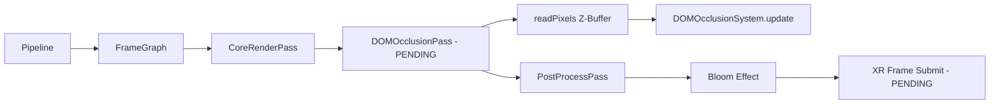

# 📚 SISTEMA DE RENDERIZADO VISUAL (PIPELINE)

```json
{
  "module": "RenderPipeline",
  "version": "V31_OCCLUSION_PASS_UPDATE",
  "dependencies": ["THREE.WebGLRenderer", "FrameGraph.js", "SceneGraph.js", "DOMOcclusionSystem.js"],
  "upgrade_from": "FrameGraph con PostProcessPass (Bloom) y Frustum Culling por Octree",
  "upgrade_to": "FrameGraph + DOM Occlusion Pass + WebXR Frame Support + GPGPU Compute hooks",
  "ai_directive": "Agregar un nuevo pass en el FrameGraph llamado 'DOMOcclusionPass' que se ejecute después del CoreRenderPass y ANTES del PostProcessPass. Este pass lee el Z-Buffer y actualiza la opacidad de los elementos DOM registrados en DOMOcclusionSystem. También preparar el renderer para preserveDrawingBuffer: true (requerido para readPixels).",
  "renderer_flags": {
    "preserveDrawingBuffer": true,
    "antialias": true,
    "powerPreference": "high-performance",
    "alpha": false
  },
  "files": 25,
  "status": "DOM_OCCLUSION_PASS_PENDING",
  "gpgpu_status": "XRSystem presente — compute shaders pendientes de implementación"
}
```

> **FrameGraphs de post-procesado (Bloom), Frustum Culling espacial y Occlusion Culling DOM.**
> **Estado:** V30 STABLE + DOM Occlusion Pass pendiente de agregar al FrameGraph.

## 💠 Esquema Conceptual



---


## 📑 Tabla de Contenidos
- [engine/rendering/CosmicBackgroundSystem.js](#enginerenderingcosmicbackgroundsystemjs) (215 líneas | 7.83 KB)
- [engine/rendering/GlassSiliconeMaterial.js](#enginerenderingglasssiliconematerialjs) (144 líneas | 5.48 KB)
- [engine/rendering/SpatialIndexSystem.js](#enginerenderingspatialindexsystemjs) (132 líneas | 3.94 KB)
- [engine/rendering/GalaxyRenderer.js](#enginerenderinggalaxyrendererjs) (102 líneas | 3.88 KB)
- [engine/rendering/stars/StarfieldSystem.js](#enginerenderingstarsstarfieldsystemjs) (101 líneas | 3.72 KB)
- [engine/rendering/effects/WindStreakVFX.js](#enginerenderingeffectswindstreakvfxjs) (93 líneas | 3.04 KB)
- [engine/rendering/InstancedRenderSystem.js](#enginerenderinginstancedrendersystemjs) (86 líneas | 2.42 KB)
- [engine/rendering/shaders/PlanetAtmosphereShader.js](#enginerenderingshadersplanetatmosphereshaderjs) (80 líneas | 2.98 KB)
- [engine/rendering/LODSystem.js](#enginerenderinglodsystemjs) (75 líneas | 2.30 KB)
- [engine/rendering/effects/EntryVFXSystem.js](#enginerenderingeffectsentryvfxsystemjs) (68 líneas | 2.31 KB)
- [engine/rendering/effects/PlanetDiscoveryVFX.js](#enginerenderingeffectsplanetdiscoveryvfxjs) (67 líneas | 2.04 KB)
- [engine/rendering/stars/StarLODSystem.js](#enginerenderingstarsstarlodsystemjs) (65 líneas | 1.84 KB)
- [engine/rendering/XRSystem.js](#enginerenderingxrsystemjs) (62 líneas | 2.10 KB)
- [engine/rendering/SceneGraph.js](#enginerenderingscenegraphjs) (61 líneas | 1.73 KB)
- [engine/rendering/passes/PostProcessPass.js](#enginerenderingpassespostprocesspassjs) (55 líneas | 2.34 KB)
- [engine/rendering/DynamicStarLODSystem.js](#enginerenderingdynamicstarlodsystemjs) (53 líneas | 1.81 KB)
- [engine/rendering/VisibilitySystem.js](#enginerenderingvisibilitysystemjs) (51 líneas | 1.71 KB)
- [engine/rendering/RenderPipeline.js](#enginerenderingrenderpipelinejs) (45 líneas | 1.43 KB)
- [engine/rendering/passes/SpatialOptimizationPass.js](#enginerenderingpassesspatialoptimizationpassjs) (37 líneas | 1.38 KB)
- [engine/rendering/stars/StarDistribution.js](#enginerenderingstarsstardistributionjs) (34 líneas | 1.11 KB)
- [engine/rendering/stars/StarParticleSystem.js](#enginerenderingstarsstarparticlesystemjs) (34 líneas | 0.94 KB)
- [engine/rendering/stars/StarSpriteSystem.js](#enginerenderingstarsstarspritesystemjs) (31 líneas | 1.01 KB)
- [engine/rendering/stars/StarMeshSystem.js](#enginerenderingstarsstarmeshsystemjs) (30 líneas | 0.98 KB)
- [engine/rendering/FrameGraph.js](#enginerenderingframegraphjs) (23 líneas | 0.65 KB)
- [engine/rendering/passes/CoreRenderPass.js](#enginerenderingpassescorerenderpassjs) (10 líneas | 0.22 KB)

---
## 📜 Código Fuente (Desplegable)

<h3 id="enginerenderingcosmicbackgroundsystemjs">📄 <code>engine/rendering/CosmicBackgroundSystem.js</code></h3>

*Estadísticas: 215 líneas de código, Tamaño: 7.83 KB*

<details>
<summary><strong>🔭 [ Clic para expandir el código fuente ]</strong></summary>

```js
/**
 * CosmicBackgroundSystem.js
 * OMEGA V28 Master Edition — Universe Simulation
 */
import * as THREE from 'https://unpkg.com/three@0.132.2/build/three.module.js?v=V28_OMEGA_FINAL';
import { Registry } from '../core/ServiceRegistry.js';


export class CosmicBackgroundSystem {
    static phase = 'simulation';

    constructor(services) {
        this.services = services;
        this.events = Registry.get('events');
        
        this.nebulaMesh = null;
        this.starfield = null;
        
        this.uniforms = {
            uTime: { value: 0 },
            uResolution: { value: new THREE.Vector2(window.innerWidth, window.innerHeight) },
            uParallax: { value: new THREE.Vector3(0, 0, 0) },
            uVelocity: { value: new THREE.Vector3(0, 0, 0) },
            uPixelRatio: { value: window.devicePixelRatio || 1 }
        };

        this.starCount = 10000;
        this.radius = 25000;
    }

    init() {
        console.log('[CosmicBackground] OMEGA Deep Space Engine Active.');
        
        this.registry = Registry.get('registry');
        if (!this.registry) return;

        const sceneGraph = this.Registry.get('SceneGraph');
        if (!sceneGraph) return;

        this.createNebula(sceneGraph);
        this.createStarfield(sceneGraph);
    }

    onResize(width, height) {
        this.uniforms.uResolution.value.set(width, height);
        this.uniforms.uPixelRatio.value = window.devicePixelRatio || 1;
    }

    createNebula(sceneGraph) {
        const geometry = new THREE.PlaneGeometry(30000, 30000);
        this.nebulaMaterial = new THREE.ShaderMaterial({
            uniforms: this.uniforms,
            transparent: true,
            depthWrite: false,
            vertexShader: `
                varying vec2 vUv;
                void main() {
                    vUv = uv;
                    gl_Position = projectionMatrix * modelViewMatrix * vec4(position, 1.0);
                }
            `,
            fragmentShader: `
                uniform float uTime;
                uniform vec2 uResolution;
                uniform vec3 uParallax;
                varying vec2 vUv;

                float hash(vec2 p) {
                    p = fract(p * vec2(123.34, 456.21));
                    p += dot(p, p + 45.32);
                    return fract(p.x * p.y);
                }

                float noise(vec2 p) {
                    vec2 i = floor(p);
                    vec2 f = fract(p);
                    f = f * f * (3.0 - 2.0 * f);
                    float a = hash(i);
                    float b = hash(i + vec2(1.0, 0.0));
                    float c = hash(i + vec2(0.0, 1.0));
                    float d = hash(i + vec2(1.0, 1.0));
                    return mix(mix(a, b, f.x), mix(c, d, f.x), f.y);
                }

                float fbm(vec2 p) {
                    float v = 0.0;
                    float a = 0.5;
                    for (int i = 0; i < 3; i++) {
                        v += a * noise(p);
                        p *= 2.0;
                        a *= 0.5;
                    }
                    return v;
                }

                void main() {
                    vec2 uv = (vUv - 0.5) * 2.0;
                    uv.x *= uResolution.x / uResolution.y;
                    vec2 pUv = uv + uParallax.xy * 0.1;

                    vec3 deepSpace = vec3(0.02, 0.02, 0.03);
                    vec3 nebulaSoft = vec3(0.1, 0.1, 0.12);
                    vec3 highlight = vec3(0.15, 0.15, 0.18);

                    vec3 color = deepSpace;

                    float layer1 = fbm(pUv * 0.4 + uTime * 0.002);
                    color = mix(color, nebulaSoft, pow(layer1, 3.0) * 0.3);

                    float layer2 = fbm(pUv * 0.8 - uTime * 0.003 + 5.0);
                    color = mix(color, highlight, pow(layer2, 4.0) * 0.2);

                    gl_FragColor = vec4(color, 1.0);
                }
            `
        });

        this.nebulaMesh = new THREE.Mesh(geometry, this.nebulaMaterial);
        this.nebulaMesh.position.z = -10000;
        sceneGraph.getScene().add(this.nebulaMesh);
    }

    createStarfield(sceneGraph) {
        const geometry = new THREE.BufferGeometry();
        const positions = new Float32Array(this.starCount * 3);
        const colors = new Float32Array(this.starCount * 3);
        const sizes = new Float32Array(this.starCount);

        for (let i = 0; i < this.starCount; i++) {
            const r = 500 + Math.random() * (this.radius - 500);
            const theta = 2 * Math.PI * Math.random();
            const phi = Math.acos(2 * Math.random() - 1);
            
            positions[i * 3] = r * Math.sin(phi) * Math.cos(theta);
            positions[i * 3 + 1] = r * Math.sin(phi) * Math.sin(theta);
            positions[i * 3 + 2] = r * Math.cos(phi);

            colors[i * 3] = 1.0; colors[i * 3 + 1] = 1.0; colors[i * 3 + 2] = 1.0; 
            sizes[i] = Math.random() * 4 + 1.0;
        }

        geometry.setAttribute('position', new THREE.BufferAttribute(positions, 3));
        geometry.setAttribute('color', new THREE.BufferAttribute(colors, 3));
        geometry.setAttribute('size', new THREE.BufferAttribute(sizes, 1));

        this.starMaterial = new THREE.ShaderMaterial({
            uniforms: this.uniforms,
            vertexShader: `
                uniform float uTime;
                uniform vec3 uVelocity;
                uniform float uPixelRatio;
                attribute float size;
                attribute vec3 color;
                varying vec3 vColor;
                varying float vIntensity;
                
                void main() {
                    vColor = color;
                    vec3 pos = position;
                    pos.x += sin(uTime * 0.5 + pos.y * 0.001) * 30.0;
                    pos.y += cos(uTime * 0.3 + pos.x * 0.001) * 30.0;

                    vec4 mvPosition = modelViewMatrix * vec4(pos, 1.0);
                    float speed = length(uVelocity);
                    vIntensity = min(1.0 + (speed * 0.03), 4.0);
                    
                    gl_PointSize = size * uPixelRatio * vIntensity * (3500.0 / -mvPosition.z);
                    gl_Position = projectionMatrix * mvPosition;
                }
            `,
            fragmentShader: `
                varying vec3 vColor;
                varying float vIntensity;
                void main() {
                    vec2 xy = gl_PointCoord.xy - vec2(0.5);
                    float ll = length(xy);
                    if (ll > 0.5) discard;
                    float alpha = (0.5 - ll) * 2.0;
                    alpha = pow(alpha, 1.5);
                    gl_FragColor = vec4(vColor * vIntensity, alpha);
                }
            `,
            transparent: true,
            blending: THREE.AdditiveBlending,
            depthWrite: false
        });

        this.starfield = new THREE.Points(geometry, this.starMaterial);
        sceneGraph.getScene().add(this.starfield);
    }

    update(delta, time) {
        this.uniforms.uTime.value = time;
        
        const camera = this.Registry.get('CameraSystem')?.getCamera();
        const navSystem = this.Registry.get('UniverseNavigationSystem') || this.Registry.get('NavigationSystem');

        if (camera) {
            this.uniforms.uParallax.value.copy(camera.position).multiplyScalar(0.01);
            if (this.nebulaMesh) {
                this.nebulaMesh.position.copy(camera.position).z -= 10000;
            }
        }

        if (navSystem && navSystem.velocity) {
            this.uniforms.uVelocity.value.copy(navSystem.velocity);
        }

        if (this.starfield) {
            this.starfield.rotation.y += delta * 0.08;
            this.starfield.rotation.x += delta * 0.03;
        }
    }
}

```

</details>

---

<h3 id="enginerenderingglasssiliconematerialjs">📄 <code>engine/rendering/GlassSiliconeMaterial.js</code></h3>

*Estadísticas: 144 líneas de código, Tamaño: 5.48 KB*

<details>
<summary><strong>🔭 [ Clic para expandir el código fuente ]</strong></summary>

```js
/**
 * GlassSiliconeMaterial.js
 * OMEGA V28 Master Edition — Custom Shader Layer
 * Features: 3D Simplex Noise displacement, gelatinous wobble, and glass-like transparency.
 */
import * as THREE from 'https://unpkg.com/three@0.132.2/build/three.module.js?v=V28_OMEGA_FINAL';

export class GlassSiliconeMaterial extends THREE.ShaderMaterial {
    constructor(color = 0x00f2ff) {
        const uniforms = {
            uTime: { value: 0 },
            uColor: { value: new THREE.Color(color) },
            uWobbleIntensity: { value: 0.15 },
            uOpacity: { value: 0.8 }
        };

        const vertexShader = `
            uniform float uTime;
            uniform float uWobbleIntensity;
            varying vec2 vUv;
            varying vec3 vNormal;
            varying vec3 vViewPosition;

            // Simple 3D Noise function (Simplex-like)
            vec3 mod289(vec3 x) { return x - floor(x * (1.0 / 289.0)) * 289.0; }
            vec4 mod289(vec4 x) { return x - floor(x * (1.0 / 289.0)) * 289.0; }
            vec4 permute(vec4 x) { return mod289(((x*34.0)+1.0)*x); }
            vec4 taylorInvSqrt(vec4 r) { return 1.79284291400159 - 0.85373472095314 * r; }

            float snoise(vec3 v) {
                const vec2 C = vec2(1.0/6.0, 1.0/3.0);
                const vec4 D = vec4(0.0, 0.5, 1.0, 2.0);
                vec3 i  = floor(v + dot(v, C.yyy));
                vec3 x0 = v - i + dot(i, C.xxx);
                vec3 g = step(x0.yzx, x0.xyz);
                vec3 l = 1.0 - g;
                vec3 i1 = min( g.xyz, l.zxy );
                vec3 i2 = max( g.xyz, l.zxy );
                vec3 x1 = x0 - i1 + C.xxx;
                vec3 x2 = x0 - i2 + C.yyy;
                vec3 x3 = x0 - D.yyy;
                i = mod289(i);
                vec4 p = permute( permute( permute(
                           i.z + vec4(0.0, i1.z, i2.z, 1.0 ))
                         + i.y + vec4(0.0, i1.y, i2.y, 1.0 ))
                         + i.x + vec4(0.0, i1.x, i2.x, 1.0 ));
                float n_ = 0.142857142857;
                vec3 ns = n_ * D.wyz - D.xzx;
                vec4 j = p - 49.0 * floor(p * ns.z * ns.z);
                vec4 x_ = floor(j * ns.z);
                vec4 y_ = floor(j - 7.0 * x_ );
                vec4 x = x_ * ns.x + ns.yyyy;
                vec4 y = y_ * ns.x + ns.yyyy;
                vec4 h = 1.0 - abs(x) - abs(y);
                vec4 b0 = vec4( x.xy, y.xy );
                vec4 b1 = vec4( x.zw, y.zw );
                vec4 s0 = floor(b0)*2.0 + 1.0;
                vec4 s1 = floor(b1)*2.0 + 1.0;
                vec4 sh = -step(h, vec4(0.0));
                vec4 a0 = b0.xzyw + s0.xzyw*sh.xxyy ;
                vec4 a1 = b1.xzyw + s1.xzyw*sh.zzww ;
                vec3 p0 = vec3(a0.xy,h.x);
                vec3 p1 = vec3(a0.zw,h.y);
                vec3 p2 = vec3(a1.xy,h.z);
                vec3 p3 = vec3(a1.zw,h.w);
                vec4 norm = taylorInvSqrt(vec4(dot(p0,p0), dot(p1,p1), dot(p2, p2), dot(p3,p3)));
                p0 *= norm.x; p1 *= norm.y; p2 *= norm.z; p3 *= norm.w;
                vec4 m = max(0.6 - vec4(dot(x0,x0), dot(x1,x1), dot(x2,x2), dot(x3,x3)), 0.0);
                m = m * m;
                return 42.0 * dot( m*m, vec4( dot(p0,x0), dot(p1,x1), dot(p2,x2), dot(p3,x3) ) );
            }

            void main() {
                vUv = uv;
                vNormal = normalize(normalMatrix * normal);
                
                // Displace vertex position based on Simplex Noise
                float noise = snoise(position * 0.05 + uTime * 0.5);
                vec3 newPosition = position + normal * noise * uWobbleIntensity * 10.0;
                
                vec4 mvPosition = modelViewMatrix * vec4(newPosition, 1.0);
                vViewPosition = -mvPosition.xyz;
                gl_Position = projectionMatrix * mvPosition;
            }
        `;

        const fragmentShader = `
            uniform float uTime;
            uniform vec3 uColor;
            uniform float uOpacity;
            varying vec2 vUv;
            varying vec3 vNormal;
            varying vec3 vViewPosition;

            void main() {
                // Fresnel Effect for glass-like outline
                vec3 normal = normalize(vNormal);
                vec3 viewDir = normalize(vViewPosition);
                float fresnel = pow(1.0 - dot(normal, viewDir), 3.0);
                
                // Gelatinous interior color
                vec3 baseColor = uColor * (0.5 + 0.5 * sin(uTime * 0.2));
                vec3 finalColor = mix(baseColor, vec3(1.0), fresnel * 0.5);
                
                gl_FragColor = vec4(finalColor, uOpacity + fresnel * 0.2);
            }
        `;

        super({
            uniforms,
            vertexShader,
            fragmentShader,
            transparent: true,
            depthWrite: true,
            side: THREE.DoubleSide
        });
    }

    update(time) {
        this.uniforms.uTime.value = time;
    }
}

/**
 * OMEGA V28+ Safe Material Factory
 * Prevents shader compilation crashes on unsupported GPUs.
 */
export function createSafeGlassMaterial(color) {
    try {
        return new GlassSiliconeMaterial(color);
    } catch (err) {
        console.warn("[GlassSiliconeMaterial] ⚠️ Shader Compilation Failed. Using High-Performance Fallback.", err);
        return new THREE.MeshStandardMaterial({
            color: color,
            roughness: 0.1,
            metalness: 0.5,
            transparent: true,
            opacity: 0.8,
            emissive: color,
            emissiveIntensity: 0.3
        });
    }
}

```

</details>

---

<h3 id="enginerenderingspatialindexsystemjs">📄 <code>engine/rendering/SpatialIndexSystem.js</code></h3>

*Estadísticas: 132 líneas de código, Tamaño: 3.94 KB*

<details>
<summary><strong>🔭 [ Clic para expandir el código fuente ]</strong></summary>

```js
import * as THREE from 'https://unpkg.com/three@0.132.2/build/three.module.js?v=V28_OMEGA_FINAL';

/**
 * OctreeNode.js?v=V28_OMEGA_FINAL - V14 INDUSTRIAL
 * A single node in the spatial partitioning tree.
 */
class OctreeNode {
    constructor(center, size, depth, maxDepth) {
        this.center = center; // THREE.Vector3
        this.size = size;
        this.depth = depth;
        this.maxDepth = maxDepth;
        this.objects = [];
        this.children = [];
        this.isLeaf = true;

        // Calculate half size for child derivation
        this.half = size / 2;
    }

    subdivide() {
        this.isLeaf = false;
        const quarter = this.size / 4;

        for (let x = -1; x <= 1; x += 2) {
            for (let y = -1; y <= 1; y += 2) {
                for (let z = -1; z <= 1; z += 2) {
                    const childCenter = new THREE.Vector3(
                        this.center.x + x * quarter,
                        this.center.y + y * quarter,
                        this.center.z + z * quarter
                    );
                    this.children.push(new OctreeNode(childCenter, this.half, this.depth + 1, this.maxDepth));
                }
            }
        }
    }

    insert(obj) {
        const pos = obj.position;

        if (this.isLeaf) {
            if (this.objects.length < 8 || this.depth >= this.maxDepth) {
                this.objects.push(obj);
                return true;
            }
            this.subdivide();
            // Move existing objects to children
            this.objects.forEach(o => this.insertToChild(o));
            this.objects = [];
        }

        return this.insertToChild(obj);
    }

    insertToChild(obj) {
        const pos = obj.position;
        // Binary search child selection
        const x = pos.x >= this.center.x ? 1 : 0;
        const y = pos.y >= this.center.y ? 1 : 0;
        const z = pos.z >= this.center.z ? 1 : 0;
        // Index mapping: 0-7 based on octant
        const index = x * 4 + y * 2 + z;
        return this.children[index].insert(obj);
    }

    query(frustum, result) {
        // Frustum vs AABB intersection
        const box = new THREE.Box3().setFromCenterAndSize(this.center, new THREE.Vector3(this.size, this.size, this.size));
        if (!frustum.intersectsBox(box)) return;

        if (this.isLeaf) {
            this.objects.forEach(obj => {
                // Sphere check for precision if needed, or direct push
                result.push(obj);
            });
        } else {
            this.children.forEach(child => child.query(frustum, result));
        }
    }
}

/**
 * SpatialIndexSystem.js?v=V28_OMEGA_FINAL - V14 INDUSTRIAL
 * Master Spatial Manager leveraging the Octree system.
 */
export class SpatialIndexSystem {
    constructor() {
        this.root = null;
        this.worldBounds = 100000; // 100,000 km universe
        this.maxDepth = 8;
        this.dependencies = ['SceneGraph'];
    }

    init() {
        console.log('[SpatialIndexSystem] V14 Octree Engine Active.');
        this.reset();
    }

    reset() {
        this.root = new OctreeNode(new THREE.Vector3(0, 0, 0), this.worldBounds, 0, this.maxDepth);
    }

    insert(object) {
        if (!this.root) this.reset();
        this.root.insert(object);
    }

    getVisibleObjects(frustum) {
        const result = [];
        if (this.root) this.root.query(frustum, result);
        return result;
    }

    postUpdate(delta, time) {
        this.reset();
        
        const sceneGraph = Registry.get('SceneGraph');
        if (!sceneGraph) return;

        const scene = sceneGraph.getScene();
        scene.traverse(obj => {
            if (obj.userData && obj.userData.spatialIndexed) {
                // In V14 we verify object bounds here
                this.insert(obj);
            }
        });
    }
}

export const spatialIndex = new SpatialIndexSystem();

```

</details>

---

<h3 id="enginerenderinggalaxyrendererjs">📄 <code>engine/rendering/GalaxyRenderer.js</code></h3>

*Estadísticas: 102 líneas de código, Tamaño: 3.88 KB*

<details>
<summary><strong>🔭 [ Clic para expandir el código fuente ]</strong></summary>

```js
import * as THREE from 'https://unpkg.com/three@0.132.2/build/three.module.js?v=V28_OMEGA_FINAL';
import { StarLODSystem } from './stars/StarLODSystem.js?v=V28_OMEGA_FINAL';
import { StarParticleSystem } from './stars/StarParticleSystem.js?v=V28_OMEGA_FINAL';
import { StarSpriteSystem } from './stars/StarSpriteSystem.js?v=V28_OMEGA_FINAL';
import { StarMeshSystem } from './stars/StarMeshSystem.js?v=V28_OMEGA_FINAL';

/**
 * GalaxyRenderer - Root Rendering Hub (OMEGA V28)
 */
export class GalaxyRenderer {
    /** @type {string} */
    static phase = 'render';

    constructor(services) {
        this.services = services;
        this.lodSystem = new StarLODSystem(services);
        this.particleSystem = new StarParticleSystem();
        this.spriteSystem = new StarSpriteSystem();
        this.meshSystem = new StarMeshSystem();
    }

    init() {
        this.lodSystem.registry = this.registry;
        
        const sceneGraph = this.Registry.get('SceneGraph');
        const generator = this.Registry.get('GalaxyGenerator');
        
        if (!sceneGraph || !generator) return;

        console.log('[GalaxyRenderer] Igniting 1,000,000 Stars (OMEGA V14)...');

        const galaxyData = generator.generateData(1000000);
        
        const geometry = new THREE.BufferGeometry();
        geometry.setAttribute('position', new THREE.BufferAttribute(galaxyData.positions, 3));
        geometry.setAttribute('aBrightness', new THREE.BufferAttribute(galaxyData.brightness, 1));
        geometry.setAttribute('color', new THREE.BufferAttribute(galaxyData.colors, 3));

        this.material = new THREE.ShaderMaterial({
            uniforms: {
                uCameraOrigin: { value: new THREE.Vector3() },
                uTime: { value: 0 }
            },
            vertexShader: `
                uniform vec3 uCameraOrigin;
                uniform float uTime;
                attribute float aBrightness;
                attribute vec3 color;
                varying float vBrightness;
                varying vec3 vColor;

                void main() {
                    vBrightness = aBrightness;
                    vColor = color;
                    vec3 pos = position - uCameraOrigin;
                    vec4 mvPosition = modelViewMatrix * vec4(pos, 1.0);
                    float size = 2.0 + aBrightness * 3.0;
                    gl_PointSize = clamp(size * (300.0 / -mvPosition.z), 1.0, 5.0);
                    gl_Position = projectionMatrix * mvPosition;
                }
            `,
            fragmentShader: `
                varying float vBrightness;
                varying vec3 vColor;
                uniform float uTime;

                void main() {
                    float dist = distance(gl_PointCoord, vec2(0.5));
                    if (dist > 0.5) discard;
                    float twinkle = sin(uTime * 2.0 + vBrightness * 100.0);
                    float intensity = 0.7 + 0.3 * twinkle;
                    gl_FragColor = vec4(vColor, vBrightness * intensity);
                }
            `,
            transparent: true,
            blending: THREE.AdditiveBlending,
            depthWrite: false
        });

        this.starPoints = new THREE.Points(geometry, this.material);
        this.starPoints.name = 'Starfield';
        this.starPoints.renderOrder = -100;
        
        sceneGraph.getScene().add(this.starPoints);
    }

    update(delta, time) {
        if (!this.material) return;
        this.material.uniforms.uTime.value = time;

        const originSystem = this.Registry.get('FloatingOriginSystem');
        if (originSystem) {
            this.material.uniforms.uCameraOrigin.value.copy(originSystem.sectorOrigin);
        }

        const camera = this.Registry.get('CameraSystem')?.getCamera();
        if (camera) {
            this.lodSystem.update(camera);
        }
    }
}

```

</details>

---

<h3 id="enginerenderingstarsstarfieldsystemjs">📄 <code>engine/rendering/stars/StarfieldSystem.js</code></h3>

*Estadísticas: 101 líneas de código, Tamaño: 3.72 KB*

<details>
<summary><strong>🔭 [ Clic para expandir el código fuente ]</strong></summary>

```js
import * as THREE from 'https://unpkg.com/three@0.132.2/build/three.module.js?v=V28_OMEGA_FINAL';
import { StarDistribution } from './StarDistribution.js?v=V28_OMEGA_FINAL';
// registry imported via injection

/**
 * StarfieldSystem.js?v=V28_OMEGA_FINAL - V35 INDUSTRIAL
 * 
 * Main kernel for 1,000,000 GPU-accelerated stars.
 * Uses a professional shader with Clamped Sizing and Pseudo-Random Twinkle.
 */
export class StarfieldSystem {
    constructor() {
        this.starCount = 1000000;
        this.points = null;
        this.material = null;
    }

    init() {
        console.log('[StarfieldSystem] Igniting 1,000,000 Stars...');

        const { positions, brightness } = StarDistribution.generateDisk(this.starCount);

        const geometry = new THREE.BufferGeometry();
        geometry.setAttribute('position', new THREE.BufferAttribute(positions, 3));
        geometry.setAttribute('aBrightness', new THREE.BufferAttribute(brightness, 1));

        this.material = new THREE.ShaderMaterial({
            uniforms: {
                uCameraOrigin: { value: new THREE.Vector3() },
                uTime: { value: 0 },
                uColor: { value: new THREE.Color(0xffffff) }
            },
            vertexShader: `
                uniform vec3 uCameraOrigin;
                uniform float uTime;
                attribute float aBrightness;
                varying float vBrightness;

                void main() {
                    vBrightness = aBrightness;
                    
                    // Floating Origin Shift: position is relative to global origin,
                    // uCameraOrigin is the sector shift offset.
                    vec3 pos = position - uCameraOrigin;
                    
                    vec4 mvPosition = modelViewMatrix * vec4(pos, 1.0);
                    
                    // Clamped Size Logic (V15 Professional)
                    float size = 2.0 + aBrightness * 3.0;
                    gl_PointSize = clamp(size * (300.0 / -mvPosition.z), 1.5, 6.0);
                    
                    gl_Position = projectionMatrix * mvPosition;
                }
            `,
            fragmentShader: `
                varying float vBrightness;
                uniform float uTime;

                void main() {
                    float dist = distance(gl_PointCoord, vec2(0.5));
                    if (dist > 0.5) discard;

                    // Pseudo-Random Twinkle (V15 Hash Noise)
                    float twinkle = sin(uTime * 3.0 + vBrightness * 50.0);
                    float brightness = 0.6 + 0.4 * twinkle;

                    gl_FragColor = vec4(vec3(1.0), vBrightness * brightness);
                }
            `,
            transparent: true,
            blending: THREE.AdditiveBlending,
            depthWrite: false
        });

        this.points = new THREE.Points(geometry, this.material);
        this.points.renderOrder = -100; // Background

        const sceneGraph = this.Registry.get('SceneGraph');
        if (sceneGraph) {
            sceneGraph.getScene().add(this.points);
        }
    }

    update(delta, time) {
        if (!this.material) return;

        this.material.uniforms.uTime.value = time;

        const originSystem = this.Registry.get('FloatingOriginSystem');
        if (originSystem) {
            // Update the camera origin for the re-centering shader logic
            // Note: originSystem.sectorOrigin represents the shift in 64-bit space
            this.material.uniforms.uCameraOrigin.value.set(
                originSystem.sectorOrigin.x,
                originSystem.sectorOrigin.y,
                originSystem.sectorOrigin.z
            );
        }
    }
}

```

</details>

---

<h3 id="enginerenderingeffectswindstreakvfxjs">📄 <code>engine/rendering/effects/WindStreakVFX.js</code></h3>

*Estadísticas: 93 líneas de código, Tamaño: 3.04 KB*

<details>
<summary><strong>🔭 [ Clic para expandir el código fuente ]</strong></summary>

```js
import * as THREE from 'https://unpkg.com/three@0.132.2/build/three.module.js?v=V28_OMEGA_FINAL';
// registry/events imported via injection

/**
 * WindStreakVFX.js?v=V28_OMEGA_FINAL - V30 OMEGA
 * 
 * Visualizes air flow around the ship during high-speed atmospheric flight.
 */
export class WindStreakVFX {
    constructor() {
        this.group = new THREE.Group();
        this.streaks = [];
        this.maxStreaks = 40;
    }

    init() {
        const scene = this.Registry.get('SceneGraph')?.getScene();
        if (scene) scene.add(this.group);

        this.events.on('weather:turbulence', (data) => this.handleTurbulence(data));
        console.log('[WindStreakVFX] Aero-Visuals Online.');
    }

    handleTurbulence({ intensity, speed }) {
        const targetCount = Math.floor(intensity * this.maxStreaks);
        
        // Spawn more if under target
        if (this.streaks.length < targetCount && Math.random() > 0.5) {
            this.createStreak(speed);
        }
    }

    createStreak(speed) {
        const camera = this.Registry.get('CameraSystem')?.getCamera();
        if (!camera) return;

        // Spawn in front of ship
        const offset = new THREE.Vector3(
            (Math.random() - 0.5) * 150,
            (Math.random() - 0.5) * 100,
            -200 - Math.random() * 300
        ).applyQuaternion(camera.quaternion);

        const pos = camera.position.clone().add(offset);
        
        // Streak Geometry (Long thin line)
        const length = 50 + Math.random() * 100;
        const color = new THREE.Color(0xffffff).lerp(new THREE.Color(0x00ffcc), Math.random() * 0.5);
        
        const geo = new THREE.BufferGeometry().setFromPoints([
            new THREE.Vector3(0, 0, 0),
            new THREE.Vector3(0, 0, length)
        ]);
        const mat = new THREE.LineBasicMaterial({ 
            color, 
            transparent: true, 
            opacity: 0.15 + Math.random() * 0.3 
        });
        
        const streak = new THREE.Line(geo, mat);
        streak.position.copy(pos);
        streak.lookAt(camera.position); // Align with flight path (approximation)
        
        this.group.add(streak);
        this.streaks.push({
            mesh: streak,
            speed: speed * 1.5,
            life: 1.0,
            decay: 0.05 + Math.random() * 0.1
        });
    }

    update(delta) {
        for (let i = this.streaks.length - 1; i >= 0; i--) {
            const s = this.streaks[i];
            
            // Move streaks backwards relative to ship
            const velocity = new THREE.Vector3(0, 0, s.speed * delta);
            s.mesh.position.add(velocity.applyQuaternion(s.mesh.quaternion));
            
            s.life -= s.decay;
            s.mesh.material.opacity = s.life * 0.4;

            if (s.life <= 0) {
                this.group.remove(s.mesh);
                s.mesh.geometry.dispose();
                s.mesh.material.dispose();
                this.streaks.splice(i, 1);
            }
        }
    }
}

```

</details>

---

<h3 id="enginerenderinginstancedrendersystemjs">📄 <code>engine/rendering/InstancedRenderSystem.js</code></h3>

*Estadísticas: 86 líneas de código, Tamaño: 2.42 KB*

<details>
<summary><strong>🔭 [ Clic para expandir el código fuente ]</strong></summary>

```js
/**
 * InstancedRenderSystem.js
 * OMEGA V28 Master Edition — Foundation Layer
 */
import * as THREE from 'https://unpkg.com/three@0.132.2/build/three.module.js?v=V28_OMEGA_FINAL';
import { Registry } from '../core/ServiceRegistry.js';


export class InstancedRenderSystem {
    static phase = 'foundation';

    constructor(services) {
        this.services = services;
        this.registry = Registry.get('registry');
        this.batches = new Map(); // id -> { mesh, dummy, matrix, count }
    }

    init() {
        console.log('[InstancedRenderSystem] OMEGA V28 Batching Engine Online.');
    }

    /**
     * Register a new batch
     */
    createBatch(id, geometry, material, count) {
        const mesh = new THREE.InstancedMesh(geometry, material, count);
        mesh.instanceMatrix.setUsage(THREE.DynamicDrawUsage);
        
        const batch = {
            mesh,
            dummy: new THREE.Object3D(),
            matrix: new THREE.Matrix4(),
            count,
            currentIdx: 0,
            isDirty: false
        };

        this.batches.set(id, batch);
        
        const sceneGraph = this.Registry.get('SceneGraph');
        if (sceneGraph) {
            sceneGraph.addToLayer('universe', mesh);
        }

        console.log(`[InstancedRenderSystem] Created batch: ${id} (${count} instances)`);
        return batch;
    }

    /**
     * Set a single instance data
     */
    setInstance(id, index, position, rotation, scale, color) {
        const batch = this.batches.get(id);
        if (!batch) return;

        batch.dummy.position.copy(position);
        if (rotation) batch.dummy.rotation.copy(rotation);
        if (scale) batch.dummy.scale.set(scale, scale, scale);
        
        batch.dummy.updateMatrix();
        batch.mesh.setMatrixAt(index, batch.dummy.matrix);

        if (color) {
            batch.mesh.setColorAt(index, new THREE.Color(color));
        }
        batch.isDirty = true;
    }

    /**
     * Finalize batch updates
     */
    postUpdate() {
        this.batches.forEach(batch => {
            if (batch.isDirty) {
                batch.mesh.instanceMatrix.needsUpdate = true;
                if (batch.mesh.instanceColor) batch.mesh.instanceColor.needsUpdate = true;
                batch.isDirty = false;
            }
        });
    }

    getMesh(id) {
        return this.batches.get(id)?.mesh;
    }
}

```

</details>

---

<h3 id="enginerenderingshadersplanetatmosphereshaderjs">📄 <code>engine/rendering/shaders/PlanetAtmosphereShader.js</code></h3>

*Estadísticas: 80 líneas de código, Tamaño: 2.98 KB*

<details>
<summary><strong>🔭 [ Clic para expandir el código fuente ]</strong></summary>

```js
import * as THREE from 'https://unpkg.com/three@0.132.2/build/three.module.js?v=V28_OMEGA_FINAL';

/**
 * PlanetAtmosphereShader.js?v=V28_OMEGA_FINAL - V33 OMEGA FUSION + NINTENDO EDGE
 * 
 * Implements the "Visual Bridge" and "Geometry Edge Shader" for 
 * premium minimalist aesthetics (Nintendo-style).
 */
export const PlanetAtmosphereShader = {
    uniforms: {
        uColor: { value: new THREE.Color(0x00f2ff) },
        uOutlineColor: { value: new THREE.Color(0xffffff) },
        uCoefficient: { value: 0.1 },
        uPower: { value: 4.0 },
        uSunPosition: { value: new THREE.Vector3(1, 1, 1) },
        uDistance: { value: 0.0 },
        uTransitionPoint: { value: 50000.0 }
    },
    vertexShader: `
        uniform float uDistance;
        uniform float uTransitionPoint;
        varying vec3 vNormal;
        varying vec3 vViewPosition;
        varying vec3 vWorldNormal;

        void main() {
            vNormal = normalize(normalMatrix * normal);
            vWorldNormal = normalize((modelMatrix * vec4(normal, 0.0)).xyz);
            
            float scale = uDistance > uTransitionPoint ? (uDistance / uTransitionPoint) * 0.15 : 1.0;
            
            vec4 mvPosition = modelViewMatrix * vec4(position * scale, 1.0);
            vViewPosition = -mvPosition.xyz;
            gl_Position = projectionMatrix * mvPosition;
        }
    `,
    fragmentShader: `
        uniform vec3 uColor;
        uniform vec3 uOutlineColor;
        uniform float uCoefficient;
        uniform float uPower;
        uniform vec3 uSunPosition;
        uniform float uDistance;
        uniform float uTransitionPoint;
        
        varying vec3 vNormal;
        varying vec3 vViewPosition;
        varying vec3 vWorldNormal;

        void main() {
            vec3 viewDir = normalize(vViewPosition);
            
            // --- V33 NINTENDO EDGE (Geometry Edge Shader) ---
            // Fresnel rim for the crisp minimalist outline
            float fresnel = dot(vNormal, viewDir);
            float outline = smoothstep(0.4, 0.5, 1.0 - fresnel);
            
            // Standard Atmospheric Scattering
            float atmosphereIntensity = pow(uCoefficient - fresnel, uPower);
            
            // Lighting
            float sunDot = dot(vNormal, normalize(uSunPosition));
            float lighting = max(sunDot, 0.2);
            
            // Distance-based logic
            float transitionMix = smoothstep(uTransitionPoint * 2.0, uTransitionPoint, uDistance);
            
            vec3 atmosColor = uColor * lighting;
            vec3 finalColor = mix(atmosColor, uOutlineColor, outline * 0.5);
            
            // Point Phase (Star effect)
            if (uDistance > uTransitionPoint) {
                finalColor += vec3(0.8, 0.9, 1.0) * (transitionMix * 0.5);
            }
            
            gl_FragColor = vec4(finalColor, max(atmosphereIntensity * transitionMix, outline * 0.3));
        }
    `
};

```

</details>

---

<h3 id="enginerenderinglodsystemjs">📄 <code>engine/rendering/LODSystem.js</code></h3>

*Estadísticas: 75 líneas de código, Tamaño: 2.30 KB*

<details>
<summary><strong>🔭 [ Clic para expandir el código fuente ]</strong></summary>

```js
import * as THREE from 'https://unpkg.com/three@0.132.2/build/three.module.js?v=V28_OMEGA_FINAL';
import { Registry } from '../core/ServiceRegistry.js?v=V28_OMEGA_FINAL';

/**
 * LODSystem.js?v=V28_OMEGA_FINAL - V15 INDUSTRIAL DETAIL
 * 
 * Orchestrates distance-based detail levels globally.
 */
export class LODSystem {
    constructor() {
        this.objects = new Map(); // mesh -> { levels, lastLevel }
        this.dependencies = ['CameraSystem'];
        this.distances = {
            HIGH: 500,    // < 500km
            MEDIUM: 2000,  // < 2000km
            LOW: 10000     // > 10000km
        };
    }

    init() {
        console.log('[LODSystem] Industrial LOD Orchestrator Ready.');
    }

    /**
     * Register an object for LOD management
     * levels: [{ distance, geometry, material }]
     */
    register(object, levels) {
        this.objects.set(object, {
            levels: levels.sort((a, b) => a.distance - b.distance),
            lastLevel: -1
        });
    }

    /**
     * Phase: Update
     * Manual update to support shader LOD and material swaps
     */
    update(delta, time) {
        const camera = Registry.get('CameraSystem')?.getCamera();
        if (!camera) return;

        const camPos = camera.position;

        this.objects.forEach((data, obj) => {
            const dist = camPos.distanceTo(obj.position);
            
            // Find appropriate level
            let activeLevel = 0;
            for (let i = data.levels.length - 1; i >= 0; i--) {
                if (dist >= data.levels[i].distance) {
                    activeLevel = i;
                    break;
                }
            }

            if (activeLevel !== data.lastLevel) {
                this.switchLevel(obj, data.levels[activeLevel]);
                data.lastLevel = activeLevel;
            }
        });
    }

    switchLevel(obj, level) {
        // Swap geometry and material if they exist (Manual LOD)
        if (level.geometry) obj.geometry = level.geometry;
        if (level.material) obj.material = level.material;
        
        // Custom events for logic LOD (e.g., stopping physics for distant moons)
        if (obj.userData) obj.userData.lodLevel = level.distance;
    }
}

export const lodSystem = new LODSystem();

```

</details>

---

<h3 id="enginerenderingeffectsentryvfxsystemjs">📄 <code>engine/rendering/effects/EntryVFXSystem.js</code></h3>

*Estadísticas: 68 líneas de código, Tamaño: 2.31 KB*

<details>
<summary><strong>🔭 [ Clic para expandir el código fuente ]</strong></summary>

```js
import * as THREE from 'https://unpkg.com/three@0.132.2/build/three.module.js?v=V28_OMEGA_FINAL';
import gsap from 'gsap';
// registry/events imported via injection

/**
 * EntryVFXSystem.js?v=V28_OMEGA_FINAL - V25 OMEGA
 * 
 * Handles the visual "Plasma Glow" and camera shake during high-speed entry.
 */
export class EntryVFXSystem {
    constructor() {
        this.glow = null;
        this.isActive = false;
    }

    init() {
        this.events.on('fx:entry_heat', (data) => this.updateGlow(data));
        
        // Simple sprite for plasma
        const mat = new THREE.SpriteMaterial({
            color: 0xff4400,
            transparent: true,
            opacity: 0,
            blending: THREE.AdditiveBlending
        });
        this.glow = new THREE.Sprite(mat);
        this.glow.scale.set(50, 50, 1);
        
        const scene = this.Registry.get('SceneGraph')?.getScene();
        if (scene) scene.add(this.glow);
    }

    updateGlow(data) {
        if (data.heat > 0.2) {
            this.glow.material.opacity = Math.min(data.heat, 0.6);
            this.glow.material.color.setHSL(0.05 + data.heat * 0.1, 1.0, 0.5);
            
            // Shake camera based on heat
            const cam = this.Registry.get('CameraSystem')?.getCamera();
            if (cam && !this.isActive) {
                this.isActive = true;
                gsap.to(cam.position, {
                    x: "+=" + (Math.random() - 0.5) * data.heat * 5,
                    y: "+=" + (Math.random() - 0.5) * data.heat * 5,
                    duration: 0.05,
                    repeat: -1,
                    yoyo: true,
                    onUpdate: () => {
                        if (this.glow.material.opacity < 0.1) gsap.killTweensOf(cam.position);
                    }
                });
            }
        } else {
            this.glow.material.opacity = 0;
            this.isActive = false;
        }
    }

    update(delta, time) {
        const cam = this.Registry.get('CameraSystem')?.getCamera();
        if (cam && this.glow) {
            // Position glow in front of camera
            const forward = new THREE.Vector3(0, 0, -1).applyQuaternion(cam.quaternion);
            this.glow.position.copy(cam.position).addScaledVector(forward, 20);
        }
    }
}

```

</details>

---

<h3 id="enginerenderingeffectsplanetdiscoveryvfxjs">📄 <code>engine/rendering/effects/PlanetDiscoveryVFX.js</code></h3>

*Estadísticas: 67 líneas de código, Tamaño: 2.04 KB*

<details>
<summary><strong>🔭 [ Clic para expandir el código fuente ]</strong></summary>

```js
import * as THREE from 'https://unpkg.com/three@0.132.2/build/three.module.js?v=V28_OMEGA_FINAL';
import gsap from 'gsap';
// registry/events imported via injection

/**
 * PlanetDiscoveryVFX.js?v=V28_OMEGA_FINAL - V28 OMEGA
 * 
 * Creates a holographic pulse effect when a planet is discovered.
 */
export class PlanetDiscoveryVFX {
    constructor() {
        this.group = new THREE.Group();
    }

    init() {
        const scene = this.Registry.get('SceneGraph')?.getScene();
        if (scene) scene.add(this.group);

        this.events.on('planet:discovered', (data) => this.pulse(data));
        console.log('[PlanetDiscoveryVFX] Signal Processor Online.');
    }

    pulse(data) {
        // Find planet position
        const planetLOD = this.Registry.get('PlanetLODSystem');
        const planetData = planetLOD.activePlanets.get(data.id);
        if (!planetData) return;

        const pos = planetData.mesh.position;
        const radius = 120;

        // Create Expanding Ring
        const ringGeo = new THREE.RingGeometry(radius * 0.8, radius, 64);
        const ringMat = new THREE.MeshBasicMaterial({
            color: 0x00ffcc,
            transparent: true,
            opacity: 1,
            side: THREE.DoubleSide
        });
        const ring = new THREE.Mesh(ringGeo, ringMat);
        ring.position.copy(pos);
        ring.lookAt(this.Registry.get('CameraSystem').getCamera().position);
        this.group.add(ring);

        // Animate
        gsap.to(ring.scale, {
            x: 2.5, y: 2.5, z: 2.5,
            duration: 1.5,
            ease: "expo.out"
        });
        
        gsap.to(ringMat, {
            opacity: 0,
            duration: 1.5,
            ease: "power2.in",
            onComplete: () => {
                this.group.remove(ring);
                ringGeo.dispose();
                ringMat.dispose();
            }
        });

        // Trigger Camera Shake for "Impact"
        this.events.emit('camera:shake', { intensity: 0.5, duration: 0.8 });
    }
}

```

</details>

---

<h3 id="enginerenderingstarsstarlodsystemjs">📄 <code>engine/rendering/stars/StarLODSystem.js</code></h3>

*Estadísticas: 65 líneas de código, Tamaño: 1.84 KB*

<details>
<summary><strong>🔭 [ Clic para expandir el código fuente ]</strong></summary>

```js
import * as THREE from 'https://unpkg.com/three@0.132.2/build/three.module.js?v=V28_OMEGA_FINAL';

/**
 * StarLODSystem - The Orchestrator (OMEGA V28)
 */
export class StarLODSystem {
    constructor(services) {
        this.services = services;
        this.distances = {
            PARTICLE: 1000000,
            SPRITE: 100000,
            MESH: 10000
        };
        this.activeSystem = null;
        this.registry = null;
    }

    update(camera) {
        if (!camera) return;
        const dist = camera.position.length();

        if (dist > this.distances.PARTICLE) {
            this.switchTo('PARTICLE');
        } else if (dist > this.distances.SPRITE) {
            this.switchTo('SPRITE');
        } else if (dist > this.distances.MESH) {
            this.switchTo('MESH');
        } else {
            this.switchTo('SOLAR');
        }
    }

    switchTo(level) {
        if (this.activeSystem === level) return;
        this.activeSystem = level;
        console.log(`[StarLOD] Transitioning to level: ${level}`);

        const galaxy = this.Registry.get('GalaxyRenderer');
        if (!galaxy) return;

        const layers = {
            PARTICLE: galaxy.particleSystem.points,
            SPRITE: galaxy.spriteSystem.group,
            MESH: galaxy.meshSystem.mesh
        };

        Object.keys(layers).forEach(key => {
            const layer = layers[key];
            if (!layer) return;

            if (key === level) {
                layer.visible = true;
            } else {
                layer.visible = false;
            }
        });

        // Trigger Solar Generation if level is SOLAR
        if (level === 'SOLAR') {
            const solarGen = this.Registry.get('SolarSystemGenerator');
            solarGen?.generate('LOCAL', new THREE.Vector3(0,0,0));
        }
    }
}

```

</details>

---

<h3 id="enginerenderingxrsystemjs">📄 <code>engine/rendering/XRSystem.js</code></h3>

*Estadísticas: 62 líneas de código, Tamaño: 2.10 KB*

<details>
<summary><strong>🔭 [ Clic para expandir el código fuente ]</strong></summary>

```js
import { Registry } from '../core/ServiceRegistry.js?v=V28_OMEGA_FINAL';
import { events } from '../../core/EventBus.js?v=V28_OMEGA_FINAL';

/**
 * XRSystem.js?v=V28_OMEGA_FINAL - V16 INDUSTRIAL
 * 
 * Manages WebXR session lifecycle and renderer adaptation.
 */
export class XRSystem {
    constructor() {
        this.session = null;
        this.isSupported = false;
        this.dependencies = ['RenderPipeline', 'CameraSystem'];
    }

    async init() {
        if ('xr' in navigator) {
            this.isSupported = await navigator.xr.isSessionSupported('immersive-vr');
            console.log(`[XRSystem] VR Supported: ${this.isSupported}`);
            if (this.isSupported) {
                this.createEnterButton();
            }
        }
    }

    async enterVR() {
        const renderPipeline = Registry.get('RenderPipeline');
        const renderer = renderPipeline?.getRenderer();
        if (!renderer) return;

        this.session = await navigator.xr.requestSession('immersive-vr', {
            optionalFeatures: ['local-floor', 'bounded-floor', 'hand-tracking']
        });

        renderer.xr.enabled = true;
        await renderer.xr.setSession(this.session);
        
        events.emit('xr:session:started', this.session);
        this.session.addEventListener('end', () => this.exitVR());
    }

    exitVR() {
        const renderPipeline = Registry.get('RenderPipeline');
        const renderer = renderPipeline?.getRenderer();
        if (renderer) renderer.xr.enabled = false;
        
        events.emit('xr:session:ended');
        this.session = null;
    }

    createEnterButton() {
        const btn = document.createElement('button');
        btn.id = 'xr-enter-btn';
        btn.innerHTML = 'ENTER VR';
        btn.style.cssText = 'position:fixed; bottom:20px; right:20px; z-index:10000; padding:10px 20px; background:#00f2ff; color:black; border:none; border-radius:5px; cursor:pointer; font-weight:bold;';
        btn.onclick = () => this.enterVR();
        document.body.appendChild(btn);
    }
}

export const xrSystem = new XRSystem();

```

</details>

---

<h3 id="enginerenderingscenegraphjs">📄 <code>engine/rendering/SceneGraph.js</code></h3>

*Estadísticas: 61 líneas de código, Tamaño: 1.73 KB*

<details>
<summary><strong>🔭 [ Clic para expandir el código fuente ]</strong></summary>

```js
import { Scene, Group, Color } from 'three';

/**
 * SceneGraph.js
 * Gestor de Nodos OMEGA V30.
 * Organiza la topología del universo en capas estables.
 */
class SceneGraph {
    constructor() {
        this.scene = new Scene();
        this.scene.background = new Color(0x020205); // Espacio profundo puro

        // Capa 1: Fondo Inmutable (Estrellas lejanas, nebulosas de fondo)
        this.backgroundLayer = new Group();
        this.backgroundLayer.name = "BackgroundLayer";
        
        // Capa 2: Universo Dinámico (Sistemas solares, planetas rotatorios)
        this.universeLayer = new Group();
        this.universeLayer.name = "UniverseLayer";

        // Capa 3: UI 3D y Telemetría (Drones, marcadores visuales, anillos de selección)
        this.overlayLayer = new Group();
        this.overlayLayer.name = "OverlayLayer";

        // Ensamblaje maestro
        this.scene.add(this.backgroundLayer);
        this.scene.add(this.universeLayer);
        this.scene.add(this.overlayLayer);

        // Compatibilidad con código anterior (alias layers)
        this.layers = {
            background: this.backgroundLayer,
            galaxy: this.universeLayer,
            systems: this.universeLayer,
            planets: this.universeLayer,
            ui: this.overlayLayer
        };
    }

    addPlanet(mesh) {
        this.universeLayer.add(mesh);
    }

    addStarfield(mesh) {
        this.backgroundLayer.add(mesh);
    }

    get(layerName) {
        return this.layers[layerName] || this.universeLayer;
    }

    clearUniverse() {
        while(this.universeLayer.children.length > 0){ 
            const child = this.universeLayer.children[0];
            this.universeLayer.remove(child); 
        }
    }
}

export default SceneGraph;

```

</details>

---

<h3 id="enginerenderingpassespostprocesspassjs">📄 <code>engine/rendering/passes/PostProcessPass.js</code></h3>

*Estadísticas: 55 líneas de código, Tamaño: 2.34 KB*

<details>
<summary><strong>🔭 [ Clic para expandir el código fuente ]</strong></summary>

```js
import * as THREE from 'three';
import { EffectComposer } from 'https://unpkg.com/three@0.132.2/examples/jsm/postprocessing/EffectComposer.js';
import { RenderPass } from 'https://unpkg.com/three@0.132.2/examples/jsm/postprocessing/RenderPass.js';
import { UnrealBloomPass } from 'https://unpkg.com/three@0.132.2/examples/jsm/postprocessing/UnrealBloomPass.js';
import { ShaderPass } from 'https://unpkg.com/three@0.132.2/examples/jsm/postprocessing/ShaderPass.js';
import { CopyShader } from 'https://unpkg.com/three@0.132.2/examples/jsm/shaders/CopyShader.js';

export class PostProcessPass {
    constructor(renderer, scene, camera) {
        this.priority = 200; // Máxima prioridad: Debe ejecutarse al final del FrameGraph
        this.enabled = true;

        // Forzar el tone mapping en el renderer base para que OutputPass lo respete
        renderer.toneMapping = THREE.ACESFilmicToneMapping;
        renderer.toneMappingExposure = 1.2;

        this.composer = new EffectComposer(renderer);
        const pixelRatio = renderer.getPixelRatio();
        this.composer.setPixelRatio(pixelRatio);

        // 1. RenderPass: Dibuja la escena base (reemplaza al CoreRenderPass)
        const renderPass = new RenderPass(scene, camera);
        this.composer.addPass(renderPass);

        // 2. UnrealBloomPass: El resplandor AAA
        const bloomPass = new UnrealBloomPass(
            new THREE.Vector2(window.innerWidth * pixelRatio, window.innerHeight * pixelRatio),
            1.5,
            0.4,
            0.85
        );
        this.composer.addPass(bloomPass);

        // 3. ShaderPass (Copy) como salida final para compatibilidad de versiones
        const outputPass = new ShaderPass(CopyShader);
        this.composer.addPass(outputPass);

        this.composer.setSize(window.innerWidth, window.innerHeight);

        window.addEventListener('resize', () => {
            this.composer.setSize(window.innerWidth, window.innerHeight);
        });
    }

    execute(renderer, scene, camera, deltaTime) {
        // Ejecución oficial del Composer con Bloom (Restaurado)
        try {
            this.composer.render(deltaTime);
        } catch (err) {
            console.warn('[PostProcessPass] Composer render failed, fallback to renderer:', err);
            renderer.render(scene, camera);
        }
    }
}

```

</details>

---

<h3 id="enginerenderingdynamicstarlodsystemjs">📄 <code>engine/rendering/DynamicStarLODSystem.js</code></h3>

*Estadísticas: 53 líneas de código, Tamaño: 1.81 KB*

<details>
<summary><strong>🔭 [ Clic para expandir el código fuente ]</strong></summary>

```js
import * as THREE from 'https://unpkg.com/three@0.132.2/build/three.module.js?v=V28_OMEGA_FINAL';
import { Registry } from '../core/ServiceRegistry.js';


/**
 * DynamicStarLODSystem.js?v=V28_OMEGA_FINAL - V28 OMEGA
 * 
 * Implements Dynamic LOD for stars.
 * Far: GL Points (CosmicBackground) | Near: Instanced Spheres (Premium)
 */
export class DynamicStarLODSystem {
    /** @type {string} */
    static phase = 'render';

    constructor(services) {
        this.services = services;
        this.registry = Registry.get('registry');
        this.nearThreshold = 5000;
        this.activeNearStars = new Set();
    }

    init() {
        console.log('[DynamicStarLOD] Premium Star LOD Engine Online.');
        
        const instanced = this.Registry.get('InstancedRenderSystem');
        if (instanced) {
            const geo = new THREE.SphereGeometry(0.5, 4, 4);
            const mat = new THREE.MeshBasicMaterial({ color: 0xffffff, transparent: true, opacity: 0.9 });
            instanced.createBatch('LOD_STARS', geo, mat, 1000);
        }
    }

    update(delta, time) {
        const camera = this.Registry.get('CameraSystem')?.getCamera();
        const instanced = this.Registry.get('InstancedRenderSystem');
        const bg = this.Registry.get('CosmicBackgroundSystem');
        
        if (!camera || !instanced || !bg) return;
        
        const pos = camera.position;
        const distToCenter = pos.length();
        const mesh = instanced.getMesh('LOD_STARS');
        
        if (distToCenter < this.nearThreshold) {
            if (mesh) mesh.visible = true;
            if (bg.starfield) bg.starfield.material.opacity = 0.3;
        } else {
            if (mesh) mesh.visible = false;
            if (bg.starfield) bg.starfield.material.opacity = 1.0;
        }
    }
}

```

</details>

---

<h3 id="enginerenderingvisibilitysystemjs">📄 <code>engine/rendering/VisibilitySystem.js</code></h3>

*Estadísticas: 51 líneas de código, Tamaño: 1.71 KB*

<details>
<summary><strong>🔭 [ Clic para expandir el código fuente ]</strong></summary>

```js
import * as THREE from 'https://unpkg.com/three@0.132.2/build/three.module.js?v=V28_OMEGA_FINAL';
import { Registry } from '../core/ServiceRegistry.js?v=V28_OMEGA_FINAL';

/**
 * VisibilitySystem.js?v=V28_OMEGA_FINAL - V14 INDUSTRIAL
 * 
 * High-performance visibility culling.
 * Connects the SpatialIndex with the Camera Frustum.
 */
export class VisibilitySystem {
    constructor() {
        this.frustum = new THREE.Frustum();
        this.projScreenMatrix = new THREE.Matrix4();
        this.dependencies = ['CameraSystem', 'SpatialIndexSystem'];
        this.visibleSet = new Set();
    }

    init() {
        console.log('[VisibilitySystem] Industrial Culling Online.');
    }

    /**
     * Phase: Render
     * Invoked by SystemRegistry during the render phase.
     */
    render(delta, time) {
        const cameraSystem = Registry.get('CameraSystem');
        const spatialIndex = Registry.get('SpatialIndexSystem');
        
        if (!cameraSystem || !spatialIndex) return;
        const camera = cameraSystem.getCamera();
        if (!camera) return;

        // 1. Update Frustum
        this.projScreenMatrix.multiplyMatrices(camera.projectionMatrix, camera.matrixWorldInverse);
        this.frustum.setFromProjectionMatrix(this.projScreenMatrix);

        // 2. Query Spatial Index for visible candidates
        const candidates = spatialIndex.getVisibleObjects(this.frustum);

        // 3. Update visibility state
        // Temporary strategy: Hide all, then show candidates
        // In V15 we will use a more sophisticated dirty-flagging approach
        candidates.forEach(obj => {
            if (obj.visible !== undefined) obj.visible = true;
        });
    }
}


```

</details>

---

<h3 id="enginerenderingrenderpipelinejs">📄 <code>engine/rendering/RenderPipeline.js</code></h3>

*Estadísticas: 45 líneas de código, Tamaño: 1.43 KB*

<details>
<summary><strong>🔭 [ Clic para expandir el código fuente ]</strong></summary>

```js
import { Clock } from 'three';

/**
 * RenderPipeline.js
 * El Corazón de OMEGA V30. Bucle de renderizado desacoplado.
 * Implementa un patrón de "Fixed Timestep" para físicas deterministas.
 */
class RenderPipeline {
    constructor(kernel) {
        this.kernel = kernel; 
        this.scheduler = kernel.scheduler; // Injected via Kernel Boot
        this.physicsTimestep = 1 / 60; // 60Hz fijos para gravedad y órbitas
        this.systems = [];
    }

    /**
     * Añade un sistema al pipeline.
     * @param {Object} system - Objeto con método update(dt)
     */
    addSystem(system) {
        if (this.scheduler) {
            // Adaptive Migration: Pipe legacy systems directly into FrameScheduler
            this.scheduler.register(system, system.renderPhase || "simulation");
        } else if (system && typeof system.update === 'function') {
            this.systems.push(system);
        }
    }

    render(deltaTime) {
        // RENDER CALL (Pintar en pantalla)
        if (this.kernel.renderer && this.kernel.sceneGraph && this.kernel.camera) {
            if (this.kernel.frameGraph && typeof this.kernel.frameGraph.execute === 'function') {
                this.kernel.frameGraph.execute(deltaTime);
            } else {
                this.kernel.renderer.render(
                    this.kernel.sceneGraph.scene, 
                    this.kernel.camera
                );
            }
        }
    }
}

export default RenderPipeline;

```

</details>

---

<h3 id="enginerenderingpassesspatialoptimizationpassjs">📄 <code>engine/rendering/passes/SpatialOptimizationPass.js</code></h3>

*Estadísticas: 37 líneas de código, Tamaño: 1.38 KB*

<details>
<summary><strong>🔭 [ Clic para expandir el código fuente ]</strong></summary>

```js
import * as THREE from 'three';

export class SpatialOptimizationPass {
    constructor(spatialGrid, cullingDistance = 5000) {
        this.priority = 10;
        this.enabled = true;
        this.spatialGrid = spatialGrid;
        this.cullingDistance = cullingDistance;
        this.lodThreshold = 1500;
        this.frustum = new THREE.Frustum();
        this.projScreenMatrix = new THREE.Matrix4();
    }
    execute(renderer, scene, camera, deltaTime) {
        this.projScreenMatrix.multiplyMatrices(camera.projectionMatrix, camera.matrixWorldInverse);
        this.frustum.setFromProjectionMatrix(this.projScreenMatrix);

        for (const [uuid, data] of this.spatialGrid.objects) {
            const obj = data.client;
            const dist = camera.position.distanceTo(obj.position);
            
            if (dist > this.cullingDistance || !this.frustum.intersectsObject(obj)) {
                obj.visible = false;
                continue;
            }
            obj.visible = true;

            if (obj.userData.hasLOD) {
                if (dist > this.lodThreshold && obj.userData.currentLOD !== 'LOW') {
                    obj.userData.currentLOD = 'LOW';
                } else if (dist <= this.lodThreshold && obj.userData.currentLOD !== 'HIGH') {
                    obj.userData.currentLOD = 'HIGH';
                }
            }
        }
    }
}

```

</details>

---

<h3 id="enginerenderingstarsstardistributionjs">📄 <code>engine/rendering/stars/StarDistribution.js</code></h3>

*Estadísticas: 34 líneas de código, Tamaño: 1.11 KB*

<details>
<summary><strong>🔭 [ Clic para expandir el código fuente ]</strong></summary>

```js
/**
 * StarDistribution.js?v=V28_OMEGA_FINAL - V35 INDUSTRIAL
 * 
 * Generates procedural star distributions for the V15 engine.
 * Implements Galactic Disk distribution (radius, height, theta).
 */
export class StarDistribution {
    /**
     * Generates a Galactic Disk distribution.
     * @param {number} starCount 
     * @param {number} radius 
     * @param {number} height 
     */
    static generateDisk(starCount, radius = 50000, height = 2000) {
        const positions = new Float32Array(starCount * 3);
        const brightness = new Float32Array(starCount);

        for (let i = 0; i < starCount; i++) {
            // Galactic Disk Distribution
            const r = Math.sqrt(Math.random()) * radius;
            const theta = Math.random() * Math.PI * 2;

            positions[i * 3 + 0] = Math.cos(theta) * r;
            positions[i * 3 + 1] = (Math.random() - 0.5) * height;
            positions[i * 3 + 2] = Math.sin(theta) * r;

            // Vary brightness for twinkle logic
            brightness[i] = Math.random();
        }

        return { positions, brightness };
    }
}

```

</details>

---

<h3 id="enginerenderingstarsstarparticlesystemjs">📄 <code>engine/rendering/stars/StarParticleSystem.js</code></h3>

*Estadísticas: 34 líneas de código, Tamaño: 0.94 KB*

<details>
<summary><strong>🔭 [ Clic para expandir el código fuente ]</strong></summary>

```js
import * as THREE from 'https://unpkg.com/three@0.132.2/build/three.module.js?v=V28_OMEGA_FINAL';

/**
 * StarParticleSystem - L1: Deep Galaxy Layer
 * Renders 1M stars using a single Draw Call with GPU Points.
 */
export class StarParticleSystem {
    constructor() {
        this.count = 1000000;
        this.points = null;
    }

    create(positions, colors) {
        const geo = new THREE.BufferGeometry();
        geo.setAttribute('position', new THREE.Float32BufferAttribute(positions, 3));
        geo.setAttribute('color', new THREE.Float32BufferAttribute(colors, 3));

        const mat = new THREE.PointsMaterial({
            size: 1.5,
            vertexColors: true,
            transparent: true,
            opacity: 0.8,
            sizeAttenuation: false
        });

        this.points = new THREE.Points(geo, mat);
        return this.points;
    }

    update() {
        // GPU handles the rest
    }
}

```

</details>

---

<h3 id="enginerenderingstarsstarspritesystemjs">📄 <code>engine/rendering/stars/StarSpriteSystem.js</code></h3>

*Estadísticas: 31 líneas de código, Tamaño: 1.01 KB*

<details>
<summary><strong>🔭 [ Clic para expandir el código fuente ]</strong></summary>

```js
import * as THREE from 'https://unpkg.com/three@0.132.2/build/three.module.js?v=V28_OMEGA_FINAL';

/**
 * StarSpriteSystem - L2: Mid-Range Billboard Layer
 * Renders stars as glowing sprites for proximity.
 */
export class StarSpriteSystem {
    constructor() {
        this.group = new THREE.Group();
    }

    create(positions, count = 50000) {
        const texture = new THREE.TextureLoader().load('/assets/fx/star_glow.png');
        const mat = new THREE.SpriteMaterial({
            map: texture,
            color: 0xffffff,
            transparent: true,
            blending: THREE.AdditiveBlending
        });

        for (let i = 0; i < count; i++) {
            const sprite = new THREE.Sprite(mat);
            const idx = Math.floor(Math.random() * (positions.length / 3));
            sprite.position.set(positions[idx*3], positions[idx*3+1], positions[idx*3+2]);
            sprite.scale.set(50, 50, 1);
            this.group.add(sprite);
        }
        return this.group;
    }
}

```

</details>

---

<h3 id="enginerenderingstarsstarmeshsystemjs">📄 <code>engine/rendering/stars/StarMeshSystem.js</code></h3>

*Estadísticas: 30 líneas de código, Tamaño: 0.98 KB*

<details>
<summary><strong>🔭 [ Clic para expandir el código fuente ]</strong></summary>

```js
import * as THREE from 'https://unpkg.com/three@0.132.2/build/three.module.js?v=V28_OMEGA_FINAL';

/**
 * StarMeshSystem - L3: Proximity Mesh Layer
 * Renders stars as physical 3D spheres with emissive glow for up-close detail.
 */
export class StarMeshSystem {
    constructor() {
        this.mesh = null;
    }

    create(positions, count = 200) {
        const geo = new THREE.SphereGeometry(100, 16, 16);
        const mat = new THREE.MeshStandardMaterial({
            emissive: 0xffffff,
            emissiveIntensity: 1.0,
            color: 0xffffff
        });

        this.mesh = new THREE.InstancedMesh(geo, mat, count);
        const matrix = new THREE.Matrix4();
        for (let i = 0; i < count; i++) {
            const idx = Math.floor(Math.random() * (positions.length / 3));
            matrix.setPosition(positions[idx*3], positions[idx*3+1], positions[idx*3+2]);
            this.mesh.setMatrixAt(i, matrix);
        }
        return this.mesh;
    }
}

```

</details>

---

<h3 id="enginerenderingframegraphjs">📄 <code>engine/rendering/FrameGraph.js</code></h3>

*Estadísticas: 23 líneas de código, Tamaño: 0.65 KB*

<details>
<summary><strong>🔭 [ Clic para expandir el código fuente ]</strong></summary>

```js
export class FrameGraph {
    constructor(renderer, scene, camera) {
        this.renderer = renderer;
        this.scene = scene;
        this.camera = camera;
        this.passes = [];
    }
    addPass(pass) {
        this.passes.push(pass);
        this.passes.sort((a, b) => a.priority - b.priority); 
    }
    getPass(type) {
        return this.passes.find(p => p instanceof type);
    }
    execute(deltaTime) {
        for (let i = 0; i < this.passes.length; i++) {
            if (this.passes[i].enabled) {
                this.passes[i].execute(this.renderer, this.scene, this.camera, deltaTime);
            }
        }
    }
}

```

</details>

---

<h3 id="enginerenderingpassescorerenderpassjs">📄 <code>engine/rendering/passes/CoreRenderPass.js</code></h3>

*Estadísticas: 10 líneas de código, Tamaño: 0.22 KB*

<details>
<summary><strong>🔭 [ Clic para expandir el código fuente ]</strong></summary>

```js
export class CoreRenderPass {
    constructor() {
        this.priority = 100;
        this.enabled = true;
    }
    execute(renderer, scene, camera, deltaTime) {
        renderer.render(scene, camera);
    }
}

```

</details>

---

