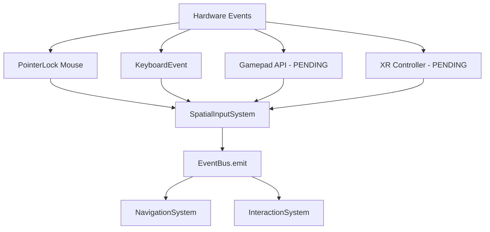

# 📚 SENSORES Y HARDWARE (INPUT)

```json
{
  "module": "InputHardwareLayer",
  "version": "V31_GAMEPAD_PENDING",
  "dependencies": ["ServiceRegistry.js", "EventBus", "navigator.getGamepads"],
  "upgrade_from": "Mouse + Keyboard events via PointerLock API",
  "upgrade_to": "Mouse + Keyboard + Gamepad API + WebXR Controller events",
  "ai_directive": "SpatialInputSystem es la capa pura de hardware. ESTABLE para Mouse/Keyboard. Pending: (1) Agregar bucle de polling para Gamepad API (navigator.getGamepads() en cada frame — NO event-driven), (2) Acoplar XR controller events vía XRSession.oninputsourceschange cuando el modo WebXR esté activo, (3) Emitir eventos unificados al EventBus sin importar la fuente (mouse/pad/xr).",
  "files": 1,
  "status": "STABLE_KEYBOARD_MOUSE",
  "gamepad_status": "PENDING — navigator.getGamepads() bucle no implementado",
  "xr_input_status": "PENDING — XRInputSource events no conectados"
}
```

> **Capa pura de Hardware.** Escucha Mouse, Teclado y emite eventos al EventBus.
> **Estado:** STABLE para Mouse/Keyboard. Gamepad y XR Controller pendientes.

## 💠 Esquema Conceptual



---

## 📜 Código Fuente (Desplegable)

<h3 id="engineinputspatialinputsystemjs">📄 <code>engine/input/SpatialInputSystem.js</code></h3>

*Estadísticas: 85 líneas de código, Tamaño: 2.54 KB*

<details>
<summary><strong>🔭 [ Clic para expandir el código fuente ]</strong></summary>

```js
/**
 * SpatialInputSystem.js
 * FASE 1 - Pura capa de Hardware (Hardware Layer)
 */
import { Registry } from '../core/ServiceRegistry.js';

export class SpatialInputSystem {
    static phase = 'input';

    constructor(services) {
        this.services = services;
        this.events = Registry.get('events');
        this.isLocked = false;
        this.keys = {};
        
        this.escStartTime = 0;
        this.escHoldThreshold = 800;

        this.onPointerDown = this.onPointerDown.bind(this);
        this.onPointerMove = this.onPointerMove.bind(this);
    }

    async init() {
        console.log('[SpatialInputSystem] Hardware Abstraction Active (Single Pipeline).');
        window.addEventListener('pointerdown', this.onPointerDown, { capture: true });
        window.addEventListener('pointermove', this.onPointerMove, { capture: true });
    }

    onPointerDown(event) {
        if (this.events) {
            console.log('%c[Pipeline] 1. INPUT_POINTER_DOWN', 'color:#ff00ea');
            this.events.emit('INPUT_POINTER_DOWN', {
                button: event.button,
                x: event.clientX,
                y: event.clientY,
                target: event.target
            });
        }
    }

    onPointerMove(event) {
        if (this.events) {
            this.events.emit('INPUT_POINTER_MOVE', {
                x: event.clientX,
                y: event.clientY,
                movementX: event.movementX || 0,
                movementY: event.movementY || 0,
                target: event.target
            });
        }
    }

    // Mantenemos métodos inyectados por retrocompatibilidad con InputManager legacy si existe
    injectKeyDown(code) {
        this.keys[code] = true;
        if (code === 'Escape') this.escStartTime = performance.now();
        this.events?.emit('input:keydown', { code });
    }

    injectKeyUp(code) {
        this.keys[code] = false;
        if (code === 'Escape') {
            const duration = performance.now() - this.escStartTime;
            if (duration >= this.escHoldThreshold) {
                this.events?.emit('input:esc:hold');
            } else {
                this.events?.emit('input:esc:click');
            }
            this.escStartTime = 0;
        }
        this.events?.emit('input:keyup', { code });
    }

    setPointerLockState(locked) {
        this.isLocked = locked;
        this.events?.emit('input:lock-change', { locked: this.isLocked });
    }

    requestPointerLock() {
        this.events?.emit('engine:request_pointer_lock');
    }

    getKey(code) { return !!this.keys[code]; }
}

```

</details>

---

