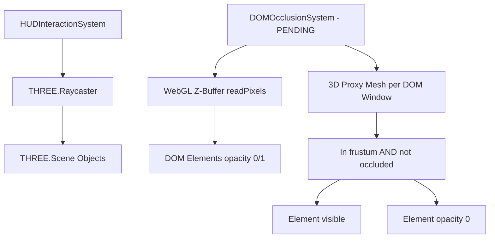

# 📚 LÓGICA DE INTERACCIÓN GLOBAL

```json
{
  "module": "InteractionLayer",
  "version": "V31_OCCLUSION_UPDATE",
  "dependencies": ["THREE.Raycaster", "THREE.WebGLRenderer", "ServiceRegistry.js", "RenderPipeline.js"],
  "upgrade_from": "DOM elementos siempre visibles sobre el canvas WebGL",
  "upgrade_to": "DOM Occlusion Culling via Z-Buffer sampling + Raymarching HUD",
  "ai_directive": "Implementar DOMOcclusionSystem que lea el Z-Buffer de WebGL para determinar si los elementos HTML flotantes están detrás de geometría 3D (planetas, naves). Los elementos ocluidos deben reducir opacidad a 0. Esto crea 'profundidad holográfica' donde ventanas Glass Silicon quedan tapadas por planetas.",
  "files": 9,
  "status": "OCCLUSION_CULLING_PENDING",
  "webxr_ready": true
}
```

> **Estado actual:** Los elementos DOM del HUD siempre se renderizan encima del canvas WebGL. Un planeta no puede ocultar una ventana flotante.
> **Estado objetivo:** Occlusion Culling vía Z-Buffer — una ventana Glass Silicon que orbite detrás de un planeta quedará visualmente oculta, creando profundidad holográfica real.

## 💠 Esquema Conceptual



## 📑 Tabla de Contenidos

- [engine/interaction/HUDInteractionSystem.js](#engineinteractionhudinteractionsystemjs) (281 líneas | 12.75 KB) — **OCCLUSION_CULLING_PENDING**
- [engine/interaction/HandInteractionSystem.js](#engineinteractionhandinteractionsystemjs) (274 líneas | 10.34 KB)
- [engine/interaction/PlayerGauntletsSystem.js](#engineinteractionplayergauntletssystemjs) (248 líneas | 9.19 KB)
- [engine/interaction/RaycastSelectionSystem.js](#engineinteractionraycastselectionsystemjs) (164 líneas | 5.35 KB)
- [engine/interaction/SpatialInteractionManager.js](#engineinteractionspatialinteractionmanagerjs) (90 líneas | 2.92 KB)
- [engine/interaction/SpatialGestureSystem.js](#engineinteractionspatialgesturesystemjs) (89 líneas | 3.14 KB)
- [engine/interaction/InteractionEventSystem.js](#engineinteractioninteractioneventsystemjs) (86 líneas | 3.23 KB)
- [engine/interaction/ScanningSystem.js](#engineinteractionscanningsystemjs) (84 líneas | 2.55 KB)
- [engine/interaction/InteractionStrategy.js](#engineinteractioninteractionstrategyjs) (54 líneas | 1.95 KB)

---

## 🔬 Contratos de Interface — Occlusion Culling V31

### Contrato: `DOMOcclusionSystem` (NUEVO — Crear como archivo separado)

> **AI TASK:** Crear `engine/interaction/DOMOcclusionSystem.js`.
> Debe:
> 1. Para cada ventana DOM registrada, rastrear su posición 3D en el espacio mundial (un `THREE.Vector3` como "anchor point")
> 2. Cada N frames (no cada frame — usar throttle de 10fps), hacer `readPixels` del Z-Buffer de WebGL en la posición proyectada del anchor
> 3. Comparar el Z del buffer con el Z proyectado del anchor. Si buffer_Z < anchor_Z → el elemento está occluido
> 4. Aplicar `opacity: 0` a los elementos occluidos con transición CSS suave
> 5. PROHIBIDO usar `readPixels` cada frame (es costoso) — throttle obligatorio

**Interface esperada:**
```js
class DOMOcclusionSystem {
    // @param {THREE.WebGLRenderer} renderer
    // @param {THREE.Camera} camera
    constructor(renderer, camera) {}

    // Registra un elemento DOM con su posición 3D en el mundo
    // @param {HTMLElement} domElement - Ventana o panel flotante
    // @param {THREE.Vector3} worldPosition - Pivot point en espacio 3D
    // @param {string} windowId - ID único para rastrear
    register(domElement, worldPosition, windowId) {}

    // Desregistra una ventana al cerrarla
    // @param {string} windowId
    unregister(windowId) {}

    // Llamar desde el game loop. Throttled internamente a 10fps para perf.
    // @param {number} time - performance.now()
    update(time) {}
}
```

**Código de implementación inyectable:**
```js
// ═══════════════════════════════════════════════════════════════════
// NUEVO ARCHIVO: engine/interaction/DOMOcclusionSystem.js
// ═══════════════════════════════════════════════════════════════════
import * as THREE from 'three';

/**
 * DOMOcclusionSystem — V31 Holographic Depth
 *
 * Lee un píxel del Z-Buffer de WebGL para cada ventana DOM flotante
 * y determina si está detrás de geometría 3D (planetas, naves, asteroides).
 * Si está ocluida → opacity: 0, revelando la ilusión de profundidad real.
 *
 * LIMITACIÓN: readPixels() solo funciona con preserveDrawingBuffer: true en el renderer.
 * RENDIMIENTO: Throttled a 10fps (cada 100ms) para evitar bottleneck de GPU readback.
 */
export class DOMOcclusionSystem {
    /**
     * @param {THREE.WebGLRenderer} renderer - Con preserveDrawingBuffer: true
     * @param {THREE.Camera} camera
     */
    constructor(renderer, camera) {
        this.renderer = renderer;
        this.camera = camera;

        /** @type {Map<string, {domElement: HTMLElement, worldPos: THREE.Vector3, lastOccluded: boolean}>} */
        this.registered = new Map();

        // Buffers reutilizables — zero GC
        this._ndc    = new THREE.Vector3();
        this._pixel  = new Uint8Array(4); // RGBA del readPixels
        this._zPixel = new Float32Array(1); // Depth pixel
        this._lastCheck = 0;
        this._checkInterval = 100; // ms entre chequeos de Z-buffer (10 fps)

        // Pre-crear el framebuffer para lectura de depth
        this._depthBuffer = null;
        this._initDepthRead();

        console.log('[DOMOcclusionSystem] V31 Holographic Depth online.');
    }

    _initDepthRead() {
        // Verificar soporte de depth texture en el renderer
        const gl = this.renderer.getContext();
        if (!gl.getExtension('WEBGL_depth_texture') && !gl.getExtension('WEBKIT_WEBGL_depth_texture')) {
            console.warn('[DOMOcclusionSystem] WEBGL_depth_texture no disponible. Usando raycasting fallback.');
            this._useRaycastFallback = true;
        } else {
            this._useRaycastFallback = false;
        }
    }

    /**
     * Registra un elemento DOM con su anchor 3D.
     * @param {HTMLElement}  domElement  - Ventana o panel flotante
     * @param {THREE.Vector3} worldPosition - Posición 3D del anchor en el universo
     * @param {string}       windowId    - ID único de la ventana
     */
    register(domElement, worldPosition, windowId) {
        this.registered.set(windowId, {
            domElement,
            worldPos: worldPosition.clone(),
            lastOccluded: false
        });
    }

    /**
     * Desregistra una ventana (llamar al cerrar).
     * @param {string} windowId
     */
    unregister(windowId) {
        this.registered.delete(windowId);
    }

    /**
     * Actualizar posición 3D de una ventana registrada (para ventanas en órbita).
     * @param {string} windowId
     * @param {THREE.Vector3} newWorldPos
     */
    updatePosition(windowId, newWorldPos) {
        const entry = this.registered.get(windowId);
        if (entry) entry.worldPos.copy(newWorldPos);
    }

    /**
     * Game Loop — Throttled a 10fps.
     * Chequea oclusión para cada ventana registrada.
     * @param {number} time - performance.now()
     */
    update(time) {
        if (time - this._lastCheck < this._checkInterval) return;
        this._lastCheck = time;

        for (const [windowId, entry] of this.registered) {
            const isOccluded = this._useRaycastFallback
                ? this._checkOcclusionRaycaster(entry.worldPos)
                : this._checkOcclusionZBuffer(entry.worldPos);

            if (isOccluded !== entry.lastOccluded) {
                entry.lastOccluded = isOccluded;
                // Transición CSS suave — no usar JS animation para no generar GC
                entry.domElement.style.transition = 'opacity 0.4s ease';
                entry.domElement.style.opacity = isOccluded ? '0' : '1';
                entry.domElement.style.pointerEvents = isOccluded ? 'none' : 'auto';
            }
        }
    }

    /**
     * Estrategia 1: Lectura directa del Z-Buffer (óptima).
     * @param {THREE.Vector3} worldPos
     * @returns {boolean} true si occluido
     */
    _checkOcclusionZBuffer(worldPos) {
        // Proyectar al clip space
        this._ndc.copy(worldPos).project(this.camera);

        // Descartar si está detrás de la cámara o fuera del frustum
        if (this._ndc.z > 1.0 || Math.abs(this._ndc.x) > 1 || Math.abs(this._ndc.y) > 1) {
            return false; // Fuera de pantalla = no ocluido (visible o detrás)
        }

        // Convertir NDC a píxeles de pantalla
        const canvas = this.renderer.domElement;
        const px = Math.round((this._ndc.x * 0.5 + 0.5) * canvas.width);
        const py = Math.round((1.0 - (this._ndc.y * 0.5 + 0.5)) * canvas.height); // Flip Y

        // Leer 1 píxel del Z-Buffer
        const gl = this.renderer.getContext();
        gl.readPixels(px, py, 1, 1, gl.RGBA, gl.UNSIGNED_BYTE, this._pixel);

        // El canal R del depth buffer en RGBA = valor de profundidad aproximado
        // (Técnica simplificada — para precisión exacta usar WebGL2 readPixels con DEPTH_COMPONENT)
        const depthBuffer = this._pixel[0] / 255.0;
        const depthAnchor  = (this._ndc.z + 1.0) * 0.5; // NDC z → [0, 1]

        // Si el buffer tiene algo más cercano que el anchor → anchor está occluido
        return depthBuffer < depthAnchor - 0.02; // 0.02 = epsilon de precisión
    }

    /**
     * Estrategia 2: Raycaster fallback (más costoso pero universal).
     * @param {THREE.Vector3} worldPos
     * @returns {boolean} true si occluido
     */
    _checkOcclusionRaycaster(worldPos) {
        const sceneGraph = window.Registry?.get('SceneGraph');
        if (!sceneGraph) return false;

        // Rayo desde la cámara hacia el anchor
        if (!this._raycaster) this._raycaster = new THREE.Raycaster();
        this._raycaster.setFromCamera(
            new THREE.Vector2(this._ndc.x, this._ndc.y),
            this.camera
        );

        const anchorDist = this.camera.position.distanceTo(worldPos);
        const hits = this._raycaster.intersectObjects(sceneGraph.getScene().children, true);

        // Si hay intersección más cerca que el anchor → occluido
        return hits.some(hit => hit.distance < anchorDist - 5.0);
    }
}
```

> **INTEGRACIÓN:** Instanciar en `HUDInteractionSystem` o `WindowManager`. Llamar `update(performance.now())` desde el game loop de render. Registrar ventanas desde `WindowDOMSystem` cuando se abren.

---

## 📜 Código Fuente (Desplegable)

<h3 id="engineinteractionhudinteractionsystemjs">📄 <code>engine/interaction/HUDInteractionSystem.js</code></h3>

*Estadísticas: 281 líneas de código, Tamaño: 12.75 KB*

<details>
<summary><strong>🔭 [ Clic para expandir el código fuente ]</strong></summary>

```js
import * as THREE from 'three';
import { Registry } from '../core/ServiceRegistry.js';
import { gsap } from 'gsap';

export class HUDInteractionSystem {
    constructor(camera) {
        this.camera = camera;
        this.events = Registry.get('events');
        this.windowDOMSystem = null;
        
        this.hoveredNode = null;
        this.isInnerHoverActive = false;
        this._highlightColor = new THREE.Color();

        this._initCrosshair();
        
        this.events.on('INTERACTION:HOVER_START', this.onHoverStart.bind(this));
        this.events.on('INTERACTION:HOVER_UPDATE', this.onHoverUpdate.bind(this));
        this.events.on('INTERACTION:HOVER_END', this.onHoverEnd.bind(this));
        this.events.on('INTERACTION:GRAVITY_GUN_FIRED', this.onGravityGunFired.bind(this));
    }

    setWindowDOMSystem(domSystem) {
        this.windowDOMSystem = domSystem;
    }

    _initCrosshair() {
        if (!document.getElementById('pg-crosshair')) {
            const crosshair = document.createElement('div');
            crosshair.id = 'pg-crosshair';
            crosshair.style.cssText = `position: absolute; top: 50%; left: 50%; width: 14px; height: 14px; border: 2px solid rgba(0, 255, 200, 0.7); border-radius: 50%; transform: translate(-50%, -50%) scale(1); pointer-events: none; z-index: 10000; transition: transform 0.15s cubic-bezier(0.175, 0.885, 0.32, 1.275), border-color 0.15s ease, opacity 0.3s ease; mix-blend-mode: screen; opacity: 0;`;
            document.body.appendChild(crosshair);
            this.crosshairDom = crosshair;
        } else {
            this.crosshairDom = document.getElementById('pg-crosshair');
        }
        this._initTargetReticle();
    }

    _initTargetReticle() {
        if (!document.getElementById('pg-target-reticle')) {
            this.targetReticle = document.createElement('div');
            this.targetReticle.id = 'pg-target-reticle';
            this.targetReticle.style.cssText = `position: absolute; pointer-events: none; z-index: 1040; width: 60px; height: 60px; border-radius: 50%; border: 1px solid rgba(0, 255, 200, 0.2); transform: translate(-50%, -50%) scale(0.3); opacity: 0; transition: transform 0.3s cubic-bezier(0.175, 0.885, 0.32, 1.275), opacity 0.3s; display: flex; align-items: center; justify-content: center; box-sizing: border-box;`;
            
            const crossH = document.createElement('div');
            crossH.style.cssText = `position: absolute; width: 140%; height: 1px; background: linear-gradient(90deg, transparent, rgba(0,255,200,0.8), transparent);`;
            const crossV = document.createElement('div');
            crossV.style.cssText = `position: absolute; width: 1px; height: 140%; background: linear-gradient(0deg, transparent, rgba(0,255,200,0.8), transparent);`;
            
            this.targetReticle.appendChild(crossH);
            this.targetReticle.appendChild(crossV);

            const innerCircle = document.createElement('div');
            innerCircle.id = 'pg-target-inner';
            innerCircle.style.cssText = `width: 12px; height: 12px; border-radius: 50%; border: 1px solid rgba(0, 255, 200, 0.9); background: rgba(0, 255, 200, 0.2); box-shadow: 0 0 10px rgba(0, 255, 200, 0.6); transition: transform 0.15s cubic-bezier(0.175, 0.885, 0.32, 1.275), background 0.15s; box-sizing: border-box; z-index: 2;`;
            this.targetReticle.appendChild(innerCircle);
            document.body.appendChild(this.targetReticle);

            const tetherSvg = document.createElementNS('http://www.w3.org/2000/svg', 'svg');
            tetherSvg.id = 'pg-tether-svg';
            tetherSvg.style.cssText = `position: fixed; inset: 0; width: 100vw; height: 100vh; pointer-events: none; z-index: 1039;`;
            
            const tetherLine = document.createElementNS('http://www.w3.org/2000/svg', 'line');
            tetherLine.id = 'pg-tether-line';
            tetherLine.setAttribute('stroke', '#00ffc8');
            tetherLine.setAttribute('stroke-width', '1.2');
            tetherLine.setAttribute('stroke-dasharray', '6 6');
            tetherLine.style.opacity = '0';
            tetherSvg.appendChild(tetherLine);
            document.body.appendChild(tetherSvg);

            const tetherDot = document.createElement('div');
            tetherDot.id = 'pg-tether-dot';
            tetherDot.style.cssText = `position: fixed; top: 0; left: 0; pointer-events: none; z-index: 1041; width: 6px; height: 6px; border-radius: 50%; background: #00ffc8; box-shadow: 0 0 8px #00ffc8; transform: translate(-50%, -50%); opacity: 0;`;
            document.body.appendChild(tetherDot);
        } else {
            this.targetReticle = document.getElementById('pg-target-reticle');
        }
    }

    onHoverStart(data) {
        this.hoveredNode = data.node;
        this._cacheNodeVisualState(this.hoveredNode);

        if (this.crosshairDom && data.isFps) {
            this.crosshairDom.style.opacity = '1';
            if (!this.hoveredNode.userData?.isDrone && !this.hoveredNode.userData?.isApp) {
                this.crosshairDom.style.transform = 'translate(-50%, -50%) scale(0.5)';
                this.crosshairDom.style.borderColor = 'rgba(255, 60, 60, 1)';
            } else {
                this.crosshairDom.style.transform = 'translate(-50%, -50%) scale(1)';
                this.crosshairDom.style.borderColor = 'rgba(0, 255, 200, 0.7)';
            }
        } else if (this.crosshairDom) {
            this.crosshairDom.style.opacity = '0';
        }

        this.onHoverUpdate(data);
    }

    onHoverUpdate(data) {
        if (!this.hoveredNode) return;
        
        const screenPos = new THREE.Vector3();
        this.hoveredNode.getWorldPosition(screenPos);

        const handSystem = window.Registry?.get('handSystem');
        if (handSystem) handSystem.setIKTarget(screenPos);

        if (screenPos.z < 0 || screenPos.z > 1) { 
            screenPos.project(this.camera);
            if (screenPos.z < 1) {
                const xOffset = (screenPos.x *  0.5 + 0.5) * window.innerWidth;
                const yOffset = (screenPos.y * -0.5 + 0.5) * window.innerHeight;
                
                if (this.targetReticle) {
                    this.targetReticle.style.left = `${xOffset}px`;
                    this.targetReticle.style.top = `${yOffset}px`;
                    this.targetReticle.style.opacity = '1';
                    this.targetReticle.style.transform = 'translate(-50%, -50%) scale(1)';
                }
                
                const mouseX = (data.mouse.x *  0.5 + 0.5) * window.innerWidth;
                const mouseY = (data.mouse.y * -0.5 + 0.5) * window.innerHeight;
                const dist = Math.hypot(mouseX - xOffset, mouseY - yOffset);
                
                const tetherLine = document.getElementById('pg-tether-line');
                const tetherDot = document.getElementById('pg-tether-dot');

                if (dist < 40) {
                    if (!this.isInnerHoverActive) {
                        this.isInnerHoverActive = true;
                        this._playInnerHoverOn();
                    }
                    if (tetherLine && tetherDot) {
                        tetherLine.setAttribute('x1', String(xOffset));
                        tetherLine.setAttribute('y1', String(yOffset));
                        tetherLine.setAttribute('x2', String(mouseX));
                        tetherLine.setAttribute('y2', String(mouseY));
                        tetherLine.style.opacity = '0.7';
                        
                        tetherDot.style.left = `${mouseX}px`;
                        tetherDot.style.top = `${mouseY}px`;
                        tetherDot.style.opacity = '1';
                    }
                } else {
                    if (this.isInnerHoverActive) {
                        this.isInnerHoverActive = false;
                        this._playInnerHoverOff();
                    }
                    if (tetherLine) tetherLine.style.opacity = '0';
                    if (tetherDot) tetherDot.style.opacity = '0';
                }
            }
        }
    }

    onHoverEnd() {
        if (!this.hoveredNode) return;
        
        const handSystem = window.Registry?.get('handSystem');
        if (handSystem) handSystem.clearIKTarget();

        if (this.isInnerHoverActive) {
            this._playInnerHoverOff();
            this.isInnerHoverActive = false;
        }

        if (this.targetReticle) {
            this.targetReticle.style.opacity = '0';
            this.targetReticle.style.transform = 'translate(-50%, -50%) scale(0.4)';
        }

        const tetherLine = document.getElementById('pg-tether-line');
        const tetherDot = document.getElementById('pg-tether-dot');
        if (tetherLine) tetherLine.style.opacity = '0';
        if (tetherDot) tetherDot.style.opacity = '0';

        this.hoveredNode = null;
    }

    onGravityGunFired() {
        if (this.crosshairDom) {
            gsap.fromTo(this.crosshairDom, 
                { scale: 0.2, borderColor: '#fff' },
                { scale: 0.5, borderColor: 'rgba(255, 60, 60, 1)', duration: 0.3, ease: 'back.out' }
            );
        }
    }

    _cacheNodeVisualState(node) {
        node.userData.__hoverBaseScale = { x: node.scale.x, y: node.scale.y, z: node.scale.z };
        const emissiveEntries = [];
        this._forEachNodeMaterial(node, (material) => {
            if (material?.emissive) {
                emissiveEntries.push({ material, r: material.emissive.r, g: material.emissive.g, b: material.emissive.b });
            }
        });
        node.userData.__hoverBaseEmissives = emissiveEntries;
    }

    _playInnerHoverOn() {
        const node = this.hoveredNode;
        if (!node) return;
        
        const inner = this.targetReticle?.querySelector('#pg-target-inner');
        if (inner) {
            inner.style.transform = 'scale(1.35)';
            inner.style.backgroundColor = 'rgba(0, 255, 200, 0.15)';
        }

        const baseScale = node.userData?.__hoverBaseScale || { x: 1, y: 1, z: 1 };
        const scaleBoost = 1.05;
        gsap.to(node.scale, { x: baseScale.x * scaleBoost, y: baseScale.y * scaleBoost, z: baseScale.z * scaleBoost, duration: 0.32, ease: 'back.out(1.45)' });

        const highlight = this._getHighlightEmissive(node);
        this._forEachNodeMaterial(node, (material) => {
            if (!material?.emissive) return;
            gsap.to(material.emissive, { r: highlight.r, g: highlight.g, b: highlight.b, duration: 0.28, ease: 'power2.out' });
        });

        if (this.windowDOMSystem && node.userData?.appId && node.userData?.isApp) {
            const windowId = `os-window-${node.userData.appId}`;
            if (document.getElementById(windowId)) {
                this.windowDOMSystem.setWindowCollapsedOnPlanetHover(node.userData.appId, false);
            } else {
                window.dispatchEvent(new CustomEvent('WARP_FLIGHT_COMPLETE', {
                    detail: {
                        appId: node.userData.appId,
                        nodeType: node.userData.nodeType || 'planet',
                        label: node.userData.appName || node.name || node.userData.appId
                    }
                }));
            }
        }
    }

    _playInnerHoverOff() {
        const node = this.hoveredNode;
        if (!node) return;
        
        const inner = this.targetReticle?.querySelector('#pg-target-inner');
        if (inner) {
            inner.style.transform = 'scale(1)';
            inner.style.backgroundColor = 'transparent';
        }

        const baseScale = node.userData?.__hoverBaseScale;
        if (baseScale) {
            gsap.to(node.scale, { x: baseScale.x, y: baseScale.y, z: baseScale.z, duration: 0.35, ease: 'back.in(1.2)' });
        }

        const baseEmissives = node.userData?.__hoverBaseEmissives || [];
        for (let i = 0; i < baseEmissives.length; i++) {
            const entry = baseEmissives[i];
            gsap.to(entry.material.emissive, { r: entry.r, g: entry.g, b: entry.b, duration: 0.35, ease: 'power2.out' });
        }

        if (this.windowDOMSystem && node.userData?.appId && node.userData?.isApp && !node.userData?.isDrone) {
            this.windowDOMSystem.setWindowCollapsedOnPlanetHover(node.userData.appId, true);
        }
    }

    _getHighlightEmissive(node) {
        const base = node.material?.color || this._highlightColor.setRGB(0.2, 0.86, 0.94);
        return { r: Math.min(1, base.r * 0.55 + 0.18), g: Math.min(1, base.g * 0.55 + 0.28), b: Math.min(1, base.b * 0.55 + 0.42) };
    }

    _forEachNodeMaterial(node, callback) {
        node.traverse((child) => {
            const materials = Array.isArray(child.material) ? child.material : [child.material];
            for (let i = 0; i < materials.length; i++) {
                if (materials[i]) {
                    callback(materials[i], child);
                }
            }
        });
    }
}

```

</details>

---

<h3 id="engineinteractionhandinteractionsystemjs">📄 <code>engine/interaction/HandInteractionSystem.js</code></h3>

*Estadísticas: 274 líneas de código, Tamaño: 10.34 KB*

<details>
<summary><strong>🔭 [ Clic para expandir el código fuente ]</strong></summary>

```js
import * as THREE from 'three';
import { GLTFLoader } from 'three/examples/jsm/loaders/GLTFLoader.js';

export class HandInteractionSystem {
    constructor(camera, scene) {
        this.camera = camera;
        this.scene = scene;
        
        // Animadores
        this.mixers = [];
        this.actions = { left: {}, right: {} };
        
        // Contenedores de las manos pegados a la cámara
        this.leftHand = new THREE.Group();
        this.leftHand.scale.set(0, 0, 0); 
        this.rightHand = new THREE.Group();
        this.rightHand.scale.set(0, 0, 0);
        this.camera.add(this.leftHand);
        this.camera.add(this.rightHand);
        
        // Coordenadas del ratón para el efecto Parallax
        this.mouse = new THREE.Vector2();
        this.targetRotation = { x: 0, y: 0 };

        // --- Espacio de variables IK (Cinemática Inversa) ---
        this.pointingBone = null;
        this.ikTargetWorld = null;
        this.ikActive = false;
        
        this.baseBoneRotation = new THREE.Quaternion();
        this.targetBoneRotation = new THREE.Quaternion();

        // --- Hologram Cybernetics ---
        this.indexFingerBone = null;
        this.holoAuraMaterial = null;
        this.targetHoloOpacity = 0.0;

        this._initHands();
        this._setupInputListeners();
    }

    _initHands() {
        const loader = new GLTFLoader();

        // 1. Cargar Mano Izquierda (Esquina superior izquierda)
        loader.load('assets/models/mano_izquierda.glb', (gltf) => {
            const model = gltf.scene;
            
            // Posicionar arriba a la izquierda, frente a la cámara
            model.position.set(-2.5, 1.5, -4); 
            // Rotar para que apunte hacia la pantalla
            model.rotation.set(0.2, 0.5, -0.3); 
            model.scale.set(1.2, 1.2, 1.2);

            this.leftHand.add(model);
            this._setupAnimations(gltf, 'left');
        });

        // 2. Cargar Mano Derecha (Lado derecho, interactuando con UI)
        loader.load('assets/models/mano_derecha.glb', (gltf) => {
            const model = gltf.scene;
            
            // Posicionar a la derecha, un poco más abajo
            model.position.set(2.5, -0.5, -3.5);
            // Rotar para apuntar al centro
            model.rotation.set(-0.1, -0.4, 0.1);

            // Búsqueda profunda del Hueso Pivote para la IK Next-Gen y Hologramas
            model.traverse((child) => {
                if (child.isBone && child.name === 'Wrist_R') { 
                    this.pointingBone = child;
                    this.baseBoneRotation.copy(child.quaternion);
                }
                if (child.isBone && child.name === 'Index_Tip_R') { 
                    this.indexFingerBone = child;
                    const aura = this._createHolographicAura();
                    this.indexFingerBone.add(aura);
                }
            });

            this.rightHand.add(model);
            this._setupAnimations(gltf, 'right');
        });
    }

    _createHolographicAura() {
        const geometry = new THREE.SphereGeometry(0.05, 16, 16); 
        this.holoAuraMaterial = new THREE.MeshBasicMaterial({
            color: 0x00ffff, 
            transparent: true,
            opacity: 0.0, 
            blending: THREE.AdditiveBlending, 
            depthWrite: false, 
            wireframe: true 
        });

        const auraMesh = new THREE.Mesh(geometry, this.holoAuraMaterial);
        auraMesh.position.set(0, 0.05, 0); 
        return auraMesh;
    }

    _setupAnimations(gltf, side) {
        if (gltf.animations.length > 0) {
            const mixer = new THREE.AnimationMixer(gltf.scene);
            this.mixers.push(mixer);

            // Mapear animaciones (asumiendo que tus modelos tienen estas animaciones)
            gltf.animations.forEach((clip) => {
                const action = mixer.clipAction(clip);
                this.actions[side][clip.name.toLowerCase()] = action;
            });

            // Reproducir animación de reposo por defecto
            if (this.actions[side]['idle']) {
                this.actions[side]['idle'].play();
            }
        }
    }

    _setupInputListeners() {
        // Rastrear el ratón para que la mano derecha lo siga ligeramente
        window.addEventListener('mousemove', (event) => {
            // Normalizar coordenadas del ratón de -1 a 1
            this.mouse.x = (event.clientX / window.innerWidth) * 2 - 1;
            this.mouse.y = -(event.clientY / window.innerHeight) * 2 + 1;

            // La mano derecha seguirá el puntero sutilmente
            this.targetRotation.x = -this.mouse.y * 0.3; 
            this.targetRotation.y = this.mouse.x * 0.5;
        });

        // Animación de Clic
        window.addEventListener('mousedown', () => {
            this.playAnimationOnce('right', 'click');
        });

        // Animación de Tecleo (Keyboard)
        window.addEventListener('keydown', (event) => {
            // Animamos la mano izquierda cuando presionas teclas de control/atajos
            if (event.code === 'Escape' || event.code === 'Space') {
                this.playAnimationOnce('left', 'tap');
            }
        });
    }

    playAnimationOnce(side, animName) {
        const action = this.actions[side][animName];
        const idleAction = this.actions[side]['idle'];

        if (action) {
            // Transición suave del Idle al Clic
            action.reset().setEffectiveTimeScale(1).setEffectiveWeight(1);
            action.setLoop(THREE.LoopOnce, 1);
            action.clampWhenFinished = true;
            
            if (idleAction) {
                action.crossFadeFrom(idleAction, 0.1, true).play();
            } else {
                action.play();
            }

            // Volver al Idle cuando termine el clic
            this.mixers.forEach(m => {
                const listener = (e) => {
                    if (e.action === action && idleAction) {
                        idleAction.reset().play();
                        idleAction.crossFadeFrom(action, 0.2, true);
                        m.removeEventListener('finished', listener);
                    }
                };
                m.addEventListener('finished', listener);
            });
        }
    }

    setIKTarget(worldPosition) {
        if (!worldPosition) {
            this.ikActive = false;
            return;
        }
        if (!this.ikTargetWorld) this.ikTargetWorld = new THREE.Vector3();
        this.ikTargetWorld.copy(worldPosition);
        this.ikActive = true;
        this.targetHoloOpacity = 0.8;
    }

    clearIKTarget() {
        this.ikActive = false;
        this.targetHoloOpacity = 0.0;
    }

    // Llama a este método dentro de tu ciclo requestAnimationFrame
    update(deltaTime) {
        // 0. Control de Visibilidad HUD Dinámico según Estado de Navegación
        if (!this.navigationSystem) {
            this.navigationSystem = window.Registry?.get('navigationSystem');
        }

        let isVisible = false;
        if (this.navigationSystem) {
            const state = this.navigationSystem.state;
            // Ocultar manos durante Intro, Menús o Secuencias de Salto Warp
            isVisible = state !== 'WARPING' && state !== 'BOOTING' && state !== 'MOUSE_UI';
        }

        const targetScaleLeft = isVisible ? 1.0 : 0.0;
        const targetScaleRight = isVisible ? 1.0 : 0.0;
        
        this.leftHand.scale.lerp(new THREE.Vector3(targetScaleLeft, targetScaleLeft, targetScaleLeft), deltaTime * 8);
        this.rightHand.scale.lerp(new THREE.Vector3(targetScaleRight, targetScaleRight, targetScaleRight), deltaTime * 8);


        // 1. Actualizar animaciones de huesos (Mixers)
        this.mixers.forEach(mixer => mixer.update(deltaTime));

        // 2. Efecto Parallax Suave (Lerp) para la mano derecha apuntando
        if (this.rightHand.children.length > 0) {
            const handModel = this.rightHand.children[0];
            if (this.targetRotation) {
                handModel.rotation.x += ((this.targetRotation.x || 0) - handModel.rotation.x) * 10 * deltaTime;
                handModel.rotation.y += ((this.targetRotation.y || 0) - handModel.rotation.y) * 10 * deltaTime;
            }
        }
        
        // Efecto de "respiración" o flotación para la mano izquierda
        if (this.leftHand.children.length > 0) {
            const time = performance.now() * 0.001;
            this.leftHand.position.y = 1.5 + Math.sin(time) * 0.05;
        }

        // 3. Ejecutar Lógica de IK en el hueso extraído de la mano derecha
        if (this.pointingBone) {
            if (this.ikActive && this.ikTargetWorld) {
                // Traducción de la cordenada Mundial del Sistema Solar al Espacio Local de la muñeca (pegada a la cámara)
                const localTarget = this.pointingBone.parent.worldToLocal(this.ikTargetWorld.clone());
                
                // Backup orgánico
                const currentQuat = this.pointingBone.quaternion.clone();

                // Fake LookAt 
                this.pointingBone.lookAt(localTarget);
                
                // OFFSET DE CORRECCIÓN (Descomentar si la mano apunta con un lado raro)
                // this.pointingBone.rotateX(Math.PI / 2); 
                // this.pointingBone.rotateY(-Math.PI / 2); 

                this.targetBoneRotation.copy(this.pointingBone.quaternion);
                this.pointingBone.quaternion.copy(currentQuat); // Revert to reality

                // Slerp fluido hacia la meta ideal calculada
                this.pointingBone.quaternion.slerp(this.targetBoneRotation, deltaTime * 8);
            } else {
                // Return to Idle Relaxed State
                this.pointingBone.quaternion.slerp(this.baseBoneRotation, deltaTime * 5);
            }
        }

        // 4. ANIMAR EL HOLOGRAMA
        if (this.holoAuraMaterial) {
            this.holoAuraMaterial.opacity += (this.targetHoloOpacity - this.holoAuraMaterial.opacity) * 10 * deltaTime;

            if (this.targetHoloOpacity > 0) {
                const time = performance.now() * 0.005;
                this.holoAuraMaterial.opacity = 0.5 + Math.sin(time) * 0.3; 
                
                if (this.indexFingerBone && this.indexFingerBone.children.length > 0) {
                    this.indexFingerBone.children[0].rotation.y += deltaTime;
                    this.indexFingerBone.children[0].rotation.x += deltaTime * 0.5;
                }
            }
        }
    }
}

```

</details>

---

<h3 id="engineinteractionplayergauntletssystemjs">📄 <code>engine/interaction/PlayerGauntletsSystem.js</code></h3>

*Estadísticas: 248 líneas de código, Tamaño: 9.19 KB*

<details>
<summary><strong>🔭 [ Clic para expandir el código fuente ]</strong></summary>

```js
import * as THREE from 'three';
import { gsap } from 'gsap';

export class PlayerGauntletsSystem {
    constructor(camera, scene) {
        this.camera = camera;
        this.scene = scene;
        this.gauntletsContainer = new THREE.Group();
        this.gauntletsContainer.name = "Player_Gauntlets_HUD";
        
        // Attach gauntlets directly to the camera so they follow 1:1 without lag
        this.camera.add(this.gauntletsContainer);
        // Ensure camera is added to scene to render children
        if (!this.camera.parent) {
            this.scene.add(this.camera);
        }

        this.leftHand = this._createCyberGauntlet(true);
        this.rightHand = this._createCyberGauntlet(false);

        // Position them prominently in first-person view
        this.leftHand.position.set(-0.75, -0.55, -1.8);
        this.rightHand.position.set(0.75, -0.55, -1.8);

        // Sleek diagonal inward angle
        this.leftHand.rotation.set(0.1, 0.3, 0.15);
        this.rightHand.rotation.set(0.1, -0.3, -0.15);

        this.gauntletsContainer.add(this.leftHand);
        this.gauntletsContainer.add(this.rightHand);
        
        // HUD Internal Space Lighting (Evita siluetas en fondo negro/noche galáctica)
        const personalLight = new THREE.PointLight(0xddeeff, 2.5, 12);
        personalLight.position.set(0, 1.5, -0.5);
        this.gauntletsContainer.add(personalLight);
        
        const personalAmbient = new THREE.AmbientLight(0xffffff, 0.9);
        this.gauntletsContainer.add(personalAmbient);

        // Idle animation state
        this.time = 0;
        this.isInteracting = false;
        
        console.log('[PlayerGauntletsSystem] Online. First-person hands active.');
    }

    _createCyberGauntlet(isLeft) {
        const group = new THREE.Group();
        const sign = isLeft ? 1 : -1;

        // Material Options
        const metalMat = new THREE.MeshStandardMaterial({
            color: 0x1d2331,
            metalness: 0.7,
            roughness: 0.3
        });

        const accentMat = new THREE.MeshStandardMaterial({
            color: 0x2f3950,
            metalness: 0.8,
            roughness: 0.4
        });

        const energyMat = new THREE.MeshStandardMaterial({
            color: 0x00e5ff,
            emissive: 0x00e5ff,
            emissiveIntensity: 2.5,
            transparent: true,
            opacity: 0.9
        });

        // 1. Wrist Joint (Sleek Connector passing to the main procedural piston arm)
        const wristGeo = new THREE.CylinderGeometry(0.18, 0.24, 0.2, 8);
        const wrist = new THREE.Mesh(wristGeo, metalMat);
        wrist.rotation.x = Math.PI / 2;
        wrist.position.z = 0.35; // Moved cleanly just behind the palm
        wrist.position.y = -0.05;
        group.add(wrist);

        // 2. Main Hand Palm Base
        const palmGeo = new THREE.BoxGeometry(0.55, 0.25, 0.6);
        const palm = new THREE.Mesh(palmGeo, metalMat);
        group.add(palm);

        // 3. Glowing Core / Reactor on back of hand
        const coreGeo = new THREE.TorusGeometry(0.14, 0.04, 8, 16);
        const core = new THREE.Mesh(coreGeo, energyMat);
        core.position.y = 0.13; // Slightly above the palm
        core.rotation.x = Math.PI / 2;
        group.add(core);

        const innerCoreGeo = new THREE.SphereGeometry(0.08, 16, 16);
        const innerCore = new THREE.Mesh(innerCoreGeo, energyMat);
        innerCore.position.y = 0.13;
        innerCore.scale.set(1, 0.4, 1);
        group.add(innerCore);
        
        group.userData.energyCore = innerCore; // Store for pulse animations

        // 4. Fingers (Procedural)
        const fingersGroup = new THREE.Group();
        fingersGroup.position.z = -0.35; // Front of the palm
        group.add(fingersGroup);

        // X positions matching human fingers: Index to Pinky
        const fingerXPositions = isLeft ? [0.18, 0.06, -0.06, -0.18] : [-0.18, -0.06, 0.06, 0.18]; 
        const fingerLengths = [0.38, 0.42, 0.39, 0.28]; // Index, Middle, Ring, Pinky
        
        for (let i = 0; i < 4; i++) {
            const fGroup = new THREE.Group();
            fGroup.position.x = fingerXPositions[i];
            
            // Base joint (Fallback to Cylinder since Capsule is r137+)
            const baseGeo = new THREE.CylinderGeometry(0.045, 0.045, fingerLengths[i] * 0.5, 8);
            const base = new THREE.Mesh(baseGeo, metalMat);
            base.position.z = -fingerLengths[i] * 0.25;
            base.rotation.x = Math.PI / 2;
            fGroup.add(base);

            // Mid joint
            const midGeo = new THREE.CylinderGeometry(0.035, 0.035, fingerLengths[i] * 0.4, 8);
            const mid = new THREE.Mesh(midGeo, accentMat);
            mid.position.z = -fingerLengths[i] * 0.7;
            mid.position.y = -0.06;
            mid.rotation.x = Math.PI / 2 - 0.25;
            fGroup.add(mid);
            
            // Glowing fingertip
            const tipGeo = new THREE.SphereGeometry(0.04, 8, 8);
            const tip = new THREE.Mesh(tipGeo, energyMat);
            tip.position.z = -fingerLengths[i] * 0.95;
            tip.position.y = -0.12;
            fGroup.add(tip);

            // Natural curve relative to hand
            fGroup.rotation.x = -0.1;
            // Slight splay outward
            fGroup.rotation.y = (fingerXPositions[i] * 0.5);

            fingersGroup.add(fGroup);
        }

        // 5. Thumb
        const thumbGroup = new THREE.Group();
        thumbGroup.position.set(sign * 0.32, -0.05, -0.15); 
        thumbGroup.rotation.y = sign * -0.7; // Angle outward
        thumbGroup.rotation.z = sign * -0.4;
        group.add(thumbGroup);

        const tBaseGeo = new THREE.CylinderGeometry(0.055, 0.055, 0.25, 8);
        const tBase = new THREE.Mesh(tBaseGeo, metalMat);
        tBase.position.x = sign * 0.12;
        tBase.rotation.z = Math.PI / 2;
        thumbGroup.add(tBase);

        const tMidGeo = new THREE.CylinderGeometry(0.045, 0.045, 0.22, 8);
        const tMid = new THREE.Mesh(tMidGeo, accentMat);
        tMid.position.x = sign * 0.35;
        tMid.rotation.z = Math.PI / 2;
        thumbGroup.add(tMid);

        const tTipGeo = new THREE.SphereGeometry(0.045, 8, 8);
        const tTip = new THREE.Mesh(tTipGeo, energyMat);
        tTip.position.x = sign * 0.48;
        thumbGroup.add(tTip);

        // 6. Cyber Armor plating
        const armorGeo = new THREE.BoxGeometry(0.65, 0.05, 0.65);
        const armor = new THREE.Mesh(armorGeo, accentMat);
        armor.position.y = 0.16;
        armor.position.z = 0.05;
        armor.rotation.x = -0.05;
        group.add(armor);

        return group;
    }

    update(deltaTime) {
        this.time += deltaTime;

        // Subtle idle breathing animation
        if (!this.isInteracting) {
            const breath = Math.sin(this.time * 2) * 0.015;
            const sway = Math.cos(this.time * 1.2) * 0.01;

            this.leftHand.position.y = -0.55 + breath;
            this.leftHand.position.x = -0.75 + sway;
            this.leftHand.rotation.z = 0.15 + sway * 1.5;

            this.rightHand.position.y = -0.55 + breath;
            this.rightHand.position.x = 0.75 - sway;
            this.rightHand.rotation.z = -0.15 - sway * 1.5;

            // Pulse cores
            const pulse = (Math.sin(this.time * 3) + 1) * 0.5; // 0 to 1
            if(this.leftHand.userData.energyCore) {
                this.leftHand.userData.energyCore.material.emissiveIntensity = 1.8 + pulse * 1.5;
            }
            if(this.rightHand.userData.energyCore) {
                this.rightHand.userData.energyCore.material.emissiveIntensity = 1.8 + pulse * 1.5;
            }
        }
    }

    animateGrab() {
        this.isInteracting = true;

        // Bring hands elegantly inward and upward for Gravity Gun hold
        gsap.to(this.leftHand.position, {
            x: -0.45, y: -0.25, z: -1.3, duration: 0.5, ease: "back.out(1.2)"
        });
        gsap.to(this.leftHand.rotation, {
            x: 0.4, y: 0.6, z: 0.5, duration: 0.5, ease: "back.out(1.2)"
        });

        gsap.to(this.rightHand.position, {
            x: 0.45, y: -0.25, z: -1.3, duration: 0.5, ease: "back.out(1.2)"
        });
        gsap.to(this.rightHand.rotation, {
            x: 0.4, y: -0.6, z: -0.5, duration: 0.5, ease: "back.out(1.2)"
        });

        if(this.leftHand.userData.energyCore) {
            gsap.to(this.leftHand.userData.energyCore.material, { emissiveIntensity: 5.0, duration: 0.3 });
            gsap.to(this.rightHand.userData.energyCore.material, { emissiveIntensity: 5.0, duration: 0.3 });
        }
    }

    animateRelease() {
        gsap.to(this.leftHand.position, {
            x: -0.75, y: -0.55, z: -1.8, duration: 0.7, ease: "power2.out"
        });
        gsap.to(this.leftHand.rotation, {
            x: 0.1, y: 0.3, z: 0.15, duration: 0.7, ease: "power2.out"
        });

        gsap.to(this.rightHand.position, {
            x: 0.75, y: -0.55, z: -1.8, duration: 0.7, ease: "power2.out",
            onComplete: () => { this.isInteracting = false; }
        });

        if(this.leftHand.userData.energyCore) {
            gsap.to(this.leftHand.userData.energyCore.material, { emissiveIntensity: 1.8, duration: 0.7 });
            gsap.to(this.rightHand.userData.energyCore.material, { emissiveIntensity: 1.8, duration: 0.7 });
        }
    }
}

```

</details>

---

<h3 id="engineinteractionraycastselectionsystemjs">📄 <code>engine/interaction/RaycastSelectionSystem.js</code></h3>

*Estadísticas: 164 líneas de código, Tamaño: 5.35 KB*

<details>
<summary><strong>🔭 [ Clic para expandir el código fuente ]</strong></summary>

```js
import * as THREE from 'three';
import { Registry } from '../core/ServiceRegistry.js';
import { CAMERA_STATES } from '../navigation/UniverseNavigationSystem.js';

export class RaycastSelectionSystem {
    constructor(camera, sceneGraph, navigationSystem) {
        this.camera = camera;
        this.sceneGraph = sceneGraph;
        this.navigationSystem = navigationSystem;
        this.events = Registry.get('events');
        
        this.raycaster = new THREE.Raycaster();
        this.mouse = new THREE.Vector2(-9999, -9999);
        this.pointerRaw = { x: -9999, y: -9999 };
        
        this.hoveredNode = null;
        this.isEnabled = false;
        
        this.updateMouse = this.updateMouse.bind(this);
        this.handleClick = this.handleClick.bind(this);
        this.update = this.update.bind(this);
    }

    enable() {
        if (this.isEnabled) return;
        this.events.on('INPUT_POINTER_MOVE', this.updateMouse);
        this.events.on('INPUT_POINTER_DOWN', this.handleClick);
        this.isEnabled = true;
    }

    disable() {
        if (!this.isEnabled) return;
        this.events.removeListener('INPUT_POINTER_MOVE', this.updateMouse);
        this.events.removeListener('INPUT_POINTER_DOWN', this.handleClick);
        this.isEnabled = false;
        this.clearHover();
    }

    _getRendererDomElement() {
        if (this.renderer && this.renderer.domElement) return this.renderer.domElement;
        // Fallback por si no est\u00e1 en Registry
        const canvas = document.querySelector('canvas');
        return canvas || document.body;
    }

    updateMouse(data) {
        if (this._isUiTarget(data.target)) {
            this.clearHover();
            return;
        }

        const domElement = this._getRendererDomElement();
        const rect = domElement.getBoundingClientRect();

        // NDC Fix robusto sugerido
        this.mouse.x = ((data.x - rect.left) / rect.width) * 2 - 1;
        this.mouse.y = -((data.y - rect.top) / rect.height) * 2 + 1;
        
        this.pointerRaw.x = data.x;
        this.pointerRaw.y = data.y;
    }

    handleClick(data) {
        if (data.button !== 0) return; // Only left click
        if (this._isUiTarget(data.target)) return;

        const hit = this.getSelection();
        if (hit) {
            console.log('%c[Pipeline] 2. OBJECT_SELECTED', 'color:#00ffea', hit.object.name || hit.object.userData.appId);
            this.events.emit('OBJECT_SELECTED', {
                object: hit.object,
                point: hit.point,
                rawEvent: data
            });
        }
    }

    // El Update se usa solo para el Hovering (FrameScheduler)
    update(delta) {
        if (!this.isEnabled) return;

        if (this.navigationSystem.state === CAMERA_STATES.WARPING || this.navigationSystem.state === CAMERA_STATES.FREE_FLIGHT) {
            this.clearHover();
            return;
        }

        this._processHover();
    }

    _processHover() {
        const isFps = this.navigationSystem.state === CAMERA_STATES.FIRST_PERSON_WALK;
        if (isFps) this.mouse.set(0, 0); // FPS siempre centro de pantalla

        const hit = this.getSelection();

        if (hit) {
            if (hit.object !== this.hoveredNode) {
                this.clearHover();
                this.hoveredNode = hit.object;
                
                if (!isFps) {
                    document.body.style.cursor = 'crosshair';
                }

                // Emit hover start for HUD System
                this.events.emit('INTERACTION:HOVER_START', { 
                    node: this.hoveredNode, 
                    isFps, 
                    mouse: this.mouse 
                });
            } else {
                // Continuous hover update
                this.events.emit('INTERACTION:HOVER_UPDATE', {
                    node: this.hoveredNode,
                    mouse: this.mouse
                });
            }
        } else {
            this.clearHover();
        }
    }

    clearHover() {
        if (!this.hoveredNode) return;
        document.body.style.cursor = 'default';
        this.events.emit('INTERACTION:HOVER_END', { node: this.hoveredNode });
        this.hoveredNode = null;
    }

    getSelection() {
        this.raycaster.setFromCamera(this.mouse, this.camera);
        const hits = this.raycaster.intersectObjects(this.sceneGraph.scene.children, true);

        // Usamos filter por si existe flag .interactive expl\u00edcito, si no exploramos padres
        for (let i = 0; i < hits.length; i++) {
            const obj = hits[i].object;
            const interactiveNode = (obj.userData && obj.userData.interactive) ? obj : this._resolveInteractiveNode(obj);
            
            if (interactiveNode) {
                return {
                    ...hits[i],
                    object: interactiveNode
                };
            }
        }
        return null;
    }

    _resolveInteractiveNode(object) {
        let current = object;
        while (current) {
            if (current.userData && (current.userData.isApp || current.userData.isNode || current.userData.isDrone || current.userData.isSatellite || current.userData.spatialType)) {
                return current;
            }
            current = current.parent;
        }
        return null;
    }

    _isUiTarget(target) {
        return !!target?.closest?.('#window-layer, #kernel-bar, #hud-layer, #initial-menu-overlay');
    }
}

```

</details>

---

<h3 id="engineinteractionspatialinteractionmanagerjs">📄 <code>engine/interaction/SpatialInteractionManager.js</code></h3>

*Estadísticas: 90 líneas de código, Tamaño: 2.92 KB*

<details>
<summary><strong>🔭 [ Clic para expandir el código fuente ]</strong></summary>

```js
/**
 * SpatialInteractionManager.js
 * OMEGA V28+ Architecture - Interaction Layer
 */
import * as THREE from 'https://unpkg.com/three@0.132.2/build/three.module.js?v=V28_OMEGA_FINAL';
import { Registry } from '../core/ServiceRegistry.js';


export class SpatialInteractionManager {
    static phase = 'input';

    constructor(services) {
        this.services = services;
        this.raycaster = new THREE.Raycaster();
        this.mouse = new THREE.Vector2();
        
        this.intersected = null;
        this.activeFocus = null;
    }

    async init() {
        const events = Registry.get('events');
        
        window.addEventListener('mousemove', (e) => this._onMouseMove(e));
        window.addEventListener('mousedown', (e) => this._onMouseDown(e));
        
        console.log("[SpatialInteractionManager] Operational.");
    }

    _onMouseMove(event) {
        this.mouse.x = (event.clientX / window.innerWidth) * 2 - 1;
        this.mouse.y = -(event.clientY / window.innerHeight) * 2 + 1;
    }

    _onMouseDown(event) {
        if (this.intersected) {
            const events = Registry.get('events');
            events.emit('spatial:select', this.intersected);
            
            // Logic for focusing or launching app
            const appId = this.intersected.userData?.appId;
            if (appId) {
                events.emit('app:launch', { id: appId, target: this.intersected });
            }
        }
    }

    update() {
        const camera = Registry.get('camera');
        const scene = Registry.get('scene');
        if (!camera || !scene) return;

        this.raycaster.setFromCamera(this.mouse, camera);

        // Optimization: Only check the celestial layer
        const celestialLayer = Registry.get('registry')?.get('SceneGraph')?.getCelestialLayer();
        const targets = celestialLayer ? celestialLayer.children : scene.children;
        
        const intersects = this.raycaster.intersectObjects(targets, true);

        if (intersects.length > 0) {
            const object = intersects[0].object;
            if (this.intersected !== object) {
                if (this.intersected) this._onOut(this.intersected);
                this.intersected = object;
                this._onHover(this.intersected);
            }
        } else {
            if (this.intersected) this._onOut(this.intersected);
            this.intersected = null;
        }
    }

    _onHover(obj) {
        Registry.get('events')?.emit('spatial:hover', obj);
        // Optional: Visual feedback
        if (obj.material && obj.material.emissive) {
            obj.userData.oldEmissive = obj.material.emissive.getHex();
            obj.material.emissive.set(0x00f2ff);
        }
    }

    _onOut(obj) {
        Registry.get('events')?.emit('spatial:out', obj);
        if (obj.material && obj.material.emissive && obj.userData.oldEmissive !== undefined) {
            obj.material.emissive.setHex(obj.userData.oldEmissive);
        }
    }
}

```

</details>

---

<h3 id="engineinteractionspatialgesturesystemjs">📄 <code>engine/interaction/SpatialGestureSystem.js</code></h3>

*Estadísticas: 89 líneas de código, Tamaño: 3.14 KB*

<details>
<summary><strong>🔭 [ Clic para expandir el código fuente ]</strong></summary>

```js
/**
 * SpatialGestureSystem.js
 * OMEGA V28 Master Edition — Input & Interaction
 */
import * as THREE from 'https://unpkg.com/three@0.132.2/build/three.module.js?v=V28_OMEGA_FINAL';
import { Registry } from '../core/ServiceRegistry.js';


export class SpatialGestureSystem {
    static phase = 'input';
    constructor(services) {
        this.services = services;
        this.touchStart = { x: 0, y: 0, time: 0 };
        this.isDown = false;
        this.threshold = 100;
        this._lastSpaceTime = 0;
    }

    init() {
        console.log('[SpatialGesture] OMEGA Gesture Recognition Online.');
        this.registry = Registry.get('registry');
        this.events = Registry.get('events');
        this.bindEvents();
    }

    bindEvents() {
        window.addEventListener('mousedown', (e) => this.onStart(e.clientX, e.clientY));
        window.addEventListener('touchstart', (e) => this.onStart(e.touches[0].clientX, e.touches[0].clientY));

        window.addEventListener('mouseup', (e) => this.onEnd(e.clientX, e.clientY));
        window.addEventListener('touchend', (e) => this.onEnd(e.changedTouches[0].clientX, e.changedTouches[0].clientY));
        
        window.addEventListener('keydown', (e) => {
            if (e.code === 'Space' && !e.repeat) {
                const now = Date.now();
                if (now - this._lastSpaceTime < 300) {
                    this.executeMacroZoom();
                }
                this._lastSpaceTime = now;
            }
        });
    }

    onStart(x, y) {
        const interaction = this.Registry.get('InteractionStrategy');
        if (interaction && interaction.isOverUI) return;

        this.touchStart = { x, y, time: Date.now() };
        this.isDown = true;
    }

    onEnd(x, y) {
        if (!this.isDown) return;
        this.isDown = false;

        const deltaX = x - this.touchStart.x;
        const deltaY = y - this.touchStart.y;
        const deltaTime = Date.now() - this.touchStart.time;

        if (deltaTime < 500) {
            if (Math.abs(deltaX) > this.threshold && Math.abs(deltaY) < this.threshold / 2) {
                if (deltaX > 0) this.triggerGesture('swipe_right');
                else this.triggerGesture('swipe_left');
            } else if (Math.abs(deltaY) > this.threshold && Math.abs(deltaX) < this.threshold / 2) {
                if (deltaY > 0) this.triggerGesture('swipe_down');
                else this.triggerGesture('swipe_up');
            }
        }
    }

    triggerGesture(type) {
        console.log(`[SpatialGestureSystem] Detected: ${type}`);
        this.events.emit('spatial:gesture', { type });

        switch (type) {
            case 'swipe_left': this.events.emit('window:cycle', { direction: 'next' }); break;
            case 'swipe_right': this.events.emit('window:cycle', { direction: 'prev' }); break;
            case 'swipe_down': this.executeMacroZoom(); break;
        }
    }

    executeMacroZoom() {
        const navSystem = this.Registry.get('NavigationSystem');
        if (navSystem) {
            navSystem.flyTo(new THREE.Vector3(0, 500, 4000), 2.5);
        }
    }
}

```

</details>

---

<h3 id="engineinteractioninteractioneventsystemjs">📄 <code>engine/interaction/InteractionEventSystem.js</code></h3>

*Estadísticas: 86 líneas de código, Tamaño: 3.23 KB*

<details>
<summary><strong>🔭 [ Clic para expandir el código fuente ]</strong></summary>

```js
import { Registry } from '../core/ServiceRegistry.js';
import * as THREE from 'three';
import { gsap } from 'gsap';

export class InteractionEventSystem {
    constructor() {
        this.events = Registry.get('events');
        this.isEnabled = false;
        
        this.onObjectSelected = this.onObjectSelected.bind(this);
    }

    setWindowDOMSystem(domSystem) {
        this.windowDOMSystem = domSystem;
    }

    enable() {
        if (this.isEnabled) return;
        this.events.on('OBJECT_SELECTED', this.onObjectSelected);
        this.isEnabled = true;
    }

    disable() {
        if (!this.isEnabled) return;
        this.events.removeListener('OBJECT_SELECTED', this.onObjectSelected);
        this.isEnabled = false;
    }

    onObjectSelected({ object, rawEvent }) {
        const spatialType = object.userData.spatialType || this._inferSpatialType(object);

        switch (spatialType) {
            case 'PLANET':
            case 'STAR':
                console.log('%c[Pipeline] 3. PLANET_SELECTED', 'color:#00ff55', object.name || object.userData.appId);
                this.events.emit('PLANET_SELECTED', { object });
                
                // BACKWARD COMPATIBILITY: Disparar evento para abrir la LULU Interface / Window
                if (object.userData.appId || object.userData.isApp) {
                    window.dispatchEvent(new CustomEvent('WARP_FLIGHT_COMPLETE', {
                        detail: {
                            appId: object.userData.appId || object.name,
                            nodeType: object.userData.nodeType || 'planet',
                            label: object.userData.appName || object.name || object.userData.appId
                        }
                    }));
                }
                break;

            case 'SATELLITE':
                console.log('%c[Pipeline] 3. SATELLITE_SELECTED', 'color:#00ff55');
                this.events.emit('SATELLITE_SELECTED', { object });
                window.dispatchEvent(new CustomEvent('SATELLITE_CLICKED', {
                    detail: {
                        satellite: object,
                        massObject: object.userData.parentMass || object
                    }
                }));
                break;

            case 'DRONE':
                this.events.emit('DRONE_SELECTED', { object });
                
                // Drone Hold logic simulated
                gsap.to(object.scale, { x: 0.8, y: 0.8, z: 0.8, duration: 0.2, yoyo: true, repeat: 1 });
                window.dispatchEvent(new CustomEvent('DRONE_HOLD_COMPLETE', { detail: { drone: object } }));
                
                if (this.windowDOMSystem && object.userData.droneWindowId) {
                    this.windowDOMSystem.setWindowCollapsed(object.userData.droneWindowId, false);
                }
                break;
                
            default:
                console.log("[InteractionEventSystem] Unknown SpatialType Selected:", spatialType, object);
        }
    }

    _inferSpatialType(object) {
        if (object.userData.isApp) return 'PLANET';
        if (object.userData.isNode) return 'PLANET';
        if (object.userData.isSatellite) return 'SATELLITE';
        if (object.userData.isDrone) return 'DRONE';
        return 'UNKNOWN';
    }
}

```

</details>

---

<h3 id="engineinteractionscanningsystemjs">📄 <code>engine/interaction/ScanningSystem.js</code></h3>

*Estadísticas: 84 líneas de código, Tamaño: 2.55 KB*

<details>
<summary><strong>🔭 [ Clic para expandir el código fuente ]</strong></summary>

```js
import { Registry } from '../core/ServiceRegistry.js';

// registry/events imported via injection

/**
 * ScanningSystem.js
 * OMEGA V28 Master Edition — Sensory & HUD
 */
export class ScanningSystem {
    static phase = 'sensory';
    constructor(services) {
        this.services = services;
        this.scanProgress = 0;
        this.scanTarget = null;
        this.scanTime = 3000;
    }

    init() {
        console.log('[Scanning] OMEGA Quantum Sensors Online.');
        this.registry = Registry.get('registry');
        this.events = Registry.get('events');

        this.events.on('input:scan:start', () => this.startScan());
        this.events.on('input:scan:stop', () => this.stopScan());
    }

    startScan() {
        const raycaster = this.Registry.get('InteractionSystem')?.getRaycaster();
        const camera = this.Registry.get('CameraSystem')?.getCamera();
        if (!raycaster || !camera) return;

        // Perform raycast against PLANET layer
        const planetLOD = this.Registry.get('PlanetLODSystem');
        const intersections = raycaster.intersectObjects(Array.from(planetLOD.activePlanets.values()).map(d => d.mesh), true);

        if (intersections.length > 0) {
            this.scanTarget = intersections[0].object; // Placeholder: refine to get planet ID
            console.log('[ScanningSystem] Target Locked.');
        }
    }

    stopScan() {
        this.scanTarget = null;
        this.scanProgress = 0;
        this.events.emit('ui:scan:progress', { progress: 0 });
    }

    update(delta, time) {
        if (!this.scanTarget) return;

        this.scanProgress += delta * 1000;
        const percent = Math.min(this.scanProgress / this.scanTime, 1.0);
        
        this.events.emit('ui:scan:progress', { progress: percent });

        if (percent >= 1.0) {
            this.completeScan();
        }
    }

    completeScan() {
        const idSystem = this.Registry.get('PlanetIdentitySystem');
        
        // Extract useful data from the target
        const planetId = this.scanTarget.uuid; 
        const seed = Math.abs(this.hashCode(planetId));
        
        const identity = idSystem.identify(planetId, seed);
        
        this.events.emit('planet:discovered', identity);
        this.stopScan();
    }

    hashCode(str) {
        let hash = 0;
        for (let i = 0; i < str.length; i++) {
            const char = str.charCodeAt(i);
            hash = ((hash << 5) - hash) + char;
            hash |= 0;
        }
        return hash;
    }
}

```

</details>

---

<h3 id="engineinteractioninteractionstrategyjs">📄 <code>engine/interaction/InteractionStrategy.js</code></h3>

*Estadísticas: 54 líneas de código, Tamaño: 1.95 KB*

<details>
<summary><strong>🔭 [ Clic para expandir el código fuente ]</strong></summary>

```js
import { Registry } from '../core/ServiceRegistry.js';

/**
 * InteractionStrategy.js
 * OMEGA V28 Master Edition — Input & Interaction
 */
export class InteractionStrategy {
    static phase = 'interaction';
    constructor(services) {
        this.services = services;
        this.isOverUI = false;
    }

    init() {
        console.log('[InteractionStrategy] OMEGA Masking System Active.');
        this.events = Registry.get('events');

        // Monitor global pointer events to detect UI intersection
        window.addEventListener('mousemove', (e) => {
            const hitUI = this.checkUITarget(e.target);
            if (hitUI !== this.isOverUI) {
                this.isOverUI = hitUI;
                this.events.emit('input:mask:change', { isMasked: this.isOverUI });
            }
        }, true);
    }

    checkUITarget(target) {
        if (!target) return false;

        // V9: Enhanced UI Boundary Detection
        if (target.closest('.os-window') || target.closest('.modular-window')) return true;
        if (target.closest('.glass-panel') && target.id !== 'system-bar') return true; 
        if (target.closest('.os-ui-root')) return true; // New V9 UI container
        
        // Context menus and dropdowns
        if (target.closest('.context-menu') || target.closest('.dropdown')) return true;

        // Explicitly allow background elements
        if (target === document.body || target.tagName === 'HTML') return false;
        if (target.id === 'window-layer' || target.id === 'hud-layer') return false;

        // If target is the 3D canvas, it's definitely NOT UI
        if (target.tagName === 'CANVAS' || target.id === 'universe' || target.id === 'galaxy-canvas') return false;
        
        // Fallback: If it's something else not inside a window, assume it's NOT UI (to prevent ghost blocking)
        return false;
    }

    shouldAllowWorldInput() {
        return !this.isOverUI;
    }
}

```

</details>

---

