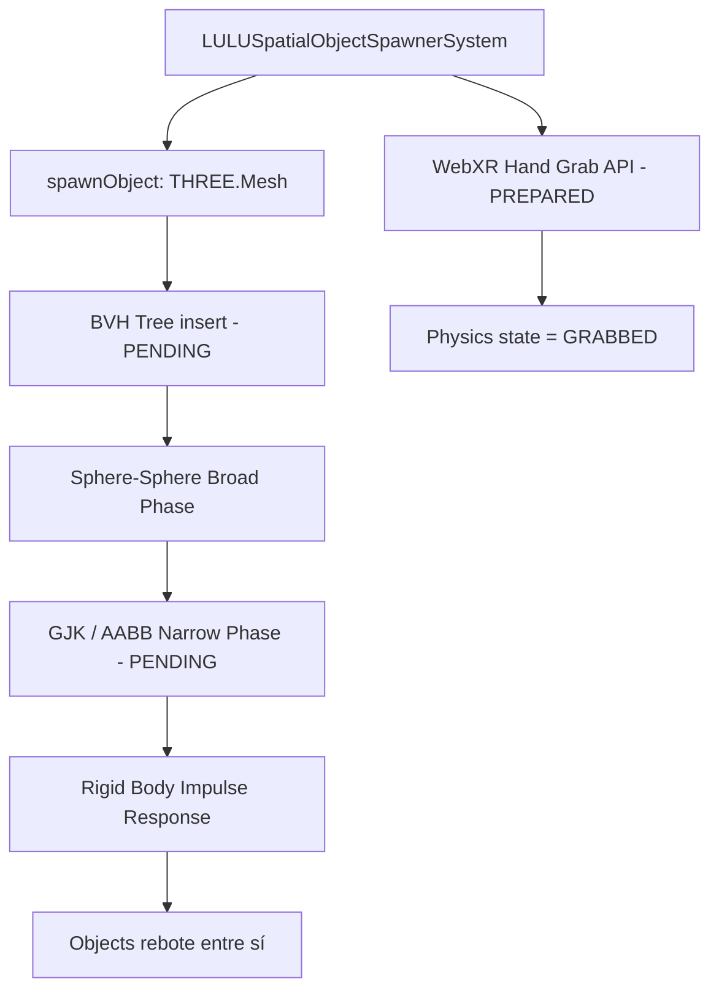

# 📚 ARCHIVOS SECUNDARIOS Y CONTROLADORES RAÍZ

```json
{
  "module": "RootControllers",
  "version": "V31_BVH_SPAWNER_UPDATE",
  "dependencies": ["EntityManager.js", "ServiceRegistry.js", "THREE.js", "SpatialIndexSystem.js"],
  "upgrade_from": "Spawning de objetos sin detección de colisiones reales",
  "upgrade_to": "BVH (Bounding Volume Hierarchy) + Rigid Body Physics en LULUSpatialObjectSpawnerSystem",
  "ai_directive": "El sistema LULU actualmente instancia objetos frente a la cámara sin colisiones. El upgrade V31 consiste en: (1) Acoplar LULUSpatialObjectSpawnerSystem con un árbol BVH/Octree para consultas espaciales eficientes, (2) Agregar colisiones de cuerpo rígido simplificadas (esferas) para que los objetos invocados reboten entre sí y respondan a impactos, (3) Preparar la API para WebXR hand grabbing.",
  "files_primary": ["LULUSpatialObjectSpawnerSystem.js", "UniverseKernel.js", "WindowManager.js", "HUDManager.js"],
  "files_total": 100,
  "status": "BVH_SPATIAL_TREE_PENDING",
  "webxr_preparation": "API de hand grabbing preparada pero no activa"
}
```

> **Ficheros top-level, LULU AI, WindowManager, SolarSystem, y BVH Spatial Spawner.**
> **Estado clave:** `LULUSpatialObjectSpawnerSystem` — BVH + Rigid Body Physics pendiente para colisiones reales.

## 💠 Esquema Conceptual — LULU BVH Upgrade



---

## 🔬 Contratos de Interface — BVH Spawner V31

### Contrato: `SimpleBVH` (Árbol Espacial para Spawner)

> **AI TASK:** Crear clase `SimpleBVH` dentro de `LULUSpatialObjectSpawnerSystem.js` o en un archivo separado `engine/spatial/SimpleBVH.js`.
> Debe:
> 1. Soportar `insert(object)` y `query(sphere)` para broad phase collision
> 2. Usar AABB (Axis-Aligned Bounding Boxes) para cada nodo
> 3. Reconstruir cada segundo (objetos pueden moverse) — no incremental en V31

**Interface esperada:**
```js
class SimpleBVH {
    // @param {THREE.Object3D[]} objects - Lista inicial de objetos físicos
    constructor(objects) {}

    // Agrega un objeto al árbol
    // @param {THREE.Object3D} object - Con .position y userData.radius
    insert(object) {}

    // Retorna objetos cuya AABB intersecta con la esfera dada
    // @param {THREE.Sphere} sphere
    // @returns {THREE.Object3D[]}
    query(sphere) {}

    // Reconstruye el árbol completo (llamar cada 60 frames)
    rebuild(objects) {}
}
```

### Contrato: `LULUSpatialObjectSpawnerSystem` — Upgrade de Física

> **AI TASK:** Localizar en `LULUSpatialObjectSpawnerSystem.js` el método `spawnObject()` y:
> 1. Después de crear el mesh, agregar al BVH: `this.bvh.insert(mesh)`
> 2. En `update()`, llamar `this._resolveCollisions()` cada frame
> 3. `_resolveCollisions()` usa el BVH para encontrar pares cercanos y aplica impulsos

**Código de física inyectable:**
```js
// ═══════════════════════════════════════════════════════════════════
// INYECTAR EN LULUSpatialObjectSpawnerSystem — Rigid Body V31
// ═══════════════════════════════════════════════════════════════════

/**
 * Resolución de colisiones esfera-esfera usando impulso de cuerpo rígido.
 * Llamar desde update() después de mover los objetos.
 * PROHIBIDO crear new Vector3 aquí — usar this._colBuffers.
 */
_resolveSphereCollisions() {
    // Pre-asignar buffers en constructor:
    // this._colBuffers = { delta: new THREE.Vector3(), impulse: new THREE.Vector3() };

    const objects = this.spawnedObjects; // Array de objetos activos
    const delta  = this._colBuffers.delta;
    const impulse = this._colBuffers.impulse;

    for (let i = 0; i < objects.length; i++) {
        for (let j = i + 1; j < objects.length; j++) {
            const a = objects[i];
            const b = objects[j];

            const ra = a.userData.radius || 5;
            const rb = b.userData.radius || 5;
            const minDist = ra + rb;

            delta.subVectors(b.position, a.position);
            const dist = delta.length();
            
            if (dist < minDist && dist > 0.001) {
                // Penetración detectada — aplicar impulso de separación
                const penetration = minDist - dist;
                const normal = delta.normalize();

                // Distribución de masa igual (simplificado)
                const separation = penetration * 0.5;
                a.position.addScaledVector(normal, -separation);
                b.position.addScaledVector(normal,  separation);

                // Intercambio de velocidades (colisión elástica simplificada)
                const velA = a.userData.velocity ?? new THREE.Vector3();
                const velB = b.userData.velocity ?? new THREE.Vector3();

                const relVel = velA.dot(normal) - velB.dot(normal);
                if (relVel < 0) { // Solo si se están acercando
                    const restitution = 0.6; // Coeficiente de rebote
                    const impulseMag = -(1 + restitution) * relVel * 0.5;
                    
                    impulse.copy(normal).multiplyScalar(impulseMag);
                    velA.add(impulse);
                    velB.sub(impulse);

                    a.userData.velocity = velA;
                    b.userData.velocity = velB;
                }
            }
        }
    }
}

/**
 * Preparación para WebXR Hand Grabbing.
 * Cuando una mano XR agarra un objeto, lo extrae de la física y lo
 * sujeta como hijo de la mano hasta que se suelte.
 *
 * @param {THREE.Object3D} handJoint - Joint de la mano XR
 * @param {THREE.Object3D} object    - Objeto a agarrar
 */
grabObject(handJoint, object) {
    if (!object || object.userData.isGrabbed) return;
    
    object.userData.isGrabbed = true;
    object.userData.grabParent = handJoint;
    object.userData.savedVelocity = object.userData.velocity?.clone() ?? new THREE.Vector3();
    object.userData.velocity = null; // Pausar física

    // Convertir posición al espacio local de la mano
    handJoint.attach(object);

    console.log('[LULU] Object grabbed via XR:', object.name || object.uuid);
}

/**
 * Suelta un objeto previamente agarrado, re-insertándolo en la física.
 * @param {THREE.Object3D} object - Objeto a soltar
 * @param {THREE.Vector3}  [throwVelocity] - Velocidad de lanzamiento
 */
releaseObject(object, throwVelocity) {
    if (!object || !object.userData.isGrabbed) return;
    
    object.userData.isGrabbed = false;

    // Devolver al contenedor de objetos físicos
    const scene = Registry.get('SceneGraph')?.getScene();
    if (scene) scene.attach(object);

    // Aplicar velocidad de lanzamiento o recuperar la anterior
    object.userData.velocity = throwVelocity?.clone() ?? object.userData.savedVelocity ?? new THREE.Vector3();
    
    console.log('[LULU] Object released. Velocity:', object.userData.velocity.length().toFixed(2));
}
```

---

## 📑 Tabla de Contenidos (100+ archivos)

- [engine/ui/lulu/LULUSpatialObjectSpawnerSystem.js](#lulu-spawner) (617 líneas | 27.17 KB) — **BVH_PENDING**
- [engine/UniverseKernel.js](#universekerneljs) (580 líneas | 27.28 KB)
- [hud/HUDManager.js](#hudmanagerjs) (564 líneas | 25.17 KB)
- [engine/universe/GalaxyGenerator.js](#galaxygeneratorjs) (341 líneas | 12.99 KB)
- [startPowderGalaxy.js](#startpowdergalaxyjs) (288 líneas | 8.55 KB)
- [engine/windows/WindowManager.js](#windowmanagerjs) (218 líneas | 8.21 KB)
- [styles/glass.css](#glassscss) (2353 líneas | 56.96 KB)
- [windows/systems/WindowDOMSystem.js](#windowdomsystemjs) (1135 líneas | 44.83 KB)
- [styles/layout.css](#layoutcss) (221 líneas | 5.54 KB)
- [engine/ui/LULUControlPanel.js](#lulucontrolpaneljs) (206 líneas | 6.08 KB)
- [engine/windows/systems/WindowBridgeSystem.js](#windowbridgesystemjs) (198 líneas | 6.13 KB)
- [engine/windows/systems/WindowDOMSystem.js](#enginewindowdomsystemjs) (197 líneas | 8.22 KB)
- [core/CelestialRegistry.js](#celestialregistryjs) (193 líneas | 5.16 KB)
- [engine/workspace/BubbleLauncher.js](#bubblelauncherjs) (186 líneas | 6.50 KB)
- [... 85+ archivos adicionales listados en el árbol del índice maestro]

---

## 📜 Código Fuente (Desplegable)
- [engine/UniverseKernel.js](#engineuniversekerneljs) (580 líneas | 27.28 KB)
- [hud/HUDManager.js](#hudhudmanagerjs) (564 líneas | 25.17 KB)
- [engine/universe/GalaxyGenerator.js](#engineuniversegalaxygeneratorjs) (341 líneas | 12.99 KB)
- [startPowderGalaxy.js](#startpowdergalaxyjs) (288 líneas | 8.55 KB)
- [styles/layout.css](#styleslayoutcss) (221 líneas | 5.54 KB)
- [engine/windows/WindowManager.js](#enginewindowswindowmanagerjs) (218 líneas | 8.21 KB)
- [engine/ui/LULUControlPanel.js](#engineuilulucontrolpaneljs) (206 líneas | 6.08 KB)
- [engine/windows/systems/WindowBridgeSystem.js](#enginewindowssystemswindowbridgesystemjs) (198 líneas | 6.13 KB)
- [engine/windows/systems/WindowDOMSystem.js](#enginewindowssystemswindowdomsystemjs) (197 líneas | 8.22 KB)
- [core/CelestialRegistry.js](#corecelestialregistryjs) (193 líneas | 5.16 KB)
- [engine/workspace/BubbleLauncher.js](#engineworkspacebubblelauncherjs) (186 líneas | 6.50 KB)
- [engine/universe/UniverseStreamer.js](#engineuniverseuniversestreamerjs) (157 líneas | 5.96 KB)
- [engine/systems/NotificationDroneSystem.js](#enginesystemsnotificationdronesystemjs) (141 líneas | 4.98 KB)
- [styles/windows.css](#styleswindowscss) (132 líneas | 2.68 KB)
- [engine/ui/lulu/LULUManualSystem.js](#engineuilulululumanualsystemjs) (129 líneas | 6.17 KB)
- [windows/WorkspaceManager.js](#windowsworkspacemanagerjs) (127 líneas | 4.47 KB)
- [engine/windows/physics/SpatialWindowPhysicsEngine.js](#enginewindowsphysicsspatialwindowphysicsenginejs) (118 líneas | 4.55 KB)
- [windows/WindowManager.js](#windowswindowmanagerjs) (117 líneas | 3.49 KB)
- [engine/devtools/BootGraphDebugger.js](#enginedevtoolsbootgraphdebuggerjs) (99 líneas | 2.88 KB)
- [engine/universe/planets/CubeSphereLOD.js](#engineuniverseplanetscubespherelodjs) (95 líneas | 2.93 KB)
- [engine/ui/lulu/LULUCommandPalette.js](#engineuilulululucommandpalettejs) (92 líneas | 2.85 KB)
- [engine/ui/EngineDebugPanel.js](#engineuienginedebugpaneljs) (88 líneas | 3.71 KB)
- [engine/ui/lulu/LULUCommandProcessor.js](#engineuilulululucommandprocessorjs) (87 líneas | 4.05 KB)
- [engine/universe/UniverseStreamingSystem.js](#engineuniverseuniversestreamingsystemjs) (87 líneas | 2.98 KB)
- [engine/universe/workers/PlanetWorker.js](#engineuniverseworkersplanetworkerjs) (87 líneas | 3.05 KB)
- [engine/windows/systems/DockSystems.js](#enginewindowssystemsdocksystemsjs) (86 líneas | 2.28 KB)
- [windows/systems/SpatialAnchorSystem.js](#windowssystemsspatialanchorsystemjs) (85 líneas | 3.12 KB)
- [engine/ui/DebugOverlay.js](#engineuidebugoverlayjs) (84 líneas | 2.79 KB)
- [engine/streaming/SpatialIndexSystem.js](#enginestreamingspatialindexsystemjs) (83 líneas | 2.86 KB)
- [engine/universe/GalaxyStreamingSystem.js](#engineuniversegalaxystreamingsystemjs) (82 líneas | 2.55 KB)
- [core/EventBus.js](#coreeventbusjs) (79 líneas | 1.99 KB)
- [engine/ui/SpatialLabelSystem.js](#engineuispatiallabelsystemjs) (77 líneas | 2.65 KB)
- [engine/ui/SpatialTelemetrySystem.js](#engineuispatialtelemetrysystemjs) (77 líneas | 2.50 KB)
- [engine/universe/AsteroidBeltSystem.js](#engineuniverseasteroidbeltsystemjs) (73 líneas | 2.29 KB)
- [network/RemotePlayerSystem.js](#networkremoteplayersystemjs) (68 líneas | 2.67 KB)
- [engine/universe/SolarSystemGenerator.js](#engineuniversesolarsystemgeneratorjs) (66 líneas | 2.20 KB)
- [engine/windows/systems/Window3DSystem.js](#enginewindowssystemswindow3dsystemjs) (66 líneas | 1.94 KB)
- [engine/ui/PerformancePanel.js](#engineuiperformancepaneljs) (65 líneas | 2.01 KB)
- [engine/universe/planets/renderers/PlanetTerrainRenderer.js](#engineuniverseplanetsrenderersplanetterrainrendererjs) (65 líneas | 2.36 KB)
- [network/UniverseSocketClient.js](#networkuniversesocketclientjs) (63 líneas | 1.93 KB)
- [core/AnimationEngine.js](#coreanimationenginejs) (61 líneas | 1.70 KB)
- [engine/spatial/SpatialIndexSystem.js](#enginespatialspatialindexsystemjs) (61 líneas | 1.81 KB)
- [core/ResourceManager.js](#coreresourcemanagerjs) (59 líneas | 1.53 KB)
- [engine/universe/ConstellationSystem.js](#engineuniverseconstellationsystemjs) (58 líneas | 1.76 KB)
- [frontend/index.html](#frontendindexhtml) (58 líneas | 2.89 KB)
- [core/ReactiveUniverseStateGraph.js](#corereactiveuniversestategraphjs) (56 líneas | 1.47 KB)
- [core/ServiceContainer.js](#coreservicecontainerjs) (56 líneas | 1.72 KB)
- [engine/universe/PlanetRingSystem.js](#engineuniverseplanetringsystemjs) (56 líneas | 1.77 KB)
- [engine/workspace/AppEmbedSystem.js](#engineworkspaceappembedsystemjs) (56 líneas | 1.78 KB)
- [core/LocalizationManager.js](#corelocalizationmanagerjs) (53 líneas | 2.04 KB)
- [core/UniverseEvents.js](#coreuniverseeventsjs) (53 líneas | 1.52 KB)
- [engine/universe/planets/renderers/PlanetDetailRenderer.js](#engineuniverseplanetsrenderersplanetdetailrendererjs) (53 líneas | 1.88 KB)
- [core/FrameScheduler.js](#coreframeschedulerjs) (51 líneas | 1.35 KB)
- [network/WebsocketBridgeSystem.js](#networkwebsocketbridgesystemjs) (49 líneas | 1.62 KB)
- [styles/base.css](#stylesbasecss) (49 líneas | 1.25 KB)
- [core/InputController.js](#coreinputcontrollerjs) (48 líneas | 1.58 KB)
- [engine/RenderWatchdog.js](#enginerenderwatchdogjs) (48 líneas | 1.40 KB)
- [engine/ui/lulu/LULUCommandRegistry.js](#engineuilulululucommandregistryjs) (48 líneas | 1.24 KB)
- [engine/spatial/SpatialHashGrid.js](#enginespatialspatialhashgridjs) (47 líneas | 1.81 KB)
- [engine/universe/PlanetLODSystem.js](#engineuniverseplanetlodsystemjs) (47 líneas | 1.44 KB)
- [engine/universe/CelestialOrbitSystem.js](#engineuniversecelestialorbitsystemjs) (46 líneas | 1.19 KB)
- [engine/universe/planets/PlanetIdentitySystem.js](#engineuniverseplanetsplanetidentitysystemjs) (46 líneas | 1.51 KB)
- [engine/assets/ShaderManager.js](#engineassetsshadermanagerjs) (45 líneas | 1.19 KB)
- [check_errors.js](#checkerrorsjs) (44 líneas | 1.27 KB)
- [engine/assets/TextureManager.js](#engineassetstexturemanagerjs) (43 líneas | 1.09 KB)
- [core/apps/AppLauncher.js](#coreappsapplauncherjs) (42 líneas | 1.26 KB)
- [engine/ui/lulu/LULUResponsePanel.js](#engineuilulululuresponsepaneljs) (42 líneas | 1.48 KB)
- [core/PhysicsController.js](#corephysicscontrollerjs) (40 líneas | 1.39 KB)
- [engine/universe/PlanetWorkerPipeline.js](#engineuniverseplanetworkerpipelinejs) (40 líneas | 1.24 KB)
- [engine/assets/MaterialRegistry.js](#engineassetsmaterialregistryjs) (39 líneas | 1.08 KB)
- [engine/universe/PlanetAppSystem.js](#engineuniverseplanetappsystemjs) (38 líneas | 1.11 KB)
- [engine/ui/CelestialOrbitSystem.js](#engineuicelestialorbitsystemjs) (37 líneas | 1.04 KB)
- [engine/ui/lulu/LULUCommandBar.js](#engineuilulululucommandbarjs) (35 líneas | 1.13 KB)
- [engine/universe/planets/PlanetBlueprintSystem.js](#engineuniverseplanetsplanetblueprintsystemjs) (35 líneas | 0.94 KB)
- [interaction/WorldInteractionSystem.js](#interactionworldinteractionsystemjs) (35 líneas | 1.20 KB)
- [engine/universe/planets/CloudSystem.js](#engineuniverseplanetscloudsystemjs) (34 líneas | 0.98 KB)
- [core/GPUCapabilityDetector.js](#coregpucapabilitydetectorjs) (33 líneas | 1.10 KB)
- [engine/simulation/SpatialIndexSystem.js](#enginesimulationspatialindexsystemjs) (33 líneas | 0.94 KB)
- [engine/ui/CelestialHierarchySystem.js](#engineuicelestialhierarchysystemjs) (33 líneas | 1.01 KB)
- [engine/universe/MultiverseEngine.js](#engineuniversemultiverseenginejs) (32 líneas | 0.92 KB)
- [engine/universe/planets/TerrainSystem.js](#engineuniverseplanetsterrainsystemjs) (30 líneas | 0.85 KB)
- [engine/UniverseSimulationLayer.js](#engineuniversesimulationlayerjs) (30 líneas | 0.84 KB)
- [package.json](#packagejson) (30 líneas | 0.66 KB)
- [engine/devtools/SystemHealthMonitor.js](#enginedevtoolssystemhealthmonitorjs) (29 líneas | 1.12 KB)
- [engine/simulation/GalaxySimulation.js](#enginesimulationgalaxysimulationjs) (29 líneas | 0.74 KB)
- [engine/universe/PlanetGenerator.js](#engineuniverseplanetgeneratorjs) (28 líneas | 0.95 KB)
- [engine/universe/planets/renderers/PlanetSphereRenderer.js](#engineuniverseplanetsrenderersplanetsphererendererjs) (28 líneas | 1.08 KB)
- [engine/assets/ModelLoader.js](#engineassetsmodelloaderjs) (27 líneas | 0.72 KB)
- [core/SceneGraph.js](#corescenegraphjs) (25 líneas | 0.75 KB)
- [engine/devtools/BootGraphVisualizer.js](#enginedevtoolsbootgraphvisualizerjs) (25 líneas | 0.74 KB)
- [config/ControlsConfig.js](#configcontrolsconfigjs) (22 líneas | 0.39 KB)
- [engine/universe/planets/renderers/PlanetSpriteRenderer.js](#engineuniverseplanetsrenderersplanetspriterendererjs) (22 líneas | 0.71 KB)
- [engine/universe/planets/renderers/PlanetPointRenderer.js](#engineuniverseplanetsrenderersplanetpointrendererjs) (21 líneas | 0.68 KB)
- [engine/universe/planets/BiomeSystem.js](#engineuniverseplanetsbiomesystemjs) (20 líneas | 0.69 KB)
- [core/SystemRegistry.js](#coresystemregistryjs) (16 líneas | 0.35 KB)
- [main.js](#mainjs) (15 líneas | 0.51 KB)
- [engine/config/PhysicsConfig.js](#engineconfigphysicsconfigjs) (14 líneas | 0.22 KB)

---
## 📜 Código Fuente (Desplegable)

<h3 id="stylesglasscss">📄 <code>styles/glass.css</code></h3>

*Estadísticas: 2353 líneas de código, Tamaño: 56.96 KB*

<details>
<summary><strong>🔭 [ Clic para expandir el código fuente ]</strong></summary>

```css
/* frontend/src/styles/glass.css */
@import url('https://fonts.googleapis.com/css2?family=M+PLUS+Rounded+1c:wght@500;700;800&display=swap');

:root {
    --silicon-cyan:  #00ffcc;
    --silicon-blue:  rgba(0, 40, 80, 0.45);
    --silicon-glow:  rgba(0, 255, 255, 0.3);
    --silicon-dark:  rgba(0, 10, 20, 0.70);
    --ice-core:      #dff8ff;
    --ice-sheen:     #9de9ff;
    --ice-indigo:    #b5c6ff;
    --ice-panel:     rgba(14, 24, 44, 0.56);
    --ice-border:    rgba(193, 232, 255, 0.42);
    --font-mono:     'M PLUS Rounded 1c', 'Segoe UI', sans-serif;
    --font-ui:       'M PLUS Rounded 1c', 'Segoe UI', sans-serif;
    --font-display:  'M PLUS Rounded 1c', 'Segoe UI', sans-serif;
    --radius-soft:   18px;
    --radius-panel:  24px;
    --radius-card:   26px;
    --radius-window: 28px;
    --text-primary:  #f2fbff;
    --text-secondary: rgba(221, 236, 246, 0.84);
    --text-muted:    rgba(193, 217, 232, 0.66);
}

* { box-sizing: border-box; }

html, body {
    margin: 0;
    padding: 0;
    width: 100%;
    height: 100%;
    overflow: hidden;
    background: #000;
    color: #fff;
    font-family: var(--font-ui);
    user-select: none;
    -webkit-user-select: none;
    text-rendering: optimizeLegibility;
    -webkit-font-smoothing: antialiased;
    -moz-osx-font-smoothing: grayscale;
}

button,
input,
select,
textarea {
    font: inherit;
}

/* ── Root container ─────────────────────────────────────────────── */
#pg-root {
    position: relative;
    width: 100vw;
    height: 100vh;
}

/* ── WebGL Canvas ───────────────────────────────────────────────── */
#pg-renderer {
    display: block;
    position: absolute;
    inset: 0;
    width: 100%;
    height: 100%;
    outline: none;
    touch-action: none;
}

/* ── UI layers ──────────────────────────────────────────────────── */
.ui-layer {
    position: absolute;
    inset: 0;
    pointer-events: none;
    z-index: 10;
}

.ui-layer > * {
    pointer-events: auto;
}

.interactive {
    pointer-events: none;
    z-index: 20;
}

#window-layer > *,
#kernel-bar > * {
    pointer-events: auto;
}

/* ── Glass silicon base ─────────────────────────────────────────── */
.glass-panel {
    position: absolute;
    background: var(--silicon-blue);
    border: 1px solid var(--silicon-glow);
    border-radius: var(--radius-panel);
    backdrop-filter: blur(24px) saturate(160%);
    -webkit-backdrop-filter: blur(24px) saturate(160%);
    box-shadow:
        0 18px 42px rgba(0, 0, 0, 0.48),
        inset 0 1px 0 rgba(255, 255, 255, 0.08),
        inset 0 0 20px rgba(0, 255, 255, 0.08);
    color: var(--text-primary);
    transform: translateZ(0);
    will-change: transform, opacity;
    animation: boot-sequence 0.6s cubic-bezier(0.16, 1, 0.3, 1) forwards;
}

/* ── HUD telemetry ──────────────────────────────────────────────── */
.kernel-os-hud {
    top: 20px;
    left: 20px;
    padding: 18px 24px;
    font-size: 12px;
    font-weight: 700;
    letter-spacing: 1.1px;
    text-transform: uppercase;
    display: flex;
    flex-direction: column;
    gap: 8px;
    min-width: 228px;
}

.hud-title {
    font-size: 11px;
    letter-spacing: 0.22em;
    color: var(--text-primary);
    border-bottom: 1px solid var(--silicon-glow);
    padding-bottom: 8px;
    margin-bottom: 4px;
    text-shadow: 0 0 12px rgba(168, 233, 255, 0.18);
}

.hud-row {
    display: flex;
    justify-content: space-between;
    gap: 16px;
}

.metric-label {
    color: var(--text-muted);
    opacity: 1;
}

.metric-value {
    color: var(--text-primary);
    text-shadow: 0 0 8px var(--silicon-cyan);
    text-align: right;
}

.spatial-reticle {
    position: absolute;
    top: 50%;
    left: 50%;
    width: 60px;
    height: 60px;
    transform: translate(-50%, -50%);
    pointer-events: none;
    z-index: 80;
    opacity: 0.82;
    transition: opacity 0.18s ease, transform 0.18s ease, filter 0.18s ease;
}

.spatial-reticle.is-flight {
    opacity: 0.96;
}

.spatial-reticle.has-target {
    transform: translate(-50%, -50%) scale(1.08);
    filter: drop-shadow(0 0 22px rgba(166, 235, 255, 0.18));
}

.spatial-reticle.is-locked {
    opacity: 1;
}

.spatial-reticle.target-planet .reticle-ring {
    border-color: rgba(190, 240, 255, 0.62);
    box-shadow:
        0 0 28px rgba(112, 224, 255, 0.24),
        inset 0 0 20px rgba(210, 243, 255, 0.12);
}

.spatial-reticle.target-planet .reticle-line,
.spatial-reticle.target-planet .reticle-core {
    background: rgba(239, 249, 255, 0.86);
    box-shadow: 0 0 14px rgba(157, 233, 255, 0.38);
}

.spatial-reticle.target-moon .reticle-ring {
    border-color: rgba(235, 245, 255, 0.7);
    box-shadow:
        0 0 32px rgba(210, 236, 255, 0.24),
        inset 0 0 20px rgba(244, 250, 255, 0.14);
}

.spatial-reticle.target-moon .reticle-line,
.spatial-reticle.target-moon .reticle-core {
    background: rgba(245, 250, 255, 0.92);
    box-shadow: 0 0 18px rgba(213, 241, 255, 0.4);
}

.spatial-reticle.is-warping .reticle-ring {
    border-color: rgba(255, 221, 183, 0.72);
}

.reticle-ring,
.reticle-ping,
.reticle-line,
.reticle-core,
.reticle-readout {
    position: absolute;
}

.reticle-ring {
    inset: 7px;
    border: 1px solid rgba(205, 238, 255, 0.24);
    border-radius: 50%;
    box-shadow:
        0 0 18px rgba(112, 224, 255, 0.16),
        inset 0 0 14px rgba(210, 243, 255, 0.08);
    transition: border-color 0.18s ease, box-shadow 0.18s ease;
}

.spatial-reticle.has-target .reticle-ring {
    border-color: rgba(173, 235, 255, 0.54);
    box-shadow:
        0 0 24px rgba(112, 224, 255, 0.22),
        inset 0 0 18px rgba(210, 243, 255, 0.12);
}

.spatial-reticle.is-locked .reticle-ring {
    border-color: rgba(239, 248, 255, 0.72);
    box-shadow:
        0 0 28px rgba(168, 233, 255, 0.28),
        inset 0 0 18px rgba(239, 248, 255, 0.16);
}

.reticle-line {
    top: 50%;
    left: 50%;
    background: rgba(230, 245, 255, 0.76);
    box-shadow: 0 0 10px rgba(140, 232, 255, 0.3);
    transition: width 0.18s ease, height 0.18s ease, background 0.18s ease, box-shadow 0.18s ease;
}

.reticle-line-x {
    width: 36px;
    height: 1px;
    transform: translate(-50%, -50%);
}

.reticle-line-y {
    width: 1px;
    height: 36px;
    transform: translate(-50%, -50%);
}

.spatial-reticle.has-target .reticle-line-x {
    width: 42px;
}

.spatial-reticle.has-target .reticle-line-y {
    height: 42px;
}

.reticle-core {
    top: 50%;
    left: 50%;
    width: 6px;
    height: 6px;
    transform: translate(-50%, -50%);
    border-radius: 50%;
    background: #f4fbff;
    box-shadow: 0 0 16px rgba(192, 240, 255, 0.62);
    transition: background 0.18s ease, box-shadow 0.18s ease;
}

.reticle-ping {
    inset: 0;
    border-radius: 50%;
    border: 1px solid rgba(176, 235, 255, 0.12);
    animation: reticle-pulse 2.2s ease-in-out infinite;
    transition: border-color 0.18s ease;
}

.spatial-reticle.has-target .reticle-ping {
    border-color: rgba(190, 240, 255, 0.22);
    animation-duration: 1.4s;
}

.reticle-readout {
    top: calc(100% + 12px);
    left: 50%;
    min-width: 188px;
    transform: translateX(-50%);
    padding: 10px 14px;
    border-radius: 18px;
    background: rgba(11, 19, 34, 0.48);
    border: 1px solid rgba(210, 240, 255, 0.18);
    backdrop-filter: blur(18px);
    -webkit-backdrop-filter: blur(18px);
    display: flex;
    flex-direction: column;
    align-items: center;
    gap: 4px;
    box-shadow:
        0 14px 30px rgba(0, 0, 0, 0.26),
        inset 0 1px 0 rgba(255, 255, 255, 0.08);
}

.reticle-name {
    font-family: var(--font-display);
    font-size: 11px;
    font-weight: 700;
    letter-spacing: 0.14em;
    color: var(--text-primary);
    text-transform: uppercase;
    line-height: 1.2;
    text-shadow: 0 0 16px rgba(168, 233, 255, 0.18);
    text-align: center;
}

.reticle-state {
    font-family: var(--font-ui);
    font-size: 10px;
    font-weight: 500;
    letter-spacing: 0.12em;
    color: rgba(214, 236, 248, 0.78);
    text-transform: uppercase;
    line-height: 1.25;
    text-align: center;
}

.spatial-target-marker {
    position: absolute;
    left: 50%;
    top: 50%;
    width: 78px;
    height: 78px;
    transform: translate(-50%, -50%);
    pointer-events: none;
    z-index: 75;
    opacity: 0;
    transition: opacity 0.18s ease;
}

.target-orbit {
    position: absolute;
    inset: 0;
    border-radius: 50%;
    border: 1px solid rgba(205, 238, 255, 0.16);
    box-shadow: 0 0 22px rgba(112, 224, 255, 0.12);
}

.target-bracket {
    position: absolute;
    width: 18px;
    height: 18px;
    border: 2px solid rgba(212, 241, 255, 0.82);
    filter: drop-shadow(0 0 10px rgba(168, 233, 255, 0.24));
}

.target-bracket.tl { top: -2px; left: -2px; border-right: none; border-bottom: none; }
.target-bracket.tr { top: -2px; right: -2px; border-left: none; border-bottom: none; }
.target-bracket.bl { bottom: -2px; left: -2px; border-right: none; border-top: none; }
.target-bracket.br { bottom: -2px; right: -2px; border-left: none; border-top: none; }

.spatial-target-marker.is-locked .target-bracket,
.spatial-target-marker.is-locked .target-orbit {
    border-color: rgba(244, 251, 255, 0.96);
}

.spatial-target-marker.is-warping .target-bracket,
.spatial-target-marker.is-warping .target-orbit {
    border-color: rgba(255, 210, 160, 0.92);
}

.target-caption {
    position: absolute;
    left: 50%;
    bottom: calc(100% + 8px);
    transform: translateX(-50%);
    padding: 5px 11px;
    border-radius: 999px;
    background: rgba(10, 18, 34, 0.38);
    border: 1px solid rgba(210, 240, 255, 0.12);
    font-family: var(--font-ui);
    font-size: 10px;
    font-weight: 600;
    letter-spacing: 0.18em;
    color: rgba(236, 248, 255, 0.92);
    text-transform: uppercase;
    white-space: nowrap;
}

.spatial-target-marker.target-moon .target-caption {
    border-color: rgba(231, 243, 255, 0.24);
    background: rgba(18, 24, 41, 0.52);
}

.spatial-target-card {
    position: absolute;
    min-width: 248px;
    max-width: 300px;
    padding: 18px 18px 16px;
    border-radius: var(--radius-card);
    border: 1px solid rgba(208, 240, 255, 0.16);
    background:
        linear-gradient(180deg, rgba(255, 255, 255, 0.1), rgba(255, 255, 255, 0.02)),
        linear-gradient(145deg, rgba(13, 22, 41, 0.5), rgba(7, 12, 24, 0.3));
    backdrop-filter: blur(24px) saturate(136%);
    -webkit-backdrop-filter: blur(24px) saturate(136%);
    box-shadow:
        0 18px 40px rgba(0, 0, 0, 0.24),
        inset 0 1px 0 rgba(255, 255, 255, 0.14),
        inset 0 -18px 36px rgba(255, 255, 255, 0.03);
    pointer-events: none;
    z-index: 78;
    opacity: 0;
    transform: translate(-50%, -50%);
    transition: opacity 0.18s ease, border-color 0.18s ease, box-shadow 0.18s ease;
}

.spatial-target-card::before {
    content: '';
    position: absolute;
    inset: 1px;
    border-radius: calc(var(--radius-card) - 1px);
    background:
        radial-gradient(circle at 10% 0%, rgba(255, 255, 255, 0.16), transparent 30%),
        linear-gradient(180deg, rgba(255, 255, 255, 0.08), transparent 24%);
    pointer-events: none;
}

.spatial-target-card::after {
    content: '';
    position: absolute;
    left: 16px;
    right: 16px;
    top: 50px;
    height: 1px;
    background: linear-gradient(90deg, rgba(204, 236, 255, 0), rgba(204, 236, 255, 0.18), rgba(204, 236, 255, 0));
    pointer-events: none;
}

.spatial-target-card.is-locked {
    border-color: rgba(236, 248, 255, 0.3);
    box-shadow:
        0 20px 42px rgba(0, 0, 0, 0.28),
        0 0 32px rgba(168, 233, 255, 0.1),
        inset 0 1px 0 rgba(255, 255, 255, 0.16);
}

.spatial-target-card.is-warping {
    border-color: rgba(255, 215, 168, 0.34);
    box-shadow:
        0 20px 42px rgba(0, 0, 0, 0.28),
        0 0 34px rgba(255, 194, 132, 0.12),
        inset 0 1px 0 rgba(255, 255, 255, 0.16);
}

.target-card-top,
.target-card-heading,
.target-card-grid,
.target-card-cell {
    position: relative;
    z-index: 1;
}

.target-card-top {
    display: flex;
    align-items: flex-start;
    justify-content: space-between;
    gap: 12px;
}

.target-card-heading {
    min-width: 0;
}

.target-card-chip {
    flex-shrink: 0;
    padding: 6px 10px;
    border-radius: 999px;
    border: 1px solid rgba(224, 243, 255, 0.16);
    background: rgba(225, 243, 255, 0.08);
    font-family: var(--font-ui);
    font-size: 10px;
    font-weight: 600;
    letter-spacing: 0.22em;
    color: rgba(241, 249, 255, 0.86);
    text-transform: uppercase;
    box-shadow: inset 0 1px 0 rgba(255, 255, 255, 0.08);
}

.target-card-eyebrow,
.target-card-status {
    font-family: var(--font-ui);
    text-transform: uppercase;
}

.target-card-eyebrow {
    font-size: 10px;
    letter-spacing: 0.16em;
    color: rgba(208, 235, 250, 0.8);
}

.target-card-title {
    margin-top: 5px;
    font-family: var(--font-display);
    font-size: 18px;
    letter-spacing: 0.035em;
    color: var(--text-primary);
    text-transform: uppercase;
    line-height: 1.18;
    text-wrap: balance;
}

.target-card-meta {
    position: relative;
    z-index: 1;
    margin-top: 12px;
    font-family: var(--font-ui);
    font-size: 12px;
    color: var(--text-secondary);
    letter-spacing: 0.035em;
    line-height: 1.55;
}

.target-card-grid {
    display: grid;
    grid-template-columns: repeat(2, minmax(0, 1fr));
    gap: 10px;
    margin-top: 12px;
}

.target-card-cell {
    display: flex;
    flex-direction: column;
    gap: 4px;
    padding: 11px 12px;
    border-radius: 16px;
    border: 1px solid rgba(211, 239, 255, 0.08);
    background: rgba(255, 255, 255, 0.04);
    box-shadow: inset 0 1px 0 rgba(255, 255, 255, 0.06);
}

.target-card-cell-wide {
    grid-column: 1 / -1;
}

.target-card-key {
    font-family: var(--font-ui);
    font-size: 10px;
    letter-spacing: 0.15em;
    color: rgba(198, 227, 245, 0.7);
    text-transform: uppercase;
}

.target-card-value {
    font-family: var(--font-display);
    font-size: 13px;
    letter-spacing: 0.06em;
    color: rgba(242, 250, 255, 0.96);
    text-transform: uppercase;
}

.target-card-status {
    position: relative;
    z-index: 1;
    margin-top: 12px;
    font-size: 11px;
    letter-spacing: 0.12em;
    color: rgba(236, 248, 255, 0.92);
    opacity: 0.88;
}

.spatial-target-card.target-moon {
    border-color: rgba(227, 239, 255, 0.24);
    box-shadow:
        0 20px 42px rgba(0, 0, 0, 0.28),
        0 0 34px rgba(213, 241, 255, 0.09),
        inset 0 1px 0 rgba(255, 255, 255, 0.16);
}

.spatial-target-card.is-locked .target-card-chip {
    border-color: rgba(236, 248, 255, 0.24);
    background: rgba(236, 248, 255, 0.1);
}

.spatial-target-card.is-warping .target-card-chip {
    border-color: rgba(255, 221, 183, 0.22);
    background: rgba(255, 205, 145, 0.12);
    color: rgba(255, 239, 221, 0.92);
}

/* ── OS Dock (kernel-bar) ───────────────────────────────────────── */
.kernel-dock {
    position: absolute;
    bottom: 20px;
    left: 50%;
    transform: translateX(-50%);
    display: flex;
    align-items: center;
    gap: 8px;
    padding: 12px 28px;
    border-radius: 34px;
    pointer-events: auto;
}

.kernel-btn {
    display: flex;
    flex-direction: column;
    align-items: center;
    gap: 4px;
    cursor: pointer;
    padding: 10px 16px;
    border-radius: 18px;
    font-size: 11px;
    font-weight: 700;
    letter-spacing: 0.06em;
    color: var(--text-primary);
    transition: background 0.2s ease, transform 0.15s cubic-bezier(0.34,1.56,0.64,1), box-shadow 0.2s ease;
}

.kernel-btn:hover {
    background: rgba(0, 255, 204, 0.12);
    transform: translateY(-5px) scale(1.08);
    box-shadow: 0 0 24px rgba(0, 255, 204, 0.28);
}

.kernel-btn:active { transform: translateY(0) scale(0.95); }

.kb-icon  { font-size: 20px; line-height: 1; pointer-events: none; }
.kb-label { pointer-events: none; }

/* ── Glass window ───────────────────────────────────────────────── */
.glass-window {
    --window-width-max: min(640px, calc(100vw - 42px));
    --window-width-min: min(520px, calc(100vw - 42px));
    --window-height-min: 320px;
    --window-height-max: calc(100vh - 48px);

    position: absolute;
    top: 32px;
    left: 32px;
    transform: scale(0.92);
    transform-origin: top left;
    opacity: 0;
    width: var(--window-width-max);
    min-width: var(--window-width-min);
    max-width: calc(100vw - 32px);
    min-height: var(--window-height-min);
    max-height: var(--window-height-max);
    background:
        linear-gradient(180deg, rgba(255, 255, 255, 0.12), rgba(255, 255, 255, 0.03)),
        linear-gradient(145deg, rgba(8, 15, 30, 0.84), rgba(10, 18, 34, 0.72));
    border: 1px solid rgba(196, 238, 255, 0.26);
    border-radius: var(--radius-window);
    backdrop-filter: blur(32px) saturate(1.9);
    -webkit-backdrop-filter: blur(32px) saturate(1.9);
    box-shadow:
        0 0 0 0.5px rgba(220, 242, 255, 0.08) inset,
        0 36px 78px rgba(0,0,0,0.76),
        0 0 58px rgba(154, 229, 255, 0.12);
    overflow: hidden;
    transition: opacity 0.3s ease, transform 0.28s cubic-bezier(0.34,1.56,0.64,1), box-shadow 0.25s ease;
    z-index: 1100;
    pointer-events: auto;
    overflow: hidden auto;
    animation: glass-breath 3.5s ease-in-out infinite;
}

.glass-window::before {
    content: '';
    position: absolute;
    inset: 0;
    border-radius: var(--radius-window);
    background: linear-gradient(120deg, rgba(255,255,255,0.07), rgba(255,255,255,0) 45%, rgba(255,255,255,0.04));
    pointer-events: none;
    mix-blend-mode: screen;
}

.glass-window:hover {
    box-shadow:
        0 0 0 0.5px rgba(220, 242, 255, 0.1) inset,
        0 44px 96px rgba(0,0,0,0.8),
        0 0 66px rgba(154, 229, 255, 0.18);
    transform: translateY(-3px) scale(0.95);
}

.glass-ice {
    border: 1px solid rgba(205, 235, 255, 0.36);
    background:
        linear-gradient(132deg, rgba(223, 248, 255, 0.17), rgba(203, 229, 249, 0.06)),
        linear-gradient(179deg, rgba(12, 25, 46, 0.78), rgba(10, 18, 34, 0.65));
}

.glass-ice .glass-header {
    background: linear-gradient(180deg, rgba(235, 252, 255, 0.24), rgba(210, 235, 251, 0.12));
}

.glass-window:focus-within {
    border-color: rgba(100, 220, 255, 0.52);
    box-shadow:
        0 0 0 0.8px rgba(220, 244, 255, 0.13) inset,
        0 40px 86px rgba(0,0,0,0.78),
        0 0 72px rgba(94, 218, 255, 0.22);
}

@keyframes glass-breath {
    0%, 100% {
        transform: translateY(0px) scale(0.95);
    }
    50% {
        transform: translateY(-2px) scale(0.96);
    }
}

.glass-window.visible {
    opacity: 1;
    transform: scale(1);
}

.glass-window.is-dragging {
    transition: none !important;
    box-shadow:
        0 0 0 0.5px rgba(220, 242, 255, 0.08) inset,
        0 34px 84px rgba(0, 0, 0, 0.76),
        0 0 56px rgba(154, 229, 255, 0.08);
}

.glass-window.is-collapsed {
    pointer-events: auto !important;
    width: 56px !important;
    height: 56px !important;
    min-width: 56px !important;
    min-height: 56px !important;
    max-width: 56px !important;
    border-radius: 50% !important;
    overflow: hidden !important;
    background:
        radial-gradient(circle at 35% 25%, rgba(255, 255, 255, 0.32), rgba(160, 234, 255, 0.12)),
        linear-gradient(150deg, rgba(19, 28, 48, 0.94), rgba(10, 16, 25, 0.87));
    box-shadow: 0 4px 12px rgba(0, 0, 0, 0.4), inset 0 1px 0 rgba(255, 255, 255, 0.1) !important;
    transition: width 0.3s ease, height 0.3s ease, min-width 0.3s ease, min-height 0.3s ease, border-radius 0.3s ease, box-shadow 0.3s ease !important;
}

.glass-window.is-collapsed .glass-header,
.glass-window.is-collapsed .glass-content {
    display: none;
}

/* Se añade esta clase cuando la ventana se colapsa y necesita seguir a un objeto 3D */
.glass-window.is-spatially-anchored {
    position: absolute !important;
    top: 0 !important;
    left: 0 !important;
    /* Usamos translate3d para aprovechar la aceleración por hardware (GPU) */
    transform-origin: center center;
    pointer-events: auto; /* Asegura que el botón siga siendo clickeable */
    z-index: 100;
}

.glass-bubble {
    position: absolute;
    width: 56px;
    height: 56px;
    border-radius: 50%;
    background:
        radial-gradient(circle at 30% 30%, rgba(240, 255, 255, 0.94), rgba(185, 220, 255, 0.42)),
        linear-gradient(140deg, rgba(140, 210, 255, 0.23), rgba(95, 189, 235, 0.18));
    border: 1px solid rgba(171, 231, 255, 0.35);
    box-shadow:
        0 0 18px rgba(94, 207, 255, 0.28),
        inset 0 0 16px rgba(255, 255, 255, 0.45),
        inset 0 2px 8px rgba(255, 255, 255, 0.55);
    display: grid;
    place-items: center;
    color: rgba(15, 42, 73, 0.88);
    font-family: var(--font-ui);
    font-weight: 800;
    letter-spacing: 0.16em;
    text-transform: uppercase;
    cursor: pointer;
    z-index: 1150;
    transition: transform 0.25s ease, box-shadow 0.25s ease;
}

.glass-bubble.hovered {
    transform: scale(1.15);
    box-shadow:
        0 0 28px rgba(110, 232, 255, 0.36),
        inset 0 0 20px rgba(255, 255, 255, 0.55);
}

.glass-window.is-collapsed::after {
    content: 'Abrir';
    position: absolute;
    inset: 0;
    display: flex;
    align-items: center;
    justify-content: center;
    color: rgba(230, 248, 255, 0.92);
    font-family: var(--font-ui);
    font-size: 10px;
    font-weight: 700;
    letter-spacing: 0.12em;
    text-transform: uppercase;
    pointer-events: none;
}

.glass-window.is-metamorphosis-window {
    width: min(940px, calc(100vw - 32px));
    min-width: min(760px, calc(100vw - 32px));
}

@media (max-width: 1200px) {
    .glass-window {
        width: min(100%, calc(100vw - 24px));
        min-width: min(320px, calc(100vw - 24px));
        max-height: calc(100vh - 30px);
        border-radius: 12px;
    }

    .glass-window.is-metamorphosis-window {
        width: min(100%, calc(100vw - 24px));
        min-width: min(320px, calc(100vw - 24px));
    }

    .glass-header {
        padding: 12px 14px;
        font-size: 12px;
    }

    .glass-header-title {
        font-size: 14px;
    }

    #kernel-bar {
        bottom: 8px;
    }

    .kernel-btn {
        width: 30px;
        height: 30px;
        margin: 0 3px;
    }
}

@media (max-width: 768px) {
    .glass-window {
        top: 4px !important;
        left: 4px !important;
        width: calc(100vw - 8px) !important;
        min-width: calc(100vw - 8px) !important;
        max-width: calc(100vw - 8px) !important;
        height: calc(100vh - 12px);
        max-height: calc(100vh - 12px);
        border-radius: 10px;
        transform: none;
        opacity: 1;
    }

    .glass-window.visible, .glass-window.is-dragging {
        transform: none;
    }

    .glass-header {
        gap: 10px;
        padding: 10px 12px;
    }

    #kernel-bar {
        bottom: 4px;
        left: 4px;
        right: 4px;
        height: 42px;
    }

    .kb-icon { font-size: 16px; }
}

@media (max-width: 480px) {
    #hud-layer, #window-layer, #kernel-bar {
        pointer-events: auto;
    }

    .glass-window {
        background: rgba(8, 12, 20, 0.92);
        backdrop-filter: blur(12px);
        -webkit-backdrop-filter: blur(12px);
    }

    .glass-header-title {
        font-size: 13px;
    }

    .menu-grid {
        grid-template-columns: 1fr;
    }

    body {
        font-size: 14px;
    }
}

/* Reduce motion for accessibility */
@media (prefers-reduced-motion: reduce) {
    * {
        transition: none !important;
        animation: none !important;
    }
}

.holographic-alert {
    position: absolute;
    top: 50%;
    left: 50%;
    transform: translate(-50%, -50%) translateZ(0);
    width: 400px;
    background: rgba(0, 40, 80, 0.6);
    border: 1px solid #00ffcc;
    box-shadow: 0 0 40px rgba(0, 255, 204, 0.2), inset 0 0 20px rgba(0, 255, 204, 0.1);
    backdrop-filter: blur(30px);
    border-radius: 8px;
    padding: 24px;
    display: flex;
    flex-direction: column;
    gap: 20px;
    animation: hologram-open 0.6s cubic-bezier(0.16, 1, 0.3, 1) forwards;
    z-index: 9999;
}

.alert-header {
    color: #00ffcc;
    font-weight: bold;
    letter-spacing: 2px;
    border-bottom: 1px solid rgba(0, 255, 204, 0.3);
    padding-bottom: 10px;
}

.alert-body {
    font-size: 16px;
    line-height: 1.5;
    color: #fff;
}

.alert-close {
    background: transparent;
    border: 1px solid #00ffcc;
    color: #00ffcc;
    padding: 10px;
    cursor: pointer;
    font-family: monospace;
    transition: all 0.2s;
}

.alert-close:hover {
    background: rgba(0, 255, 204, 0.2);
    box-shadow: 0 0 15px rgba(0, 255, 204, 0.4);
}

@keyframes hologram-open {
    0% { opacity: 0; transform: translate(-50%, -40%) scale(0.8) translateZ(0); filter: brightness(2); }
    100% { opacity: 1; transform: translate(-50%, -50%) scale(1) translateZ(0); filter: brightness(1); }
}

@keyframes hologram-close {
    100% { opacity: 0; transform: translate(-50%, -60%) scale(0.9) translateZ(0); }
}

.glass-header {
    display: flex;
    align-items: center;
    gap: 14px;
    padding: 16px 20px;
    font-size: 13px;
    font-weight: 700;
    letter-spacing: 0.08em;
    color: rgba(236, 248, 255, 0.94);
    background: linear-gradient(180deg, rgba(220, 240, 255, 0.16), rgba(214, 236, 255, 0.10));
    border-bottom: 1px solid rgba(216, 239, 255, 0.2);
    box-shadow: inset 0 -1px 0 rgba(225, 245, 255, 0.12);
    cursor: move;
    user-select: none;
    transition: transform 0.25s ease, box-shadow 0.25s ease, background 0.25s ease;
}

.glass-window:hover .glass-header {
    background: linear-gradient(180deg, rgba(235, 250, 255, 0.22), rgba(220, 242, 255, 0.14));
    box-shadow: inset 0 -1px 0 rgba(248, 252, 255, 0.16);
}

.glass-header:active {
    transform: translateY(1px);
}

.glass-header-controls {
    display: flex;
    gap: 8px;
    align-items: center;
    flex-shrink: 0;
}

.os-window-dot {
    width: 12px;
    height: 12px;
    border-radius: 999px;
    cursor: pointer;
    box-shadow: 0 0 0 1px rgba(255, 255, 255, 0.18) inset;
    transition: transform 0.18s ease, box-shadow 0.18s ease;
}

.os-window-dot:hover {
    transform: scale(1.08);
    box-shadow: 0 0 0 1px rgba(255, 255, 255, 0.28) inset;
}

.os-window-close { background: #ff6f57; }
.os-window-min { background: #ffd353; }
.os-window-max { background: #38d956; }

.glass-header-copy {
    display: flex;
    flex-direction: column;
    gap: 2px;
    min-width: 0;
}

.glass-header-badge {
    font-family: var(--font-ui);
    font-size: 11px;
    font-weight: 600;
    letter-spacing: 0.16em;
    text-transform: uppercase;
    color: rgba(214, 236, 248, 0.74);
}

.glass-header-title {
    font-family: var(--font-display);
    font-size: 16px;
    font-weight: 700;
    letter-spacing: 0.03em;
    color: var(--text-primary);
    text-transform: uppercase;
}

.win-dot,
.os-window-dot {
    width: 11px;
    height: 11px;
    border-radius: 50%;
    cursor: pointer;
    flex-shrink: 0;
    box-shadow: 0 0 0 1px rgba(255, 255, 255, 0.08) inset;
}

.win-close,
.os-window-close { background: #ff5f57; }

.win-min,
.os-window-min { background: #febc2e; }

.win-max,
.os-window-max { background: #28c840; }

.glass-content {
    padding: 26px;
    font-size: 15px;
    line-height: 1.72;
    color: var(--text-secondary);
}

.loader { opacity: 0.5; font-style: italic; }

.module-window,
.metamorph-window {
    display: flex;
    flex-direction: column;
    gap: 18px;
    width: 100%;
    min-height: 256px;
}

.module-window-badge,
.metamorph-window-badge {
    font-family: var(--font-ui);
    font-size: 11px;
    font-weight: 700;
    letter-spacing: 0.18em;
    text-transform: uppercase;
    color: rgba(215, 238, 255, 0.84);
    opacity: 0.92;
}

.module-window-title,
.metamorph-window-title {
    font-family: var(--font-display);
    font-size: clamp(22px, 2.9vw, 32px);
    line-height: 1.1;
    letter-spacing: 0.02em;
    color: var(--text-primary);
    text-transform: uppercase;
    text-align: left;
    border-bottom: 1px solid rgba(215, 235, 253, 0.14);
    padding-bottom: 8px;
}

.module-window-copy,
.metamorph-window-copy,
.metamorph-window-status {
    font-size: 14px;
    line-height: 1.65;
    color: var(--text-secondary);
    opacity: 0.8;
}

.module-window-title,
.metamorph-window-title {
    font-family: var(--font-display);
    font-size: clamp(28px, 3vw, 34px);
    line-height: 1.04;
    letter-spacing: 0.02em;
    color: var(--text-primary);
    text-transform: uppercase;
}

.module-window-copy,
.metamorph-window-copy,
.metamorph-window-status {
    font-size: 15px;
    line-height: 1.72;
    color: var(--text-secondary);
}

.metamorph-window-hero {
    display: flex;
    flex-direction: column;
    gap: 10px;
}

.metamorph-window-layout {
    display: grid;
    grid-template-columns: minmax(0, 1.15fr) minmax(300px, 0.85fr);
    gap: 16px;
}

.metamorph-plane {
    display: flex;
    flex-direction: column;
    gap: 16px;
    padding: 18px;
    border-radius: 24px;
    border: 1px solid rgba(214, 239, 255, 0.1);
    background:
        linear-gradient(180deg, rgba(255, 255, 255, 0.08), rgba(255, 255, 255, 0.025)),
        linear-gradient(145deg, rgba(16, 25, 44, 0.48), rgba(8, 13, 26, 0.28));
    box-shadow:
        inset 0 1px 0 rgba(255, 255, 255, 0.07),
        0 16px 32px rgba(0, 0, 0, 0.12);
}

.metamorph-plane-secondary {
    background:
        linear-gradient(180deg, rgba(255, 255, 255, 0.09), rgba(255, 255, 255, 0.03)),
        linear-gradient(145deg, rgba(24, 34, 56, 0.5), rgba(10, 16, 30, 0.3));
}

.metamorph-plane-head {
    display: flex;
    flex-direction: column;
    gap: 6px;
}

.metamorph-plane-title {
    font-family: var(--font-display);
    font-size: 18px;
    font-weight: 700;
    letter-spacing: 0.02em;
    color: var(--text-primary);
}

.metamorph-plane-copy,
.metamorph-plane-note {
    font-size: 14px;
    line-height: 1.65;
    color: var(--text-secondary);
}

.metamorph-plane-grid {
    display: grid;
    grid-template-columns: repeat(2, minmax(0, 1fr));
    gap: 12px;
}

.metamorph-plane-cell {
    display: flex;
    flex-direction: column;
    gap: 6px;
    padding: 14px 15px;
    border-radius: 18px;
    border: 1px solid rgba(214, 239, 255, 0.1);
    background: rgba(255, 255, 255, 0.04);
    box-shadow: inset 0 1px 0 rgba(255, 255, 255, 0.06);
}

.metamorph-plane-cell-wide {
    grid-column: 1 / -1;
}

.metamorph-plane-key {
    font-size: 10px;
    font-weight: 600;
    letter-spacing: 0.16em;
    text-transform: uppercase;
    color: rgba(198, 225, 243, 0.7);
}

.metamorph-plane-value {
    font-family: var(--font-display);
    font-size: 13px;
    letter-spacing: 0.04em;
    color: var(--text-primary);
    text-transform: uppercase;
    line-height: 1.4;
}

.module-window-grid,
.metamorph-window-grid {
    display: grid;
    grid-template-columns: repeat(2, minmax(0, 1fr));
    gap: 12px;
}

.module-window-cell,
.meta-control {
    display: flex;
    flex-direction: column;
    gap: 8px;
    padding: 14px 15px;
    border-radius: 18px;
    border: 1px solid rgba(214, 239, 255, 0.1);
    background: rgba(255, 255, 255, 0.04);
    box-shadow: inset 0 1px 0 rgba(255, 255, 255, 0.06);
}

.module-window-cell-wide {
    grid-column: 1 / -1;
}

.module-window-key,
.meta-control-key {
    font-size: 11px;
    font-weight: 600;
    letter-spacing: 0.14em;
    text-transform: uppercase;
    color: rgba(198, 225, 243, 0.7);
}

.module-window-value,
.meta-control-value {
    font-family: var(--font-display);
    font-size: 14px;
    letter-spacing: 0.04em;
    color: var(--text-primary);
    text-transform: uppercase;
}

.meta-control-color {
    justify-content: center;
}

.meta-control-slider,
.meta-control-color-input,
.meta-action {
    width: 100%;
}

.meta-control-slider {
    appearance: none;
    height: 7px;
    border-radius: 999px;
    background: linear-gradient(90deg, rgba(186, 231, 255, 0.64), rgba(104, 174, 255, 0.42));
    outline: none;
}

.meta-control-slider::-webkit-slider-thumb {
    appearance: none;
    width: 20px;
    height: 20px;
    border-radius: 50%;
    border: 1px solid rgba(230, 244, 255, 0.55);
    background: #f5fbff;
    box-shadow: 0 4px 14px rgba(124, 215, 255, 0.34);
    cursor: pointer;
}

.meta-control-color-input {
    height: 44px;
    border: none;
    border-radius: 14px;
    padding: 0;
    background: transparent;
    cursor: pointer;
}

.metamorph-window-footer {
    display: flex;
    align-items: center;
    justify-content: space-between;
    flex-wrap: wrap;
    gap: 14px;
}

.meta-action {
    max-width: 220px;
    border: 1px solid rgba(211, 239, 255, 0.18);
    border-radius: 20px;
    padding: 13px 15px;
    background: rgba(255, 255, 255, 0.06);
    color: var(--text-primary);
    font-family: var(--font-display);
    font-size: 13px;
    letter-spacing: 0.06em;
    text-transform: uppercase;
    cursor: pointer;
    transition: transform 0.2s ease, box-shadow 0.2s ease, border-color 0.2s ease;
}

.meta-action:hover {
    transform: translateY(-2px);
    border-color: rgba(230, 244, 255, 0.34);
    box-shadow: 0 12px 24px rgba(0, 0, 0, 0.18);
}

.meta-action-secondary {
    background: rgba(207, 231, 255, 0.08);
}

/* ── Initial Menu / Protocol Selection ─────────────────────────── */
#initial-menu-overlay {
    position: fixed;
    inset: 0;
    display: flex;
    align-items: center;
    justify-content: center;
    padding: 22px;
    overflow: hidden;
    background:
        radial-gradient(circle at 14% 16%, rgba(122, 224, 255, 0.16), transparent 45%),
        radial-gradient(circle at 85% 78%, rgba(181, 198, 255, 0.2), transparent 40%),
        linear-gradient(155deg, rgba(5, 14, 32, 0.88), rgba(1, 5, 13, 0.94));
    backdrop-filter: blur(18px) saturate(128%);
    -webkit-backdrop-filter: blur(18px) saturate(128%);
}

#initial-menu-overlay::before {
    content: '';
    position: absolute;
    inset: 0;
    background:
        repeating-linear-gradient(125deg, transparent 0 16px, rgba(174, 222, 255, 0.035) 16px 18px),
        linear-gradient(0deg, rgba(191, 232, 255, 0.05), rgba(191, 232, 255, 0));
    opacity: 0.38;
    pointer-events: none;
}

.menu-container {
    z-index: 1;
    width: min(840px, 92vw);
    padding: clamp(24px, 4vw, 32px);
    border-radius: 24px;
    border: 1px solid rgba(214, 239, 255, 0.1);
    background:
        linear-gradient(180deg, rgba(255, 255, 255, 0.08), rgba(255, 255, 255, 0.025)),
        linear-gradient(145deg, rgba(16, 25, 44, 0.8), rgba(8, 13, 26, 0.65));
    backdrop-filter: blur(30px) saturate(130%);
    -webkit-backdrop-filter: blur(30px) saturate(130%);
    box-shadow:
        inset 0 1px 0 rgba(255, 255, 255, 0.07),
        0 16px 40px rgba(0, 0, 0, 0.5);
    display: flex;
    flex-direction: column;
    gap: 20px;
    isolation: isolate;
    transition: transform 0.3s ease, box-shadow 0.3s ease;
}

.menu-header {
    display: flex;
    flex-direction: column;
    gap: 6px;
    text-align: left;
    width: 100%;
    margin-bottom: 8px;
}

.menu-title {
    font-family: var(--font-display);
    font-size: clamp(24px, 3.5vw, 32px);
    font-weight: 700;
    letter-spacing: 0.02em;
    color: var(--text-primary);
    text-transform: uppercase;
    margin: 0;
    text-shadow: none;
}

.menu-subtitle {
    font-size: clamp(14px, 2vw, 15px);
    line-height: 1.65;
    color: var(--text-secondary);
    text-transform: none;
    letter-spacing: normal;
    opacity: 0.8;
    margin: 0;
}

.menu-grid {
    display: grid;
    grid-template-columns: repeat(auto-fit, minmax(220px, 1fr));
    gap: 14px;
    width: 100%;
}

.menu-item-glass {
    display: flex;
    flex-direction: column;
    align-items: flex-start;
    text-align: left;
    gap: 8px;
    padding: 16px 18px;
    border-radius: 18px;
    border: 1px solid rgba(214, 239, 255, 0.15);
    background: rgba(255, 255, 255, 0.04);
    box-shadow: inset 0 1px 0 rgba(255, 255, 255, 0.05);
    cursor: pointer;
    font: inherit;
    transition: all 0.25s cubic-bezier(0.16, 1, 0.3, 1);
    transform-style: preserve-3d;
}

.menu-item-glass:hover {
    background: rgba(255, 255, 255, 0.08);
    border-color: rgba(214, 239, 255, 0.3);
    box-shadow:
        inset 0 1px 0 rgba(255, 255, 255, 0.15),
        0 8px 24px rgba(0, 0, 0, 0.2);
    transform: translateY(-2px);
}

.menu-item-glass:focus-visible {
    outline: 2px solid rgba(214, 239, 255, 0.6);
    outline-offset: 2px;
}

.menu-copy {
    display: flex;
    flex-direction: column;
    gap: 6px;
    width: 100%;
    z-index: 2;
    transform: translateZ(20px);
}

.menu-meta, .menu-tier {
    font-size: 10px;
    font-weight: 600;
    font-family: var(--font-ui);
    letter-spacing: 0.16em;
    text-transform: uppercase;
    color: rgba(198, 225, 243, 0.7);
}

.menu-label {
    font-family: var(--font-display);
    font-size: 16px;
    font-weight: 600;
    letter-spacing: 0.04em;
    color: var(--text-primary);
    text-transform: uppercase;
    line-height: 1.2;
}

.menu-item-glass.featured {
    background: rgba(255, 255, 255, 0.07);
    border-color: rgba(214, 239, 255, 0.25);
    grid-row: span 2;
    padding: 24px 20px;
}

.menu-tip {
    margin: 0;
    font-family: var(--font-ui);
    font-size: 11px;
    letter-spacing: 0.1em;
    text-transform: uppercase;
    color: rgba(191, 225, 250, 0.62);
}

/* Refined spatial glass-ice entry scene */
#initial-menu-overlay {
    background:
        radial-gradient(circle at 18% 18%, rgba(206, 240, 255, 0.04), transparent 24%),
        radial-gradient(circle at 80% 72%, rgba(227, 244, 255, 0.03), transparent 24%);
    backdrop-filter: blur(1px) saturate(106%);
    -webkit-backdrop-filter: blur(1px) saturate(106%);
}

#initial-menu-overlay::before {
    background:
        linear-gradient(90deg, transparent 0%, rgba(255, 255, 255, 0.012) 50%, transparent 100%);
    opacity: 0.45;
}

#initial-menu-overlay::after {
    content: '';
    position: absolute;
    inset: 5%;
    border-radius: 999px;
    border: 1px solid rgba(207, 232, 255, 0.06);
    filter: blur(1px);
    pointer-events: none;
}

/* Removed redundant duplicate styles */

#login-screen {
    background:
        radial-gradient(circle at 20% 20%, rgba(120, 224, 255, 0.12), transparent 40%),
        linear-gradient(165deg, rgba(3, 9, 22, 0.7), rgba(2, 5, 13, 0.72));
    backdrop-filter: blur(16px);
    -webkit-backdrop-filter: blur(16px);
}

.login-ice-shell {
    position: relative;
    width: min(460px, 92vw);
    padding: 34px;
    border-radius: 32px;
    border: 1px solid var(--ice-border);
    background:
        linear-gradient(145deg, rgba(231, 247, 255, 0.18), rgba(231, 247, 255, 0.02)),
        linear-gradient(165deg, rgba(16, 29, 56, 0.7), rgba(8, 15, 31, 0.58));
    backdrop-filter: blur(30px) saturate(160%);
    -webkit-backdrop-filter: blur(30px) saturate(160%);
    box-shadow:
        0 32px 70px rgba(0, 0, 0, 0.64),
        inset 0 1px 0 rgba(255, 255, 255, 0.18);
    display: flex;
    flex-direction: column;
    gap: 20px;
}

.login-ice-shell::before {
    content: '';
    position: absolute;
    inset: 1px;
    border-radius: 30px;
    background: radial-gradient(circle at 12% 0%, rgba(255, 255, 255, 0.2), transparent 34%);
    pointer-events: none;
}

.login-ice-header {
    position: relative;
    z-index: 1;
}

.login-ice-badge {
    margin: 0 0 8px;
    font-family: var(--font-ui);
    font-size: 10px;
    letter-spacing: 0.34em;
    text-transform: uppercase;
    color: rgba(203, 234, 255, 0.78);
}

.login-ice-title {
    margin: 0;
    font-family: var(--font-display);
    font-size: clamp(20px, 5vw, 32px);
    letter-spacing: 0.1em;
    text-transform: uppercase;
    color: var(--text-primary);
}

.login-ice-subtitle {
    margin: 10px 0 0;
    font-family: var(--font-ui);
    font-size: 13px;
    line-height: 1.55;
    color: rgba(214, 233, 246, 0.82);
}

.login-ice-fields {
    display: flex;
    flex-direction: column;
    gap: 14px;
}

.login-ice-field {
    display: flex;
    flex-direction: column;
    gap: 8px;
    font-family: var(--font-ui);
    font-size: 10px;
    letter-spacing: 0.12em;
    text-transform: uppercase;
    color: rgba(194, 224, 248, 0.75);
}

.glass-input.login-ice-input {
    width: 100%;
    border: 1px solid rgba(198, 233, 255, 0.34);
    border-radius: 16px;
    padding: 12px 14px;
    color: #e7f3ff;
    background: rgba(208, 234, 255, 0.09);
    backdrop-filter: blur(10px);
    -webkit-backdrop-filter: blur(10px);
    outline: none;
    font-family: var(--font-ui);
    transition: border-color 0.28s ease, box-shadow 0.28s ease, background 0.28s ease;
}

.glass-input.login-ice-input::placeholder {
    color: rgba(219, 238, 255, 0.5);
}

.glass-input.login-ice-input:focus {
    border-color: rgba(157, 233, 255, 0.75);
    box-shadow:
        0 0 0 1px rgba(157, 233, 255, 0.35) inset,
        0 0 18px rgba(157, 233, 255, 0.22);
    background: rgba(208, 234, 255, 0.16);
}

.glass-btn-premium.login-ice-button {
    border: 1px solid rgba(177, 228, 255, 0.46);
    border-radius: 16px;
    padding: 12px 16px;
    background:
        linear-gradient(145deg, rgba(195, 240, 255, 0.28), rgba(195, 240, 255, 0.08)),
        linear-gradient(165deg, rgba(15, 32, 61, 0.62), rgba(12, 21, 43, 0.74));
    color: #ecf8ff;
    font-family: var(--font-display);
    font-size: 12px;
    letter-spacing: 0.12em;
    text-transform: uppercase;
    cursor: pointer;
    transition: transform 0.25s ease, box-shadow 0.25s ease, border-color 0.25s ease;
}

.glass-btn-premium.login-ice-button:hover {
    transform: translateY(-2px);
    border-color: rgba(157, 233, 255, 0.8);
    box-shadow:
        0 0 0 1px rgba(157, 233, 255, 0.25) inset,
        0 10px 24px rgba(7, 17, 35, 0.54);
}

.glass-btn-premium.login-ice-button:active {
    transform: translateY(0);
}

.stelaryi-launcher {
    position: absolute;
    bottom: 84px;
    top: auto;
    right: 20px;
    display: inline-flex;
    align-items: center;
    gap: 10px;
    min-width: 160px;
    padding: 8px 12px;
    border: 1px solid rgba(208, 240, 255, 0.12);
    border-radius: 16px;
    background:
        linear-gradient(180deg, rgba(255, 255, 255, 0.09), rgba(255, 255, 255, 0.02)),
        linear-gradient(145deg, rgba(12, 21, 38, 0.56), rgba(7, 12, 24, 0.34));
    color: var(--text-primary);
    backdrop-filter: blur(22px) saturate(138%);
    -webkit-backdrop-filter: blur(22px) saturate(138%);
    box-shadow:
        0 12px 24px rgba(0, 0, 0, 0.18),
        inset 0 1px 0 rgba(255, 255, 255, 0.08);
    pointer-events: auto;
    cursor: pointer;
    transition: transform 0.22s ease, box-shadow 0.22s ease, border-color 0.22s ease, opacity 0.22s ease;
    z-index: 88;
}

.stelaryi-launcher:hover:not(:disabled) {
    transform: translateY(-2px);
    border-color: rgba(220, 243, 255, 0.24);
    box-shadow:
        0 20px 42px rgba(0, 0, 0, 0.28),
        0 0 24px rgba(178, 236, 255, 0.08),
        inset 0 1px 0 rgba(255, 255, 255, 0.1);
}

.stelaryi-launcher:disabled {
    opacity: 0.6;
    cursor: default;
}

.stelaryi-launcher.is-armed {
    border-color: rgba(198, 236, 255, 0.22);
}

.stelaryi-launcher.is-active {
    border-color: rgba(236, 246, 255, 0.3);
    box-shadow:
        0 20px 46px rgba(0, 0, 0, 0.3),
        0 0 34px rgba(193, 235, 255, 0.12),
        inset 0 1px 0 rgba(255, 255, 255, 0.12);
}

.solar-launcher {
    top: auto;
    bottom: 20px;
    right: 20px;
    border-color: rgba(255, 215, 160, 0.28);
    box-shadow: 0 18px 38px rgba(0, 0, 0, 0.28), inset 0 1px 0 rgba(255, 255, 255, 0.08);
}

.solar-launcher:hover:not(:disabled) {
    border-color: rgba(255, 227, 168, 0.48);
    box-shadow:
        0 22px 44px rgba(0, 0, 0, 0.32),
        0 0 28px rgba(255, 214, 145, 0.14),
        inset 0 1px 0 rgba(255, 255, 255, 0.1);
}

.solar-launcher.is-active {
    border-color: rgba(255, 240, 204, 0.3);
    box-shadow:
        0 20px 46px rgba(0, 0, 0, 0.3),
        0 0 34px rgba(255, 215, 130, 0.22),
        inset 0 1px 0 rgba(255, 255, 255, 0.12);
}

.stelaryi-launcher-copy {
    display: flex;
    flex-direction: column;
    align-items: flex-start;
    gap: 4px;
    min-width: 0;
}

.stelaryi-launcher-title {
    font-family: var(--font-display);
    font-size: 13px;
    font-weight: 700;
    letter-spacing: 0.02em;
    color: var(--text-primary);
}

.stelaryi-launcher-subtitle {
    font-size: 10px;
    line-height: 1.2;
    color: var(--text-secondary);
}

.stelaryi-icon {
    position: relative;
    width: 42px;
    height: 32px;
    flex-shrink: 0;
}

.stelaryi-core,
.stelaryi-ray,
.stelaryi-tail {
    position: absolute;
    display: block;
}

.stelaryi-core {
    top: 50%;
    left: 9px;
    width: 14px;
    height: 14px;
    border-radius: 50%;
    transform: translateY(-50%);
    background: radial-gradient(circle, rgba(255, 255, 255, 0.98), rgba(210, 243, 255, 0.88) 52%, rgba(154, 227, 255, 0.36));
    box-shadow:
        0 0 16px rgba(187, 235, 255, 0.34),
        0 0 32px rgba(166, 222, 255, 0.18);
}

.stelaryi-ray {
    top: 50%;
    left: 0;
    width: 20px;
    height: 2px;
    border-radius: 999px;
    background: linear-gradient(90deg, rgba(255, 255, 255, 0), rgba(214, 241, 255, 0.78), rgba(255, 255, 255, 0));
    transform-origin: 18px 50%;
}

.stelaryi-ray.ray-a { transform: translateY(-50%) rotate(-45deg); }
.stelaryi-ray.ray-b { transform: translateY(-50%) rotate(0deg); width: 24px; }
.stelaryi-ray.ray-c { transform: translateY(-50%) rotate(45deg); }

.stelaryi-tail {
    top: 50%;
    right: 0;
    width: 20px;
    height: 10px;
    transform: translateY(-50%);
    border-radius: 999px;
    background: linear-gradient(90deg, rgba(191, 239, 255, 0), rgba(191, 239, 255, 0.34), rgba(255, 255, 255, 0.92));
}

.stelaryi-overlay {
    position: absolute;
    top: 92px;
    right: 20px;
    width: min(360px, calc(100vw - 28px));
    padding: 18px;
    border-radius: 26px;
    border: 1px solid rgba(208, 240, 255, 0.12);
    background:
        linear-gradient(180deg, rgba(255, 255, 255, 0.08), rgba(255, 255, 255, 0.02)),
        linear-gradient(145deg, rgba(12, 21, 38, 0.56), rgba(7, 12, 24, 0.34));
    backdrop-filter: blur(24px) saturate(136%);
    -webkit-backdrop-filter: blur(24px) saturate(136%);
    box-shadow:
        0 20px 42px rgba(0, 0, 0, 0.24),
        inset 0 1px 0 rgba(255, 255, 255, 0.08);
    pointer-events: none;
    opacity: 0;
    transform: translateY(-10px);
    transition: opacity 0.24s ease, transform 0.24s ease;
    z-index: 87;
}

.stelaryi-overlay.is-visible {
    opacity: 1;
    transform: translateY(0);
}

.stelaryi-overlay-head,
.stelaryi-anchor-card,
.stelaryi-level {
    display: flex;
    flex-direction: column;
}

.stelaryi-overlay-head {
    gap: 4px;
}

.stelaryi-overlay-badge,
.stelaryi-anchor-key,
.stelaryi-level-label {
    font-size: 10px;
    font-weight: 700;
    letter-spacing: 0.14em;
    text-transform: uppercase;
    color: var(--text-muted);
}

.stelaryi-overlay-title,
.stelaryi-anchor-title {
    font-family: var(--font-display);
    font-size: 22px;
    font-weight: 800;
    line-height: 1.08;
    letter-spacing: 0.01em;
    color: var(--text-primary);
}

.stelaryi-anchor-card {
    gap: 8px;
    margin-top: 14px;
    padding: 16px;
    border-radius: 20px;
    border: 1px solid rgba(214, 239, 255, 0.1);
    background: rgba(255, 255, 255, 0.04);
    box-shadow: inset 0 1px 0 rgba(255, 255, 255, 0.05);
}

.stelaryi-anchor-state {
    font-size: 13px;
    line-height: 1.62;
    color: var(--text-secondary);
}

.stelaryi-levels {
    display: flex;
    flex-direction: column;
    gap: 12px;
    margin-top: 14px;
}

.stelaryi-level {
    gap: 8px;
}

.stelaryi-level-track {
    display: flex;
    flex-wrap: wrap;
    gap: 8px;
    min-height: 46px;
    padding: 12px;
    border-radius: 18px;
    border: 1px solid rgba(214, 239, 255, 0.08);
    background: rgba(255, 255, 255, 0.035);
}

.stelaryi-chip,
.stelaryi-empty {
    border-radius: 999px;
}

.stelaryi-chip {
    display: inline-flex;
    align-items: center;
    gap: 8px;
    padding: 8px 11px;
    background: rgba(223, 244, 255, 0.08);
    border: 1px solid rgba(223, 244, 255, 0.1);
    box-shadow: inset 0 1px 0 rgba(255, 255, 255, 0.06);
}

.stelaryi-chip-name {
    font-family: var(--font-display);
    font-size: 12px;
    font-weight: 700;
    color: var(--text-primary);
}

.stelaryi-chip-radius {
    font-size: 11px;
    color: var(--text-muted);
}

.stelaryi-empty {
    padding: 8px 0;
    font-size: 12px;
    color: var(--text-muted);
}

@media (max-width: 820px) {
    .glass-window {
        min-height: 0;
    }

    .stelaryi-launcher {
        top: 12px;
        right: 12px;
        min-width: 200px;
    }

    .stelaryi-overlay {
        top: 82px;
        right: 12px;
        width: min(320px, calc(100vw - 24px));
    }

    .glass-window.is-metamorphosis-window {
        min-width: min(520px, calc(100vw - 24px));
    }

    .module-window-grid,
    .metamorph-window-grid {
        grid-template-columns: 1fr;
    }

    .metamorph-window-layout,
    .metamorph-plane-grid {
        grid-template-columns: 1fr;
    }

    .menu-grid {
        grid-template-columns: 1fr 1fr;
        grid-auto-rows: 104px;
    }

    .menu-item-glass.featured {
        grid-column: auto;
    }

    .menu-container {
        padding: 24px 18px;
    }

    .menu-title {
        max-width: 10ch;
    }
}

@media (max-width: 620px) {
    .kernel-os-hud {
        top: 12px;
        left: 12px;
        min-width: 188px;
        padding: 14px 16px;
    }

    .stelaryi-launcher {
        left: 12px;
        right: 12px;
        top: auto;
        bottom: 88px;
        width: calc(100vw - 24px);
        min-width: 0;
        justify-content: center;
    }

    .stelaryi-overlay {
        left: 12px;
        right: 12px;
        top: auto;
        bottom: 150px;
        width: auto;
    }

    .spatial-target-card {
        min-width: 220px;
        max-width: min(280px, calc(100vw - 24px));
    }

    .metamorph-window-footer {
        flex-direction: column;
        align-items: stretch;
    }

    .menu-stage {
        width: 100%;
    }

    .menu-grid {
        grid-template-columns: 1fr;
        max-width: 340px;
        grid-auto-rows: 98px;
    }

    .menu-item-glass {
        height: 100%;
    }

    .menu-title {
        max-width: 100%;
    }
}

/* ── Boot entrance animation ────────────────────────────────────── */
@keyframes menu-stage-orbit {
    0% { transform: translate3d(0px, 0px, 0) rotate(0deg); }
    20% { transform: translate3d(3px, -2px, 0) rotate(0.15deg); }
    40% { transform: translate3d(5px, -5px, 0) rotate(0deg); }
    60% { transform: translate3d(1px, -7px, 0) rotate(-0.15deg); }
    80% { transform: translate3d(-4px, -4px, 0) rotate(-0.08deg); }
    100% { transform: translate3d(0px, 0px, 0) rotate(0deg); }
}

@keyframes menu-card-hover-float {
    0%, 100% { transform: translateY(-4px) scale(1.012); }
    50% { transform: translateY(-7px) scale(1.014); }
}

@keyframes reticle-pulse {
    0%, 100% { transform: scale(0.92); opacity: 0.16; }
    50% { transform: scale(1.08); opacity: 0.4; }
}

@keyframes boot-sequence {
    0%   { opacity: 0; transform: translateY(-12px) translateZ(0); }
    100% { opacity: 1; transform: translateY(0)     translateZ(0); }
}

/* ── Glass Window System: Collapsible Planet Windows ────────────── */
.glass-window {
    position: fixed;
    background: var(--silicon-dark);
    border: 1px solid var(--silicon-glow);
    border-radius: var(--radius-window);
    backdrop-filter: blur(24px) saturate(160%);
    -webkit-backdrop-filter: blur(24px) saturate(160%);
    box-shadow:
        0 20px 50px rgba(0, 0, 0, 0.5),
        inset 0 1px 0 rgba(255, 255, 255, 0.08);
    color: var(--text-primary);
    display: flex;
    flex-direction: column;
    overflow: hidden;
    z-index: 1200;
    transition: width 0.3s ease, height 0.3s ease, box-shadow 0.3s ease;
    pointer-events: auto;
}

.glass-header {
    height: 44px;
    background: linear-gradient(180deg, rgba(0, 255, 200, 0.12), rgba(0, 255, 200, 0.06));
    border-bottom: 1px solid rgba(0, 255, 200, 0.2);
    display: flex;
    align-items: center;
    justify-content: space-between;
    padding: 0 16px;
    cursor: grab;
    user-select: none;
    flex-shrink: 0;
    transition: background 0.3s ease, border-color 0.3s ease;
}

.glass-header:active {
    cursor: grabbing;
}

.glass-header-copy {
    flex: 1;
    display: flex;
    flex-direction: column;
    gap: 2px;
    min-width: 0;
}

.glass-header-badge {
    font-size: 9px;
    letter-spacing: 0.18em;
    color: rgba(0, 255, 200, 0.7);
    text-transform: uppercase;
    font-weight: 700;
    opacity: 0;
    transition: opacity 0.3s ease;
}

.glass-window:not(.is-collapsed) .glass-header-badge {
    opacity: 1;
}

.glass-header-title {
    font-size: 13px;
    font-weight: 700;
    color: #00f2ff;
    text-transform: uppercase;
    letter-spacing: 1.2px;
    line-height: 1.2;
}

.glass-header-controls {
    display: flex;
    gap: 8px;
    margin-right: 16px;
    order: -1;
    transition: opacity 0.3s ease;
}

.glass-window.is-collapsed .glass-header-controls {
    opacity: 0.6;
}

.os-window-dot {
    width: 10px;
    height: 10px;
    border-radius: 50%;
    cursor: pointer;
    transition: box-shadow 0.2s ease, transform 0.2s ease;
}

.os-window-dot:hover {
    transform: scale(1.2);
}

.os-window-close {
    background: #ff5566;
    box-shadow: 0 0 8px rgba(255, 85, 102, 0.4);
}

.os-window-min {
    background: #ffaa33;
    box-shadow: 0 0 8px rgba(255, 170, 51, 0.4);
}

.os-window-max {
    background: #00ffcc;
    box-shadow: 0 0 8px rgba(0, 255, 204, 0.4);
}

.glass-content {
    flex: 1;
    padding: 20px;
    overflow: auto;
    transition: opacity 0.3s ease, max-height 0.3s ease;
    max-height: 500px;
}

.glass-window.is-collapsed .glass-content {
    display: none;
}

/* ── Metamorph Window Styles ────────────────────────────────────── */
.is-metamorphosis-window {
    min-width: 360px;
    width: 420px;
    max-height: 600px;
}

.is-metamorphosis-window.is-collapsed {
    width: 280px;
    max-height: 44px;
}

.metamorph-window {
    display: flex;
    flex-direction: column;
    gap: 20px;
}

.metamorph-window-badge,
.metamorph-window-title,
.metamorph-plane-title,
.metamorph-plane-head {
    color: #00f2ff;
}

.metamorph-window-badge {
    font-size: 9px;
    letter-spacing: 0.2em;
    text-transform: uppercase;
    color: rgba(0, 255, 200, 0.8);
    font-weight: 700;
}

.metamorph-window-title {
    font-size: 16px;
    font-weight: 700;
    letter-spacing: 1px;
}

.metamorph-window-copy,
.metamorph-plane-copy {
    font-size: 12px;
    line-height: 1.5;
    color: var(--text-secondary);
}

.module-window {
    display: flex;
    flex-direction: column;
    gap: 16px;
}

.module-window-badge {
    font-size: 10px;
    letter-spacing: 0.18em;
    text-transform: uppercase;
    color: rgba(0, 255, 200, 0.7);
    font-weight: 700;
}

.module-window-title {
    font-size: 16px;
    font-weight: 700;
    color: #00f2ff;
}

.module-window-copy {
    font-size: 12px;
    color: var(--text-secondary);
    line-height: 1.5;
}

.module-window-grid {
    display: grid;
    grid-template-columns: 1fr;
    gap: 12px;
}

.module-window-cell {
    display: grid;
    grid-template-columns: auto 1fr;
    gap: 12px;
    align-items: center;
    padding: 10px;
    background: rgba(0, 255, 200, 0.05);
    border: 1px solid rgba(0, 255, 200, 0.1);
    border-radius: 8px;
}

.module-window-key {
    font-size: 11px;
    color: rgba(0, 255, 200, 0.7);
    text-transform: uppercase;
    font-weight: 600;
    letter-spacing: 0.05em;
}

.module-window-value {
    font-size: 12px;
    color: var(--text-primary);
    text-align: right;
}

.module-window-cell-wide {
    grid-column: 1 / -1;
    grid-template-columns: auto 1fr;
}

/* ── Hover state for planet windows ────────────────────────────── */
.glass-window.is-planet-window {
    min-width: 300px;
    width: 350px;
}

.glass-window.is-planet-window.is-collapsed {
    width: 280px;
    border-color: rgba(0, 255, 200, 0.5);
}

.glass-window.is-planet-window:not(.is-collapsed) {
    width: 380px;
}

.glass-window.is-dragging {
    box-shadow:
        0 25px 60px rgba(0, 0, 0, 0.6),
        0 0 40px rgba(0, 255, 200, 0.2);
}

/* ── LULU OS Command Bar ────────────────────────────────────────── */
.lulu-command-input {
    position: absolute !important;
    bottom: 20px !important;
    left: 20px !important;
    transform: none !important;
    width: clamp(300px, 30vw, 500px) !important;
    padding: 14px 20px !important;
    background: rgba(0, 15, 25, 0.85) !important;
    color: var(--silicon-cyan) !important;
    border: 1px solid var(--silicon-cyan) !important;
    border-radius: 20px !important;
    font-family: var(--font-mono) !important;
    font-size: 15px !important;
    letter-spacing: 0.05em !important;
    z-index: 99999 !important;
    outline: none !important;
    box-shadow: 0 0 25px rgba(0, 255, 204, 0.15), inset 0 0 10px rgba(0, 255, 204, 0.1) !important;
    pointer-events: auto !important;
    transition: all 0.3s ease;
}

.lulu-command-input:focus {
    background: rgba(0, 25, 40, 0.95) !important;
    box-shadow: 0 0 35px rgba(0, 255, 204, 0.3), inset 0 0 15px rgba(0, 255, 204, 0.2) !important;
    border-color: #fff !important;
}

```

</details>

---

<h3 id="windowssystemswindowdomsystemjs">📄 <code>windows/systems/WindowDOMSystem.js</code></h3>

*Estadísticas: 1135 líneas de código, Tamaño: 44.83 KB*

<details>
<summary><strong>🔭 [ Clic para expandir el código fuente ]</strong></summary>

```js
// frontend/src/windows/systems/WindowDOMSystem.js
import * as THREE from 'three';
import { gsap } from 'gsap';
import { SpatialAnchorSystem } from './SpatialAnchorSystem.js';

/**
 * WindowDOMSystem
 * Creates and manages glass silicon OS windows inside #window-layer.
 */
export class WindowDOMSystem {
    constructor(layerEl = null, scene = null) {
        this.container = layerEl ?? document.getElementById('window-layer');
        this.scene = scene || window?.engine?.scene || null;
        this.camera = window?.engine?.camera || null;
        this.zIndexSeed = 1200;
        this.collapsibleWindows = new Map(); // Track collapsible windows
        this.droneObjects = new Map();
        this.messengerObjects = new Map();
        this.bubbleAnimations = new Map();
        this.worldPulseObjects = new Map();
        this._droneOrbitRaf = null;
        this._messengerRaf = null;
        
        this.spatialAnchorSystem = new SpatialAnchorSystem(this.camera, document.body);

        if (!this.container) {
            this.container = document.createElement('div');
            this.container.id = 'window-layer';
            this.container.style.cssText = 'position:fixed;inset:0;pointer-events:none;z-index:1000;';
            document.body.appendChild(this.container);
            console.warn('[WindowDOMSystem] #window-layer not found, auto-created.');
        }

        this.container.style.pointerEvents = 'none';

        window.addEventListener('SHOW_LARGE_NOTIFICATION', this.showHologramNotification.bind(this));
    }

    injectWindow(appId, metadata = {}) {
        const windowId = `os-window-${appId}`;
        const existing = document.getElementById(windowId);
        if (existing) {
            this._promoteWindow(existing);
            existing.style.opacity = '1';
            existing.style.transform = 'scale(1)';
            existing.style.transition = 'opacity 0.24s ease, transform 0.28s ease';
            existing.__refreshEditor?.(metadata);
            // Restore from collapsed state if applicable
            if (this.collapsibleWindows.get(windowId)?.isCollapsed) {
                this._toggleWindowCollapse(windowId, false);
            }
            return existing;
        }

        const win = document.createElement('div');
        win.id = windowId;
        win.className = 'glass-window glass-ice';

        const isMetamorphosis = metadata.nodeType === 'metamorph-moon';
        const isPlanetWindow = metadata.nodeType === 'planet' || metadata.nodeType === 'star';
        
        if (isMetamorphosis) {
            win.classList.add('is-metamorphosis-window');
        }
        
        if (isPlanetWindow) {
            win.classList.add('is-planet-window');
        }

        // All windows can collapse into an accessible sphere.
        this.collapsibleWindows.set(windowId, { isCollapsed: false, appId });

        const label = (metadata.parentName || metadata.appName || appId).toUpperCase();
        const header = document.createElement('div');
        header.className = 'glass-header';
        header.innerHTML = `
            <span class="glass-header-controls">
                <span class="os-window-dot os-window-close" data-close></span>
                <span class="os-window-dot os-window-min"></span>
                <span class="os-window-dot os-window-max"></span>
            </span>
            <div class="glass-header-copy">
                <span class="glass-header-badge">${isMetamorphosis ? 'Metamorfosis' : 'Sistema orbital'}</span>
                <span class="glass-header-title">${label}</span>
            </div>
        `;

        const content = document.createElement('div');
        content.className = 'glass-content';

        if (isMetamorphosis) {
            win.__refreshEditor = (nextMetadata) => this._renderMetamorphosisPanel(content, appId, nextMetadata, win);
            this._renderMetamorphosisPanel(content, appId, metadata, win);
        } else {
            this._renderStandardModule(content, appId);
        }

        win.appendChild(header);
        win.appendChild(content);
        this.container.appendChild(win);

        this._positionWindow(win);
        this._promoteWindow(win);
        this._makeWindowDraggable(win, header);

        win.style.opacity = '0';
        win.style.transform = 'translate(-50%,-58%) scale(0.72)';

        requestAnimationFrame(() => {
            win.style.transition = 'opacity 0.36s ease, transform 0.45s cubic-bezier(0.22,1.2,0.35,1)';
            win.style.opacity = '1';
            win.style.transform = 'translate(-50%,-50%) scale(1)';
        });

        win.addEventListener('pointerdown', () => this._promoteWindow(win));

        const closeBtn = header.querySelector('[data-close]');
        closeBtn?.addEventListener('click', (event) => {
            event.stopPropagation();
            this._closeWindow(win);
            if (isPlanetWindow) {
                this.collapsibleWindows.delete(windowId);
            }
        });
        
        // Add collapse/expand button for any window.
        const minBtn = header.querySelector('.os-window-min');
        minBtn?.addEventListener('click', (event) => {
            event.stopPropagation();
            this._toggleWindowCollapse(windowId);
        });

        // Keep window draggability and promotion active when collapsed or expanded.
        win.addEventListener('pointerdown', () => this._promoteWindow(win));

        // Si hay masa conectada al appId, inicia la nave mensajera inmediatamente
        const state = this.collapsibleWindows.get(windowId);
        if (state && !state.massObject) {
            const massObject = this._findMassObjectByAppId(appId);
            if (massObject) {
                state.massObject = massObject;
                this._spawnMessengerForWindow(windowId, massObject);
            }
        }

        return win;
    }

    _renderStandardModule(content, appId) {
        content.innerHTML = `
            <div class="module-window">
                <div class="module-window-badge">Modulo del sistema</div>
                <div class="module-window-title">${appId.toUpperCase()}</div>
                <div class="module-window-copy">Conexion establecida con el subsistema seleccionado del universo.</div>
                <div class="module-window-grid">
                    <div class="module-window-cell">
                        <span class="module-window-key">Estado</span>
                        <span class="module-window-value">En linea</span>
                    </div>
                    <div class="module-window-cell">
                        <span class="module-window-key">Enlace</span>
                        <span class="module-window-value">Nucleo sincronizado</span>
                    </div>
                    <div class="module-window-cell module-window-cell-wide">
                        <span class="module-window-key">Sesion</span>
                        <span class="module-window-value">${Math.random().toString(36).slice(2, 10).toUpperCase()}</span>
                    </div>
                </div>
            </div>
        `;
    }

    _renderMetamorphosisPanel(content, appId, metadata, win) {
        const context = this._resolveMassContext(appId);
        const label = (metadata.parentName || metadata.appName || appId).toUpperCase();

        if (!context.mass || !context.orbitEntry) {
            content.innerHTML = `
                <div class="metamorph-window">
                    <div class="metamorph-window-badge">Satelite humano de metamorfosis</div>
                    <div class="metamorph-window-title">${label}</div>
                    <div class="metamorph-window-copy">La masa vinculada no esta disponible para edicion en este momento.</div>
                </div>
            `;
            return;
        }

        const material = context.mass.material;
        const initialState = {
            scale: Number(context.mass.scale.x || 1),
            orbitSpeed: Number(context.orbitEntry.speed || 0),
            glow: Number(this._readGlowStrength(material)),
            color: material?.color ? `#${material.color.getHexString()}` : '#dff8ff'
        };

        content.innerHTML = `
            <div class="metamorph-window">
                <div class="metamorph-window-hero">
                    <div class="metamorph-window-badge">Satelite humano de metamorfosis</div>
                    <div class="metamorph-window-title">${label}</div>
                    <div class="metamorph-window-copy">Panel modular de dos planos para deformar la masa seleccionada a gusto humano, sin perder el lenguaje glass ice del universo.</div>
                </div>

                <div class="metamorph-window-layout">
                    <section class="metamorph-plane metamorph-plane-primary">
                        <div class="metamorph-plane-head">
                            <div class="metamorph-plane-title">Plano de control</div>
                            <div class="metamorph-plane-copy">Ajustes directos sobre la masa vinculada en tiempo real.</div>
                        </div>
                        <div class="metamorph-window-grid">
                            <label class="meta-control">
                                <span class="meta-control-key">Escala de la masa</span>
                                <input class="meta-control-slider" data-role="scale" type="range" min="0.7" max="1.85" step="0.01" value="${initialState.scale.toFixed(2)}">
                                <span class="meta-control-value" data-value="scale">${initialState.scale.toFixed(2)}x</span>
                            </label>
                            <label class="meta-control">
                                <span class="meta-control-key">Velocidad orbital</span>
                                <input class="meta-control-slider" data-role="orbitSpeed" type="range" min="0.02" max="1.8" step="0.01" value="${initialState.orbitSpeed.toFixed(2)}">
                                <span class="meta-control-value" data-value="orbitSpeed">${initialState.orbitSpeed.toFixed(2)} rad</span>
                            </label>
                            <label class="meta-control">
                                <span class="meta-control-key">Intensidad del aura</span>
                                <input class="meta-control-slider" data-role="glow" type="range" min="0.02" max="0.75" step="0.01" value="${initialState.glow.toFixed(2)}">
                                <span class="meta-control-value" data-value="glow">${initialState.glow.toFixed(2)}</span>
                            </label>
                            <label class="meta-control meta-control-color">
                                <span class="meta-control-key">Color base</span>
                                <input class="meta-control-color-input" data-role="color" type="color" value="${initialState.color}">
                                <span class="meta-control-value" data-value="color">${initialState.color.toUpperCase()}</span>
                            </label>
                        </div>
                    </section>

                    <aside class="metamorph-plane metamorph-plane-secondary">
                        <div class="metamorph-plane-head">
                            <div class="metamorph-plane-title">Segundo plano</div>
                            <div class="metamorph-plane-copy">Lectura elaborada del panel 2D. Puedes arrastrar esta ventana libremente por la pantalla.</div>
                        </div>
                        <div class="metamorph-plane-grid">
                            <div class="metamorph-plane-cell">
                                <span class="metamorph-plane-key">Representacion 3D</span>
                                <span class="metamorph-plane-value">Satelite humano</span>
                            </div>
                            <div class="metamorph-plane-cell">
                                <span class="metamorph-plane-key">Modo</span>
                                <span class="metamorph-plane-value">Metamorfosis total</span>
                            </div>
                            <div class="metamorph-plane-cell">
                                <span class="metamorph-plane-key">Masa vinculada</span>
                                <span class="metamorph-plane-value">${label}</span>
                            </div>
                            <div class="metamorph-plane-cell">
                                <span class="metamorph-plane-key">Plano 2D</span>
                                <span class="metamorph-plane-value">Arrastrable</span>
                            </div>
                            <div class="metamorph-plane-cell metamorph-plane-cell-wide">
                                <span class="metamorph-plane-key">Estado</span>
                                <span class="metamorph-plane-value" data-value="status">Sintonia orbital activa</span>
                            </div>
                        </div>
                        <div class="metamorph-plane-note">El satelite humano encarna la huella con la que deformamos y reescribimos las masas del universo.</div>
                    </aside>
                </div>

                <div class="metamorph-window-footer">
                    <button class="meta-action" type="button" data-action="reset">Restaurar masa</button>
                    <button class="meta-action meta-action-secondary" type="button" data-action="center">Centrar panel</button>
                    <div class="metamorph-window-status">Editor listo. Este panel puede moverse como modulo 2D sobre el universo.</div>
                </div>
            </div>
        `;

        const scaleInput = content.querySelector('[data-role="scale"]');
        const orbitInput = content.querySelector('[data-role="orbitSpeed"]');
        const glowInput = content.querySelector('[data-role="glow"]');
        const colorInput = content.querySelector('[data-role="color"]');
        const resetButton = content.querySelector('[data-action="reset"]');
        const centerButton = content.querySelector('[data-action="center"]');

        const scaleValue = content.querySelector('[data-value="scale"]');
        const orbitValue = content.querySelector('[data-value="orbitSpeed"]');
        const glowValue = content.querySelector('[data-value="glow"]');
        const colorValue = content.querySelector('[data-value="color"]');
        const statusValue = content.querySelector('[data-value="status"]');

        const setStatus = (text) => {
            if (statusValue) {
                statusValue.textContent = text;
            }
        };

        const applyColor = () => {
            if (!material?.color) {
                return;
            }

            material.color.set(colorInput.value);
            if (material.emissive) {
                material.emissive.copy(material.color).multiplyScalar(Number(glowInput.value));
            }
        };

        const updateScale = () => {
            const value = Number(scaleInput.value);
            context.mass.scale.setScalar(value);
            scaleValue.textContent = `${value.toFixed(2)}x`;
            setStatus('Escala de la masa reconfigurada');
        };

        const updateOrbit = () => {
            const value = Number(orbitInput.value);
            context.orbitEntry.speed = value;
            orbitValue.textContent = `${value.toFixed(2)} rad`;
            setStatus('Velocidad orbital ajustada');
        };

        const updateGlow = () => {
            const value = Number(glowInput.value);
            if (material?.emissive) {
                material.emissive.copy(material.color).multiplyScalar(value);
            }
            glowValue.textContent = value.toFixed(2);
            setStatus('Aura luminica modulada');
        };

        const updateColor = () => {
            applyColor();
            colorValue.textContent = colorInput.value.toUpperCase();
            setStatus('Color base reescrito');
        };

        const resetAll = () => {
            scaleInput.value = initialState.scale.toFixed(2);
            orbitInput.value = initialState.orbitSpeed.toFixed(2);
            glowInput.value = initialState.glow.toFixed(2);
            colorInput.value = initialState.color;
            updateScale();
            updateOrbit();
            updateGlow();
            updateColor();
            setStatus('Masa restaurada a la lectura inicial');
        };

        scaleInput.addEventListener('input', updateScale);
        orbitInput.addEventListener('input', updateOrbit);
        glowInput.addEventListener('input', updateGlow);
        colorInput.addEventListener('input', updateColor);
        resetButton?.addEventListener('click', resetAll);
        centerButton?.addEventListener('click', () => {
            this._positionWindow(win, true);
            setStatus('Panel centrado en el plano 2D');
        });

        updateScale();
        updateOrbit();
        updateGlow();
        updateColor();
        setStatus('Sintonia orbital activa');
    }

    _resolveMassContext(appId) {
        const engine = window.engine;
        const context = {
            mass: null,
            orbit: null,
            orbitEntry: null
        };

        if (!engine?.scene) {
            return context;
        }

        engine.scene.traverse((object) => {
            if (context.mass) {
                return;
            }

            if (
                object.userData?.appId === appId &&
                (
                    object.userData?.isMass ||
                    object.userData?.nodeType === 'planet' ||
                    object.userData?.nodeType === 'star' ||
                    object.userData?.isMetamorphMoon
                )
            ) {
                context.mass = object;
            }
        });

        if (!context.mass) {
            return context;
        }

        context.orbit = context.mass.parent || null;
        context.orbitEntry = engine.physicsSystem?.orbitalNodes?.find((entry) => entry.node === context.orbit) || null;
        return context;
    }

    _readGlowStrength(material) {
        if (!material?.emissive || !material?.color) {
            return 0.08;
        }

        const maxColor = Math.max(material.color.r, material.color.g, material.color.b, 0.001);
        const maxEmissive = Math.max(material.emissive.r, material.emissive.g, material.emissive.b, 0);
        return Math.min(0.75, Math.max(0.02, maxEmissive / maxColor));
    }

    _positionWindow(win, animate = false) {
        const rect = win.getBoundingClientRect();
        const left = Math.max(14, (window.innerWidth - rect.width) * 0.5);
        const top = Math.max(14, (window.innerHeight - rect.height) * 0.5);

        if (animate) {
            win.style.transition = 'left 0.26s ease, top 0.26s ease, transform 0.26s ease';
        }

        win.style.left = `${Math.round(left)}px`;
        win.style.top = `${Math.round(top)}px`;
    }

    _makeWindowDraggable(win, handle) {
        let dragState = null;

        const onPointerMove = (event) => {
            if (!dragState) {
                return;
            }

            const nextLeft = event.clientX - dragState.offsetX;
            const nextTop = event.clientY - dragState.offsetY;
            const clamped = this._clampWindowPosition(win, nextLeft, nextTop);

            win.style.left = `${clamped.left}px`;
            win.style.top = `${clamped.top}px`;
        };

        const onPointerUp = (event) => {
            if (!dragState) {
                return;
            }

            handle.releasePointerCapture?.(event.pointerId);
            win.classList.remove('is-dragging');
            dragState = null;
        };

        handle.addEventListener('pointerdown', (event) => {
            if (event.button !== 0) {
                return;
            }

            // Don't start drag when interacting with control dots
            if (event.target.closest('.os-window-dot')) {
                return;
            }

            const rect = win.getBoundingClientRect();
            dragState = {
                offsetX: event.clientX - rect.left,
                offsetY: event.clientY - rect.top
            };

            this._promoteWindow(win);
            win.classList.add('is-dragging');
            handle.setPointerCapture?.(event.pointerId);
            event.preventDefault();
        });

        window.addEventListener('pointermove', onPointerMove);
        window.addEventListener('pointerup', onPointerUp);

        win.__disposeDrag = () => {
            window.removeEventListener('pointermove', onPointerMove);
            window.removeEventListener('pointerup', onPointerUp);
        };
    }

    setWindowCollapsed(windowId, shouldCollapse) {
        this._toggleWindowCollapse(windowId, shouldCollapse);
    }

    _findMassObjectByAppId(appId) {
        if (!this.scene) return null;

        let found = null;
        this.scene.traverse((obj) => {
            if (found) return;
            if (obj.userData?.appId === appId && obj.userData?.isMass) {
                found = obj;
            }
        });

        return found;
    }

    _findMetamorphSatelliteForMass(massObject) {
        if (!this.scene || !massObject || !massObject.userData?.appId) return null;
        let satellite = null;
        const parentId = massObject.userData.appId;

        this.scene.traverse((obj) => {
            if (satellite) return;
            if (obj.userData?.isMetamorphMoon && (obj.userData.parentAppId === parentId || obj.userData.appId === parentId)) {
                satellite = obj;
            }
        });

        // Fallback: primer metamorph visible cercano
        if (!satellite) {
            this.scene.traverse((obj) => {
                if (satellite) return;
                if (obj.userData?.isMetamorphMoon) satellite = obj;
            });
        }

        return satellite;
    }

    _spawnDroneForWindow(windowId) {
        const state = this.collapsibleWindows.get(windowId);
        if (!state) return;
        if (this.droneObjects.has(windowId)) return;

        this._createDockedBubble(windowId);
        this.droneObjects.set(windowId, { isHtmlBubble: true });
    }

    _createDockedBubble(windowId) {
        const bubbleId = `${windowId}-bubble`;
        let bubble = document.getElementById(bubbleId);
        if (!bubble) {
            bubble = document.createElement('div');
            bubble.id = bubbleId;
            bubble.className = 'glass-bubble docked-os-bubble';
            bubble.innerHTML = `
                <span class="bubble-icon">•</span>
                <span class="bubble-text">ABRIR</span>
            `;
            bubble.style.pointerEvents = 'auto';
            bubble.style.position = 'fixed';
            bubble.style.left = '20px';
            bubble.style.zIndex = '99999';
            bubble.style.transformOrigin = 'left center';

            // Glow styles
            if (!document.getElementById('bubble-cyan-flash-style')) {
                const styleEl = document.createElement('style');
                styleEl.id = 'bubble-cyan-flash-style';
                styleEl.textContent = `
                    @keyframes bubble-cyan-pulse {
                        0% { transform: scale(1); opacity: 1; text-shadow: 0 0 4px rgba(0,255,255,0.8); }
                        50% { transform: scale(1.35); opacity: 0.75; text-shadow: 0 0 12px rgba(0,255,255,0.95), 0 0 24px rgba(0,255,255,0.4); }
                        100% { transform: scale(1); opacity: 1; text-shadow: 0 0 4px rgba(0,255,255,0.8); }
                    }
                    .glass-bubble .bubble-icon { color: #00ffff; font-size: 18px; line-height: 1; animation: bubble-cyan-pulse 0.66s ease-in-out infinite; }
                    .glass-bubble .bubble-text { color: #bbffff; font-size: 12px; margin-left: 6px; letter-spacing: 0.7px; text-transform: uppercase; }
                    .docked-os-bubble {
                        display: flex; align-items: center; justify-content: flex-start;
                        background: rgba(5, 8, 15, 0.6); backdrop-filter: blur(8px);
                        border: 1px solid rgba(0, 255, 255, 0.2); border-radius: 20px;
                        padding: 8px 16px; cursor: pointer; transition: background 0.2s;
                    }
                    .docked-os-bubble:hover { background: rgba(0, 50, 80, 0.7); border-color: rgba(0, 255, 255, 0.5); }
                `;
                document.head.appendChild(styleEl);
            }

            bubble.addEventListener('click', (event) => {
                event.stopPropagation();
                this._toggleWindowCollapse(windowId, false);
            });
            document.body.appendChild(bubble); // Al body directo para asegurar Fija izquierda
        }

        const existingBubbles = document.querySelectorAll('.docked-os-bubble');
        const offset = (existingBubbles.length - 1) * 55;
        bubble.style.top = `calc(50% - 30px + ${offset}px)`;

        gsap.fromTo(bubble, { opacity: 0, x: -50 }, { opacity: 1, x: 0, duration: 0.5, ease: 'back.out(1.2)' });
    }

    _recalcBubblePositions() {
        const bubbles = document.querySelectorAll('.docked-os-bubble');
        bubbles.forEach((b, i) => {
            gsap.to(b, { top: `calc(50% - 30px + ${i * 55}px)`, duration: 0.3, ease: 'power2.out' });
        });
    }

    _createGlassSilicon3DLabel(text = 'ABRIR', size = { width: 1.2, height: 0.36 }) {
        const group = new THREE.Group();

        const radius = size.height / 2;
        const length = size.width - size.height;

        // 1. Cuerpo de la Burbuja (Volumen 3D principal con fallback geométrico)
        let bodyGeo, shadowGeo;
        try {
            if (THREE.CapsuleGeometry) {
                bodyGeo = new THREE.CapsuleGeometry(radius, length, 16, 32);
                shadowGeo = new THREE.CapsuleGeometry(radius * 0.85, length * 0.95, 12, 24);
            } else {
                throw new Error("CapsuleGeometry missing");
            }
        } catch (e) {
            console.warn('[WindowDOMSystem] CapsuleGeometry fallback triggered:', e?.message);
            bodyGeo = new THREE.SphereGeometry(radius * 1.5, 32, 16);
            bodyGeo.scale(1, 0.5, 1);
            shadowGeo = new THREE.SphereGeometry(radius * 1.5 * 0.85, 32, 16);
            shadowGeo.scale(1, 0.45, 0.95);
        }

        const bodyMat = new THREE.MeshPhysicalMaterial({
            color: 0x88ccff,
            metalness: 0.1,
            roughness: 0.05,
            transmission: 0.9,
            thickness: 0.5,
            ior: 1.45,
            transparent: true,
            opacity: 0.85,
            side: THREE.DoubleSide
        });
        const body = new THREE.Mesh(bodyGeo, bodyMat);
        body.rotation.z = Math.PI / 2; 
        group.add(body);

        // 2. Sombra Interna / Núcleo oscuro (Provee profundidad volumétrica)
        const shadowMat = new THREE.MeshBasicMaterial({
            color: 0x001122,
            transparent: true,
            opacity: 0.5,
            depthWrite: false
        });
        const shadow = new THREE.Mesh(shadowGeo, shadowMat);
        shadow.rotation.z = Math.PI / 2;
        shadow.position.z = -0.05; 
        group.add(shadow);

        // 3. Brillo Especular Estilo Mario (Highlight orgánico superior)
        const hlGeo = new THREE.SphereGeometry(radius * 0.35, 16, 16);
        const hlMat = new THREE.MeshBasicMaterial({
            color: 0xffffff,
            transparent: true,
            opacity: 0.85,
            depthWrite: false
        });
        const highlight = new THREE.Mesh(hlGeo, hlMat);
        highlight.scale.set(1.8, 0.6, 1);
        highlight.position.set(-length * 0.35, radius * 0.55, radius * 0.7);
        highlight.rotation.z = Math.PI / 8;
        group.add(highlight);

        // 4. Texto Flotante (Limpio, sin tarjeta ni rectángulos)
        const canvas = document.createElement('canvas');
        canvas.width = 512;
        canvas.height = 128;
        const ctx = canvas.getContext('2d');
        
        ctx.clearRect(0, 0, canvas.width, canvas.height);
        ctx.fillStyle = '#ffffff';
        ctx.font = '800 52px var(--font-ui, Inter, Arial)';
        ctx.textAlign = 'center';
        ctx.textBaseline = 'middle';
        ctx.shadowColor = 'rgba(0, 255, 255, 0.95)';
        ctx.shadowBlur = 14;
        ctx.fillText(text.toUpperCase(), canvas.width / 2, canvas.height / 2);

        const texture = new THREE.CanvasTexture(canvas);
        texture.needsUpdate = true;

        const textGeo = new THREE.PlaneGeometry(size.width * 0.95, size.height * 0.95);
        const textMat = new THREE.MeshBasicMaterial({
            map: texture,
            transparent: true,
            opacity: 1,
            depthTest: false,
            depthWrite: false,
            toneMapped: false
        });
        const textMesh = new THREE.Mesh(textGeo, textMat);
        textMesh.position.z = radius + 0.02; // Flotando justo delante de la burbuja
        
        group.add(textMesh);
        group.renderOrder = 1001;

        return group;
    }

    _getMessengerLayer() {
        return null;
    }

    _spawnMessengerForWindow(windowId, massObject) {
        // Deprecated. Handled by the CSS Dock on the left UI.
    }

    _removeMessenger(windowId) {
        // Deprecated. Handled by the CSS Dock.
    }

    _ensureMessengerLoop() {
        // Deprecated.
    }

    _stopMessengerLoop() {
        // Deprecated.
    }

    _removeDrone(windowId) {
        const entry = this.droneObjects.get(windowId);
        if (!entry) return;

        // Eliminar Bubble visual Docked
        const bubbleId = `${windowId}-bubble`;
        const bubble = document.getElementById(bubbleId);
        if (bubble) {
            gsap.to(bubble, { opacity: 0, x: -30, duration: 0.25, onComplete: () => {
                if(bubble.parentElement) bubble.parentElement.removeChild(bubble);
                this._recalcBubblePositions();
            }});
        }

        // Limpiar restos legacy si existieran (Drones 3D viejos)
        if (entry.drone) {
            const label = entry.drone.userData?.labelMesh;
            if (label) {
                if (label.material) {
                    if (label.material.map) label.material.map.dispose();
                    label.material.dispose();
                }
                if (label.geometry) label.geometry.dispose();
            }
            this.scene.remove(entry.drone);
            if (entry.drone.geometry) entry.drone.geometry.dispose();
            if (entry.drone.material) entry.drone.material.dispose();
        }

        this.droneObjects.delete(windowId);

        if (this.droneObjects.size === 0) {
            this._stopDroneOrbitLoop();
        }
    }

    _ensureDroneOrbitLoop() {
        if (this._droneOrbitRaf) return;

        const animate = () => {
            this.droneObjects.forEach((entry) => {
                const { drone, massObject } = entry;
                if (!massObject) return;

                const center = new THREE.Vector3();
                massObject.getWorldPosition(center);
                const orbit = drone.userData.orbitSettings;

                orbit.angle += orbit.speed;
                const x = center.x + Math.cos(orbit.angle) * orbit.radius;
                const y = center.y + Math.sin(orbit.angle * 0.58) * (orbit.radius * 0.24) + 1.2;
                const z = center.z + Math.sin(orbit.angle) * orbit.radius;

                drone.position.set(x, y, z);
                drone.lookAt(center);

                // Etiqueta 3D glass-silicon face to camera
                const label = drone.userData?.labelMesh;
                if (label && this.camera) {
                    label.quaternion.copy(this.camera.quaternion);
                }
            });

            this._droneOrbitRaf = requestAnimationFrame(animate);
        };

        this._droneOrbitRaf = requestAnimationFrame(animate);
    }

    _stopDroneOrbitLoop() {
        if (!this._droneOrbitRaf) return;
        cancelAnimationFrame(this._droneOrbitRaf);
        this._droneOrbitRaf = null;
    }

    _worldToScreen(position) {
        if (!this.camera || !this.scene) return null;
        const vector = position.clone().project(this.camera);
        const x = (vector.x + 1) / 2 * window.innerWidth;
        const y = (-vector.y + 1) / 2 * window.innerHeight;
        return { x, y };
    }

    _createBubbleElement(windowId, massObject = null) {
        const bubbleId = `${windowId}-bubble`;
        let bubble = document.getElementById(bubbleId);
        if (!bubble) {
            bubble = document.createElement('div');
            bubble.id = bubbleId;
            bubble.className = 'glass-bubble';
            bubble.innerHTML = `
                <span class="bubble-icon">•</span>
                <span class="bubble-text">ABRIR</span>
            `;
            bubble.style.pointerEvents = 'auto';

            // Estilo de punto titilante cian
            if (!document.getElementById('bubble-cyan-flash-style')) {
                const styleEl = document.createElement('style');
                styleEl.id = 'bubble-cyan-flash-style';
                styleEl.textContent = `
                    @keyframes bubble-cyan-pulse {
                        0% { transform: scale(1); opacity: 1; text-shadow: 0 0 4px rgba(0,255,255,0.8); }
                        50% { transform: scale(1.35); opacity: 0.75; text-shadow: 0 0 12px rgba(0,255,255,0.95), 0 0 24px rgba(0,255,255,0.4); }
                        100% { transform: scale(1); opacity: 1; text-shadow: 0 0 4px rgba(0,255,255,0.8); }
                    }
                    .glass-bubble .bubble-icon {
                        color: #00ffff;
                        font-size: 18px;
                        line-height: 1;
                        animation: bubble-cyan-pulse 0.66s ease-in-out infinite;
                    }
                    .glass-bubble .bubble-text {
                        color: #bbffff;
                        font-size: 12px;
                        margin-left: 6px;
                        letter-spacing: 0.7px;
                        text-transform: uppercase;
                    }
                `;
                document.head.appendChild(styleEl);
            }

            bubble.addEventListener('mouseenter', () => bubble.classList.add('hovered'));
            bubble.addEventListener('mouseleave', () => bubble.classList.remove('hovered'));
            bubble.addEventListener('click', (event) => {
                event.stopPropagation();
                this._toggleWindowCollapse(windowId, false);
            });
            this.container.appendChild(bubble);
        }

        const targetPos = massObject ? this._worldToScreen(massObject.getWorldPosition(new THREE.Vector3())) : null;
        if (targetPos) {
            gsap.set(bubble, {
                left: `${targetPos.x - 28}px`,
                top: `${targetPos.y - 28}px`,
                opacity: 0,
                scale: 0.7
            });
        } else {
            const win = document.getElementById(windowId);
            if (win) {
                const rect = win.getBoundingClientRect();
                gsap.set(bubble, {
                    left: `${rect.left + rect.width / 2 - 28}px`,
                    top: `${rect.top + rect.height / 2 - 28}px`,
                    opacity: 0,
                    scale: 0.7
                });
            }
        }

        gsap.to(bubble, {
            opacity: 1,
            scale: 1,
            duration: 0.45,
            ease: 'back.out(1.6)'
        });

        const floatTween = gsap.to(bubble, {
            x: `+=${(Math.random() - 0.5) * 24}px`,
            y: `+=${(Math.random() - 0.5) * 18}px`,
            duration: 2.2,
            yoyo: true,
            repeat: -1,
            ease: 'sine.inOut'
        });

        this.bubbleAnimations.set(windowId, { bubble, floatTween });

        return bubble;
    }

    _destroyBubbleElement(windowId) {
        const record = this.bubbleAnimations.get(windowId);
        if (record) {
            record.floatTween.kill();
            this.bubbleAnimations.delete(windowId);
        }

        const bubble = document.getElementById(`${windowId}-bubble`);
        if (!bubble) return;

        gsap.to(bubble, {
            scale: 0.4,
            opacity: 0,
            duration: 0.24,
            ease: 'power2.in',
            onComplete: () => bubble.remove()
        });
    }

    _pulseMassSurface(massObject, intensity = 1) {
        if (!massObject?.material) return;

        const material = Array.isArray(massObject.material) ? massObject.material[0] : massObject.material;
        if (!material) return;

        const origin = {
            emissiveIntensity: material.emissiveIntensity || 0.2,
            metalness: material.metalness || 0.1,
            dom: material.emissive ? material.emissive.clone() : new THREE.Color(0x000000)
        };

        this._surfacePulseTween?.kill?.();
        this._surfacePulseTween = gsap.to(material, {
            emissiveIntensity: Math.min(2.1, origin.emissiveIntensity + 0.7 * intensity),
            metalness: Math.min(1, origin.metalness + 0.5 * intensity),
            duration: 0.8,
            yoyo: true,
            repeat: 1,
            ease: 'power2.inOut',
            onUpdate: () => {
                if (material.emissive) {
                    material.emissive.lerp(new THREE.Color(0x99cfff), 0.22 * intensity);
                }
            },
            onComplete: () => {
                material.emissiveIntensity = origin.emissiveIntensity;
                material.metalness = origin.metalness;
                if (material.emissive) {
                    material.emissive.copy(origin.dom);
                }
            }
        });
    }

    _clampWindowPosition(win, left, top) {
        const margin = 12;
        const rect = win.getBoundingClientRect();
        const maxLeft = Math.max(margin, window.innerWidth - rect.width - margin);
        const maxTop = Math.max(margin, window.innerHeight - rect.height - margin);

        return {
            left: Math.min(maxLeft, Math.max(margin, left)),
            top: Math.min(maxTop, Math.max(margin, top))
        };
    }

    _promoteWindow(win) {
        this.zIndexSeed += 1;
        win.style.zIndex = String(this.zIndexSeed);
    }

    _closeWindow(win) {
        win.__disposeDrag?.();
        win.style.transition = 'opacity 0.2s ease, transform 0.2s ease';
        win.style.opacity = '0';
        win.style.transform = 'scale(0.9)';
        setTimeout(() => win.remove(), 220);
    }

    _toggleWindowCollapse(windowId, toggle = undefined) {
        const win = document.getElementById(windowId);
        if (!win) return;

        const state = this.collapsibleWindows.get(windowId);
        if (!state) return;

        const isCollapsed = toggle !== undefined ? toggle : !state.isCollapsed;
        state.isCollapsed = isCollapsed;

        if (isCollapsed) {
            if (!state.originalStyles) {
                state.originalStyles = {
                    width: win.style.width || '',
                    height: win.style.height || '',
                    minWidth: win.style.minWidth || '',
                    minHeight: win.style.minHeight || '',
                    maxHeight: win.style.maxHeight || '',
                    borderRadius: win.style.borderRadius || '',
                    padding: win.style.padding || '',
                    overflow: win.style.overflow || '',
                    position: win.style.position || '',
                    top: win.style.top || '',
                    left: win.style.left || ''
                };
            }

            win.classList.add('is-collapsed');
            win.style.width = '56px';
            win.style.height = '56px';
            win.style.minWidth = '56px';
            win.style.minHeight = '56px';
            win.style.maxHeight = '56px';
            win.style.borderRadius = '50%';
            win.style.padding = '0';
            win.style.overflow = 'hidden';
            win.style.cursor = 'pointer';
            win.style.userSelect = 'none';

            const content = win.querySelector('.glass-content');
            if (content) content.style.display = 'none';

            const headerCopy = win.querySelector('.glass-header-copy');
            if (headerCopy) headerCopy.style.display = 'none';

            const closeBtn = win.querySelector('.os-window-close');
            const minBtn = win.querySelector('.os-window-min');
            if (closeBtn) closeBtn.style.display = 'none';
            if (minBtn) minBtn.style.display = 'none';

            win.__collapseClick = (event) => {
                event.stopPropagation();
                this._toggleWindowCollapse(windowId, false);
            };
            win.addEventListener('click', win.__collapseClick);

            this._spawnDroneForWindow(windowId);
            // Ya NO creamos la vieja burbuja flotante que seguía al planeta en 3D
            // this._createBubbleElement(windowId);

            if (state.massObject) {
                this._pulseMassSurface(state.massObject, 1.4);
                
                if (this.spatialAnchorSystem) {
                    const pos = new THREE.Vector3();
                    state.massObject.getWorldPosition(pos);
                    this.spatialAnchorSystem.anchorWindow(
                        windowId, 
                        win, 
                        pos.x, pos.y, pos.z,
                        state.massObject
                    );
                }
            }
        } else {
            this._destroyBubbleElement(windowId);
            this._removeDrone(windowId);
            this._removeMessenger(windowId);
            if (state.massObject) {
                this._pulseMassSurface(state.massObject, 0.6);
            }
            this._removeDrone(windowId);
            this._removeMessenger(windowId);
            win.classList.remove('is-collapsed');
            if (state.originalStyles) {
                win.style.width = state.originalStyles.width;
                win.style.height = state.originalStyles.height;
                win.style.minWidth = state.originalStyles.minWidth;
                win.style.minHeight = state.originalStyles.minHeight;
                win.style.maxHeight = state.originalStyles.maxHeight;
                win.style.borderRadius = state.originalStyles.borderRadius;
                win.style.padding = state.originalStyles.padding;
                win.style.overflow = state.originalStyles.overflow;
                win.style.position = state.originalStyles.position;
                win.style.top = state.originalStyles.top;
                win.style.left = state.originalStyles.left;
            } else {
                win.style.width = '';
                win.style.height = '';
                win.style.minWidth = '';
                win.style.minHeight = '';
                win.style.maxHeight = 'none';
                win.style.overflow = 'visible';
            }

            win.style.cursor = '';
            win.style.userSelect = '';

            const content = win.querySelector('.glass-content');
            if (content) content.style.display = '';

            const headerCopy = win.querySelector('.glass-header-copy');
            if (headerCopy) headerCopy.style.display = '';

            const closeBtn = win.querySelector('.os-window-close');
            const minBtn = win.querySelector('.os-window-min');
            if (closeBtn) closeBtn.style.display = '';
            if (minBtn) minBtn.style.display = '';

            if (win.__collapseClick) {
                win.removeEventListener('click', win.__collapseClick);
                delete win.__collapseClick;
            }

            if (this.spatialAnchorSystem) {
                this.spatialAnchorSystem.releaseWindow(windowId);
            }
        }

        console.log(`[PlanetWindow] ${state.appId} ${isCollapsed ? 'Collapsed' : 'Expanded'}`);
    }

    showHologramNotification(event) {
        if (document.getElementById('hologram-notification')) return;

        const drone = event.detail?.target;
        if (!drone) return;

        const panel = document.createElement('div');
        panel.id = 'hologram-notification';
        panel.className = 'glass-panel holographic-alert';
        panel.innerHTML = `
            <div class="alert-header">[ SECURE TRANSMISSION ]</div>
            <div class="alert-body">${drone.userData?.message || 'Mensaje desde satélite'}</div>
            <button class="alert-close">ACKNOWLEDGE</button>
        `;

        const targetLayer = document.getElementById('window-layer') || document.body;
        targetLayer.appendChild(panel);

        panel.querySelector('.alert-close').addEventListener('click', () => {
            panel.style.animation = 'hologram-close 0.3s forwards';
            setTimeout(() => {
                panel.remove();
                window.dispatchEvent(new CustomEvent('NOTIFICATION_DISMISSED', { detail: { drone } }));
            }, 300);
        });
    }

    setWindowCollapsedOnPlanetHover(appIdOrWindowId, shouldCollapse = true) {
        const windowId = appIdOrWindowId.startsWith('os-window-') 
            ? appIdOrWindowId 
            : `os-window-${appIdOrWindowId}`;
        
        const state = this.collapsibleWindows.get(windowId);
        if (state && shouldCollapse !== state.isCollapsed) {
            this._toggleWindowCollapse(windowId, shouldCollapse);
        }
    }
}


```

</details>

---

<h3 id="engineuilulululuspatialobjectspawnersystemjs">📄 <code>engine/ui/lulu/LULUSpatialObjectSpawnerSystem.js</code></h3>

*Estadísticas: 617 líneas de código, Tamaño: 27.17 KB*

<details>
<summary><strong>🔭 [ Clic para expandir el código fuente ]</strong></summary>

```js
// frontend/src/engine/ui/lulu/LULUSpatialObjectSpawnerSystem.js
import * as THREE from 'three';
import { Registry } from '../../core/ServiceRegistry.js';
import { gsap } from 'gsap';

export class LULUSpatialObjectSpawnerSystem {
    constructor(kernel) {
        this.kernel = kernel;
        this.registry = Registry;
        this.scene = null;
        this.camera = null;
        
        this.bodies = [];
        this.objectTypes = {
            'esfera':   { geo: () => new THREE.SphereGeometry(0.5, 32, 32), mass: 1, radius: 0.5 },
            'cubo':     { geo: () => new THREE.BoxGeometry(1, 1, 1), mass: 2, radius: 0.866 },
            'cilindro': { geo: () => new THREE.CylinderGeometry(0.3, 0.3, 1.2, 32), mass: 1.5, radius: 0.65 },
            'cono':     { geo: () => new THREE.ConeGeometry(0.5, 1.2, 32), mass: 1.2, radius: 0.65 },
            'torus':    { geo: () => new THREE.TorusGeometry(0.4, 0.15, 16, 100), mass: 0.8, radius: 0.55 },
            'default':  { geo: () => new THREE.SphereGeometry(0.4, 32, 32), mass: 1, radius: 0.4 }
        };
        
        this.isEditMode = false;
        this.editingBody = null;
        this.raycaster = new THREE.Raycaster();
        this.mouse = new THREE.Vector2();
        
        this.isDragging = false;
        this.previousMousePosition = { x: 0, y: 0 };
    }

    init() {
        console.log('[LULU Spawner] Sistema de objetos espaciales inicializado');
        
        this.scene = Registry.get('kernel').scene;
        this.camera = Registry.get('camera') || Registry.get('kernel').camera;
        
        // Marcador visual de selección
        const markerGeo = new THREE.EdgesGeometry(new THREE.BoxGeometry(1, 1, 1));
        const markerMat = new THREE.LineBasicMaterial({ color: 0x00e5ff, transparent: true, opacity: 0.8 });
        this.selectionMarker = new THREE.LineSegments(markerGeo, markerMat);
        this.selectionMarker.visible = false;
        this.scene.add(this.selectionMarker);
        
        window.LULU_SPAWNER = this;
        this.setupInteractions();
    }

    setupInteractions() {
        window.addEventListener('pointerdown', (e) => {
            if (e.button !== 0) return; // Clic izquierdo
            
            let isLocked = !!document.pointerLockElement;
            
            // Si no estamos sobre el canvas y no está bloqueado, no seleccionar ni rotar para no interferir con la UI
            if (!isLocked && e.target.tagName !== 'CANVAS') return;
            
            if (this.editingBody && !isLocked) {
                // Iniciar rotación manual en modo mouse
                this.isDragging = true;
                this.previousMousePosition = { x: e.clientX, y: e.clientY };
            }
            
            if (isLocked) {
                this.mouse.x = 0; // Centro de la pantalla (crosshair)
                this.mouse.y = 0;
            } else {
                this.mouse.x = (e.clientX / window.innerWidth) * 2 - 1;
                this.mouse.y = -(e.clientY / window.innerHeight) * 2 + 1;
            }
            
            if (!this.camera || !this.scene) return;
            
            this.raycaster.setFromCamera(this.mouse, this.camera);
            
            // Ignorar los objetos que ya se han convertido en satélites
            const activeBodies = this.bodies.filter(b => !b.isSatellite);
            const meshes = activeBodies.map(b => b.mesh);
            const intersects = this.raycaster.intersectObjects(meshes);
            
            if (intersects.length > 0) {
                const hitMesh = intersects[0].object;
                const body = activeBodies.find(b => b.mesh === hitMesh);
                if (body && !body.isEditing) {
                    this.enterEditMode(body);
                }
            } else if (this.editingBody) {
                // Si estamos editando y hacemos clic fuera... ¿Hemos hecho clic en un mundo/masa del Universo?
                const allIntersects = this.raycaster.intersectObjects(this.scene.children, true);
                let hitMass = null;
                
                for (let hit of allIntersects) {
                    let obj = hit.object;
                    let isMass = false;
                    while (obj && !isMass) {
                        if (obj.name && (obj.name.includes('Planet') || obj.name.includes('Sun') || obj.name.includes('Moon'))) {
                            hitMass = obj;
                            isMass = true;
                        }
                        obj = obj.parent;
                    }
                    if (hitMass) break;
                }
                
                if (hitMass) {
                    // CÓDIGO NIVEL INGENIERÍA: Mover el cubo a la órbita de este mundo
                    this.attachToOrbit(this.editingBody, hitMass);
                    this.exitEditMode(true); // Soltar suavemente sin gravedad
                } else {
                    // Soltar normalmente en el espacio (física de caída)
                    this.exitEditMode(false);
                }
            }
        });
        
        window.addEventListener('pointermove', (e) => {
            if (this.isDragging && this.editingBody && !document.pointerLockElement) {
                const deltaMove = {
                    x: e.clientX - this.previousMousePosition.x,
                    y: e.clientY - this.previousMousePosition.y
                };

                // Rotar el objeto en su propio eje basándose en el mouse
                this.editingBody.mesh.rotation.y += deltaMove.x * 0.01;
                this.editingBody.mesh.rotation.x += deltaMove.y * 0.01;
                
                // Actualizar los sliders del UI
                const rx = document.getElementById('lm-rot-x');
                const ry = document.getElementById('lm-rot-y');
                if (rx && ry) {
                    let newRx = this.editingBody.mesh.rotation.x % 6.28;
                    if (newRx < 0) newRx += 6.28;
                    let newRy = this.editingBody.mesh.rotation.y % 6.28;
                    if (newRy < 0) newRy += 6.28;
                    rx.value = newRx;
                    ry.value = newRy;
                    document.getElementById('lm-val-rx').innerText = newRx.toFixed(1);
                    document.getElementById('lm-val-ry').innerText = newRy.toFixed(1);
                }

                this.previousMousePosition = { x: e.clientX, y: e.clientY };
            }
        });
        
        window.addEventListener('pointerup', () => {
            this.isDragging = false;
        });

        window.addEventListener('contextmenu', e => {
            // Prevenir menu predeterminado si editamos
            if(this.mouse) e.preventDefault();
        });
        
        window.addEventListener('wheel', e => {
            if (this.editingBody) {
                this.scrollDelta = Math.sign(e.deltaY); // Direct step direction
            }
        }, { passive: true });
    }

    enterEditMode(body) {
        if (this.editingBody) {
             this.exitEditMode();
        }
        
        body.isEditing = true;
        body.isLevitating = false;
        
        if (body.originalScale && !body.isNewlySpawned) {
             gsap.to(body.mesh.scale, {
                 x: body.originalScale.x,
                 y: body.originalScale.y,
                 z: body.originalScale.z,
                 duration: 0.5,
                 ease: "back.out(1.5)"
             });
        }
        body.isNewlySpawned = false;
        
        this.editingBody = body;
        
        let gauntlets = null;
        try { gauntlets = this.registry.get('HandInteractionSystem'); } catch(e) {}
        if (gauntlets && gauntlets.animateGrab) gauntlets.animateGrab();
        
        // Detener física
        body.velocity.set(0, 0, 0);
        
        // Levitar el objeto frente a la cámara como una "Gravity Gun"
        // Colocándolo ligeramente a la derecha para dejar espacio al UI
        body.targetLocalPos = new THREE.Vector3(1.5, -0.4, -6);
        this.selectionMarker.visible = true;
        
        this.buildModelerUI(body);
    }
    
    attachToOrbit(body, targetMass) {
        console.log(`[LULU] Convirtiendo ${body.id} en Satélite Físico de ${targetMass.name}`);
        body.isSatellite = true;
        
        // Guardar la posición actual en el mundo para la animación de transición
        const startWorldPos = new THREE.Vector3();
        body.mesh.getWorldPosition(startWorldPos);
        
        // Crear Pivot de Rotación en el centro del planeta
        const pivot = new THREE.Object3D();
        targetMass.add(pivot);
        pivot.add(body.mesh);
        
        // Ajustar la escala de forma dinámica
        const worldScale = new THREE.Vector3();
        targetMass.getWorldScale(worldScale);
        body.mesh.scale.divide(worldScale);
        
        // Calcular radio más cercano (1.1 en vez de 1.3)
        if (!targetMass.geometry.boundingSphere) targetMass.geometry.computeBoundingSphere();
        const planetBoundRadius = targetMass.geometry.boundingSphere ? targetMass.geometry.boundingSphere.radius : 1.0;
        const orbitRadius = planetBoundRadius * 1.1; 
        
        // Configurar ángulo inicial en el espacio
        pivot.rotation.y = Math.random() * Math.PI * 2;
        
        // Compensamos localmente el mesh para que visualmente empiece en la misma posición que estaba levitando
        pivot.worldToLocal(startWorldPos);
        body.mesh.position.copy(startWorldPos);
        
        // Animación refinada: Vuelo elíptico curvado hacia su posición orbital estable
        gsap.to(body.mesh.position, {
            x: orbitRadius,
            y: (Math.random() - 0.5) * (planetBoundRadius * 0.3), // Ligera desalineación ecuatorial para variar las órbitas
            z: 0,
            duration: 1.8,
            ease: "power2.inOut"
        });
        
        // Registrando el Pivot (para que orbite) en vez del mesh (que solo rotaría en su eje)
        const physics = Registry.get('kernel').physicsSystem;
        if (physics && physics.registerOrbit) {
            const speed = (Math.random() * 0.3) + 0.15; 
            physics.registerOrbit(pivot, speed);
        }
    }
    
    exitEditMode(attachedToOrbit = false) {
        if (!this.editingBody) return;
        
        const body = this.editingBody;
        body.isEditing = false;

        let gauntlets = null;
        try { gauntlets = this.registry.get('HandInteractionSystem'); } catch(e) {}
        if (gauntlets && gauntlets.animateRelease) gauntlets.animateRelease();
        
        // Solo darle modo levitación si NO lo pegamos a un planeta
        if (!attachedToOrbit) {
            body.isLevitating = true;
            body.originalScale = body.mesh.scale.clone();
            
            // Asignamos una posición ligeramente aleatoria para que floten agrupados sin solaparse (como un enjambre)
            body.levitationOffset = new THREE.Vector3(
                (Math.random() - 0.5) * 1.6,
                (Math.random() - 0.5) * 1.6,
                (Math.random() - 0.5) * 0.6
            );
            
            // Se reduce la escala de manera animada
            const scaleMultiplier = 0.4;
            gsap.to(body.mesh.scale, {
                x: body.originalScale.x * scaleMultiplier,
                y: body.originalScale.y * scaleMultiplier,
                z: body.originalScale.z * scaleMultiplier,
                duration: 0.5,
                ease: "power2.out"
            });
        }
        
        this.editingBody = null;
        this.selectionMarker.visible = false;
        
        const panel = document.getElementById('lulu-modeler-panel');
        if (panel) panel.remove();
    }

    storeInBackpack() {
        if (!this.editingBody) return;
        
        const body = this.editingBody;
        body.isEditing = false;
        this.editingBody = null;
        this.selectionMarker.visible = false;

        const gauntlets = this.registry.get('PlayerGauntlets');
        if (gauntlets) gauntlets.animateRelease();
        
        const panel = document.getElementById('lulu-modeler-panel');
        if (panel) panel.remove();
        
        // Animacion HUD: Se encoge y cae a la "mochila"
        gsap.to(body.mesh.scale, { x: 0, y: 0, z: 0, duration: 0.4, ease: "back.in(1.5)" });
        gsap.to(body.mesh.position, {
            y: body.mesh.position.y - 3,
            duration: 0.4,
            ease: "power2.in"
        });
        
        setTimeout(() => {
            if (this.scene) this.scene.remove(body.mesh);
            this.bodies = this.bodies.filter(b => b.id !== body.id);
            console.log(`[LULU] Objeto ${body.id} guardado en la mochila holográfica.`);
            window.dispatchEvent(new CustomEvent('LULU_BACKPACK_STORE', { detail: { id: body.id } }));
        }, 450);
    }

    buildModelerUI(body) {
        const existing = document.getElementById('lulu-modeler-panel');
        if (existing) existing.remove();
        
        const panel = document.createElement('div');
        panel.id = 'lulu-modeler-panel';
        panel.style.cssText = `
            position: absolute; left: 20px; top: 18%;
            width: 300px; padding: 20px;
            background: rgba(10, 20, 30, 0.85); backdrop-filter: blur(12px);
            border: 1px solid rgba(0, 255, 255, 0.3); border-radius: 12px;
            color: #fff; font-family: monospace; z-index: 10000;
            box-shadow: 0 10px 30px rgba(0,255,255,0.15);
            pointer-events: auto;
        `;
        
        const scaleX = body.mesh.scale.x;
        const scaleY = body.mesh.scale.y;
        const scaleZ = body.mesh.scale.z;
        const rotX = body.mesh.rotation.x;
        const rotY = body.mesh.rotation.y;
        const rotZ = body.mesh.rotation.z;
        const isWireframe = body.mesh.material.wireframe;
        const emissiveInt = body.mesh.material.emissiveIntensity;
        const currentColor = '#' + body.mesh.material.color.getHexString();
        
        panel.innerHTML = `
            <h3 style="color:#00e5ff; text-transform:uppercase; margin-top:0;">LULU Modeler</h3>
            <p style="font-size:12px; color:#aaa; margin-bottom:15px; border-bottom:1px solid #333; padding-bottom:10px;">
                Control absoluto del poligono en la dimension virtual.
            </p>
            
            <div style="margin-bottom: 8px; font-size: 13px;">
                <label style="display:flex; justify-content:space-between;">Escala X <span id="lm-val-x">${scaleX.toFixed(1)}</span></label>
                <input id="lm-scale-x" type="range" min="0.1" max="5" step="0.1" value="${scaleX}" style="width:100%">
            </div>
            <div style="margin-bottom: 8px; font-size: 13px;">
                <label style="display:flex; justify-content:space-between;">Escala Y <span id="lm-val-y">${scaleY.toFixed(1)}</span></label>
                <input id="lm-scale-y" type="range" min="0.1" max="5" step="0.1" value="${scaleY}" style="width:100%">
            </div>
            <div style="margin-bottom: 12px; font-size: 13px;">
                <label style="display:flex; justify-content:space-between;">Escala Z <span id="lm-val-z">${scaleZ.toFixed(1)}</span></label>
                <input id="lm-scale-z" type="range" min="0.1" max="5" step="0.1" value="${scaleZ}" style="width:100%">
            </div>

            <div style="margin-bottom: 8px; font-size: 13px;">
                <label style="display:flex; justify-content:space-between;">Rotación X <span id="lm-val-rx">${rotX.toFixed(1)}</span></label>
                <input id="lm-rot-x" type="range" min="0" max="6.28" step="0.1" value="${rotX}" style="width:100%">
            </div>
            <div style="margin-bottom: 8px; font-size: 13px;">
                <label style="display:flex; justify-content:space-between;">Rotación Y <span id="lm-val-ry">${rotY.toFixed(1)}</span></label>
                <input id="lm-rot-y" type="range" min="0" max="6.28" step="0.1" value="${rotY}" style="width:100%">
            </div>
            <div style="margin-bottom: 12px; font-size: 13px;">
                <label style="display:flex; justify-content:space-between;">Rotación Z <span id="lm-val-rz">${rotZ.toFixed(1)}</span></label>
                <input id="lm-rot-z" type="range" min="0" max="6.28" step="0.1" value="${rotZ}" style="width:100%">
            </div>
            
            <div style="margin-bottom: 12px; font-size: 13px; display:flex; justify-content:space-between; align-items:center;">
                <label>Color Base</label>
                <input id="lm-color" type="color" value="${currentColor}" style="border:none; width:30px; height:30px; background:none; cursor:pointer;">
            </div>

            <div style="margin-bottom: 12px; font-size: 13px; display:flex; justify-content:space-between; align-items:center;">
                <label>Modo Wireframe</label>
                <input id="lm-wireframe" type="checkbox" ${isWireframe ? 'checked' : ''} style="width:18px; height:18px;">
            </div>
            
            <div style="margin-bottom: 20px; font-size: 13px;">
                <label style="display:flex; justify-content:space-between;">Radiación <span id="lm-val-glow">${emissiveInt.toFixed(1)}</span></label>
                <input id="lm-glow" type="range" min="0" max="3" step="0.1" value="${emissiveInt}" style="width:100%">
            </div>
            
            <button id="lm-close" style="
                width: 100%; padding: 12px; background: #00e5ff; 
                color: #000; border: none; font-weight: bold; cursor: pointer; border-radius: 6px;
                transition: transform 0.1s;
            ">TERMINAR EDICION</button>
        `;
        
        document.body.appendChild(panel);
        
        const updateScale = () => {
             const sx = parseFloat(document.getElementById('lm-scale-x').value);
             const sy = parseFloat(document.getElementById('lm-scale-y').value);
             const sz = parseFloat(document.getElementById('lm-scale-z').value);
             body.mesh.scale.set(sx, sy, sz);
             document.getElementById('lm-val-x').innerText = sx.toFixed(1);
             document.getElementById('lm-val-y').innerText = sy.toFixed(1);
             document.getElementById('lm-val-z').innerText = sz.toFixed(1);
        };

        const updateRot = () => {
             const rx = parseFloat(document.getElementById('lm-rot-x').value);
             const ry = parseFloat(document.getElementById('lm-rot-y').value);
             const rz = parseFloat(document.getElementById('lm-rot-z').value);
             body.mesh.rotation.set(rx, ry, rz);
             document.getElementById('lm-val-rx').innerText = rx.toFixed(1);
             document.getElementById('lm-val-ry').innerText = ry.toFixed(1);
             document.getElementById('lm-val-rz').innerText = rz.toFixed(1);
        };
        
        document.getElementById('lm-scale-x').addEventListener('input', updateScale);
        document.getElementById('lm-scale-y').addEventListener('input', updateScale);
        document.getElementById('lm-scale-z').addEventListener('input', updateScale);

        document.getElementById('lm-rot-x').addEventListener('input', updateRot);
        document.getElementById('lm-rot-y').addEventListener('input', updateRot);
        document.getElementById('lm-rot-z').addEventListener('input', updateRot);
        
        document.getElementById('lm-color').addEventListener('input', (e) => {
             body.mesh.material.color.set(e.target.value);
             body.mesh.material.emissive.set(e.target.value);
        });

        document.getElementById('lm-wireframe').addEventListener('change', (e) => {
             body.mesh.material.wireframe = e.target.checked;
        });
        
        document.getElementById('lm-glow').addEventListener('input', (e) => {
             const val = parseFloat(e.target.value);
             body.mesh.material.emissiveIntensity = val;
             document.getElementById('lm-val-glow').innerText = val.toFixed(1);
        });
        
        const closeBtn = document.getElementById('lm-close');
        closeBtn.addEventListener('click', () => this.exitEditMode());
        closeBtn.addEventListener('mousedown', () => closeBtn.style.transform = 'scale(0.96)');
        closeBtn.addEventListener('mouseup', () => closeBtn.style.transform = 'scale(1)');
    }

    spawnObject(typeName) {
        const type = this.objectTypes[typeName] || this.objectTypes.default;
        
        const geometry = type.geo();
        const material = new THREE.MeshPhysicalMaterial({
            color: 0xffffff,
            emissive: 0xffffff,
            emissiveIntensity: 0.6,
            metalness: 0.2,
            roughness: 0.1,
            clearcoat: 1.0,
            transparent: true,
            opacity: 0.95
        });
        
        const mesh = new THREE.Mesh(geometry, material);
        
        const spawnPos = new THREE.Vector3(0, 0, -8);
        if (this.camera) {
            spawnPos.applyMatrix4(this.camera.matrixWorld);
            spawnPos.add(new THREE.Vector3(
                (Math.random() - 0.5) * 4,
                Math.random() * 2 + 1,
                (Math.random() - 0.5) * 4
            ));
        }
        
        mesh.position.copy(spawnPos);
        mesh.castShadow = true;
        mesh.receiveShadow = true;
        
        this.scene.add(mesh);
        
        const id = `obj_${Date.now()}`;
        const bodyObj = {
            id,
            mesh,
            velocity: new THREE.Vector3(0, 0, 0),
            mass: type.mass,
            radius: type.radius,
            isNewlySpawned: true,
            originalScale: new THREE.Vector3(1, 1, 1)
        };
        this.bodies.push(bodyObj);
        
        mesh.scale.set(0.01, 0.01, 0.01);
        gsap.to(mesh.scale, { x: 1, y: 1, z: 1, duration: 1.2, ease: "elastic.out(1, 0.3)" });
        
        console.log(`[LULU Spawner] ${typeName} creado. Inicializando Modo Ratón / Edición...`);
        
        // Entra directamente seleccionado (Modo Ratón / Setup)
        this.enterEditMode(bodyObj);
    }

    update(deltaTime) {
        if (!this.bodies.length) return;
        
        const gravity = -18.0;
        let groundY = -20;
        let cameraDelta = new THREE.Vector3(0, 0, 0);

        if (this.camera) {
             // Forzar la actualización matemática de la cámara para eliminar el input-lag
             this.camera.updateMatrixWorld(true);
             groundY = this.camera.position.y - 12;
             
             if (!this.previousCameraPosition) {
                 this.previousCameraPosition = this.camera.position.clone();
             }
             cameraDelta.subVectors(this.camera.position, this.previousCameraPosition);
             this.previousCameraPosition.copy(this.camera.position);
        }

        for(let body of this.bodies) {
             // Ignorar totalmente si ya es un satélite gobernado por las leyes de Newton del kernel
             if (body.isSatellite) continue;
             
             if (body.isEditing) {
                 // Inercia Cero: Pegado hermético a cámara agregando el salto primero
                 body.mesh.position.add(cameraDelta);

                 if (this.camera && body.targetLocalPos) {
                     const worldPos = body.targetLocalPos.clone().applyMatrix4(this.camera.matrixWorld);
                     body.mesh.position.lerp(worldPos, 0.85);
                     
                     this.selectionMarker.position.copy(body.mesh.position);
                     this.selectionMarker.rotation.copy(body.mesh.rotation);
                     this.selectionMarker.scale.copy(body.mesh.scale).multiplyScalar(1.05); 
                 }
                 continue; 
             }
             
             if (body.isLevitating) {
                 // El enjambre de objetos levitando tampoco debe soltarse jamás
                 body.mesh.position.add(cameraDelta);

                 if (this.camera && body.levitationOffset) {
                     const smoothSpeed = 10.0;
                     const levitationDistance = 2.5;
                     
                     const targetOffset = new THREE.Vector3(
                         body.levitationOffset.x,
                         body.levitationOffset.y,
                         -levitationDistance + body.levitationOffset.z
                     );
                     
                     const worldPos = targetOffset.applyMatrix4(this.camera.matrixWorld);
                     body.mesh.position.lerp(worldPos, smoothSpeed * deltaTime);
                     body.mesh.lookAt(this.camera.position);
                 }
                 continue; // Salta la física de gravedad porque está levitando
             }
             
             body.velocity.y += gravity * deltaTime;
             body.mesh.position.addScaledVector(body.velocity, deltaTime);
             
             if (body.mesh.position.y - body.radius < groundY) {
                  body.mesh.position.y = groundY + body.radius;
                  body.velocity.y *= -0.75;
                  body.velocity.x *= 0.95;
                  body.velocity.z *= 0.95;
             } else {
                  body.velocity.x *= 0.99;
                  body.velocity.z *= 0.99;
             }
             
             body.mesh.rotation.x += body.velocity.z * deltaTime * 0.5;
             body.mesh.rotation.y += body.velocity.x * deltaTime * 0.5;
        }
        
        for(let i=0; i<this.bodies.length; i++) {
             for(let j=i+1; j<this.bodies.length; j++) {
                  const b1 = this.bodies[i];
                  const b2 = this.bodies[j];
                  const diff = new THREE.Vector3().subVectors(b2.mesh.position, b1.mesh.position);
                  const dist = diff.length();
                  const min_dist = b1.radius + b2.radius;
                  
                  if (dist < min_dist && dist > 0.0001) {
                       const overlap = min_dist - dist;
                       const normal = diff.normalize();
                       
                       const correction = normal.clone().multiplyScalar(overlap / 2);
                       b1.mesh.position.sub(correction);
                       b2.mesh.position.add(correction);
                       
                       const relativeV = new THREE.Vector3().subVectors(b2.velocity, b1.velocity);
                       const speed = relativeV.dot(normal);
                       if (speed < 0) {
                           const e = 0.8;
                           const impulse = -(1 + e) * speed / ( (1/b1.mass) + (1/b2.mass) );
                           const impulseVec = normal.clone().multiplyScalar(impulse);
                           
                           b1.velocity.sub(impulseVec.clone().multiplyScalar(1/b1.mass));
                           b2.velocity.add(impulseVec.clone().multiplyScalar(1/b2.mass));
                       }
                  }
             }
        }

        const cameraPos = this.camera ? this.camera.position : new THREE.Vector3();
        for (let i = this.bodies.length - 1; i >= 0; i--) {
            const body = this.bodies[i];
            if (body.mesh.position.distanceTo(cameraPos) > 200 || body.mesh.position.y < groundY - 50) {
                if (body.mesh.geometry) body.mesh.geometry.dispose();
                if (body.mesh.material) body.mesh.material.dispose();
                this.scene.remove(body.mesh);
                this.bodies.splice(i, 1);
            }
        }
    }
}

```

</details>

---

<h3 id="engineuniversekerneljs">📄 <code>engine/UniverseKernel.js</code></h3>

*Estadísticas: 580 líneas de código, Tamaño: 27.28 KB*

<details>
<summary><strong>🔭 [ Clic para expandir el código fuente ]</strong></summary>

```js
// frontend/src/engine/UniverseKernel.js
import * as THREE from 'three';
import SceneGraph from './rendering/SceneGraph.js';
import RenderPipeline from './rendering/RenderPipeline.js';
import { FrameGraph }               from './rendering/FrameGraph.js';
import { SpatialOptimizationPass }  from './rendering/passes/SpatialOptimizationPass.js';
import { PostProcessPass }          from './rendering/passes/PostProcessPass.js';
import { CelestialPhysicsSystem }   from './physics/CelestialPhysicsSystem.js';
import { GalaxyGenerator }          from './universe/GalaxyGenerator.js';
import { UniverseNavigationSystem } from './navigation/UniverseNavigationSystem.js';
import { FloatingOriginSystem }     from './core/spatial/FloatingOriginSystem.js';
import { GalaxyGenerationSystem }   from './galaxy/GalaxyGenerationSystem.js';
import { SpatialInputSystem }     from './input/SpatialInputSystem.js';
import { RaycastSelectionSystem } from './interaction/RaycastSelectionSystem.js';
import { InteractionEventSystem } from './interaction/InteractionEventSystem.js';
import { HUDInteractionSystem }   from './interaction/HUDInteractionSystem.js';
import { UniverseSocketClient }   from '../network/UniverseSocketClient.js';
import { WebsocketBridgeSystem }  from '../network/WebsocketBridgeSystem.js';
import { RemotePlayerSystem }     from '../network/RemotePlayerSystem.js';
import { HandInteractionSystem }    from './interaction/HandInteractionSystem.js';
import { NotificationDroneSystem }  from './systems/NotificationDroneSystem.js';
// V4 Arch Imports
import { WindowBridgeSystem }      from './windows/systems/WindowBridgeSystem.js';
import { WindowDOMSystem }         from './windows/systems/WindowDOMSystem.js';
import { HUDManager }               from '../hud/HUDManager.js';
import { WindowManager }            from '../windows/WindowManager.js';
import WorkspaceManager             from '../windows/WorkspaceManager.js';
import { KernelBarSystem }          from '../ui/KernelBarSystem.js';
import { InitialMenu }              from '../ui/InitialMenu.js';
import { GameMenuSystem }           from '../ui/GameMenuSystem.js';
import { detectGPUCapabilities }    from '../core/GPUCapabilityDetector.js';
import { BootGraphDebugger }       from './devtools/BootGraphDebugger.js';
import { SystemHealthMonitor }     from './devtools/SystemHealthMonitor.js';
import { UniverseStreamer }       from './universe/UniverseStreamer.js';
import { BootGraphVisualizer }    from './devtools/BootGraphVisualizer.js';
import { FrameScheduler }         from './core/FrameScheduler.js';
import { SpatialIndexSystem }     from './spatial/SpatialIndexSystem.js';
import { AimRaySystem }           from './navigation/AimRaySystem.js';
import { PawnController }         from './navigation/PawnController.js';
import { PawnOrientationSystem }  from './navigation/PawnOrientationSystem.js';
import { ThirdPersonCameraSystem} from './navigation/ThirdPersonCameraSystem.js';
import { EngineDebugPanel }       from './ui/EngineDebugPanel.js';
import { LULUControlPanel }       from './ui/LULUControlPanel.js';
import { LULUCommandBar }         from './ui/lulu/LULUCommandBar.js';
import { LULUResponsePanel }      from './ui/lulu/LULUResponsePanel.js';
import { LULUCommandProcessor }   from './ui/lulu/LULUCommandProcessor.js';
import { LULUSpatialObjectSpawnerSystem } from './ui/lulu/LULUSpatialObjectSpawnerSystem.js';
import { Orquestador } from './core/Orquestador.js';

import { Registry } from './core/ServiceRegistry.js';
import { EventBus } from '../core/EventBus.js';
import { EntityManager } from './core/EntityManager.js';
import { CelestialRegistry } from '../core/CelestialRegistry.js';
import { AnimationEngine } from '../core/AnimationEngine.js';

/**
 * UniverseKernel — V30 OMEGA
 * 
 * 7-phase deterministic boot sequence (async/await strict):
 * 
 *  Fase 1 — Setup DOM / Renderer / Camera
 *  Fase 2 — SceneGraph segmentation + Fallback (anti black-screen)
 *  Fase 3 — RenderPipeline.start()  ← loop begins, shows fallback grid
 *  Fase 4 — Instantiate Physics + Navigation (NOT yet in loop)
 *  Fase 5 — AWAIT GalaxyGenerator.buildAsync()  ← resolves Ghost Boot
 *  Fase 6 — Inject Physics + Navigation into RenderPipeline
 *  Fase 7 — UI handoff: HUD → KernelBar → Windows → Interaction
 * 
 *  window.engine = this  (exposed for DevTools live debugging)
 */
export class UniverseKernel {
    constructor() {
        this.state = 'INITIALIZING';
        this.renderer          = null;
        this.scene             = null;
        this.camera            = null;
        this.sceneGraph        = null;
        this.spatialIndex      = null;
        this.renderPipeline    = null;
        this.physicsSystem     = null;
        this.navigationSystem  = null;
        this.galaxyGenerator   = null;
        this.hudManager        = null;
        this.windowManager     = null;
        this.kernelBar         = null;
        this.interactionSystem = null;
        this.initialMenu       = null;
        this.luluPanel         = null;
        this.bootGraph         = new BootGraphDebugger({ debug: true });
        this.onToggleStelaryi  = null;

        // Core Loop State
        this.clock = new THREE.Clock();
        this.isRunning = false;
        this.animationFrameId = null;
        this.engineLoop = this.engineLoop.bind(this);
    }

    async boot() {
        console.log('%c🚀 [Kernel] Executing Boot Sequence OMEGA V30', 'color:#00ffcc;font-weight:bold;font-size:13px');

        // ── Service Locator Registration ─────────────────────────────────────
        Registry.clear();
        Registry.register('kernel', this);
        Registry.register('registry', this.bootGraph);
        Registry.register('events', new EventBus());
        Registry.register('EntityManager', new EntityManager());
        Registry.register('CelestialRegistry', new CelestialRegistry());
        Registry.register('AnimationEngine', new AnimationEngine());

        this.scheduler = new FrameScheduler();
        Registry.register('scheduler', this.scheduler);
        
        this.bootVisualizer = new BootGraphVisualizer(Registry);
        Registry.register('bootGraph', this.bootVisualizer);

        // ── Fase 1: Setup DOM / Renderer / Camera ─────────────────────────────
        const canvas = document.getElementById('pg-renderer');
        this.renderer = new THREE.WebGLRenderer({ 
            canvas, 
            antialias:       true, 
            powerPreference: 'high-performance',
        });

        // Fallback guard contra pantalla negra por contexto invalido.
        const gl = this.renderer.getContext();
        if (!gl) {
            throw new Error('WebGL context not available: check GPU support / browser settings');
        }

        // ── Fase 1 (Cont): GPU & Camera ──────────────────────────────────────
        this.gpuCapabilities = detectGPUCapabilities(this.renderer);
        this.engineProfile = this.gpuCapabilities?.profile || 'low';
        
        this.profileSettings = {
            high: { fps: 60, stars: 100000, orbits: 60 },
            medium: { fps: 60, stars: 60000, orbits: 40 },
            low: { fps: 60, stars: 30000, orbits: 24 }
        };

        // FORCE NATIVE RESOLUTION - ZERO SCALING
        const finalPixelRatio = window.devicePixelRatio || 1;
        this.renderer.setPixelRatio(finalPixelRatio);
        this.renderer.setClearColor(0x000000, 1); // Restored standard background
        this.renderer.setSize(window.innerWidth, window.innerHeight);
        
        this.camera = new THREE.PerspectiveCamera(65, window.innerWidth / window.innerHeight, 0.1, 15000);
        this.camera.position.set(0, 150, 400);
        this.camera.lookAt(0, 0, 0);
        Registry.register('camera', this.camera);
        this.bootGraph.register('Camera', this.camera, [], 'CORE');

        window.addEventListener('resize', () => {
            if (this.camera) {
                this.camera.aspect = window.innerWidth / window.innerHeight;
                this.camera.updateProjectionMatrix();
                this.renderer.setSize(window.innerWidth, window.innerHeight);
                this._syncUIPerformance();
            }
        }, { passive: true });

        // ── Fase 2: SceneGraph OMEGA V30 ──────────────────────────────────────
        this.sceneGraph = new SceneGraph();
        this.scene = this.sceneGraph.scene;
        this.bootGraph.register('SceneGraph', this.sceneGraph, [], 'SCENE');

        this.spatialIndex = new SpatialIndexSystem();
        this.bootGraph.register('SpatialIndex', this.spatialIndex, ['SceneGraph'], 'SPATIAL');

        this.universeStreamer = new UniverseStreamer(this.camera, this.sceneGraph, this.spatialIndex);
        this.bootGraph.register('UniverseStreamer', this.universeStreamer, ['SceneGraph', 'SpatialIndex'], 'SIMULATION');

        // ── Fase 3: RenderPipeline OMEGA V30 (Fixed Timestep) ─────────────────
        this.renderPipeline = new RenderPipeline(this);
        this.bootGraph.register('RenderPipeline', this.renderPipeline, ['SceneGraph'], 'RENDER');

        // Configura FrameGraph con post-procesado
        this.frameGraph = new FrameGraph(this.renderer, this.scene, this.camera);
        this.frameGraph.addPass(new SpatialOptimizationPass(this.spatialIndex));
        this.frameGraph.addPass(new PostProcessPass(this.renderer, this.scene, this.camera));
        this.bootGraph.register('FrameGraph', this.frameGraph, ['RenderPipeline', 'SpatialIndex'], 'RENDER');
        
        this.renderPipeline.frameGraph = this.frameGraph;

        // Kick off the internal boot graph sequence before motion begins
        await this.bootGraph.resolveBootSequence();

        // Start Core Kernel Deterministic Loop
        this.start();

        // ── Fase 4: Instantiate Systems (NOT yet injected into pipeline) ───────
        this.aimRaySystem = new AimRaySystem(this);
        this.bootGraph.register('AimRaySystem', this.aimRaySystem, ['SceneGraph'], 'INPUT');
        this.scheduler.register(this.aimRaySystem, 'input');

        this.pawnController = new PawnController(this);
        this.bootGraph.register('PawnController', this.pawnController, [], 'SIMULATION');

        this.pawnOrientationSystem = new PawnOrientationSystem(this);
        this.bootGraph.register('PawnOrientationSystem', this.pawnOrientationSystem, ['AimRaySystem', 'PawnController'], 'SIMULATION');
        this.scheduler.register(this.pawnOrientationSystem, 'simulation');

        this.tpsCameraSystem = new ThirdPersonCameraSystem(this);
        this.bootGraph.register('ThirdPersonCameraSystem', this.tpsCameraSystem, ['AimRaySystem', 'PawnController'], 'NAVIGATION');
        this.scheduler.register(this.tpsCameraSystem, 'navigation');

        this.physicsSystem    = new CelestialPhysicsSystem(this);
        this.bootGraph.register('CelestialPhysicsSystem', this.physicsSystem, ['RenderPipeline'], 'PHYSICS');
        this.scheduler.register(this.physicsSystem, "physics");

        // Legacy WorldInteractionSystem instance removed.

        // hand hud
        this.handInteractionSystem = new HandInteractionSystem(this.camera, this.scene);
        this.bootGraph.register('HandInteractionSystem', this.handInteractionSystem, ['Camera'], 'RENDER');
        this.scheduler.register(this.handInteractionSystem, 'render');
        if (window.Registry) {
            window.Registry.register('handSystem', this.handInteractionSystem);
        }

        this.navigationSystem = new UniverseNavigationSystem(
            this.camera,
            this.scene,
            this.renderer.domElement
        );
        this.bootGraph.register('UniverseNavigationSystem', this.navigationSystem, ['CelestialPhysicsSystem'], 'NAVIGATION');
        this.scheduler.register(this.navigationSystem, "navigation");

        // ── Fase 5: AWAIT Galaxy Generation ───────────────────────────────────
        // ROOT CAUSE of Ghost Boot: if this is not awaited, the pipeline renders
        // an empty scene and the physics system has zero registered orbits.
        
        // ── OMEGA Phase D: Procedural Mechanics ─────────────────────────────
        this.galaxyGenSystem = new GalaxyGenerationSystem();
        // ── OMEGA Phase D: Procedural Mechanics ─────────────────────────────
        this.galaxyGenSystem = new GalaxyGenerationSystem();
        this.galaxyGenSystem.init(Registry.get('EntityManager').world);
        this.scheduler.register(this.galaxyGenSystem, GalaxyGenerationSystem.phase);
        this.bootGraph.register('GalaxyGenerationSystem', this.galaxyGenSystem, ['SceneGraph'], 'SIMULATION');

        this.floatingOrigin = new FloatingOriginSystem();
        this.floatingOrigin.init(Registry.get('EntityManager').world);
        this.scheduler.register(this.floatingOrigin, FloatingOriginSystem.phase);
        this.bootGraph.register('FloatingOriginSystem', this.floatingOrigin, ['Camera', 'SceneGraph'], 'NAVIGATION');
        this.galaxyGenerator = new GalaxyGenerator(this.sceneGraph, this.physicsSystem);
        this.bootGraph.register('GalaxyGenerator', this.galaxyGenerator, ['SceneGraph', 'CelestialPhysicsSystem'], 'UNIVERSE');

        const starCountByProfile = {
            high: 70000,
            medium: 42000,
            low: 22000
        };
        this.galaxyGenerator.setOptions({
            starCount: starCountByProfile[this.engineProfile] || 25000,
            maxOrbitCount: this.engineProfile === 'low' ? 24 : 40
        });
        
        let galaxyBuilt = false;
        try {
            await this.galaxyGenerator.buildAsync(); // ← the critical await
            galaxyBuilt = true;
            console.log('%c[Kernel] Galaxy build complete.', 'color:#00ffcc');
        } catch (err) {
            console.error(
                '%c[Kernel] GalaxyGenerator FAILED — engine in fallback mode:', 
                'color:#ff4444;font-weight:bold', err
            );
        }

        // ── Fase 6: Inject Physics + Navigation into RenderPipeline ──────────
        // Physics MUST be registered before the navigation system so orbital
        // positions are updated before the camera lerps toward its target.
        this.renderPipeline.addSystem(this.physicsSystem);
        this.renderPipeline.addSystem(this.navigationSystem);

        // ── Fase 7: UI Handoff ────────────────────────────────────────────────
        await this._mountUI();

        // Ensure systems added in phase 7 are in boot order as well
        await this.bootGraph.resolveBootSequence();

        // Expose for DevTools strict debugging:
        //   window.engine              → UniverseKernel
        //   window.scene.children      → layer groups
        //   window.scene.getObjectByName('MegaSun')
        //   window.engine.physicsSystem.orbitalNodes.length
        window.engine = this;
        window.scene  = this.scene;

        this.state = 'READY';
        console.log('%c✅ [Kernel] Boot Complete. Physics and UI online.', 'color:#00ffcc;font-weight:bold;font-size:14px');
        
        // System Health Monitor Injection for DevTools
        window.healthMonitor = new SystemHealthMonitor();
        window.healthMonitor.report();
    }

    // ── Fallback scene visible at t=0 ─────────────────────────────────────────

    _createFallbackScene() {
        const grid = new THREE.GridHelper(500, 100, 0x00ffff, 0x003333);
        const axes = new THREE.AxesHelper(50);
        grid.name          = 'fallback_grid';
        axes.name          = 'fallback_axes';
        grid.userData      = { isFallback: true };
        axes.userData      = { isFallback: true };
        this.sceneGraph.layers.background.add(grid, axes);
    }

    _syncUIPerformance() {
        if (!this.profileSettings || !this.renderPipeline) {
            return;
        }

        const settings = this.profileSettings[this.engineProfile] || this.profileSettings.low;

        if (this.renderer) {
            this.renderer.setPixelRatio(window.devicePixelRatio || 1);
            this.renderer.setSize(window.innerWidth, window.innerHeight);
        }

        if (this.renderPipeline?.setTargetFPS) {
            this.renderPipeline.setTargetFPS(settings.fps);
        }

        if (this.camera) {
            this.camera.aspect = window.innerWidth / window.innerHeight;
            this.camera.updateProjectionMatrix();
        }

        if (this.frameGraph && this.frameGraph.getPass) {
            const pp = this.frameGraph.getPass(PostProcessPass);
            if (pp && pp.composer) {
                pp.composer.setPixelRatio(this.renderer.getPixelRatio());
                pp.composer.setSize(window.innerWidth, window.innerHeight);
            }
        }

        if (this.hudManager) {
            // Allow HUD to adapt to screen density without redraw overhead.
            this.hudManager.updateMetrics?.(this.renderer.info.render.frame, this.renderer.info.render.calls);
        }
    }

    // ── UI initialization (called AFTER galaxy exists in scene) ───────────────

    async _mountUI() {
        // 1. HUD telemetry panel → #hud-layer
        this.hudManager = new HUDManager('hud-layer');
        this.bootGraph.register('HUDManager', this.hudManager, ['RenderPipeline'], 'UI');

        // 2. OS dock → #kernel-bar
        this.kernelBar = new KernelBarSystem();
        this.kernelBar.initialize();
        this.bootGraph.register('KernelBarSystem', this.kernelBar, ['HUDManager'], 'UI');

        // 3. Window system → #window-layer
        this.windowManager = new WindowManager(
            document.getElementById('window-layer'),
            this.scene
        );
        Registry.register('WindowManager', this.windowManager);
        this.windowManager.initialize();
        this.bootGraph.register('WindowManager', this.windowManager, ['KernelBarSystem'], 'UI');

        // 3.1 Window bridge + DOM integration
        this.windowBridgeSystem = new WindowBridgeSystem(this.windowManager);
        this.windowBridgeSystem.initialize?.();
        this.bootGraph.register('WindowBridgeSystem', this.windowBridgeSystem, ['WindowManager'], 'UI');

        this.windowDOMSystem = new WindowDOMSystem(this.windowManager);
        this.windowDOMSystem.initialize?.();
        this.bootGraph.register('WindowDOMSystem', this.windowDOMSystem, ['WindowManager'], 'UI');

        // 4. World-space planet hover + click → warp + window
        this.spatialInputSystem = new SpatialInputSystem(Registry);
        this.spatialInputSystem.init();
        Registry.register('SpatialInputSystem', this.spatialInputSystem);

        //    Placed AFTER galaxy build so planets exist in scene for raycasting
        this.raycastSelectionSystem = new RaycastSelectionSystem(this.camera, this.sceneGraph, this.navigationSystem);
        this.interactionEventSystem = new InteractionEventSystem();
        this.hudInteractionSystem = new HUDInteractionSystem(this.camera);

        // FASE 5: Instanciar WebSocket Client y el Bridge
        this.socketClient = new UniverseSocketClient();
        Registry.register('socket', this.socketClient);
        this.websocketBridgeSystem = new WebsocketBridgeSystem(this.navigationSystem);

        this.bootGraph.register('SpatialInputSystem', this.spatialInputSystem, [], 'INTERACTION');
        this.bootGraph.register('RaycastSelectionSystem', this.raycastSelectionSystem, ['SceneGraph', 'UniverseNavigationSystem', 'SpatialInputSystem'], 'INTERACTION');
        this.bootGraph.register('InteractionEventSystem', this.interactionEventSystem, ['RaycastSelectionSystem'], 'INTERACTION');
        this.bootGraph.register('HUDInteractionSystem', this.hudInteractionSystem, ['Camera'], 'UI');
        this.bootGraph.register('WebsocketBridgeSystem', this.websocketBridgeSystem, ['RaycastSelectionSystem'], 'NETWORK');

        this.interactionEventSystem.setWindowDOMSystem(this.windowManager.domSystem);
        this.hudInteractionSystem.setWindowDOMSystem(this.windowManager.domSystem);
        
        this.raycastSelectionSystem.enable();
        this.interactionEventSystem.enable();
        
        // Remote Players System (MMO)
        this.remotePlayerSystem = new RemotePlayerSystem(this.sceneGraph);
        this.bootGraph.register('RemotePlayerSystem', this.remotePlayerSystem, ['WebsocketBridgeSystem'], 'NETWORK');
        
        this.scheduler.register(this.raycastSelectionSystem, 'interaction');
        this.scheduler.register(this.hudInteractionSystem, 'ui');
        this.scheduler.register(this.websocketBridgeSystem, 'network');
        this.scheduler.register(this.remotePlayerSystem, 'simulation');
        
        
        // Expose legacy reference for telemetry updates (e.g. getActiveTarget)
        this.interactionSystem = this.raycastSelectionSystem;

        // 4.5 Skeletal HUD Hand Interaction System
        this.handSystem = new HandInteractionSystem(this.camera, this.scene);
        Registry.register('HandInteractionSystem', this.handSystem);
        this.renderPipeline.addSystem({
            renderPhase: 'post-navigation',
            update: (deltaTime) => this.handSystem.update(deltaTime)
        });

        this.notificationDroneSystem = new NotificationDroneSystem(this.sceneGraph, this.navigationSystem);
        this.bootGraph.register('NotificationDroneSystem', this.notificationDroneSystem, ['UniverseNavigationSystem', 'RaycastSelectionSystem'], 'AI');
        this.renderPipeline.addSystem(this.notificationDroneSystem);

        // Debug panel de engine en vivo
        this.debugPanel = new EngineDebugPanel(this.renderer, this.spatialIndex, this.universeStreamer);
        this.bootGraph.register('EngineDebugPanel', this.debugPanel, ['RenderPipeline', 'SpatialIndex', 'UniverseStreamer'], 'UI');

        // Asegurarse de iterar el streamer cada frame si existe el método update
        this.renderPipeline.addSystem({
            renderPhase: 'pre-simulation',
            update: (deltaTime) => {
                if (this.universeStreamer && typeof this.universeStreamer.update === 'function') {
                    this.universeStreamer.update(deltaTime);
                }
            }
        });

        // Asegurar llamada al update del panel en cada frame
        this.renderPipeline.addSystem({
            renderPhase: 'post-navigation',
            update: (deltaTime) => {
                if (this.debugPanel && typeof this.debugPanel.update === 'function') {
                    this.debugPanel.update(deltaTime);
                }
            }
        });

        const renderer = this.renderer;
        const hud = this.hudManager;
        const kernel = this;
        this.renderPipeline.addSystem({
            renderPhase: 'post-navigation',
            update() {
                if (!hud.isInitialized) return;
                hud.updateMetrics(
                    renderer.info.render.frame,
                    renderer.info.render.calls
                );
                hud.updateSpatial(
                    kernel.camera,
                    kernel.navigationSystem,
                    kernel.interactionSystem
                );
            }
        });

        this.onToggleStelaryi = () => {
            const candidateTarget =
                kernel.navigationSystem.focusTarget ||
                kernel.interactionSystem.getActiveTarget?.() ||
                null;

            kernel.navigationSystem.toggleStelaryi(candidateTarget);
        };
        window.addEventListener('PG:TOGGLE_STELARYI', this.onToggleStelaryi);

        this.onToggleSolarSystem = () => {
            const candidateTarget =
                kernel.navigationSystem.focusTarget ||
                kernel.interactionSystem.getActiveTarget?.() ||
                null;

            kernel.navigationSystem.toggleSolarSystem(candidateTarget);
        };
        window.addEventListener('PG:TOGGLE_SOLAR_SYSTEM', this.onToggleSolarSystem);
        this.initialMenu = new InitialMenu(this);
        this.bootGraph.register('InitialMenu', this.initialMenu, ['HUDManager', 'WindowManager'], 'UI');
        this.initialMenu.render();

        this.gameMenuSystem = new GameMenuSystem(this);
        Registry.register('GameMenuSystem', this.gameMenuSystem);

        this.luluPanel = new LULUControlPanel(this);
        this.luluPanel.init();
        this.scheduler.register(this.luluPanel, 'ui');

        this.luluResponse = new LULUResponsePanel();
        this.luluResponse.init();
        this.scheduler.register(this.luluResponse, 'ui');
        
        this.luluProcessor = new LULUCommandProcessor(this, this.luluResponse);
        this.luluCommandBar = new LULUCommandBar(this.luluProcessor);
        this.luluCommandBar.init();
        
        this.luluPanel.setResponsePanel(this.luluResponse);
        
        this.renderPipeline.addSystem({
            renderPhase: 'post-navigation',
            update: (delta) => {
                if (this.luluPanel && typeof this.luluPanel.update === 'function') {
                    this.luluPanel.update(delta);
                }
            }
        });

        const spawner = new LULUSpatialObjectSpawnerSystem(this);
        Registry.register('luluSpawner', spawner);
        spawner.init();
        
        this.renderPipeline.addSystem({
            renderPhase: 'post-navigation',
            update: (deltaTime) => spawner.update(deltaTime)
        });

        // 7. Workspace OS Manager (Tiling Layout Integration)
        const workspaceManager = new WorkspaceManager('window-layer');
        Registry.register('WorkspaceManager', workspaceManager);
        
        // 8. MASTER ORQUESTADOR (The "Brain" for LULU & DevTools)
        const orquestador = new Orquestador(this);
        Registry.register('Orquestador', orquestador);
        orquestador.init();

        window.addEventListener('keydown', (e) => {
            if (e.key === 'F3') {
                e.preventDefault();
                workspaceManager.toggleMissionControl();
            }
        });

        console.log('%c[Kernel] UI Systems activated.', 'color:#00ffcc;font-weight:bold');
    }

    start() {
        if (this.isRunning) return;
        this.isRunning = true;
        this.clock.start();
        this.engineLoop();
        console.log("🚀 [OMEGA ENGINE] Kernel Master Loop Started.");
    }

    stop() {
        this.isRunning = false;
        if (this.animationFrameId) cancelAnimationFrame(this.animationFrameId);
        this.clock.stop();
        console.log("🛑 [OMEGA ENGINE] Kernel Master Loop Suspended.");
    }

    engineLoop() {
        if (!this.isRunning) return;
        this.animationFrameId = requestAnimationFrame(this.engineLoop);
        
        // Fixed timestep delta capping
        const deltaTime = Math.min(this.clock.getDelta(), 0.1);

        // 1. UPDATE ECOSYSTEM
        if (this.scheduler) {
            this.scheduler.update(deltaTime);
        }

        // 2. RENDER PIPELINE
        if (this.renderPipeline && typeof this.renderPipeline.render === 'function') {
            this.renderPipeline.render(deltaTime);
        }
    }
}

```

</details>

---

<h3 id="hudhudmanagerjs">📄 <code>hud/HUDManager.js</code></h3>

*Estadísticas: 564 líneas de código, Tamaño: 25.17 KB*

<details>
<summary><strong>🔭 [ Clic para expandir el código fuente ]</strong></summary>

```js
// frontend/src/hud/HUDManager.js
import * as THREE from 'three';

/**
 * HUDManager
 * Renders telemetry plus the spatial targeting HUD into #hud-layer.
 */
export class HUDManager {
    constructor(layerId) {
        this.container = document.getElementById(layerId);
        this.nodes = {};
        this.isInitialized = false;
        this._frameCount = 0;
        this._lastTime = performance.now();

        this._worldTarget = new THREE.Vector3();
        this._screenTarget = new THREE.Vector3();
        this._offsetPoint = new THREE.Vector3();
        this._cameraDirection = new THREE.Vector3();
        this._cameraRight = new THREE.Vector3();
        this._worldScale = new THREE.Vector3();

        this._buildUI();
    }

    _buildUI() {
        if (!this.container) {
            console.warn('[HUDManager] #hud-layer not found in DOM.');
            return;
        }

        const panel = document.createElement('div');
        panel.className = 'glass-panel kernel-os-hud';

        const title = document.createElement('div');
        title.className = 'hud-title';
        title.textContent = 'NUCLEO OMEGA V30';
        panel.appendChild(title);

        const mkMetric = (label) => {
            const row = document.createElement('div');
            row.className = 'hud-row';

            const lbl = document.createElement('span');
            lbl.className = 'metric-label';
            lbl.textContent = label;

            const val = document.createElement('span');
            val.className = 'metric-value';
            val.textContent = 'ACTIVO';

            row.appendChild(lbl);
            row.appendChild(val);
            panel.appendChild(row);
            return val;
        };

        this.nodes.fps = mkMetric('FPS');
        this.nodes.draw = mkMetric('LLAMADAS');
        this.nodes.frame = mkMetric('CUADRO');
        this.nodes.physics = mkMetric('FISICA ORBITAL');
        this.nodes.systems = mkMetric('SISTEMAS');

        const reticle = document.createElement('div');
        reticle.className = 'spatial-reticle';
        reticle.innerHTML = `
            <div class="reticle-ring"></div>
            <div class="reticle-core"></div>
            <div class="reticle-line reticle-line-x"></div>
            <div class="reticle-line reticle-line-y"></div>
            <div class="reticle-ping"></div>
            <div class="reticle-readout">
                <span class="reticle-name">VECTOR</span>
                <span class="reticle-state">MODO RATON</span>
            </div>
        `;

        const marker = document.createElement('div');
        marker.className = 'spatial-target-marker';
        marker.innerHTML = `
            <div class="target-bracket tl"></div>
            <div class="target-bracket tr"></div>
            <div class="target-bracket bl"></div>
            <div class="target-bracket br"></div>
            <div class="target-orbit"></div>
            <div class="target-caption">VECTOR</div>
        `;

        const card = document.createElement('div');
        card.className = 'spatial-target-card';
        card.innerHTML = `
            <div class="target-card-top">
                <div class="target-card-heading">
                    <div class="target-card-eyebrow">Lectura orbital</div>
                    <div class="target-card-title">Sin objetivo</div>
                </div>
                <div class="target-card-chip">VECTOR</div>
            </div>
            <div class="target-card-meta">Esperando adquisicion de masa.</div>
            <div class="target-card-grid">
                <div class="target-card-cell">
                    <span class="target-card-key">Distancia</span>
                    <span class="target-card-value target-card-range">0 u</span>
                </div>
                <div class="target-card-cell">
                    <span class="target-card-key">Modo</span>
                    <span class="target-card-value target-card-mode">RATON</span>
                </div>
                <div class="target-card-cell target-card-cell-wide">
                    <span class="target-card-key">Clase</span>
                    <span class="target-card-value target-card-class">Esperando vector</span>
                </div>
            </div>
            <div class="target-card-status">Reposo</div>
        `;

        const stelaryiLauncher = document.createElement('button');
        stelaryiLauncher.type = 'button';
        stelaryiLauncher.className = 'stelaryi-launcher';
        stelaryiLauncher.innerHTML = `
            <span class="stelaryi-icon" aria-hidden="true">
                <span class="stelaryi-core"></span>
                <span class="stelaryi-ray ray-a"></span>
                <span class="stelaryi-ray ray-b"></span>
                <span class="stelaryi-ray ray-c"></span>
                <span class="stelaryi-tail"></span>
            </span>
            <span class="stelaryi-launcher-copy">
                <span class="stelaryi-launcher-title">Modo estelaryi</span>
                <span class="stelaryi-launcher-subtitle">Selecciona una masa</span>
            </span>
        `;
        stelaryiLauncher.addEventListener('click', () => {
            window.dispatchEvent(new CustomEvent('PG:TOGGLE_STELARYI'));
        });

        const stelaryiOverlay = document.createElement('div');
        stelaryiOverlay.className = 'stelaryi-overlay';
        stelaryiOverlay.innerHTML = `
            <div class="stelaryi-overlay-head">
                <div class="stelaryi-overlay-badge">Modo estelaryi</div>
                <div class="stelaryi-overlay-title">Alineacion orbital</div>
            </div>
            <div class="stelaryi-anchor-card">
                <div class="stelaryi-anchor-key">Masa ancla</div>
                <div class="stelaryi-anchor-title">Sin masa</div>
                <div class="stelaryi-anchor-state">Selecciona una masa para organizar el universo.</div>
            </div>
            <div class="stelaryi-levels">
                <div class="stelaryi-level">
                    <div class="stelaryi-level-label">Orbita 01</div>
                    <div class="stelaryi-level-track" data-level="0"></div>
                </div>
                <div class="stelaryi-level">
                    <div class="stelaryi-level-label">Orbita 02</div>
                    <div class="stelaryi-level-track" data-level="1"></div>
                </div>
                <div class="stelaryi-level">
                    <div class="stelaryi-level-label">Orbita 03</div>
                    <div class="stelaryi-level-track" data-level="2"></div>
                </div>
            </div>
        `;

        const solarLauncher = document.createElement('button');
        solarLauncher.type = 'button';
        solarLauncher.className = 'stelaryi-launcher solar-launcher';
        solarLauncher.innerHTML = `
            <span class="stelaryi-icon" aria-hidden="true">
                <span class="stelaryi-core"></span>
            </span>
            <span class="stelaryi-launcher-copy">
                <span class="stelaryi-launcher-title">Modo sistema solar</span>
                <span class="stelaryi-launcher-subtitle">Reorganizar en linea</span>
            </span>
        `;
        solarLauncher.addEventListener('click', () => {
            window.dispatchEvent(new CustomEvent('PG:TOGGLE_SOLAR_SYSTEM'));
        });

        const solarOverlay = document.createElement('div');
        solarOverlay.className = 'stelaryi-overlay solar-overlay';
        solarOverlay.innerHTML = `
            <div class="stelaryi-overlay-head">
                <div class="stelaryi-overlay-badge">Modo sistema solar</div>
                <div class="stelaryi-overlay-title">Reorganizador de masas</div>
            </div>
            <div class="stelaryi-anchor-card">
                <div class="stelaryi-anchor-key">Centro</div>
                <div class="stelaryi-anchor-title">Sin masa</div>
                <div class="stelaryi-anchor-state">Activa para ordenar por creacion o prioridad. (A: prior, S: toggle)</div>
            </div>
            <div class="stelaryi-levels">
                <div class="stelaryi-level">
                    <div class="stelaryi-level-label">Seleccion</div>
                    <div class="stelaryi-level-track" data-level="0"></div>
                </div>
            </div>
        `;

        this.nodes.reticle = reticle;
        this.nodes.reticleName = reticle.querySelector('.reticle-name');
        this.nodes.reticleState = reticle.querySelector('.reticle-state');
        this.nodes.marker = marker;
        this.nodes.markerCaption = marker.querySelector('.target-caption');
        this.nodes.card = card;
        this.nodes.cardEyebrow = card.querySelector('.target-card-eyebrow');
        this.nodes.cardTitle = card.querySelector('.target-card-title');
        this.nodes.cardChip = card.querySelector('.target-card-chip');
        this.nodes.cardMeta = card.querySelector('.target-card-meta');
        this.nodes.cardRange = card.querySelector('.target-card-range');
        this.nodes.cardMode = card.querySelector('.target-card-mode');
        this.nodes.cardClass = card.querySelector('.target-card-class');
        this.nodes.cardStatus = card.querySelector('.target-card-status');
        this.nodes.stelaryiLauncher = stelaryiLauncher;
        this.nodes.stelaryiLauncherSubtitle = stelaryiLauncher.querySelector('.stelaryi-launcher-subtitle');
        this.nodes.stelaryiOverlay = stelaryiOverlay;
        this.nodes.stelaryiAnchorTitle = stelaryiOverlay.querySelector('.stelaryi-anchor-title');
        this.nodes.stelaryiAnchorState = stelaryiOverlay.querySelector('.stelaryi-anchor-state');
        this.nodes.stelaryiLevelTracks = Array.from(stelaryiOverlay.querySelectorAll('.stelaryi-level-track'));
        this.nodes.solarLauncher = solarLauncher;
        this.nodes.solarLauncherSubtitle = solarLauncher.querySelector('.stelaryi-launcher-subtitle');
        this.nodes.solarOverlay = solarOverlay;
        this.nodes.solarAnchorTitle = solarOverlay.querySelector('.stelaryi-anchor-title');
        this.nodes.solarAnchorState = solarOverlay.querySelector('.stelaryi-anchor-state');
        this.nodes.solarLevelTracks = Array.from(solarOverlay.querySelectorAll('.stelaryi-level-track'));

        this.container.appendChild(panel);
        this.container.appendChild(reticle);
        this.container.appendChild(marker);
        this.container.appendChild(card);
        this.container.appendChild(stelaryiLauncher);
        this.container.appendChild(stelaryiOverlay);
        this.container.appendChild(solarLauncher);
        this.container.appendChild(solarOverlay);

        this.isInitialized = true;
        console.log('%c[HUDManager] Telemetry Online.', 'color:#00ffcc');
    }

    updateMetrics(frame, drawCalls, systemCount) {
        if (!this.isInitialized) return;

        this._frameCount++;
        const now = performance.now();
        const delta = now - this._lastTime;

        if (delta >= 100) {
            const fps = Math.round((this._frameCount * 1000) / delta);
            this.nodes.fps.textContent = fps;
            this.nodes.draw.textContent = drawCalls;
            this.nodes.frame.textContent = frame;
            if (systemCount != null) this.nodes.systems.textContent = systemCount;
            this._frameCount = 0;
            this._lastTime = now;
        }
    }

    updateSpatial(camera, navigationSystem, interactionSystem) {
        if (!this.isInitialized || !camera || !navigationSystem || !interactionSystem) return;

        const focusTarget = navigationSystem.focusTarget || null;
        const hoverTarget = interactionSystem.getHoverNode?.() || null;
        const activeTarget = focusTarget || hoverTarget;
        const state = navigationSystem.state || 'MOUSE_UI';

        this._updateReticle(state, hoverTarget, focusTarget);
        this._updateStelaryi(navigationSystem, hoverTarget, focusTarget);
        this._updateSolarSystem(navigationSystem, hoverTarget, focusTarget);

        if (!activeTarget) {
            this._hideTargetMarker();
            return;
        }

        this._updateTargetMarker(camera, activeTarget, activeTarget === focusTarget, state);
    }

    _updateReticle(state, hoverTarget, focusTarget) {
        const hasTarget = !!hoverTarget || !!focusTarget;
        const target = focusTarget || hoverTarget;
        const isMass = !!target && (target.userData?.isMass || target.userData?.nodeType === 'planet' || target.userData?.nodeType === 'star' || target.userData?.isMetamorphMoon);

        this.nodes.reticle.classList.toggle('is-flight', state === 'FREE_FLIGHT');
        this.nodes.reticle.classList.toggle('has-target', hasTarget);
        this.nodes.reticle.classList.toggle('is-locked', !!focusTarget);
        this.nodes.reticle.classList.toggle('is-warping', state === 'WARPING');
        this.nodes.reticle.classList.toggle('target-planet', isMass);
        this.nodes.reticle.classList.toggle('target-moon', false);

        this.nodes.reticleName.textContent = this._formatLocationLabel(state, hoverTarget, focusTarget);
        this.nodes.reticleState.textContent = this._formatLocationState(state, hoverTarget, focusTarget);
    }

    _updateTargetMarker(camera, target, isLocked, state) {
        target.getWorldPosition(this._worldTarget);
        this._screenTarget.copy(this._worldTarget).project(camera);

        if (this._screenTarget.z < -1 || this._screenTarget.z > 1) {
            this._hideTargetMarker();
            return;
        }

        const x = (this._screenTarget.x * 0.5 + 0.5) * window.innerWidth;
        const y = (-this._screenTarget.y * 0.5 + 0.5) * window.innerHeight;
        const size = this._computeMarkerSize(camera, target);
        const distance = camera.position.distanceTo(this._worldTarget);
        const title = this._formatTargetTitle(target);
        const category = this._formatTargetCategory(target);
        const modeLabel = this._formatStateLabel(state, null, isLocked ? target : null);

        this.nodes.marker.classList.toggle('is-locked', isLocked);
        this.nodes.marker.classList.toggle('is-warping', state === 'WARPING');
        this.nodes.marker.classList.toggle('target-planet', true);
        this.nodes.marker.classList.toggle('target-moon', false);
        this.nodes.marker.style.left = `${x}px`;
        this.nodes.marker.style.top = `${y}px`;
        this.nodes.marker.style.width = `${size}px`;
        this.nodes.marker.style.height = `${size}px`;
        this.nodes.marker.style.opacity = '1';
        this.nodes.markerCaption.textContent = this._formatMarkerCaption(target, state, isLocked);

        const cardX = Math.min(window.innerWidth - 180, Math.max(180, x + size * 0.7));
        const cardY = Math.min(window.innerHeight - 80, Math.max(80, y - size * 0.6));
        this.nodes.card.style.left = `${cardX}px`;
        this.nodes.card.style.top = `${cardY}px`;
        
        // Evitamos que la tarjeta espacial (Hover Card) invada visualmente a la Ventana OS
        // Si estamos enfocados y bloqueados, la Ventana OS (Panel Principal) toma el relevo.
        const shouldHideCard = isLocked && state === 'WORLD_FOCUS';
        this.nodes.card.style.opacity = shouldHideCard ? '0' : '1';
        this.nodes.card.style.pointerEvents = shouldHideCard ? 'none' : 'auto';

        this.nodes.card.classList.toggle('is-locked', isLocked);
        this.nodes.card.classList.toggle('is-warping', state === 'WARPING');
        this.nodes.card.classList.toggle('target-planet', true);
        this.nodes.card.classList.toggle('target-moon', false);

        this.nodes.cardEyebrow.textContent = category;
        this.nodes.cardTitle.textContent = title;
        this.nodes.cardChip.textContent = this._formatChipLabel(state, isLocked);
        this.nodes.cardMeta.textContent = this._describeTargetState(state, isLocked, target);
        this.nodes.cardRange.textContent = `${Math.round(distance).toLocaleString('es-CO')} u`;
        this.nodes.cardMode.textContent = modeLabel;
        this.nodes.cardClass.textContent = this._formatTargetClass(target);
        this.nodes.cardStatus.textContent = this._formatStatusLabel(state, isLocked);
    }

    _hideTargetMarker() {
        this.nodes.marker.style.opacity = '0';
        this.nodes.card.style.opacity = '0';
        this.nodes.marker.classList.remove('target-planet', 'target-moon', 'is-locked', 'is-warping');
        this.nodes.card.classList.remove('target-planet', 'target-moon', 'is-locked', 'is-warping');
    }

    _updateStelaryi(navigationSystem, hoverTarget, focusTarget) {
        const snapshot = navigationSystem.getStelaryiSnapshot?.() || {
            active: false,
            anchorLabel: 'Sin masa',
            anchorState: 'Selecciona una masa para organizar el universo.',
            levels: [[], [], []]
        };

        // existing code continues...
    }

    _updateSolarSystem(navigationSystem, hoverTarget, focusTarget) {
        const snapshot = navigationSystem.getSolarSystemSnapshot?.() || {
            active: false,
            mode: 'creation',
            anchorLabel: 'Sin masa',
            selected: 'Ninguno',
            size: 0
        };

        this.nodes.solarLauncher.classList.toggle('is-active', !!snapshot.active);
        this.nodes.solarLauncher.disabled = !snapshot.active && !hoverTarget && !focusTarget;
        this.nodes.solarLauncherSubtitle.textContent = snapshot.active
            ? `Orden: ${snapshot.mode.toUpperCase()} | Seleccion: ${snapshot.selected} (${snapshot.size})`
            : 'Toca para entrar al modo';

        this.nodes.solarOverlay.classList.toggle('is-visible', !!snapshot.active);
        this.nodes.solarAnchorTitle.textContent = snapshot.anchorLabel || 'Sin masa';
        this.nodes.solarAnchorState.textContent = snapshot.active
            ? `Modo solar: ${snapshot.mode}. Use ↔ para cambiar, A/D para mover.`
            : 'Selecciona una masa y activa el modo.';

        const track = this.nodes.solarLevelTracks?.[0];
        if (track) {
            track.innerHTML = snapshot.active
                ? `<span class="stelaryi-chip">(${snapshot.size}) masas</span>`
                : '<span class="stelaryi-empty">Modo inactivo</span>';
        }
    }

    _updateStelaryi(navigationSystem, hoverTarget, focusTarget) {
        const snapshot = navigationSystem.getStelaryiSnapshot?.() || {
            active: false,
            anchorLabel: 'Sin masa',
            anchorState: 'Selecciona una masa para organizar el universo.',
            levels: [[], [], []]
        };

        const armed = !!(focusTarget || hoverTarget);

        this.nodes.stelaryiLauncher.classList.toggle('is-armed', armed);
        this.nodes.stelaryiLauncher.classList.toggle('is-active', !!snapshot.active);
        this.nodes.stelaryiLauncher.disabled = !armed && !snapshot.active;
        this.nodes.stelaryiLauncherSubtitle.textContent = snapshot.active
            ? 'Vista viva alineada'
            : armed
                ? 'Alinear masas ahora'
                : 'Selecciona una masa';

        this.nodes.stelaryiOverlay.classList.toggle('is-visible', !!snapshot.active);
        this.nodes.stelaryiAnchorTitle.textContent = snapshot.anchorLabel || 'Sin masa';
        this.nodes.stelaryiAnchorState.textContent = snapshot.anchorState || 'Selecciona una masa para organizar el universo.';

        for (let i = 0; i < this.nodes.stelaryiLevelTracks.length; i++) {
            const track = this.nodes.stelaryiLevelTracks[i];
            const items = snapshot.levels?.[i] || [];

            if (!items.length) {
                track.innerHTML = '<span class="stelaryi-empty">Sin masas en este nivel</span>';
                continue;
            }

            track.innerHTML = items.map((item) => `
                <span class="stelaryi-chip">
                    <span class="stelaryi-chip-name">${item.label}</span>
                    <span class="stelaryi-chip-radius">${item.radius}u</span>
                </span>
            `).join('');
        }
    }

    _computeMarkerSize(camera, target) {
        let radius = 10;
        if (target.geometry) {
            if (!target.geometry.boundingSphere) {
                target.geometry.computeBoundingSphere();
            }
            radius = target.geometry.boundingSphere?.radius || radius;
            target.getWorldScale(this._worldScale);
            radius *= Math.max(this._worldScale.x, this._worldScale.y, this._worldScale.z);
        }

        camera.getWorldDirection(this._cameraDirection);
        this._cameraRight.crossVectors(this._cameraDirection, camera.up).normalize().multiplyScalar(radius);
        this._offsetPoint.copy(this._worldTarget).add(this._cameraRight);

        const projectedOffset = this._offsetPoint.project(camera);
        const dx = (projectedOffset.x - this._screenTarget.x) * window.innerWidth * 0.5;
        const dy = (projectedOffset.y - this._screenTarget.y) * window.innerHeight * 0.5;
        const pixelRadius = Math.sqrt(dx * dx + dy * dy);

        return Math.min(180, Math.max(58, pixelRadius * 2.6));
    }

    _formatStateLabel(state, hoverTarget, focusTarget) {
        if (state === 'SOLAR_SYSTEM') return 'SOLAR';
        if (state === 'STELARYI') return 'ESTELARYI';
        if (state === 'WARPING') return 'SALTO';
        if (state === 'WORLD_FOCUS') return 'FOCO';
        if (focusTarget) return 'BLOQUEO';
        if (hoverTarget) return 'VECTOR';
        if (state === 'FREE_FLIGHT') return 'VUELO';
        return 'RATON';
    }

    _formatChipLabel(state, isLocked) {
        if (state === 'SOLAR_SYSTEM') return 'SOLAR';
        if (state === 'STELARYI') return 'ESTELARYI';
        if (state === 'WARPING') return 'SALTO';
        if (isLocked || state === 'WORLD_FOCUS') return 'BLOQUEO';
        return 'VECTOR';
    }

    _describeTargetState(state, isLocked, target) {
        if (target?.userData?.isMetamorphMoon || target?.userData?.nodeType === 'planet' || target?.userData?.isApp) {
            if (state === 'SOLAR_SYSTEM') return 'Modo solar activo; selecciona y reordena las masas con A/D y ↔.';
            if (state === 'STELARYI') return 'Vista organizada en tres niveles orbitales alrededor de la masa ancla.';
            if (state === 'WARPING') return 'Trayectoria sincronizada con la trayectoria viva de la masa.';
            if (isLocked || state === 'WORLD_FOCUS') return 'Orbita estable. El satelite de configuracion ya es accesible.';
            return 'Vector listo para adquirir masa orbital.';
        }

        if (target?.userData?.nodeType === 'star') {
            if (state === 'STELARYI') return 'El nucleo estelar queda anclado mientras el resto de masas se ordena en tres niveles orbitales.';
            if (state === 'WARPING') return 'Trayectoria sincronizada hacia el nucleo estelar.';
            if (isLocked || state === 'WORLD_FOCUS') return 'Nucleo estelar bloqueado. El satelite de configuracion ya es accesible.';
            return 'Masa estelar lista para adquisicion.';
        }

        if (state === 'STELARYI') return 'Vista organizada en tres niveles orbitales alrededor de la masa ancla.';
        if (state === 'WARPING') return 'Trayectoria sincronizada con la orbita viva de la masa.';
        if (isLocked || state === 'WORLD_FOCUS') return 'Orbita estable. El satelite de configuracion ya es accesible.';
        return 'Vector listo para adquirir masa orbital.';
    }

    _formatStatusLabel(state, isLocked) {
        if (state === 'SOLAR_SYSTEM') return 'Modo solar activo';
        if (state === 'STELARYI') return 'Alineacion estelaryi estable';
        if (state === 'WARPING') return 'Corredor de warp estable';
        if (isLocked || state === 'WORLD_FOCUS') return 'Objetivo bloqueado';
        return 'Vector adquirido';
    }

    _formatLocationLabel(state, hoverTarget, focusTarget) {
        const target = focusTarget || hoverTarget;

        if (!target) {
            return 'ESPACIO INFINITO';
        }

        const name = (target.userData?.label || target.userData?.appName || target.name || 'MASA ORBITAL').toUpperCase();
        return name;
    }

    _formatLocationState(state, hoverTarget, focusTarget) {
        const target = focusTarget || hoverTarget;

        if (!target) {
            if (state === 'FREE_FLIGHT') return 'DERIVA LIBRE';
            if (state === 'STELARYI') return 'UNIVERSO ORGANIZADO';
            if (state === 'WORLD_FOCUS') return 'ORBITA ESTABLE';
            if (state === 'WARPING') return 'CORREDOR DE WARP';
            return 'SECTOR OBSERVADO';
        }

        if (state === 'STELARYI') return 'MODO ESTELARYI ACTIVO';
        if (state === 'WARPING') return 'APROXIMACION EN CURSO';
        if (focusTarget) return 'ORBITA ESTABLE ACTIVA';
        return 'MASA SELECCIONABLE';
    }

    _formatTargetCategory(target) {
        if (target.userData?.nodeType === 'star') {
            return 'Estrella editable';
        }
        return 'Masa editable';
    }

    _formatTargetClass(target) {
        const appId = target.userData?.appId || target.userData?.appName || 'MASA';
        return `NUCLEO / ${appId.toUpperCase()}`;
    }

    _formatTargetTitle(target) {
        return target.userData?.label || target.userData?.appName || target.name || 'Masa orbital';
    }

    _formatMarkerCaption(target, state, isLocked) {
        if (state === 'STELARYI') return 'ESTELARYI';
        if (state === 'WARPING') return 'SALTO';
        
        if (target.userData?.nodeType === 'star') {
            return isLocked ? 'SOL' : 'ESTRELLA';
        }

        return isLocked ? 'BLOQUEO' : 'MASA';
    }
}

```

</details>

---

<h3 id="engineuniversegalaxygeneratorjs">📄 <code>engine/universe/GalaxyGenerator.js</code></h3>

*Estadísticas: 341 líneas de código, Tamaño: 12.99 KB*

<details>
<summary><strong>🔭 [ Clic para expandir el código fuente ]</strong></summary>

```js
// frontend/src/engine/universe/GalaxyGenerator.js
import * as THREE from 'three';

export class GalaxyGenerator {
    constructor(sceneGraph, physicsSystem) {
        this.sceneGraph = sceneGraph;
        this.physicsSystem = physicsSystem;
        this.appNodes = ['Terminal', 'Explorer', 'Gallery', 'Database', 'Settings'];

        this.options = {
            starCount: 50000,
            maxOrbitCount: 40
        };
    }

    setOptions(options = {}) {
        this.options = {
            ...this.options,
            ...options
        };
    }

    async buildAsync() {
        await this.createStarfield();
        this.createHierarchicalSolarSystem();
    }

    async createStarfield() {
        const particleCount = Math.max(5000, Math.min(120000, this.options.starCount || 50000));
        const positions = new Float32Array(particleCount * 3);

        for (let i = 0; i < particleCount; i++) {
            positions[i * 3] = (Math.random() - 0.5) * 4000;
            positions[i * 3 + 1] = (Math.random() - 0.5) * 4000;
            positions[i * 3 + 2] = (Math.random() - 0.5) * 4000;

            if (i % 2000 === 0) {
                await new Promise(resolve => setTimeout(resolve, 0));
            }
        }

        const geometry = new THREE.BufferGeometry();
        geometry.setAttribute('position', new THREE.BufferAttribute(positions, 3));

        const material = new THREE.PointsMaterial({
            color: 0xffffff,
            size: 0.7,
            transparent: true,
            opacity: 0.6,
            sizeAttenuation: true
        });

        this.sceneGraph.layers.background.add(new THREE.Points(geometry, material));
    }

    createHierarchicalSolarSystem() {
        const solarSystem = new THREE.Object3D();
        solarSystem.name = 'SolarSystem_Core';
        this.physicsSystem.registerOrbit(solarSystem, 0.05);
        this.sceneGraph.layers.systems.add(solarSystem);

        const sunColor = 0xffdd88;
        const sunMesh = new THREE.Mesh(
            new THREE.SphereGeometry(40, 64, 64),
            new THREE.MeshStandardMaterial({
                color: sunColor,
                roughness: 0.18,
                metalness: 0.2,
                emissive: new THREE.Color(sunColor).multiplyScalar(0.38)
            })
        );
        sunMesh.name = 'MegaSun';
        sunMesh.userData = {
            isApp: true,
            isNode: true,
            isMass: true,
            nodeType: 'star',
            appId: 'sol',
            appName: 'Sol',
            label: 'Sol central'
        };
        sunMesh.add(new THREE.PointLight(0xffcc88, 3.0, 3000));
        solarSystem.add(sunMesh);

        this.sceneGraph.scene.add(new THREE.AmbientLight(0x112244, 0.8));

        const planetGeo = new THREE.IcosahedronGeometry(8, 4);
        const moonGeo = new THREE.IcosahedronGeometry(2, 2);
        const satelliteHeadGeo = new THREE.SphereGeometry(1.55, 18, 18);
        const satelliteTorsoGeo = new THREE.CylinderGeometry(1.18, 1.5, 5.6, 18);
        const satelliteArmGeo = new THREE.BoxGeometry(5.6, 0.42, 0.42);
        const satellitePanelGeo = new THREE.BoxGeometry(4.8, 2.8, 0.18);
        const satelliteSpineGeo = new THREE.CylinderGeometry(0.18, 0.22, 3.8, 12);
        const satelliteHaloGeo = new THREE.TorusGeometry(2.55, 0.16, 12, 40);
        const satelliteDishGeo = new THREE.ConeGeometry(1.15, 1.9, 24);
        const moonMat = new THREE.MeshStandardMaterial({
            color: 0xaaffff,
            roughness: 0.8
        });

        const planetColors = [0x00ffcc, 0x0088ff, 0xff5500, 0xaa00ff, 0xffaa00];

        const sunMetamorphOrbit = new THREE.Object3D();
        sunMetamorphOrbit.name = 'MetamorphOrbit_Sol';
        sunMetamorphOrbit.rotation.x = Math.PI * 0.18;
        sunMetamorphOrbit.rotation.z = Math.PI * 0.1;
        this.physicsSystem.registerOrbit(sunMetamorphOrbit, 0.24);
        sunMesh.add(sunMetamorphOrbit);

        const sunMetamorphColor = new THREE.Color(sunColor).lerp(new THREE.Color(0xf6fbff), 0.62);
        const sunSatellite = new THREE.Group();
        sunSatellite.position.set(58, 0, 0);
        sunSatellite.scale.setScalar(0.001);
        sunSatellite.visible = false;
        sunSatellite.name = 'MetamorphSatellite_Sol';
        sunSatellite.userData = {
            isApp: true,
            isNode: true,
            isMass: true,
            isMetamorphMoon: true,
            nodeType: 'metamorph-moon',
            appId: 'sol',
            appName: 'Sol',
            label: 'Satelite humano de metamorfosis Sol',
            parentAppId: 'sol',
            parentName: 'Sol'
        };

        const sunBodyMaterial = new THREE.MeshStandardMaterial({
            color: sunMetamorphColor.clone().lerp(new THREE.Color(0xffffff), 0.24),
            roughness: 0.16,
            metalness: 0.8,
            emissive: sunMetamorphColor.clone().multiplyScalar(0.26),
            transparent: true,
            opacity: 0.97
        });

        const sunPanelMaterial = new THREE.MeshStandardMaterial({
            color: new THREE.Color(0xfff3d6),
            roughness: 0.15,
            metalness: 0.82,
            emissive: sunMetamorphColor.clone().multiplyScalar(0.2),
            transparent: true,
            opacity: 0.9
        });

        const sunAccentMaterial = new THREE.MeshStandardMaterial({
            color: sunMetamorphColor.clone().lerp(new THREE.Color(0xffffff), 0.4),
            roughness: 0.12,
            metalness: 0.86,
            emissive: sunMetamorphColor.clone().multiplyScalar(0.36),
            transparent: true,
            opacity: 0.94
        });

        const sunSatelliteParts = [
            new THREE.Mesh(satelliteTorsoGeo, sunBodyMaterial.clone()),
            new THREE.Mesh(satelliteHeadGeo, sunBodyMaterial.clone()),
            new THREE.Mesh(satelliteSpineGeo, sunAccentMaterial.clone()),
            new THREE.Mesh(satelliteArmGeo, sunAccentMaterial.clone()),
            new THREE.Mesh(satellitePanelGeo, sunPanelMaterial.clone()),
            new THREE.Mesh(satellitePanelGeo, sunPanelMaterial.clone()),
            new THREE.Mesh(satelliteHaloGeo, sunAccentMaterial.clone()),
            new THREE.Mesh(satelliteDishGeo, sunAccentMaterial.clone()),
            new THREE.Mesh(new THREE.SphereGeometry(0.9, 16, 16), sunAccentMaterial.clone())
        ];

        sunSatelliteParts[0].position.y = 0.6;
        sunSatelliteParts[1].position.set(0, 4.6, 0);
        sunSatelliteParts[2].position.set(0, -1.4, 0);
        sunSatelliteParts[3].position.set(0, 1.5, 0);
        sunSatelliteParts[4].position.set(-5.3, 1.5, 0);
        sunSatelliteParts[5].position.set(5.3, 1.5, 0);
        sunSatelliteParts[6].position.set(0, 1.2, 0);
        sunSatelliteParts[6].rotation.x = Math.PI * 0.5;
        sunSatelliteParts[7].position.set(0, -3.2, 0);
        sunSatelliteParts[7].rotation.x = -Math.PI * 0.5;
        sunSatelliteParts[8].position.set(0, 1.5, 0);

        for (let s = 0; s < sunSatelliteParts.length; s++) {
            const part = sunSatelliteParts[s];
            part.userData.baseOpacity = part.material.opacity;
            sunSatellite.add(part);
        }

        sunMetamorphOrbit.add(sunSatellite);

        for (let i = 0; i < this.appNodes.length; i++) {
            const appName = this.appNodes[i];
            const appId = appName.toLowerCase();

            const planetOrbit = new THREE.Object3D();
            planetOrbit.name = `PlanetOrbit_${appName}`;
            planetOrbit.rotation.y = (i / this.appNodes.length) * Math.PI * 2;
            this.physicsSystem.registerOrbit(planetOrbit, (Math.random() * 0.2) + 0.1);
            solarSystem.add(planetOrbit);

            const distance = 150 + (i * 45) + Math.random() * 20;
            const planetColor = planetColors[i % planetColors.length];
            const planet = new THREE.Mesh(
                planetGeo,
                new THREE.MeshStandardMaterial({
                    color: planetColor,
                    roughness: 0.3,
                    metalness: 0.7,
                    emissive: new THREE.Color(planetColor).multiplyScalar(0.06)
                })
            );
            planet.position.set(distance, 0, 0);
            planet.name = `Planet_${appName}`;
            planet.userData = {
                isApp: true,
                isNode: true,
                isMass: true,
                nodeType: 'planet',
                appId,
                appName
            };
            planetOrbit.add(planet);

            const moonCount = Math.floor(Math.random() * 3) + 1;
            for (let m = 0; m < moonCount; m++) {
                const moonOrbit = new THREE.Object3D();
                moonOrbit.name = `MoonOrbit_${appName}_${m}`;
                moonOrbit.rotation.x = Math.random() * Math.PI;
                this.physicsSystem.registerOrbit(moonOrbit, (Math.random() * 1.5) + 0.5);
                planet.add(moonOrbit);

                const moon = new THREE.Mesh(moonGeo, moonMat);
                moon.position.set(16 + m * 6, 0, 0);
                moon.name = `Moon_${appName}_${m}`;
                moonOrbit.add(moon);
            }

            const metamorphOrbit = new THREE.Object3D();
            metamorphOrbit.name = `MetamorphOrbit_${appName}`;
            metamorphOrbit.rotation.x = Math.PI * 0.32;
            metamorphOrbit.rotation.z = Math.PI * 0.12;
            this.physicsSystem.registerOrbit(metamorphOrbit, 0.75 + (i * 0.04));
            planet.add(metamorphOrbit);

            const metamorphColor = new THREE.Color(planetColor).lerp(new THREE.Color(0xe8f8ff), 0.55);
            const metamorphSatellite = new THREE.Group();
            metamorphSatellite.position.set(28, 0, 0);
            metamorphSatellite.scale.setScalar(0.001);
            metamorphSatellite.visible = false;
            metamorphSatellite.name = `MetamorphSatellite_${appName}`;
            metamorphSatellite.userData = {
                isNode: true,
                isMass: true,
                isMetamorphMoon: true,
                nodeType: 'metamorph-moon',
                appId,
                appName,
                label: `Satelite humano de metamorfosis ${appName}`,
                parentAppId: appId,
                parentName: appName
            };

            const bodyMaterial = new THREE.MeshStandardMaterial({
                color: metamorphColor.clone().lerp(new THREE.Color(0xf7fbff), 0.24),
                roughness: 0.2,
                metalness: 0.78,
                emissive: metamorphColor.clone().multiplyScalar(0.24),
                transparent: true,
                opacity: 0.96
            });

            const panelMaterial = new THREE.MeshStandardMaterial({
                color: new THREE.Color(0xeef9ff),
                roughness: 0.16,
                metalness: 0.84,
                emissive: metamorphColor.clone().multiplyScalar(0.16),
                transparent: true,
                opacity: 0.88
            });

            const accentMaterial = new THREE.MeshStandardMaterial({
                color: metamorphColor.clone().lerp(new THREE.Color(0xffffff), 0.35),
                roughness: 0.14,
                metalness: 0.82,
                emissive: metamorphColor.clone().multiplyScalar(0.34),
                transparent: true,
                opacity: 0.92
            });

            const torso = new THREE.Mesh(satelliteTorsoGeo, bodyMaterial.clone());
            torso.position.y = 0.6;

            const head = new THREE.Mesh(satelliteHeadGeo, bodyMaterial.clone());
            head.position.set(0, 4.6, 0);

            const spine = new THREE.Mesh(satelliteSpineGeo, accentMaterial.clone());
            spine.position.set(0, -1.4, 0);

            const arms = new THREE.Mesh(satelliteArmGeo, accentMaterial.clone());
            arms.position.set(0, 1.5, 0);

            const leftPanel = new THREE.Mesh(satellitePanelGeo, panelMaterial.clone());
            leftPanel.position.set(-5.3, 1.5, 0);

            const rightPanel = new THREE.Mesh(satellitePanelGeo, panelMaterial.clone());
            rightPanel.position.set(5.3, 1.5, 0);

            const halo = new THREE.Mesh(satelliteHaloGeo, accentMaterial.clone());
            halo.position.set(0, 1.2, 0);
            halo.rotation.x = Math.PI * 0.5;

            const dish = new THREE.Mesh(satelliteDishGeo, accentMaterial.clone());
            dish.position.set(0, -3.2, 0);
            dish.rotation.x = -Math.PI * 0.5;

            const shoulderCore = new THREE.Mesh(
                new THREE.SphereGeometry(0.9, 16, 16),
                accentMaterial.clone()
            );
            shoulderCore.position.set(0, 1.5, 0);

            const satelliteParts = [
                torso,
                head,
                spine,
                arms,
                leftPanel,
                rightPanel,
                halo,
                dish,
                shoulderCore
            ];

            for (let p = 0; p < satelliteParts.length; p++) {
                const part = satelliteParts[p];
                part.userData.baseOpacity = part.material.opacity;
                metamorphSatellite.add(part);
            }

            metamorphOrbit.add(metamorphSatellite);
        }
    }
}

```

</details>

---

<h3 id="startpowdergalaxyjs">📄 <code>startPowderGalaxy.js</code></h3>

*Estadísticas: 288 líneas de código, Tamaño: 8.55 KB*

<details>
<summary><strong>🔭 [ Clic para expandir el código fuente ]</strong></summary>

```js
/* =========================================================
   ⚠️  DEPRECATED — V28 OMEGA BOOTSTRAP (ARCHIVED)
   This file uses the OLD API (kernel.systems, kernel.scheduler, kernel.start).
   It is NOT loaded by index.html. The active entry point is: src/main.js
   DO NOT reference this file in any <script> tag.
   ========================================================= */

/* =========================================================
   POWDER GALAXY ENGINE
   REFINED PRO BOOTSTRAP (V28 OMEGA)
   ========================================================= */

import { UniverseKernel } from './engine/UniverseKernel.js?v=V28_OMEGA_FINAL';

/**
 * 1. SINGLETON PROTECTION & GLOBAL STATE
 */
function ensureEngineSingleton() {
    if (window.__POWDER_GALAXY__?.running) {
        console.warn("%c[PowderGalaxy] Engine already running.", "color: #ffaa00; font-weight: bold;");
        return false;
    }

    const params = new URLSearchParams(location.search);
    const debug = params.has('debug');

    window.__POWDER_GALAXY__ = {
        running: true,
        kernel: null,
        debug: debug,
        version: "V28-OMEGA",
        startTime: performance.now()
    };

    if (debug) {
        console.log("%c[Engine] DEBUG MODE ACTIVE", "background: #f00; color: #fff; padding: 2px 5px;");
    }

    return true;
}

/**
 * 2. BASE CSS NORMALIZATION
 */
function applyEngineBaseCSS() {
    const css = `
        html, body {
            margin: 0;
            padding: 0;
            height: 100%;
            width: 100%;
            overflow: hidden;
            background: black;
            user-select: none;
            -webkit-user-select: none;
        }
        #pg-renderer {
            display: block;
            width: 100%;
            height: 100%;
            position: absolute;
            top: 0;
            left: 0;
            touch-action: none;
        }
    `;
    const style = document.createElement('style');
    style.textContent = css;
    document.head.appendChild(style);

    document.documentElement.style.backgroundColor = "black";
    document.body.style.position = "fixed";
}

/**
 * 3. DOM LAYER ORCHESTRATION
 */
function createDOMLayers() {
    let canvas = document.getElementById('pg-renderer');
    if (!canvas) {
        canvas = document.createElement('canvas');
        canvas.id = 'pg-renderer';
        document.body.appendChild(canvas);
    }

    let labelLayer = document.getElementById('label-layer');
    if (!labelLayer) {
        labelLayer = document.createElement('div');
        labelLayer.id = 'label-layer';
        labelLayer.style.cssText = "position: fixed; inset: 0; pointer-events: none; z-index: 500;";
        document.body.appendChild(labelLayer);
    }

    let hudLayer = document.getElementById('hud-layer');
    if (!hudLayer) {
        hudLayer = document.createElement('div');
        hudLayer.id = 'hud-layer';
        hudLayer.style.cssText = "position: fixed; inset: 0; pointer-events: none; z-index: 1000;";
        document.body.appendChild(hudLayer);
    }

    return { canvas, labelLayer, hudLayer };
}

/**
 * 4. REFINED FRAME LOOP
 */
function createFrameLoop(scheduler) {
    if (!scheduler || typeof scheduler.update !== 'function') {
        console.warn('[FrameLoop] scheduler missing or no update() method; skipping legacy frame loop.');
        return;
    }

    let last = performance.now();
    let paused = false;

    document.addEventListener("visibilitychange", () => {
        paused = document.hidden;
        if (!paused) {
            last = performance.now();
            if (window.__POWDER_GALAXY__.debug) console.log("[Engine] Resumed.");
        }
    });

    function frame(time) {
        requestAnimationFrame(frame);
        if (paused) return;

        let delta = (time - last) / 1000;
        last = time;

        delta = Math.max(0, Math.min(delta, 0.1));

        scheduler.update(delta, time / 1000);
    }

    requestAnimationFrame(frame);
}

/**
 * 5. RESIZE HANDLER (HiDPI Aware)
 */
function initResize(kernel) {
    window.addEventListener("resize", () => {
        const pipeline = kernel.systems.get("RenderPipeline");
        if (pipeline) {
            pipeline.resize(
                window.innerWidth, 
                window.innerHeight,
                window.devicePixelRatio
            );
        }
    });
}

/**
 * 6. BOOTSTRAP MAIN
 */
async function startPowderGalaxy() {
    if (!ensureEngineSingleton()) return;

    console.log("%c🚀 [Boot] OMEGA Horizons V14 Initializing...", "color: #00ffaa; font-weight: bold;");

    applyEngineBaseCSS();
    const { canvas, labelLayer, hudLayer } = createDOMLayers();

    const kernel = new UniverseKernel({
        canvas,
        labelContainer: labelLayer,
        hudContainer: hudLayer
    });

    window.__POWDER_GALAXY__.kernel = kernel;

    // V15 Hardened Boot: Start frame loop BEFORE async boot to allow fallback rendering
    createFrameLoop(kernel.scheduler);
    initResize(kernel);

    try {
        await kernel.boot(); 

        // V33: Immediate Heartbeat Ascension
        kernel.start();

        console.log("%c🌌 [Boot] OMEGA protocol complete. System Ready.", "color: #00f0ff; font-weight: bold;");

        // Wire DOM → Engine Input
        setupInputBridge(kernel);

        // Lifecycle Bridge (Deterministic)
        setupOSLifecycle(kernel);

        // V33: Automatic Debug Ascension
        if (window.__POWDER_GALAXY__.debug) {
            console.log("%c⚡ [Kernel] Debug mode detected. Ascending without login...", "color: #ffaa00;");
            kernel.events.emit('os:login_success'); 
        }

    } catch (err) {
        console.error("%c❌ [Boot] Critical Failure:", "color: #ff4444; font-weight: bold;", err);
        window.__POWDER_GALAXY__.running = false;
        throw err;
    }
}

/**
 * 7. DOM → ENGINE INPUT BRIDGE
 */
function setupInputBridge(kernel) {
    const canvas = document.getElementById('pg-renderer');
    const input = kernel.systems.get('SpatialInputSystem');
    const events = kernel.events;

    if (!input) {
        console.warn('[InputBridge] SpatialInputSystem not found.');
        return;
    }

    // Mouse Move
    window.addEventListener('mousemove', (e) => {
        input.injectMouseMove(
            e.clientX, e.clientY,
            e.movementX || 0, e.movementY || 0,
            window.innerWidth, window.innerHeight
        );
    }, { passive: true });

    // Mouse Down / Up (track drag state for orbit)
    window.addEventListener('mousedown', (e) => {
        input.injectMouseDown(e);
        events.emit('input:mousedown', { event: e, button: e.button });
    });
    window.addEventListener('mouseup', (e) => {
        input.injectMouseUp(e);
        events.emit('input:mouseup', { event: e, button: e.button });
    });

    // Click / Double Click
    window.addEventListener('click', (e) => input.injectClick(e));
    window.addEventListener('dblclick', (e) => input.injectDoubleClick(e));

    // Keyboard
    window.addEventListener('keydown', (e) => input.injectKeyDown(e.code));
    window.addEventListener('keyup', (e) => input.injectKeyUp(e.code));

    // Wheel → Zoom
    window.addEventListener('wheel', (e) => {
        e.preventDefault();
        events.emit('input:wheel', { deltaY: e.deltaY });
    }, { passive: false });

    // Context Menu (prevent)
    window.addEventListener('contextmenu', (e) => e.preventDefault());

    // Pointer Lock
    events.on('engine:request_pointer_lock', () => {
        canvas.requestPointerLock?.();
    });

    document.addEventListener('pointerlockchange', () => {
        input.setPointerLockState(document.pointerLockElement === canvas);
    });

    console.log('%c[InputBridge] DOM → Engine wiring complete.', 'color: #8aff00;');
}

/**
 * 7. OS LIFECYCLE BRIDGE
 */
function setupOSLifecycle(k) {
    k.events.on('engine:boot_complete', async () => {
        if (window.__POWDER_GALAXY__.debug) return; // Skip login in debug

        const { LoginPanel } = await import('./ui/LoginPanel.js?v=V28_OMEGA_FINAL');
        const login = new LoginPanel(k);
        login.render();
    });

    k.events.on('os:login_success', async () => {
        // kernel.start() is now called globally after boot or manually if needed
        const { hudController } = await import('./ui/HUDController.js?v=V28_OMEGA_FINAL');
        hudController.init(k);
    });
}

// AUTO-START
startPowderGalaxy();

```

</details>

---

<h3 id="styleslayoutcss">📄 <code>styles/layout.css</code></h3>

*Estadísticas: 221 líneas de código, Tamaño: 5.54 KB*

<details>
<summary><strong>🔭 [ Clic para expandir el código fuente ]</strong></summary>

```css
#universe {
    position: absolute;
    top: 0;
    left: 0;
    width: 100vw;
    height: 100vh;
    z-index: 0;
    pointer-events: auto; /* Restored for selection raycasting */
}

/* Layer 1: GLASS WINDOWS */
/* El contenedor principal de ventanas */
#window-layer {
    position: absolute;
    top: 0; left: 0; right: 0; bottom: 0;
    pointer-events: none; /* Deja pasar clics al 3D, las ventanas lo bloquean individualmente */
    overflow: hidden;
    z-index: 10;
}

/* Modo Modular: Pilas Laterales (Docks) */
#window-layer.modular-mode {
    display: grid;
    grid-template-columns: 350px 1fr 350px; /* Dock Izquierdo, Espacio 3D, Dock Derecho */
    grid-template-areas: "left-dock center-view right-dock";
    gap: 20px;
    padding: 20px;
}

/* Windows themselves block clicks */
.os-window {
    pointer-events: auto !important; /* Ensure windows capture input */
    position: absolute;
    top: 50px;
    left: 50px;
}

.os-window.modular-slot, #lulu-panel.modular-slot, #lulu-response-panel.modular-slot {
    position: relative !important; /* Anulamos el Absolute */
    width: 100% !important;
    height: max-content !important;
    max-height: 40vh; /* Para que quepan varias apiladas */
    transform: none !important; /* GSAP limpiará esto */
    box-shadow: 0 10px 30px rgba(0,0,0,0.5); /* Sombra más controlada */
    grid-area: left-dock; /* Por defecto van a la izquierda, podemos alternar con JS */
    pointer-events: auto !important;
}

/* Las ventanas pares van al dock derecho para equilibrar */
.os-window.modular-slot:nth-child(even) {
    grid-area: right-dock;
}

/* LULU Prioritario: Arriba a la derecha siempre */
.lulu-priority {
    grid-area: right-dock !important;
    order: -1 !important; /* Lo fuerza a colocarse en la parte más alta del dock derecho */
    align-self: start;
}

/* Layer 2: HUD */
#hud-layer {
    position: absolute;
    top: 0;
    left: 0;
    width: 100vw;
    height: 100vh;
    z-index: 20;
    pointer-events: none;
}

#notifications {
    position: absolute;
    top: 20px;
    right: 20px;
    display: flex;
    flex-direction: column;
    gap: 15px;
    width: 320px;
}

/* Layer 3: SYSTEM BAR */
#system-bar {
    position: absolute;
    bottom: 25px;
    left: 50%;
    transform: translateX(-50%) translateY(100px); /* Initially hidden for login */
    height: 72px;
    padding: 0 32px;
    z-index: 3000;
    display: flex;
    align-items: center;
    justify-content: center;
    gap: 20px;
    pointer-events: none;
    opacity: 0;
    transition: all 1s cubic-bezier(0.16, 1, 0.3, 1);
}

.system-bar-active {
    transform: translateX(-50%) translateY(0) !important;
    opacity: 1 !important;
    pointer-events: auto !important;
}

/* V36 GLASS SILICON PREMIUM DESIGN SYSTEM */
.glass-capsule-premium {
    position: relative;
    background: rgba(255, 255, 255, 0.03);
    backdrop-filter: blur(40px) saturate(200%) brightness(1.1);
    -webkit-backdrop-filter: blur(40px) saturate(200%) brightness(1.1);
    border-radius: 28px;
    border: 1px solid rgba(255, 255, 255, 0.12);
    box-shadow: 
        0 30px 60px rgba(0, 0, 0, 0.5),
        inset 0 0 0 1px rgba(255, 255, 255, 0.05);
    overflow: hidden;
    transition: all 0.6s cubic-bezier(0.16, 1, 0.3, 1);
}

.glass-capsule-premium::before {
    content: '';
    position: absolute;
    inset: 0;
    background: linear-gradient(
        135deg,
        rgba(255, 255, 255, 0.1) 0%,
        rgba(255, 255, 255, 0.02) 40%,
        transparent 60%,
        rgba(255, 255, 255, 0.02) 100%
    );
    pointer-events: none;
    z-index: 1;
}

.glass-refraction-overlay {
    position: absolute;
    inset: 0;
    background: radial-gradient(circle at 20% 20%, rgba(255, 255, 255, 0.08) 0%, transparent 80%);
    pointer-events: none;
    z-index: 0;
    mix-blend-mode: overlay;
}

/* UI ELEMENTS */
.glass-input {
    background: rgba(255, 255, 255, 0.05);
    border: 1px solid rgba(255, 255, 255, 0.1);
    border-radius: 14px;
    padding: 12px 20px;
    color: white;
    font-family: 'Inter', sans-serif;
    font-size: 14px;
    outline: none;
    transition: all 0.3s;
}

.glass-input:focus {
    background: rgba(255, 255, 255, 0.1);
    border-color: rgba(0, 240, 255, 0.5);
    box-shadow: 0 0 20px rgba(0, 240, 255, 0.15);
}

.glass-btn-premium {
    background: linear-gradient(135deg, rgba(0, 240, 255, 0.2), rgba(0, 136, 255, 0.2));
    border: 1px solid rgba(0, 240, 255, 0.3);
    border-radius: 14px;
    padding: 14px 32px;
    color: #00f0ff;
    font-family: 'Inter', sans-serif;
    font-weight: 600;
    letter-spacing: 1px;
    cursor: pointer;
    transition: all 0.4s;
}

.glass-btn-premium:hover {
    background: linear-gradient(135deg, rgba(0, 240, 255, 0.4), rgba(0, 136, 255, 0.4));
    transform: scale(1.05);
    box-shadow: 0 0 30px rgba(0, 240, 255, 0.3);
}

.os-window-header {
    background: rgba(255, 255, 255, 0.05);
    border-bottom: 1px solid rgba(255, 255, 255, 0.05);
    padding: 12px 16px;
    display: flex;
    align-items: center;
    gap: 12px;
}

.os-window-title {
    font-family: 'Inter', sans-serif;
    font-weight: 500;
    font-size: 13px;
    color: rgba(255, 255, 255, 0.7);
    letter-spacing: 0.5px;
    flex-grow: 1;
}

.window-btn {
    width: 12px;
    height: 12px;
    border-radius: 50%;
    cursor: pointer;
    transition: all 0.2s ease;
}

.window-btn.close { background: #ff5f56; }
.window-btn.min { background: #ffbd2e; }
.window-btn.max { background: #27c93f; }

.window-btn:hover {
    filter: brightness(1.2);
    transform: scale(1.1);
}

.os-window-content {
    background: radial-gradient(circle at top left, rgba(255,255,255,0.05), transparent);
}

```

</details>

---

<h3 id="enginewindowswindowmanagerjs">📄 <code>engine/windows/WindowManager.js</code></h3>

*Estadísticas: 218 líneas de código, Tamaño: 8.21 KB*

<details>
<summary><strong>🔭 [ Clic para expandir el código fuente ]</strong></summary>

```js
/**
 * WindowManager.js
 * OMEGA V28 Master Edition — Workspace & UI
 */
import * as THREE from 'https://unpkg.com/three@0.132.2/build/three.module.js?v=V28_OMEGA_FINAL';
import gsap from 'gsap';
import { Draggable } from 'gsap/Draggable';

import { Window3DSystem } from './systems/Window3DSystem.js?v=V28_OMEGA_FINAL';
import { WindowDOMSystem } from './systems/WindowDOMSystem.js?v=V28_OMEGA_FINAL';
import { WindowBridgeSystem } from './systems/WindowBridgeSystem.js?v=V28_OMEGA_FINAL';
import { SolarDockSystem, PlanetDockSystem, MoonDockSystem } from './systems/DockSystems.js?v=V28_OMEGA_FINAL';
import { SpatialWindowPhysicsEngine } from './physics/SpatialWindowPhysicsEngine.js?v=V28_OMEGA_FINAL';
import { TransformComponent, WindowComponent, VelocityComponent } from '../core/EntityManager.js?v=V28_OMEGA_FINAL';
import { Registry } from '../core/ServiceRegistry.js';

gsap.registerPlugin(Draggable);

export class WindowManager {
    static phase = 'workspace';
    constructor(domLayer, scene) {
        if (WindowManager.instance) return WindowManager.instance;
        this.domLayer = domLayer;
        this.scene = scene;
        this.registry = Registry.get('registry');
        this.windows = new Map();
        this._pool = []; // Pool for window object/DOM reuse
        
        // Subsystems are now OMEGA Systems managed by the manifest
        this.domSystem = null;
        this.threeSystem = null;
        this.bridgeSystem = null;
        this.physics = null;
        this.dockSystems = null;
        
        WindowManager.instance = this;
    }

    init() {
        console.log('[WindowManager] OMEGA Window Pipeline Online.');
        
        // Retrieve subsystems from registry (they are guaranteed by manifest dependencies)
        this.domSystem = this.Registry.get('WindowDOMSystem');
        this.threeSystem = this.Registry.get('Window3DSystem');
        this.bridgeSystem = this.Registry.get('WindowBridgeSystem');
        this.physics = this.Registry.get('SpatialWindowPhysicsEngine') || this.Registry.get('WindowPhysics'); 
        this.dockSystems = this.Registry.get('DockSystems');

        const events = Registry.get('events') || window.__OMEGA_EVENTS__;

        if (events) {
            events.on('window:launch', (data) => this.openWindow(data));
            events.on('window:close', (data) => this.closeWindow(data.id));
            events.on('window:focus', (data) => this.focusWindow(data.id));
        }

        console.log('[WindowManager] Subsystems linked via Registry.');
    }

    openWindow(config) {
        const id = config.id || `win-` + Date.now();
        if (this.windows.has(id)) {
            this.focusWindow(id);
            return;
        }

        // Ensure groupId exists to sincronizar 2D / 3D de tarjet
        config.groupId = config.groupId || config.source || config.type || 'default';
        config.groupLabel = config.groupLabel || (config.groupId === 'default' ? 'Grupo Universal' : `Grupo ` + config.groupId);

        let win;
        if (this._pool.length > 0) {
            win = this._pool.pop();
            win.id = id;
            win.config = config;
            // Reset state (position, visibility, etc.)
            if (win.domElement) win.domElement.style.display = 'block';
            if (win.mesh) win.mesh.visible = true;
            if (win.projection) win.projection.visible = true;
        } else {
            const entityManager = Registry.get('EntityManager');
            const entity = entityManager.create();
            entityManager.addComponent(entity, "WindowComponent", new WindowComponent(config.url));
            entityManager.addComponent(entity, "TransformComponent", new TransformComponent());
            entityManager.addComponent(entity, "VelocityComponent", new VelocityComponent());

            const domElement = this.domSystem?.createDOMWindow(entity, id, config);
            const mesh = this.threeSystem?.create3DWindow(entity, id, config);
            win = { entity, id, domElement, mesh, config };
        }

        // V36: Glass Silicon Style Injection
        if (domElement) {
            domElement.classList.add('glass-capsule-premium');
            const refraction = document.createElement('div');
            refraction.className = 'glass-refraction-overlay';
            domElement.prepend(refraction);
            
            if (this.physics) {
               this.physics.register(id, domElement, config.mass || 1.0);
            }
        }

        win = { entity: win.entity, id, domElement: win.domElement, mesh: win.mesh, config };
        
        // V28 OOMEGA: Method Injection for Docking
        win.updateDockPosition = (x, y) => {
            if (win.domElement) {
                gsap.to(win.domElement, { 
                    x: x - win.domElement.offsetWidth / 2, 
                    y: y - win.domElement.offsetHeight / 2,
                    duration: 0.1,
                    overwrite: "auto"
                });
            }
        };

        this.windows.set(id, win);
        
        if (config.groupId && this.bridgeSystem?.registerTarjetGroup) {
            this.bridgeSystem.registerTarjetGroup(config.groupId, [id], { label: config.groupLabel||`Grupo ` + config.groupId, color: config.groupColor });
        }

        if (this.bridgeSystem) {
            const projection = this.bridgeSystem.createProjection(id, win.domElement);
            if (projection) {
                projection.position.set(0, 5, -10); 
                win.projection = projection;
            }
        }

        this.makeDraggable(id);
        this.focusWindow(id);
        return id;
    }

    makeDraggable(id) {
        const win = this.windows.get(id);
        if (!win || !win.domElement) return;

        const self = this;
        Draggable.create(win.domElement, {
            trigger: win.domElement.querySelector('.os-window-header, .modular-window-header'),
            onPress: function() {
                self.focusWindow(id);
                if (self.physics) self.physics.setDragging(id, true);
                win.domElement.classList.add('dragging');
            },
            onRelease: function() {
                if (self.physics) self.physics.setDragging(id, false);
                win.domElement.classList.remove('dragging');
            },
            onClick: function() {
                self.focusWindow(id);
            }
        });
    }

    focusWindow(id) {
        const win = this.windows.get(id);
        if (!win) return;
        
        const animationEngine = this.Registry.get('AnimationEngine');

        this.windows.forEach(w => {
            if (w.id !== id && w.domElement.classList.contains('active')) {
                w.domElement.classList.remove('active');
                if (animationEngine) animationEngine.blurSoft(w.domElement);
            }
            if (w.domElement) w.domElement.style.zIndex = 100;
        });

        if (win.domElement) {
            win.domElement.classList.add('active');
            win.domElement.style.zIndex = 1000;
            if (animationEngine) animationEngine.focusSoft(win.domElement);
        }
    }

    getWindowsByTag(tag) {
        const results = [];
        this.windows.forEach(win => {
            if (win.config && win.config.tags && win.config.tags.includes(tag)) {
                results.push(win);
            }
        });
        return results;
    }

    closeWindow(id) {
        const win = this.windows.get(id);
        if (!win) return;

        gsap.to(win.domElement, {
            scale: 0.8,
            opacity: 0,
            duration: 0.3,
            onComplete: () => {
                win.domElement.style.display = 'none';
                if (win.mesh) win.mesh.visible = false;
                if (win.projection) win.projection.visible = false;
                
                this.physics?.unregister(id);
                this.windows.delete(id);
                this._pool.push(win);
            }
        });
    }

    update(delta, time) {
        // No manual updates needed here if they are separate Systems in the Registry,
        // but since WindowManager orchestrates the logic loop for windows:
        if (this.physics) this.physics.update(delta, time);
        if (this.bridgeSystem) this.bridgeSystem.sync();
        if (this.dockSystems) this.dockSystems.update(delta, time);
    }
}

```

</details>

---

<h3 id="engineuilulucontrolpaneljs">📄 <code>engine/ui/LULUControlPanel.js</code></h3>

*Estadísticas: 206 líneas de código, Tamaño: 6.08 KB*

<details>
<summary><strong>🔭 [ Clic para expandir el código fuente ]</strong></summary>

```js
import { Registry } from '../core/ServiceRegistry.js';
import { LULUManualSystem } from './lulu/LULUManualSystem.js';

export class LULUControlPanel {

constructor(kernel){

this.kernel = kernel
this.registry = kernel.registry

this.panel = null

}

async init(){

// LULU DevTools Interface (Asíncrono y ultra estricto, previene crash)
const brain = await Registry.waitFor('Orquestador');

this.panel = document.createElement("div")

this.panel.id = "lulu-panel"

this.panel.style.position = "absolute"
this.panel.style.bottom = "80px"
this.panel.style.left = "20px"
this.panel.style.transform = "none"
this.panel.style.width = "280px"
this.panel.style.background = "rgba(0,0,0,0.6)"
this.panel.style.color = "#00ffcc"
this.panel.style.fontFamily = "monospace"
this.panel.style.padding = "10px"
this.panel.style.zIndex = "9999"

this.panel.innerHTML = `
<b>LULU ENGINE PANEL</b>
<div id="lulu-fps">FPS:</div>
<div id="lulu-systems">Systems:</div>
<div id="lulu-entities">Entities:</div>
<div id="lulu-memory">Memory:</div>
`

const targetLayer = document.getElementById('window-layer') || document.body;
targetLayer.appendChild(this.panel);

window.LULU = this;
console.log("%c🚀 [LULU] Asistente IA en línea. Usa la consola para comandos directos.", "color:#ff00ff;font-weight:bold;font-size:14px");

this.responsePanel = null;

if (brain) {
    this.inspect_system = (name) => this._log(JSON.stringify(brain.inspect_system(name), null, 2));
    this.system_graph = () => this._log(JSON.stringify(brain.system_graph(), null, 2));
    this.performance = () => this._log(JSON.stringify(brain.performance(), null, 2));
    this.boot_analysis = () => this._log(JSON.stringify(brain.boot_analysis(), null, 2));
    this.memory = () => this._log(JSON.stringify(brain.memory(), null, 2));
    this.show_manual = () => LULUManualSystem.open();
    
    // Alias de conveniencia
    this.help = () => this._log("Comandos LULU: inspect_system('name'), system_graph(), manual(), etc.");
}
}

setResponsePanel(panel) {
    this.responsePanel = panel;
}

_log(msg) {
    if (this.responsePanel) {
        this.responsePanel.log(msg);
    }
}

update(delta){

this.updateFPS()
this.updateSystems()
this.updateMemory()

}

updateFPS(){

if(!this.last) this.last = performance.now()

const now = performance.now()
const fps = Math.round(1000/(now-this.last))

this.last = now

document.getElementById("lulu-fps").innerText =
"FPS: " + fps

}

updateSystems(){

if(!this.registry) return

const systems = this.registry._systems || []

document.getElementById("lulu-systems").innerText =
"Systems: " + systems.length

}

updateMemory(){

if(performance.memory){

const mb = Math.round(performance.memory.usedJSHeapSize/1048576)

document.getElementById("lulu-memory").innerText =
"Memory: " + mb + " MB"

}

}

// ------ Comandos IA de LULU ------

scan() {
    const msg = "📡 Escaneando arquitectura OMEGA V30...";
    console.log(`%c[LULU] ${msg}`, "color:#00ffcc; font-weight: bold; font-size: 13px");
    this._log(msg);
    
    console.log("Kernel State:", this.kernel.state);
    if (this.kernel.bootGraph && typeof this.kernel.bootGraph.systems !== 'undefined') {
        let nodes = this.kernel.bootGraph.systems.size;
        console.log("Nodos Boot Registrados:", nodes);
        this._log(`Estado: ${this.kernel.state} | Nodos Boot: ${nodes}`);
    }
    const endMsg = "Arquitectura verificada. Todo verde.";
    console.log(`%c[LULU] ${endMsg}`, "color:#00ff00");
    this._log(endMsg);
}

debug_boot() {
    const msg = "🐛 Analizando Boot Graph para posibles bloqueos...";
    console.log(`%c[LULU] ${msg}`, "color:#ffaa00; font-weight: bold; font-size: 13px");
    this._log(msg);
    
    if (this.kernel.bootGraph && typeof this.kernel.bootGraph.systems !== 'undefined') {
        const tableData = [];
        for (const [k, v] of this.kernel.bootGraph.systems.entries()) {
            tableData.push({
                Nodo: k,
                Dependencias: v.dependencies.join(', ') || 'Ninguna',
                Resuelto: v.booted ? '✅ Listo' : '⏳ Pendiente'
            });
        }
        console.table(tableData);
        
        const endMsg = "Análisis completado. (Revisar consola F12 para tabla en detalle)";
        console.log(`%c[LULU] ${endMsg}`, "color:#00ff00");
        this._log(endMsg);
    } else {
        const errMsg = "BootGraph offline.";
        console.log(`[LULU] ${errMsg}`);
        this._log(errMsg);
    }
}

optimize_gpu() {
    const msg = "⚡ Minimizando latencia del GPU. Forzando máximo rendimiento...";
    console.log(`%c[LULU] ${msg}`, "color:#00ffcc; font-weight: bold; font-size: 13px");
    this._log(msg);
    
    if (this.kernel.renderPipeline && this.kernel.renderPipeline.setTargetFPS) {
        this.kernel.renderPipeline.setTargetFPS(60);
    }
    if (this.kernel.renderer) {
        this.kernel.renderer.setPixelRatio(Math.min(window.devicePixelRatio, 2.0));
    }
    const endMsg = "Optimización al máximo. Pipeline estabilizado.";
    console.log(`%c[LULU] ${endMsg}`, "color:#00ff00");
    this._log(endMsg);
}

expand_engine() {
    const msg = "🛠️ Módulo de expansión iniciado...";
    console.log(`%c[LULU] ${msg}`, "color:#ffbb00; font-weight: bold; font-size: 13px");
    this._log(msg);
    const instMsg = "Pídeme por chat: \"LULU, genérame un sistema nuevo\" y lo programaré.";
    console.log(instMsg);
    this._log(instMsg);
}

upgrade_architecture() {
    const msg = "🧠 Evaluando evolución del motor OMEGA...";
    console.log(`%c[LULU] ${msg}`, "color:#ff00ff; font-weight: bold; font-size: 13px");
    this._log(msg);
    
    const props = 
`Propuestas actuales:
1. Migrar SpatialHashGrid a WebWorkers.
2. Rendering instanciado (InstancedMesh).
3. Transformar nuestro flujo a ECS puro.`;
    console.log(`%c${props}`, "color: #aaaaaa; font-family: monospace;");
    this._log(props);
    const askMsg = "Dime cuál implementamos.";
    console.log(`%c${askMsg}`, "color:#00ffcc");
    this._log(askMsg);
}

}
```

</details>

---

<h3 id="enginewindowssystemswindowbridgesystemjs">📄 <code>engine/windows/systems/WindowBridgeSystem.js</code></h3>

*Estadísticas: 198 líneas de código, Tamaño: 6.13 KB*

<details>
<summary><strong>🔭 [ Clic para expandir el código fuente ]</strong></summary>

```js
import * as THREE from 'https://unpkg.com/three@0.132.2/build/three.module.js?v=V28_OMEGA_FINAL';
import html2canvas from 'https://unpkg.com/html2canvas@1.4.1/dist/html2canvas.esm.js';

export class WindowBridgeSystem {
    constructor() {
        this.bridges = new Map();
        this.vector = new THREE.Vector3();

        this.resizeObserver = new ResizeObserver(entries => {
            for (let entry of entries) {
                const bridgeId = entry.target.dataset.bridgeId;
                if (bridgeId && this.bridges.has(bridgeId)) {
                    this.handleResize(this.bridges.get(bridgeId), entry.contentRect);
                }
            }
        });

        this.mutationObserver = new MutationObserver(mutations => {
            mutations.forEach(m => {
                const target = m.target.closest ? m.target.closest('[data-bridge-id]') : null;
                const bridgeId = target?.dataset.bridgeId;

                if (bridgeId && this.bridges.has(bridgeId)) {
                    this.queueTextureSync(bridgeId);
                }
            });
        });
    }

    createBridge(id, domElement, planeMesh) {
        const canvas = document.createElement('canvas');
        const ctx = canvas.getContext('2d', { willReadFrequently: true });

        const texture = new THREE.CanvasTexture(canvas);
        texture.minFilter = THREE.LinearFilter;
        texture.magFilter = THREE.LinearFilter;
        texture.format = THREE.RGBAFormat;

        if (planeMesh.material) {
            planeMesh.material.map = texture;
            planeMesh.material.needsUpdate = true;
        }

        planeMesh.userData.bridgeId = id;

        const bridge = {
            id,
            domElement,
            planeMesh,
            canvas,
            ctx,
            texture,
            isSyncing: false,
            needsTextureUpdate: true,
            syncTimeout: null
        };

        domElement.dataset.bridgeId = id;

        this.resizeObserver.observe(domElement);
        this.mutationObserver.observe(domElement, {
            childList: true,
            subtree: true,
            characterData: true,
            attributes: true,
            attributeFilter: ['class', 'style']
        });

        this.bridges.set(id, bridge);
        this.queueTextureSync(id);

        return bridge;
    }

    handleResize(bridge, rect) {
        const width = Math.max(1, Math.floor(rect.width));
        const height = Math.max(1, Math.floor(rect.height));

        if (bridge.canvas.width === width && bridge.canvas.height === height) return;

        bridge.canvas.width = width;
        bridge.canvas.height = height;

        bridge.planeMesh.scale.set(width / 100, height / 100, 1);
        this.queueTextureSync(bridge.id);
    }

    queueTextureSync(id) {
        const bridge = this.bridges.get(id);
        if (!bridge) return;

        if (bridge.syncTimeout) return;

        bridge.syncTimeout = setTimeout(() => {
            bridge.needsTextureUpdate = true;
            bridge.syncTimeout = null;
        }, 50);
    }

    async executeTextureSync(bridge) {
        if (bridge.isSyncing || !bridge.needsTextureUpdate) return;

        bridge.isSyncing = true;
        bridge.needsTextureUpdate = false;

        try {
            const snapshot = await html2canvas(bridge.domElement, {
                backgroundColor: null,
                scale: 1,
                logging: false
            });

            bridge.ctx.clearRect(0, 0, bridge.canvas.width, bridge.canvas.height);
            bridge.ctx.drawImage(snapshot, 0, 0, bridge.canvas.width, bridge.canvas.height);

            bridge.texture.needsUpdate = true;

            if (snapshot && snapshot.parentNode) {
                snapshot.parentNode.removeChild(snapshot);
            }
            snapshot.width = 0;
            snapshot.height = 0;

        } catch (error) {
            console.error(`[WindowBridge] Rasterization failed for ${bridge.id}:`, error);
        } finally {
            bridge.isSyncing = false;
        }
    }

    update(camera) {
        const halfWidth = window.innerWidth * 0.5;
        const halfHeight = window.innerHeight * 0.5;

        this.bridges.forEach(bridge => {
            bridge.planeMesh.getWorldPosition(this.vector);
            this.vector.project(camera);

            if (
                this.vector.z < -1 || this.vector.z > 1 ||
                this.vector.x < -1 || this.vector.x > 1 ||
                this.vector.y < -1 || this.vector.y > 1
            ) {
                bridge.domElement.style.display = 'none';
                return;
            }

            bridge.domElement.style.display = 'block';

            const x = Math.round((this.vector.x * halfWidth) + halfWidth);
            const y = Math.round(-(this.vector.y * halfHeight) + halfHeight);

            bridge.domElement.style.transform = `translate(-50%, -50%) translate(${x}px, ${y}px) translateZ(0)`;

            if (bridge.needsTextureUpdate && !bridge.isSyncing) {
                this.executeTextureSync(bridge);
            }
        });
    }

    simulateClickFromUV(bridgeId, uv) {
        const bridge = this.bridges.get(bridgeId);
        if (!bridge) return;

        const localX = uv.x * bridge.domElement.offsetWidth;
        const localY = (1 - uv.y) * bridge.domElement.offsetHeight;

        const clickEvent = new MouseEvent('click', {
            view: window,
            bubbles: true,
            cancelable: true,
            clientX: bridge.domElement.getBoundingClientRect().left + localX,
            clientY: bridge.domElement.getBoundingClientRect().top + localY
        });

        const target = document.elementFromPoint(clickEvent.clientX, clickEvent.clientY) || bridge.domElement;
        target.dispatchEvent(clickEvent);
    }

    removeBridge(id) {
        const bridge = this.bridges.get(id);
        if (!bridge) return;

        this.resizeObserver.unobserve(bridge.domElement);

        if (bridge.texture) {
            bridge.texture.dispose();
        }

        if (bridge.planeMesh && bridge.planeMesh.material) {
            bridge.planeMesh.material.map = null;
            bridge.planeMesh.material.dispose();
        }

        this.bridges.delete(id);
    }
}

```

</details>

---

<h3 id="enginewindowssystemswindowdomsystemjs">📄 <code>engine/windows/systems/WindowDOMSystem.js</code></h3>

*Estadísticas: 197 líneas de código, Tamaño: 8.22 KB*

<details>
<summary><strong>🔭 [ Clic para expandir el código fuente ]</strong></summary>

```js
import { Registry } from '../../core/ServiceRegistry.js';

/**
 * WindowDOMSystem V28-REFINED OMEGA — Production
 * - Bug 6: DOM is FULLY BLOCKED until kernel:universe_ready fires
 * - Windows open ONLY on nav:arrival (after cinematic warp completes)
 * - Holographic boot animation: scale 0.85 → 1.0 + opacity fade
 * - Per-app content registered
 * - EventBus aliases: UI:OPEN_APP, OPEN_APP
 * - No innerHTML thrashing after initial creation
 */
export class WindowDOMSystem {
    static phase = 'workspace';

    constructor(services) {
        this.services  = services;
        this.registry  = Registry.get('registry');
        this.container = null;
        this.windows   = new Map();
        this._ready    = false; // Bug 6: gate
    }

    init() {
        const events = Registry.get('events');
        if (!events) return;

        // Bug 6: Mount only post-universe-ready
        events.on('kernel:universe_ready', () => {
            const k = Registry.get('kernel');
            this.container = k?.config?.labelContainer
                           || document.getElementById('label-layer')
                           || document.getElementById('window-layer')
                           || document.body;
            this._ready = true;
            console.log('[WindowDOM] Viewport Layer mounted.');
        });

        // Primary: open on nav:arrival (post-warp) — Bug 6 order
        events.on('nav:arrival', data => this._onArrival(data));

        // Modular window aliases
        events.on('modular-window:open', data => this._openById(data?.id || data?.app));
        events.on('modular-window:close', data => this.removeWindow(data?.id));

        // Legacy aliases
        events.on('UI:OPEN_APP', data => this._openById(data?.id || data?.app));
        events.on('OPEN_APP',    data => this._openById(data?.app));
    }

    _onArrival(data) {
        if (!data?.id) return;
        this._openById(data.id, data.name);
    }

    _openById(id, title) {
        if (!id) return;
        const wid = `app_${id}`;
        if (this.windows.has(wid)) { this._focusWindow(wid); return; }

        this.createDOMWindow(null, wid, {
            title:   title || id.charAt(0).toUpperCase() + id.slice(1),
            width:   620,
            height:  420,
            content: this._buildContent(id),
            zIndex:  1000
        });
    }

    createDOMWindow(entity, id, cfg) {
        if (!this._ready) {
            // Queue until ready
            const events = Registry.get('events');
            events?.once('kernel:universe_ready', () => this.createDOMWindow(entity, id, cfg));
            return null;
        }

        const el     = document.createElement('div');
        el.id        = `win-${id}`;
        el.className = 'os-window modular-window glass-window';
        el.setAttribute('data-window-type', 'modular');
        el.setAttribute('data-ui-label', 'ventana modular');
        const groupId = cfg.groupId || 'default';
        el.setAttribute('data-group-id', groupId);

        el.style.cssText = `
            width:${cfg.width || 560}px;height:${cfg.height || 380}px;
            z-index:${cfg.zIndex || 100};position:absolute;
            top:50%;left:50%;
            transform:translate(-50%,-50%) scale(0.88);
            opacity:0;
            min-width:320px; min-height:220px;
            max-width:calc(100vw - 40px); max-height:calc(100vh - 40px);
        `;

        el.innerHTML = `
            <div class="os-window-header modular-window-header">
                <div class="os-window-controls modular-window-controls">
                    <div class="window-btn close"  data-action="close"></div>
                    <div class="window-btn min"    data-action="minimize"></div>
                    <div class="window-btn max"    data-action="maximize"></div>
                </div>
                <div class="os-window-title modular-window-title">${cfg.title || 'App'}</div>
            </div>
            <div class="os-window-content modular-window-content">${cfg.content || ''}</div>
        `;

        el.querySelector('[data-action="close"]').addEventListener('click', () => this.removeWindow(id));
        el.querySelector('[data-action="minimize"]').addEventListener('click', () => {
            el.style.transition = 'all 0.35s cubic-bezier(0.16,1,0.3,1)';
            el.style.transform  = 'translate(-50%,-50%) scale(0.08)';
            el.style.opacity    = '0';
        });
        el.querySelector('[data-action="maximize"]').addEventListener('click', () => {
            el.style.transition = 'all 0.45s cubic-bezier(0.16,1,0.3,1)';
            el.style.width  = '100vw'; el.style.height = '100vh';
            el.style.top    = '0';    el.style.left   = '0';
            el.style.transform = 'none';
        });

        this.container.appendChild(el);
        this.windows.set(id, el);
        this._normalizeModularWindow(el);

        // Tarjet click / evento de interacción modular
        el.addEventListener('click', () => {
            Registry.get('events')?.emit('modular-window:click', { windowId: id, groupId });
        });

        // Holographic boot animation
        requestAnimationFrame(() => {
            el.style.transition = 'opacity 0.45s cubic-bezier(0.16,1,0.3,1), transform 0.45s cubic-bezier(0.16,1,0.3,1)';
            el.style.opacity    = '1';
            el.style.transform  = 'translate(-50%,-50%) scale(1)';
        });

        const em = Registry.get('EntityManager');
        if (em && entity) em.addComponent(entity, 'DOMComponent', { element: el });

        Registry.get('events')?.emit('window:opened', { id, element: el });
        Registry.get('events')?.emit('modular-window:opened', { id, element: el });
        return el;
    }

    _focusWindow(id) {
        const el = this.windows.get(id);
        if (!el) return;
        el.style.zIndex     = '9999';
        el.style.transition = 'transform 0.3s cubic-bezier(0.16,1,0.3,1)';
        el.style.transform  = 'translate(-50%,-50%) scale(1.03)';
        setTimeout(() => { el.style.transform = 'translate(-50%,-50%) scale(1)'; }, 250);
    }

    removeWindow(id) {
        const el = this.windows.get(id);
        if (!el) return;
        el.style.transition = 'all 0.3s cubic-bezier(0.16,1,0.3,1)';
        el.style.opacity    = '0';
        el.style.transform  = 'translate(-50%,-50%) scale(0.88)';
        setTimeout(() => { el.remove(); this.windows.delete(id); }, 320);
    }

    _normalizeModularWindow(el) {
        if (!el) return;

        el.style.boxSizing = 'border-box';
        el.style.minWidth  = '320px';
        el.style.minHeight = '220px';
        el.style.maxWidth  = 'calc(100vw - 32px)';
        el.style.maxHeight = 'calc(100vh - 32px)';
        el.style.overflow  = 'hidden';

        const content = el.querySelector('.os-window-content, .modular-window-content');
        if (content) {
            content.style.overflow = 'auto';
            content.style.minHeight = '160px';
            content.style.maxHeight = 'calc(100vh - 140px)';
            content.style.boxSizing = 'border-box';
            content.style.padding = '16px';
        }

        el.classList.add('modular-window-normalized');
    }

    _buildContent(id) {
        const map = {
            terminal:     `<div style="font-family:'Courier New';color:#00ffcc;padding:18px"><div>OMEGA Terminal v28</div><div style="opacity:.7;margin-top:10px">$ _</div></div>`,
            browser:      `<div style="padding:18px"><input style="width:100%;background:rgba(0,255,255,.08);border:1px solid rgba(0,255,255,.4);border-radius:8px;padding:10px 14px;color:#fff;font:13px/1 Inter,sans-serif;outline:none" placeholder="Search or enter URL…" /></div>`,
            explorer:     `<div style="padding:18px;color:rgba(255,255,255,.8)">🗂 File Explorer — Spatial OS</div>`,
            settings:     `<div style="padding:18px;color:rgba(255,255,255,.8)">⚙️ System Settings — OMEGA V28</div>`,
            artists:      `<div style="padding:18px;color:rgba(255,255,255,.8)">🎨 Artists Database</div>`,
            tattoos:      `<div style="padding:18px;color:rgba(255,255,255,.8)">🖋 Tattoo Gallery</div>`,
            appointments: `<div style="padding:18px;color:rgba(255,255,255,.8)">📅 Appointments</div>`
        };
        return map[id] || `<div style="padding:18px;color:rgba(255,255,255,.8)">${id}</div>`;
    }
}

```

</details>

---

<h3 id="corecelestialregistryjs">📄 <code>core/CelestialRegistry.js</code></h3>

*Estadísticas: 193 líneas de código, Tamaño: 5.16 KB*

<details>
<summary><strong>🔭 [ Clic para expandir el código fuente ]</strong></summary>

```js
import * as THREE from 'https://unpkg.com/three@0.132.2/build/three.module.js?v=V28_OMEGA_FINAL';

/**
 * CelestialRegistry.js?v=V28_OMEGA_FINAL - OMEGA V28
 * Universe OS Celestial Body Registry
 */
export class CelestialRegistry {
    /** @type {string} */
    static phase = 'simulation';

    constructor(services){
        this.services = services;
        this.registry = services?.get('registry');
        this.events = services?.get('events'); // Bridge to kernel events
        
        // V15: Discovery Log Link
        this.discoveryLog = null;

        /**
         * MASTER BODY STORE
         */
        this.bodies = new Map();

        /**
         * TYPE INDEX
         */
        this.byType = {
            MEGASUN: new Set(),
            BLUESUN: new Set(),
            PLANET:  new Set(),
            MOON:    new Set()
        };

        /**
         * CATEGORY INDEX
         */
        this.byCategory = new Map();
    }

    init(){
        this.discoveryLog = this.registry?.get('DiscoveryLogSystem');
        console.log('[CelestialRegistry] OMEGA V28 Registry Online.');
    }

    /**
     * Creates a spatial group and registers it (optional)
     */
    createGroup(name) {
        const group = new THREE.Group();
        group.name = name;
        
        const sceneGraph = this.registry?.get('SceneGraph');
        if (sceneGraph) {
            sceneGraph.addWorldObject(group);
        }
        
        return group;
    }

    /**
     * V14: Master Factory for Universe OS entities
     */
    createCelestial(type, params) {
        const { name, radius, color, parent, distance = 0 } = params;
        
        const group = new THREE.Group();
        group.name = name;

        // V28 OMEGA Sphere Geometry with segments optimized for L4
        const geo = new THREE.SphereGeometry(radius, 32, 32);
        const mat = new THREE.MeshPhongMaterial({ 
            color: color,
            emissive: color,
            emissiveIntensity: type === 'SUN' ? 0.5 : 0.05,
            shininess: type === 'SUN' ? 100 : 10
        });

        const mesh = new THREE.Mesh(geo, mat);
        group.add(mesh);

        if (distance > 0 && parent) {
            const angle = Math.random() * Math.PI * 2;
            group.position.set(Math.cos(angle) * distance, 0, Math.sin(angle) * distance);
        }

        if (parent) {
            parent.add(group);
        }

        this.register(group, type, params.category || 'GENERAL');

        return group;
    }

    register(object, type, category = null){
        if(!object){
            console.warn('[CelestialRegistry] Cannot register null object.');
            return;
        }

        const id = object.uuid;
        if(this.bodies.has(id)) return;

        object.updateMatrixWorld(true);
        this.bodies.set(id, object);

        if(this.byType[type]){
            this.byType[type].add(id);
        }

        if(category){
            if(!this.byCategory.has(category)){
                this.byCategory.set(category,new Set());
            }
            this.byCategory.get(category).add(id);
        }

        object.userData.osType = type;
        object.userData.osCategory = category;

        if (this.events) {
            this.events.emit('celestial:registered', object);
        }

        console.log(`[CelestialRegistry] Registered ${type}: ${object.name || id}`);
        return id;
    }

    unregister(id){
        const object = this.bodies.get(id);
        if(!object) return;

        const type = object.userData.osType;
        const category = object.userData.osCategory;

        if(this.byType[type]) this.byType[type].delete(id);

        if(category && this.byCategory.has(category)){
            const set = this.byCategory.get(category);
            set.delete(id);
            if(set.size === 0) this.byCategory.delete(category);
        }

        this.bodies.delete(id);
        if (this.events) {
            this.events.emit('celestial:unregistered', object);
        }
    }

    getById(id){
        return this.bodies.get(id);
    }

    getByType(type){
        const ids = this.byType[type] || new Set();
        return Array.from(ids).map(id => this.bodies.get(id)).filter(Boolean);
    }

    getByCategory(category){
        const ids = this.byCategory.get(category) || new Set();
        return Array.from(ids).map(id => this.bodies.get(id)).filter(Boolean);
    }

    getMegaSun(){
        const list = this.getByType('MEGASUN');
        return list.length ? list[0] : null;
    }

    forEach(callback){
        this.bodies.forEach(callback);
    }

    stats(){
        return {
            totalBodies: this.bodies.size,
            megasuns: this.byType.MEGASUN?.size || 0,
            planets: this.byType.PLANET?.size || 0,
            categories: this.byCategory.size
        };
    }

    clear(){
        this.bodies.clear();
        Object.keys(this.byType).forEach(type=>{
            this.byType[type].clear();
        });
        this.byCategory.clear();
    }
}

export const celestialRegistry = new CelestialRegistry();


```

</details>

---

<h3 id="engineworkspacebubblelauncherjs">📄 <code>engine/workspace/BubbleLauncher.js</code></h3>

*Estadísticas: 186 líneas de código, Tamaño: 6.50 KB*

<details>
<summary><strong>🔭 [ Clic para expandir el código fuente ]</strong></summary>

```js
import { Registry } from '../core/ServiceRegistry.js';

/**
 * BubbleLauncher.js
 * OMEGA V28 Master Edition — Workspace & UI
 */
export class BubbleLauncher {
    static phase = 'workspace';
    constructor(services) {
        this.services = services;
        this.container = null;
        this.input = null;
        this.mode = 'url';
    }

    init() {
        console.log('[BubbleLauncher] OMEGA Quick-Action Core Online.');
        this.registry = Registry.get('registry');
        this.events = Registry.get('events');
        this.createLauncherUI();
        this.events.on('frame:end', ({ delta }) => this.update(delta));
    }

    createLauncherUI() {
        this.container = document.createElement('div');
        this.container.id = 'bubble-launcher-container';
        
        // Match the container-less, floating sensitivo style
        this.container.style.cssText = `
            position: fixed;
            bottom: 40px;
            left: 40px;
            display: flex;
            align-items: center;
            gap: 15px;
            z-index: 9999;
            pointer-events: auto;
        `;

        const plusBtn = document.createElement('button');
        plusBtn.className = 'btn-glass-circle';
        plusBtn.innerHTML = '+';
        plusBtn.style.cssText = `
            width: 50px; height: 50px;
            border-radius: 50%; font-size: 24px;
            background: rgba(0, 136, 255, 0.4);
            border: 1px solid rgba(255, 255, 255, 0.2);
            box-shadow: 0 0 30px rgba(0, 136, 255, 0.3);
            color: white; transform-origin: center;
        `;

        this.input = document.createElement('input');
        this.input.type = 'text';
        this.input.placeholder = 'Paste URL...';
        this.input.style.cssText = `
            width: 0px; opacity: 0;
            padding: 12px 0px; border-radius: 25px;
            background: rgba(255, 255, 255, 0.05);
            backdrop-filter: blur(25px);
            border: 1px solid rgba(255, 255, 255, 0.1);
            color: white; outline: none;
            font-family: 'Inter', sans-serif;
            transition: all 0.6s cubic-bezier(0.19, 1, 0.22, 1);
        `;

        plusBtn.onclick = () => this.toggleInput();

        this.input.onkeydown = (e) => {
            if (e.key === 'Enter' && this.input.value) {
                this.launchBubble(this.input.value);
                this.input.value = '';
                this.toggleInput();
            }
        };

        this.container.appendChild(plusBtn);
        this.container.appendChild(this.input);
        document.body.appendChild(this.container);
    }

    update(delta) {
        // This method is now called on each frame:end event.
        // It can be used for any continuous updates needed by the launcher.
        // For example, if the launcher needed to react to world state changes.
        // Currently, it doesn't perform any specific action.
    }

    toggleInput() {
        const interaction = this.Registry.get('InteractionSystem') || this.Registry.get('WorldInteractionSystem');
        const isOpen = this.input.style.width !== '0px';

        if (!isOpen) {
            // Check context
            if (interaction.focusedMoon) {
                this.input.placeholder = 'Write Note...';
                this.mode = 'note';
            } else if (interaction.focusedSun) {
                this.input.placeholder = 'Paste URL...';
                this.mode = 'url';
            } else {
                console.log('[BubbleLauncher] Focus required (Sun or Moon).');
                // Could pulse the UI to indicate focus is needed
                return;
            }

            this.input.style.width = '300px';
            this.input.style.paddingLeft = '20px';
            this.input.style.paddingRight = '20px';
            this.input.style.opacity = '1';
            this.input.focus();
        } else {
            this.input.style.width = '0px';
            this.input.style.paddingLeft = '0px';
            this.input.style.paddingRight = '0px';
            this.input.style.opacity = '0';
        }
    }

    launchBubble(content) {
        const isUrl = this.mode === 'url';
        
        // 1. Viscous Detachment Bubble
        const bubble = document.createElement('div');
        const color = isUrl ? 'rgba(0, 240, 255, 0.8)' : 'rgba(255, 240, 0, 0.8)'; // Cyan for URL, Yellow for Note
        bubble.style.cssText = `
            position: fixed;
            left: 50px;
            bottom: 60px;
            width: 40px; height: 40px;
            background: radial-gradient(circle at 30% 30%, rgba(255,255,255,0.6), ${color});
            border-radius: 50%;
            z-index: 10000;
            backdrop-filter: blur(10px);
            box-shadow: 0 0 50px ${color};
            pointer-events: none;
        `;
        document.body.appendChild(bubble);

        // 2. The Silicone Sequence (Stretch -> Snap -> Birth)
        const tl = gsap.timeline();
        
        tl.to(bubble, {
            scaleY: 1.3,
            scaleX: 0.85,
            y: -40,
            duration: 0.4,
            ease: "power2.inOut"
        })
        .to(bubble, {
            scale: 1.1,
            y: -400, // Float up into workspace
            duration: 1.2,
            ease: "expo.out",
            onStart: () => {
                // Harmonic detach wobble
                gsap.to(bubble, { scaleX: 1.2, scaleY: 0.8, duration: 0.15, repeat: 1, yoyo: true });
            },
            onComplete: () => {
                if (isUrl) {
                    if (!content.startsWith('http')) content = 'https://' + content;
                    events.emit('system:spawn-protostar', {
                        url: content,
                        screenX: 60,
                        screenY: window.innerHeight - 60
                    });
                } else {
                    events.emit('system:spawn-note', {
                        text: content,
                        screenX: 60,
                        screenY: window.innerHeight - 60
                    });
                }
                
                // Final expansion "pop" into window
                gsap.to(bubble, { 
                    scale: 3, 
                    opacity: 0, 
                    duration: 0.5, 
                    ease: "power2.out",
                    onComplete: () => bubble.remove() 
                });
            }
        });
    }
}

```

</details>

---

<h3 id="engineuniverseuniversestreamerjs">📄 <code>engine/universe/UniverseStreamer.js</code></h3>

*Estadísticas: 157 líneas de código, Tamaño: 5.96 KB*

<details>
<summary><strong>🔭 [ Clic para expandir el código fuente ]</strong></summary>

```js
import * as THREE from 'three';

export class UniverseStreamer {
    constructor(camera, sceneGraph, spatialGrid, sectorSize = 2000, renderDistance = 1) {
        this.camera = camera;
        this.sceneGraph = sceneGraph;
        this.spatialGrid = spatialGrid;
        
        // Tamaño de cada "cubo" del universo
        this.sectorSize = sectorSize; 
        
        // Cuántos sectores alrededor de la cámara se van a cargar (1 = un grid de 3x3x3)
        this.renderDistance = renderDistance; 
        
        this.activeSectors = new Map(); // sectorId -> THREE.Group
        this.currentSectorId = null;
    }

    async initialize() {
        console.log("🌌 [UniverseStreamer] Initialized. Awaiting camera movement...");
        this.checkAndStreamSectors();
    }

    // Calcula el ID único del sector basado en coordenadas espaciales
    getSectorId(position) {
        const cx = Math.floor(position.x / this.sectorSize);
        const cy = Math.floor(position.y / this.sectorSize);
        const cz = Math.floor(position.z / this.sectorSize);
        return `${cx},${cy},${cz}`;
    }

    update(deltaTime) {
        const newSectorId = this.getSectorId(this.camera.position);
        
        if (newSectorId !== this.currentSectorId) {
            this.currentSectorId = newSectorId;
            this.checkAndStreamSectors();
        }
    }

    checkAndStreamSectors() {
        if (!this.currentSectorId) return;

        const [cx, cy, cz] = this.currentSectorId.split(',').map(Number);
        const requiredSectors = new Set();

        // Calcular los sectores vecinos requeridos
        for (let x = cx - this.renderDistance; x <= cx + this.renderDistance; x++) {
            for (let y = cy - this.renderDistance; y <= cy + this.renderDistance; y++) {
                for (let z = cz - this.renderDistance; z <= cz + this.renderDistance; z++) {
                    requiredSectors.add(`${x},${y},${z}`);
                }
            }
        }

        // 1. Descargar sectores que ya no están en rango
        for (const [sectorId, sectorGroup] of this.activeSectors.entries()) {
            if (!requiredSectors.has(sectorId)) {
                this.unloadSector(sectorId, sectorGroup);
            }
        }

        // 2. Cargar nuevos sectores que entraron en rango
        for (const sectorId of requiredSectors) {
            if (!this.activeSectors.has(sectorId)) {
                this.loadSector(sectorId);
            }
        }
    }

    async loadSector(sectorId) {
        // Marcar como "cargando" para evitar llamadas duplicadas
        this.activeSectors.set(sectorId, null); 

        const sectorGroup = new THREE.Group();
        sectorGroup.name = `Sector_${sectorId}`;

        // Generación asíncrona del contenido del sector
        await this.generateSectorContent(sectorId, sectorGroup);

        // Validar si el sector sigue siendo requerido después de la carga asíncrona
        if (this.activeSectors.has(sectorId)) {
            this.sceneGraph.layers.galaxy.add(sectorGroup);
            this.activeSectors.set(sectorId, sectorGroup);
            
            // Inyectar objetos físicos al SpatialHashGrid para el Raycaster
            sectorGroup.traverse(child => {
                if (child.isMesh) {
                    this.spatialGrid.insert(child);
                }
            });
        } else {
            // Si ya no se necesita, limpiamos la memoria generada
            this.disposeGroup(sectorGroup);
        }
    }

    unloadSector(sectorId, sectorGroup) {
        if (sectorGroup) {
            this.sceneGraph.layers.galaxy.remove(sectorGroup);
            
            // Retirar del grid espacial y limpiar memoria gráfica
            sectorGroup.traverse(child => {
                if (child.isMesh) {
                    // Nota: Idealmente SpatialGrid debe tener un método delete(client), 
                    // por ahora el Garbage Collector limpia las referencias huérfanas
                    this.spatialGrid.objects.delete(child.uuid); 
                }
            });
            
            this.disposeGroup(sectorGroup);
        }
        this.activeSectors.delete(sectorId);
    }

    disposeGroup(group) {
        group.traverse(child => {
            if (child.isMesh) {
                if (child.geometry) child.geometry.dispose();
                if (child.material) {
                    if (Array.isArray(child.material)) {
                        child.material.forEach(m => m.dispose());
                    } else {
                        child.material.dispose();
                    }
                }
            }
        });
    }

    // Delegado de generación (Conectado al GalaxyGenerator en el futuro)
    async generateSectorContent(sectorId, group) {
        const [cx, cy, cz] = sectorId.split(',').map(Number);
        
        // Simulación: Generar un campo de estrellas base para este sector
        const starGeo = new THREE.BufferGeometry();
        const starCount = 500;
        const positions = new Float32Array(starCount * 3);
        
        for(let i = 0; i < starCount * 3; i += 3) {
            // Posiciones locales dentro del sector
            positions[i] = (Math.random() - 0.5) * this.sectorSize + (cx * this.sectorSize);
            positions[i+1] = (Math.random() - 0.5) * this.sectorSize + (cy * this.sectorSize);
            positions[i+2] = (Math.random() - 0.5) * this.sectorSize + (cz * this.sectorSize);
        }
        
        starGeo.setAttribute('position', new THREE.BufferAttribute(positions, 3));
        const starMat = new THREE.PointsMaterial({ color: 0x88ccff, size: 2.0, transparent: true, opacity: 0.8 });
        
        const stars = new THREE.Points(starGeo, starMat);
        group.add(stars);

        // Retardo artificial corto para simular procesamiento asíncrono
        await new Promise(resolve => setTimeout(resolve, 50));
    }
}

```

</details>

---

<h3 id="enginesystemsnotificationdronesystemjs">📄 <code>engine/systems/NotificationDroneSystem.js</code></h3>

*Estadísticas: 141 líneas de código, Tamaño: 4.98 KB*

<details>
<summary><strong>🔭 [ Clic para expandir el código fuente ]</strong></summary>

```js
import * as THREE from 'three';
import { gsap } from 'gsap';

export class NotificationDroneSystem {
    constructor(sceneGraph, navigationSystem) {
        this.sceneGraph = sceneGraph;
        this.navigationSystem = navigationSystem;
        this.drones = [];
        this.clock = new THREE.Clock();

        this.onSatelliteClicked = this.onSatelliteClicked.bind(this);
        this.onCameraArrived = this.onCameraArrived.bind(this);
        this.onDroneHoldComplete = this.onDroneHoldComplete.bind(this);
        this.onNotificationDismissed = this.onNotificationDismissed.bind(this);

        window.addEventListener('SATELLITE_CLICKED', this.onSatelliteClicked);
        window.addEventListener('CAMERA_ARRIVED_AT_SATELLITE', this.onCameraArrived);
        window.addEventListener('DRONE_HOLD_COMPLETE', this.onDroneHoldComplete);
        window.addEventListener('NOTIFICATION_DISMISSED', this.onNotificationDismissed);
    }

    onSatelliteClicked(event) {
        const { satellite, massObject } = event.detail;
        if (!satellite || !massObject) return;

        this.pendingDelivery = { satellite, massObject };
        this.navigationSystem.flyToTarget(satellite, 25, 'CAMERA_ARRIVED_AT_SATELLITE');
    }

    onCameraArrived(event) {
        if (!this.pendingDelivery) return;
        const { satellite, massObject } = this.pendingDelivery;
        this.pendingDelivery = null;

        const droneGeo = new THREE.OctahedronGeometry(0.8, 0);
        const droneMat = new THREE.MeshStandardMaterial({
            color: 0x00ffcc,
            emissive: 0x00aa88,
            emissiveIntensity: 2,
            transparent: true,
            opacity: 0
        });

        const drone = new THREE.Mesh(droneGeo, droneMat);
        const startPos = new THREE.Vector3();
        massObject.getWorldPosition(startPos);
        drone.position.copy(startPos);

        drone.userData = {
            isNotifier: true,
            state: 'flight',
            satellite,
            massObject,
            angle: Math.random() * Math.PI * 2,
            orbitRadius: 8,
            orbitSpeed: 1.5,
            message: 'SISTEMA ACTUALIZADO: NUEVOS DATOS'
        };

        this.sceneGraph.layers.ui.add(drone);
        this.drones.push(drone);

        const targetPos = new THREE.Vector3();
        satellite.getWorldPosition(targetPos);
        targetPos.y += 5;

        gsap.to(drone.material, { opacity: 1, duration: 0.5 });
        gsap.to(drone.position, {
            x: targetPos.x,
            y: targetPos.y,
            z: targetPos.z,
            duration: 2.0,
            ease: 'power2.inOut',
            onComplete: () => {
                drone.userData.state = 'orbiting';
            }
        });
    }

    onDroneHoldComplete(event) {
        const { drone } = event.detail;
        if (!drone || drone.userData.state !== 'orbiting') return;

        drone.userData.state = 'focused';

        gsap.to(drone.material, { emissiveIntensity: 5, duration: 0.5 });
        gsap.to(drone.scale, { x: 1.5, y: 1.5, z: 1.5, duration: 0.5, ease: 'back.out' });

        this.navigationSystem.flyToTarget(drone, 10, 'SHOW_LARGE_NOTIFICATION');
    }

    onNotificationDismissed(event) {
        const { drone } = event.detail;
        if (!drone) return;

        drone.userData.state = 'orbiting';
        gsap.to(drone.material, { emissiveIntensity: 2, duration: 0.5 });
        gsap.to(drone.scale, { x: 1, y: 1, z: 1, duration: 0.5 });

        if (drone.userData?.satellite) {
            this.navigationSystem.flyToTarget(drone.userData.satellite, 25, null);
        }
    }

    update(deltaTime) {
        if (this.drones.length === 0) return;

        const cameraPos = this.navigationSystem.camera.position;

        this.drones = this.drones.filter(drone => {
            if (!drone || !drone.userData) return false;
            if (drone.userData.state === 'orbiting') {
                drone.userData.angle += drone.userData.orbitSpeed * deltaTime;

                const satPos = new THREE.Vector3();
                drone.userData.satellite.getWorldPosition(satPos);

                drone.position.x = satPos.x + Math.cos(drone.userData.angle) * drone.userData.orbitRadius;
                drone.position.z = satPos.z + Math.sin(drone.userData.angle) * drone.userData.orbitRadius;
                drone.position.y = satPos.y + Math.sin(drone.userData.angle * 2) * 2;

                drone.rotation.y += 2 * deltaTime;
                drone.rotation.x += 1 * deltaTime;

                const distance = cameraPos.distanceTo(drone.position);
                if (distance > 60) {
                    drone.material.emissiveIntensity = 0.5;
                } else {
                    drone.material.emissiveIntensity = 2.0;
                }
            }

            if (drone.userData.state === 'focused') {
                // mantener en foco de cámara
            }

            return true;
        });
    }
}

```

</details>

---

<h3 id="styleswindowscss">📄 <code>styles/windows.css</code></h3>

*Estadísticas: 132 líneas de código, Tamaño: 2.68 KB*

<details>
<summary><strong>🔭 [ Clic para expandir el código fuente ]</strong></summary>

```css
/* windows.css - V15 INDUSTRIAL GLASS */

.os-window, .modular-window {
    position: absolute;
    background: rgba(10, 20, 30, 0.7);
    backdrop-filter: blur(20px) saturate(180%);
    border: 1px solid rgba(0, 242, 255, 0.3);
    border-radius: 12px;
    box-shadow: 0 20px 50px rgba(0, 0, 0, 0.5), 0 0 20px rgba(0, 242, 255, 0.1);
    color: white;
    font-family: 'Inter', sans-serif;
    overflow: hidden;
    display: flex;
    flex-direction: column;
    min-width: 320px;
    min-height: 220px;
    max-width: calc(100vw - 32px);
    max-height: calc(100vh - 32px);
}

.modular-window-normalized {
    box-sizing: border-box;
}

.os-window-header, .modular-window-header {
    height: 40px;
    background: rgba(0, 242, 255, 0.1);
    border-bottom: 1px solid rgba(0, 242, 255, 0.2);
    display: flex;
    align-items: center;
    padding: 0 15px;
    cursor: grab;
    user-select: none;
}

.os-window-title, .modular-window-title {
    flex-grow: 1;
    font-size: 14px;
    font-weight: 600;
    color: #00f2ff;
    text-transform: uppercase;
    letter-spacing: 1px;
}

.os-window-content, .modular-window-content {
    flex-grow: 1;
    padding: 20px;
    overflow: auto;
    min-height: 160px;
    max-height: calc(100vh - 140px);
    box-sizing: border-box;
}

.os-window-controls, .modular-window-controls {
    display: flex;
    gap: 10px;
}

#messenger-layer {
    pointer-events: none;
    position: fixed;
    inset: 0;
    z-index: 5000;
}

.messenger-token {
    width: 14px;
    height: 14px;
    border-radius: 50%;
    background: rgba(0, 233, 255, 0.94);
    box-shadow: 0 0 16px rgba(0, 233, 255, 0.7), 0 0 6px rgba(14, 86, 121, 0.6);
    transform: translate(-50%, -50%);
}


.os-window-header {
    height: 40px;
    background: rgba(0, 242, 255, 0.1);
    border-bottom: 1px solid rgba(0, 242, 255, 0.2);
    display: flex;
    align-items: center;
    padding: 0 15px;
    cursor: grab;
    user-select: none;
}

.os-window-header:active {
    cursor: grabbing;
}

.os-window-title {
    flex-grow: 1;
    font-size: 14px;
    font-weight: 600;
    color: #00f2ff;
    text-transform: uppercase;
    letter-spacing: 1px;
}

.os-window-content {
    flex-grow: 1;
    padding: 20px;
    overflow: auto;
}

.os-window-controls {
    display: flex;
    gap: 10px;
}

.os-window-btn {
    width: 12px;
    height: 12px;
    border-radius: 50%;
    cursor: pointer;
}

.os-window-btn.close { background: #ff5555; }
.os-window-btn.minimize { background: #ffcc00; }
.os-window-btn.maximize { background: #00ffcc; }

#tarjet-ui-overlay {
    pointer-events: auto;
}

.tarjet-projection-canvas {
    object-fit: contain;
    image-rendering: optimizeSpeed;
    filter: drop-shadow(0 0 10px rgba(0, 255, 204, 0.35));
}


```

</details>

---

<h3 id="engineuilulululumanualsystemjs">📄 <code>engine/ui/lulu/LULUManualSystem.js</code></h3>

*Estadísticas: 129 líneas de código, Tamaño: 6.17 KB*

<details>
<summary><strong>🔭 [ Clic para expandir el código fuente ]</strong></summary>

```js
import { gsap } from 'gsap';

export const MANUAL_HTML = `
<div style="font-family: 'Courier New', monospace; color: #fff; padding: 20px; line-height: 1.6;">
    <h2 style="color: #00e5ff; border-bottom: 1px solid rgba(0,229,255,0.3); padding-bottom: 10px; margin-top: 0;">MANUAL DEL JUGADOR - OMEGA V30</h2>
    
    <h3 style="color: #ffaa00;">🌌 1. El Despertar (Menú Inicial)</h3>
    <p>Empiezas flotando en Vuelo Cinematográfico automático. Haz clic en <b>"POWDERTRUE"</b> (o en tu perfil) para despertar y tomar el control total del universo.</p>

    <h3 style="color: #ffaa00;">🛸 2. Exploración (Vuelo Libre / God View)</h3>
    <ul style="color: #aaa; padding-left: 20px;">
        <li style="margin-bottom: 10px;"><strong style="color: #fff;">Mirar:</strong> Mantén <b>Clic Derecho o Clic Izquierdo</b> en el espacio vacío y arrastra el ratón. Gimbal Lock eliminado: puedes mirar totalmente hacia el norte o el sur sin volcarte.</li>
        <li style="margin-bottom: 10px;"><strong style="color: #fff;">Volar:</strong> Usa las teclas <b>W, A, S, D</b> para impulsarte con inercia física suave.</li>
    </ul>

    <h3 style="color: #ffaa00;">⚡ 3. Viaje Warp (Salto Hiperespacial)</h3>
    <p>Para visitar un Planeta visible, apúntale directamente y haz un <b>Clic Izquierdo</b> rápido. La cámara estirará el FOV dinámicamente, viajarás a velocidad luz en línea recta, y frenarás de forma automática en su atmósfera exterior.</p>

    <h3 style="color: #ffaa00;">🌍 4. Modo Órbita (World Focus)</h3>
    <ul style="color: #aaa; padding-left: 20px;">
        <li style="margin-bottom: 10px;"><strong style="color: #fff;">Orbitar:</strong> Al finalizar un salto Warp, quedas anclado gravitacionalmente al planeta. Si haces <b>Clic y arrastras</b> el ratón, entrarás en una órbita rotatoria perfecta inspeccionando sus polos.</li>
        <li style="margin-bottom: 10px;"><strong style="color: #fff;">Aproximarse:</strong> Usa la <b>Rueda del Ratón (Scroll)</b> para hacer zoom in o zoom out y analizar la superficie.</li>
    </ul>

    <h3 style="color: #ffaa00;">🔙 5. Escapar al Espacio Exterior (Botón de escape)</h3>
    <p>Presiona la tecla <b>ESC (Escape)</b> para desengancharte suavemente del planeta donde te encuentras. La cámara retrocederá de golpe restaurándote el Modo Vuelo Libre inercial.</p>
    
    <h3 style="color: #ffaa00;">🛠️ 6. Poderes LULU (Ingeniería Divina)</h3>
    <p>Si escribes <b style="color:#00e5ff">"cubo"</b>, <b style="color:#00e5ff">"esfera"</b>, o <b style="color:#00e5ff">"torus"</b> en la terminal de LULU, aparecerá un objeto sólido levitando. Rotátalo usando el ratón. Si con el objeto atrapado en tus manos le das Clic Izquierdo a un planeta, el objeto será expulsado en parábola y se integrará al anillo orbital de dicho planeta volviéndose una luna física. Si haces clic en el vacío, simplemente lo dejarás flotando e inerte.</p>

    <div style="margin-top: 40px; text-align: center; color: rgba(255,255,255,0.3); font-size: 11px; letter-spacing: 1px;">
        [ DOC_ID: LULU_MANUAL_SYSTEM | EDITABLE EN: frontend/src/engine/ui/lulu/LULUManualSystem.js ]
    </div>
</div>
`;

export class LULUManualSystem {
    static open() {
        if (document.getElementById('lulu-manual-panel')) return; 

        // Salir del pointer lock si está activo para poder scrollear y cerrar
        if (document.pointerLockElement) {
            document.exitPointerLock?.();
        }

        const panel = document.createElement('div');
        panel.id = 'lulu-manual-panel';
        panel.style.cssText = `
            position: fixed;
            top: 50%;
            left: 50%;
            transform: translate(-50%, -50%) scale(0.9);
            width: 760px;
            max-width: 90vw;
            max-height: 80vh;
            overflow-y: auto;
            background: rgba(8, 12, 18, 0.95);
            backdrop-filter: blur(20px);
            border: 1px solid rgba(0, 229, 255, 0.3);
            border-radius: 12px;
            z-index: 100000;
            box-shadow: 0 20px 60px rgba(0, 229, 255, 0.1);
            pointer-events: auto;
            opacity: 0;
            cursor: default;
        `;
        
        const style = document.createElement('style');
        style.innerText = `
            #lulu-manual-panel::-webkit-scrollbar { width: 8px; }
            #lulu-manual-panel::-webkit-scrollbar-track { background: rgba(0,0,0,0.5); border-radius: 4px; }
            #lulu-manual-panel::-webkit-scrollbar-thumb { background: rgba(0, 229, 255, 0.3); border-radius: 4px; }
            #lulu-manual-panel::-webkit-scrollbar-thumb:hover { background: rgba(0, 229, 255, 0.6); }
        `;
        document.head.appendChild(style);

        panel.innerHTML = MANUAL_HTML;

        const closeBtn = document.createElement('button');
        closeBtn.innerText = '✕';
        closeBtn.style.cssText = `
            position: absolute;
            top: 15px;
            right: 15px;
            background: rgba(255, 0, 80, 0.1);
            border: 1px solid rgba(255, 0, 80, 0.4);
            color: #ff3366;
            font-family: sans-serif;
            font-size: 14px;
            font-weight: bold;
            width: 32px;
            height: 32px;
            border-radius: 50%;
            cursor: pointer;
            transition: all 0.2s;
            display: flex;
            align-items: center;
            justify-content: center;
        `;
        closeBtn.onmouseenter = () => {
            closeBtn.style.background = 'rgba(255, 0, 80, 0.4)';
            closeBtn.style.transform = 'scale(1.1)';
        }
        closeBtn.onmouseleave = () => {
            closeBtn.style.background = 'rgba(255, 0, 80, 0.1)';
            closeBtn.style.transform = 'scale(1)';
        }
        closeBtn.onclick = () => {
            gsap.to(panel, {
                opacity: 0,
                scale: 0.95,
                duration: 0.25,
                ease: 'power2.in',
                onComplete: () => panel.remove()
            });
        };

        panel.appendChild(closeBtn);
        document.body.appendChild(panel);

        gsap.to(panel, {
            opacity: 1,
            scale: 1,
            duration: 0.5,
            ease: 'back.out(1.1)'
        });
    }
}

```

</details>

---

<h3 id="windowsworkspacemanagerjs">📄 <code>windows/WorkspaceManager.js</code></h3>

*Estadísticas: 127 líneas de código, Tamaño: 4.47 KB*

<details>
<summary><strong>🔭 [ Clic para expandir el código fuente ]</strong></summary>

```js
import gsap from "gsap";

export class WorkspaceManager {
    constructor(layerId = 'window-layer') {
        this.layer = document.getElementById(layerId);
        this.isModular = false;
        
        // Memoria Espacial: Almacena z-index y coordenadas absolutas originales
        this.spatialMemory = new WeakMap();
    }

    toggleMissionControl() {
        if (!this.layer) return;

        const rawWindows = Array.from(this.layer.querySelectorAll('.os-window, #lulu-panel, #lulu-response-panel'));
        const windows = rawWindows.filter(win => window.getComputedStyle(win).display !== 'none');
        
        if (windows.length === 0) return;

        // FASE 1: FIRST (Capturar estado inicial)
        const firstStates = windows.map(win => win.getBoundingClientRect());

        // FASE 2: LAST (Aplicar clases para forzar el layout final modular)
        this.isModular = !this.isModular;
        
        if (this.isModular) {
            windows.forEach(win => {
                // Guarda las propiedades reales en el mapa débil
                this.spatialMemory.set(win, {
                    left: win.style.left,
                    top: win.style.top,
                    right: win.style.right,
                    bottom: win.style.bottom,
                    width: win.style.width,
                    height: win.style.height,
                    zIndex: win.style.zIndex
                });
                
                win.classList.add('modular-slot');
                
                // Prioridad de LULU
                if (win.id === 'lulu-panel' || win.id === 'lulu-response-panel' || win.classList.contains('lulu-telemetry')) {
                    win.classList.add('lulu-priority');
                }
            });

            this.layer.classList.add('modular-mode');
            
            // Glassmorphism Activo (Transition GSAP)
            gsap.to(this.layer, {
                backdropFilter: "blur(5px)",
                backgroundColor: "rgba(0, 0, 0, 0.3)",
                duration: 0.5,
                ease: "power2.out"
            });
            
        } else {
            this.layer.classList.remove('modular-mode');
            
            // Glassmorphism Reversa
            gsap.to(this.layer, {
                backdropFilter: "blur(0px)",
                backgroundColor: "rgba(0, 0, 0, 0)",
                duration: 0.4,
                ease: "power2.in"
            });

            windows.forEach(win => {
                win.classList.remove('modular-slot', 'lulu-priority');
                win.style.position = 'absolute';
                
                // Restaura desde Memoria Espacial exactitud milimétrica
                const memory = this.spatialMemory.get(win);
                if (memory) {
                    win.style.left = memory.left;
                    win.style.top = memory.top;
                    win.style.right = memory.right;
                    win.style.bottom = memory.bottom;
                    win.style.width = memory.width;
                    win.style.height = memory.height;
                    win.style.zIndex = memory.zIndex;
                }
            });
        }

        // Dejar que el CSS Grid pinte (forzamos reflujo)
        this.layer.getBoundingClientRect();

        // FASE 3: INVERT (Capturar nuevo estado en el Dock de Pilas Laterales)
        const lastStates = windows.map(win => win.getBoundingClientRect());

        // FASE 4: PLAY (Animar con GSAP desde lo invertido hasta destino final Grid)
        windows.forEach((win, index) => {
            const first = firstStates[index];
            const last = lastStates[index];

            const deltaX = first.left - last.left;
            const deltaY = first.top - last.top;
            const deltaWidth = first.width / (last.width || 1);
            const deltaHeight = first.height / (last.height || 1);

            gsap.set(win, {
                x: deltaX,
                y: deltaY,
                scaleX: deltaWidth,
                scaleY: deltaHeight,
                transformOrigin: "top left"
            });

            gsap.to(win, {
                x: 0,
                y: 0,
                scaleX: 1,
                scaleY: 1,
                duration: 0.7,
                ease: "expo.inOut",
                onComplete: () => {
                    // Limpieza total del inline style GSAP
                    gsap.set(win, { clearProps: "transform,scaleX,scaleY" });
                }
            });
        });
    }
}

export default WorkspaceManager;

```

</details>

---

<h3 id="enginewindowsphysicsspatialwindowphysicsenginejs">📄 <code>engine/windows/physics/SpatialWindowPhysicsEngine.js</code></h3>

*Estadísticas: 118 líneas de código, Tamaño: 4.55 KB*

<details>
<summary><strong>🔭 [ Clic para expandir el código fuente ]</strong></summary>

```js
/**
 * SpatialWindowPhysicsEngine.js
 * OMEGA V28 Master Edition — Workspace & UI
 */
import gsap from 'gsap';

export class SpatialWindowPhysicsEngine {
    static phase = 'workspace';
    constructor(services) {
        this.services = services;
        this.bodies = new Map();
    }

    init() {
        console.log('[WindowPhysics] OMEGA Inertial Engine Online.');
    }

    register(id, element, mass = 1.0) {
        this.bodies.set(id, { 
            element, 
            mass, 
            dragging: false,
            velocity: { x: 0, y: 0 },
            lastPos: { x: 0, y: 0 },
            friction: 0.95
        });
    }

    unregister(id) {
        this.bodies.delete(id);
    }

    setDragging(id, state) {
        const body = this.bodies.get(id);
        if (body) body.dragging = state;
    }

    update(delta, time) {
        const physicsController = this.services?.get('PhysicsController');
        if (!physicsController) return;

        this.bodies.forEach((body, id) => {
            // Get current transform from GSAP/style
            const x = gsap.getProperty(body.element, "x");
            const y = gsap.getProperty(body.element, "y");

            if (body.dragging) {
                // Tracking velocity during drag (Guard against delta=0)
                const safeDelta = Math.max(0.001, delta);
                body.velocity.x = (x - body.lastPos.x) / safeDelta;
                body.velocity.y = (y - body.lastPos.y) / safeDelta;
                body.lastPos.x = x;
                body.lastPos.y = y;

                // --- Elastic Boundary Resistance ---
                const bounds = {
                    left: 0,
                    right: window.innerWidth - body.element.offsetWidth,
                    top: 0,
                    bottom: window.innerHeight - body.element.offsetHeight
                };

                let targetX = x;
                let targetY = y;

                if (x < bounds.left) targetX = physicsController.applyRubberBand(x - bounds.left, window.innerWidth) + bounds.left;
                if (x > bounds.right) targetX = physicsController.applyRubberBand(x - bounds.right, window.innerWidth) + bounds.right;
                if (y < bounds.top) targetY = physicsController.applyRubberBand(y - bounds.top, window.innerHeight) + bounds.top;
                if (y > bounds.bottom) targetY = physicsController.applyRubberBand(y - bounds.bottom, window.innerHeight) + bounds.bottom;

                if (targetX !== x || targetY !== y) {
                    gsap.set(body.element, { x: targetX, y: targetY });
                }

            } else {
                // Applying inertia and spring-back
                const bounds = {
                    left: 0,
                    right: window.innerWidth - body.element.offsetWidth,
                    top: 0,
                    bottom: window.innerHeight - body.element.offsetHeight
                };

                let forceX = 0;
                let forceY = 0;

                // 1. Calculate Spring-back if out of bounds
                if (x < bounds.left) forceX = physicsController.getSpringForce(x, bounds.left, body.velocity.x);
                else if (x > bounds.right) forceX = physicsController.getSpringForce(x, bounds.right, body.velocity.x);

                if (y < bounds.top) forceY = physicsController.getSpringForce(y, bounds.top, body.velocity.y);
                else if (y > bounds.bottom) forceY = physicsController.getSpringForce(y, bounds.bottom, body.velocity.y);

                if (forceX !== 0 || forceY !== 0) {
                    body.velocity.x += forceX * delta;
                    body.velocity.y += forceY * delta;
                }

                // 2. Apply velocities
                if (Math.abs(body.velocity.x) > 0.1 || Math.abs(body.velocity.y) > 0.1 || forceX !== 0 || forceY !== 0) {
                    const newX = x + body.velocity.x * delta;
                    const newY = y + body.velocity.y * delta;

                    // Soft friction decay
                    body.velocity.x *= body.friction;
                    body.velocity.y *= body.friction;

                    // BUG 10 FIX: Clamp velocity to prevent NaN explosions (OMEGA Hardening)
                    body.velocity.x = Math.max(-5000, Math.min(5000, body.velocity.x));
                    body.velocity.y = Math.max(-5000, Math.min(5000, body.velocity.y));

                    gsap.set(body.element, { x: newX, y: newY });
                }
            }
        });
    }
}

```

</details>

---

<h3 id="windowswindowmanagerjs">📄 <code>windows/WindowManager.js</code></h3>

*Estadísticas: 117 líneas de código, Tamaño: 3.49 KB*

<details>
<summary><strong>🔭 [ Clic para expandir el código fuente ]</strong></summary>

```js
import { gsap } from 'gsap';
import { WindowDOMSystem } from './systems/WindowDOMSystem.js';

export class WindowManager {
    constructor(layerEl = null, scene = null) {
        this.domSystem = new WindowDOMSystem(layerEl, scene);
        this.scene = scene;
        this.onAppLaunch = this.onAppLaunch.bind(this);
    }

    initialize() {
        window.addEventListener('WARP_FLIGHT_COMPLETE', this.onAppLaunch);
        console.log('%c[WindowManager] Listening for WARP_FLIGHT_COMPLETE.', 'color:#00ffcc');
    }

    dispose() {
        window.removeEventListener('WARP_FLIGHT_COMPLETE', this.onAppLaunch);
    }

    onAppLaunch(event) {
        const appId = event.detail?.appId;
        const nodeType = event.detail?.nodeType;
        const payload = event.detail || {};

        if (!appId) {
            return;
        }

        if (nodeType === 'planet' || nodeType === 'star') {
            this.activateMetamorphMoon(appId);
            return;
        }

        if (nodeType === 'metamorph-moon' || !nodeType) {
            this.domSystem.injectWindow(appId, payload);
        }
    }

    activateMetamorphMoon(appId) {
        if (!this.scene) {
            return;
        }

        const moons = [];
        this.scene.traverse((object) => {
            if (object.userData?.isMetamorphMoon) {
                moons.push(object);
            }
        });

        for (let i = 0; i < moons.length; i++) {
            const moon = moons[i];
            const isTarget = moon.userData?.parentAppId === appId;

            gsap.killTweensOf(moon.scale);
            this._killMaterialTweens(moon);

            if (isTarget) {
                moon.visible = true;
                gsap.to(moon.scale, {
                    x: 1,
                    y: 1,
                    z: 1,
                    duration: 0.55,
                    ease: 'back.out(1.6)'
                });

                this._tweenMaterialOpacity(moon, 1, 0.35, 'power2.out');
            } else {
                gsap.to(moon.scale, {
                    x: 0.001,
                    y: 0.001,
                    z: 0.001,
                    duration: 0.28,
                    ease: 'power2.in',
                    onComplete: () => {
                        moon.visible = false;
                    }
                });

                this._tweenMaterialOpacity(moon, 0.18, 0.22, 'power2.in');
            }
        }
    }

    _killMaterialTweens(object) {
        object.traverse((child) => {
            const materials = Array.isArray(child.material) ? child.material : [child.material];
            for (let i = 0; i < materials.length; i++) {
                if (materials[i]) {
                    gsap.killTweensOf(materials[i]);
                }
            }
        });
    }

    _tweenMaterialOpacity(object, opacityFactor, duration, ease) {
        object.traverse((child) => {
            const materials = Array.isArray(child.material) ? child.material : [child.material];
            for (let i = 0; i < materials.length; i++) {
                const material = materials[i];
                if (!material || typeof material.opacity !== 'number') {
                    continue;
                }

                const baseOpacity = child.userData?.baseOpacity ?? material.opacity;
                material.transparent = true;
                gsap.to(material, {
                    opacity: Math.max(0.04, baseOpacity * opacityFactor),
                    duration,
                    ease
                });
            }
        });
    }
}

```

</details>

---

<h3 id="enginedevtoolsbootgraphdebuggerjs">📄 <code>engine/devtools/BootGraphDebugger.js</code></h3>

*Estadísticas: 99 líneas de código, Tamaño: 2.88 KB*

<details>
<summary><strong>🔭 [ Clic para expandir el código fuente ]</strong></summary>

```js
export class BootGraphDebugger {
    constructor({ debug = true } = {}) {
        this.systems = new Map();
        this.bootOrder = [];
        this.debug = debug;
    }

    register(name, instance, dependencies = [], phase = "SIMULATION") {
        if (this.systems.has(name)) {
            console.warn(`[BootGraph] System ${name} already registered`);
        }
        this.systems.set(name, {
            name,
            instance,
            dependencies,
            phase,
            booted: false
        });
    }

    async resolveBootSequence() {
        if (this.debug) {
            console.groupCollapsed("🚀 [OMEGA ENGINE] Boot Sequence");
        }

        const resolved = new Set();
        const booting = new Set();

        const bootSystem = async (name) => {
            if (resolved.has(name)) return;
            if (booting.has(name)) {
                throw new Error(`[BootGraph] Circular dependency detected at: ${name}`);
            }

            booting.add(name);
            const sys = this.systems.get(name);

            if (!sys) {
                throw new Error(`[BootGraph] System ${name} is not registered`);
            }

            for (const dep of sys.dependencies) {
                if (!this.systems.has(dep)) {
                    throw new Error(`[BootGraph] Missing dependency: ${dep} (required by ${name})`);
                }
                await bootSystem(dep);
            }

            const start = performance.now();
            try {
                if (typeof sys.instance.initialize === "function") {
                    await sys.instance.initialize();
                }
            } catch (err) {
                console.error(`[BootGraph] Failed initializing ${name}`, err);
                throw err;
            }

            const time = (performance.now() - start).toFixed(2);
            sys.booted = true;
            resolved.add(name);
            this.bootOrder.push({ name, phase: sys.phase, time });

            if (this.debug) {
                console.log(
                    `%c✔ ${name} %c[${sys.phase}] %c(${time}ms)`,
                    "color:#00ffcc",
                    "color:#ffaa00",
                    "color:#888"
                );
            }
        };

        for (const [name] of this.systems) {
            await bootSystem(name);
        }

        if (this.debug) {
            console.groupEnd();
            console.info(`%c[BootGraph] Systems booted: ${this.bootOrder.length}`, "color:#00ffaa");
        }

        return this.bootOrder;
    }

    getBootOrder() {
        return this.bootOrder;
    }

    getGraph() {
        const graph = [];
        for (const [name, sys] of this.systems) {
            graph.push({ name, dependencies: sys.dependencies, phase: sys.phase });
        }
        return graph;
    }
}


```

</details>

---

<h3 id="engineuniverseplanetscubespherelodjs">📄 <code>engine/universe/planets/CubeSphereLOD.js</code></h3>

*Estadísticas: 95 líneas de código, Tamaño: 2.93 KB*

<details>
<summary><strong>🔭 [ Clic para expandir el código fuente ]</strong></summary>

```js
import * as THREE from 'https://unpkg.com/three@0.132.2/build/three.module.js?v=V28_OMEGA_FINAL';
import { Registry } from '../../core/ServiceRegistry.js?v=V28_OMEGA_FINAL';

/**
 * CubeSphereLOD.js?v=V28_OMEGA_FINAL - V34 NEURAL
 * 
 * Implements a 6-face Quadtree Cube Sphere.
 * Avoids polar distortion and manages high-fidelity terrain patches.
 */
export class CubeSphereLOD {
    constructor(planetId, radius, blueprint) {
        this.planetId = planetId;
        this.radius = radius;
        this.blueprint = blueprint;
        
        this.group = new THREE.Group();
        this.faces = []; // 6 Face groups
        
        this.initFaces();
    }

    initFaces() {
        // Create 6 face anchors
        const orientations = [
            new THREE.Vector3(1, 0, 0),  // Right
            new THREE.Vector3(-1, 0, 0), // Left
            new THREE.Vector3(0, 1, 0),  // Top
            new THREE.Vector3(0, -1, 0), // Bottom
            new THREE.Vector3(0, 0, 1),  // Front
            new THREE.Vector3(0, 0, -1)  // Back
        ];

        orientations.forEach((dir, index) => {
            const faceGroup = new THREE.Group();
            faceGroup.name = `face_${index}`;
            this.group.add(faceGroup);
            this.faces.push({
                direction: dir,
                root: faceGroup,
                nodes: [] // Quadtree nodes
            });
        });
    }

    async update(camera) {
        const workerPipeline = Registry.get('PlanetWorkerPipeline');
        if (!workerPipeline) return;

        const playerPos = camera.position;

        for (const face of this.faces) {
            // Basic subdivision logic based on distance
            const dist = face.root.position.distanceTo(playerPos);
            
            if (dist < this.radius * 3 && face.nodes.length === 0) {
                this.subdivideFace(face, workerPipeline);
            }
        }
    }

    async subdivideFace(face, pipeline) {
        const resolution = 32;
        const direction = face.direction.toArray();
        
        // Request mesh from worker
        const meshData = await pipeline.generateMesh(this.planetId, {
            radius: this.radius,
            resolution: resolution,
            direction: direction,
            seed: this.blueprint.seed
        });

        this.createPatch(face, meshData);
    }

    createPatch(face, data) {
        const geometry = new THREE.BufferGeometry();
        geometry.setAttribute('position', new THREE.BufferAttribute(data.vertices, 3));
        
        // Minimalist OS Shader
        const material = new THREE.MeshStandardMaterial({ 
            color: this.blueprint.atmosphereColor,
            wireframe: false 
        });

        const mesh = new THREE.Mesh(geometry, material);
        face.root.add(mesh);
        face.nodes.push(mesh);
    }

    getMesh() {
        return this.group;
    }
}

```

</details>

---

<h3 id="engineuilulululucommandpalettejs">📄 <code>engine/ui/lulu/LULUCommandPalette.js</code></h3>

*Estadísticas: 92 líneas de código, Tamaño: 2.85 KB*

<details>
<summary><strong>🔭 [ Clic para expandir el código fuente ]</strong></summary>

```js
import { LULUCommands } from "./LULUCommandRegistry.js"

export class LULUCommandPalette {

    constructor(input) {
        this.input = input
        this.panel = null
    }

    init() {
        this.panel = document.createElement("div")

        this.panel.style.position = "absolute"
        this.panel.style.bottom = "60px"
        this.panel.style.left = "20px"
        this.panel.style.width = "400px"
        this.panel.style.background = "rgba(0,0,0,0.8)"
        this.panel.style.color = "#00ffcc"
        this.panel.style.fontFamily = "monospace"
        this.panel.style.border = "1px solid #00ffcc"
        this.panel.style.borderBottom = "none"
        this.panel.style.borderTopLeftRadius = "4px"
        this.panel.style.borderTopRightRadius = "4px"
        this.panel.style.zIndex = "10001"
        this.panel.style.display = "none"
        this.panel.style.boxSizing = "border-box"

        document.body.appendChild(this.panel)

        this.input.addEventListener("input", () => {
            const val = this.input.value.trim()
            if (val === '') {
                this.panel.style.display = "none"
                this.panel.innerHTML = ""
            } else {
                this.update(val)
            }
        })
        
        // Hide panel when input loses focus after a short delay to allow clicks
        this.input.addEventListener("blur", () => {
             setTimeout(() => { if(this.panel) this.panel.style.display = "none"; }, 150);
        });
        
        this.input.addEventListener("focus", () => {
             if (this.input.value.trim() !== '') {
                 this.update(this.input.value)
             }
        });
    }

    update(text) {
        this.panel.innerHTML = ""
        const query = text.toLowerCase()
        
        const results = LULUCommands.filter(c =>
            c.name.includes(query) || c.command.toLowerCase().includes(query)
        )

        if (results.length === 0) {
            this.panel.style.display = "none";
            return;
        }

        this.panel.style.display = "block";

        results.forEach(cmd => {
            const item = document.createElement("div")
            item.innerText = cmd.name + " — " + cmd.description
            item.style.padding = "10px"
            item.style.cursor = "pointer"
            item.style.borderBottom = "1px solid rgba(0, 255, 204, 0.3)"
            
            item.onmouseover = () => {
                item.style.background = "rgba(0, 255, 204, 0.2)"
            }
            item.onmouseout = () => {
                item.style.background = "transparent"
            }

            item.onclick = () => {
                this.input.value = cmd.command
                this.panel.innerHTML = ""
                this.panel.style.display = "none"
                this.input.focus();
            }

            this.panel.appendChild(item)
        })
    }
}

```

</details>

---

<h3 id="engineuienginedebugpaneljs">📄 <code>engine/ui/EngineDebugPanel.js</code></h3>

*Estadísticas: 88 líneas de código, Tamaño: 3.71 KB*

<details>
<summary><strong>🔭 [ Clic para expandir el código fuente ]</strong></summary>

```js
export class EngineDebugPanel {
    constructor(renderer, spatialGrid, universeStreamer) {
        this.renderer = renderer;
        this.spatialGrid = spatialGrid;
        this.universeStreamer = universeStreamer;
        
        this.frameCount = 0;
        this.lastTime = performance.now();
        this.fps = 0;
        
        this.panelElement = null;
        this.metrics = {};
    }

    async initialize() {
        this.createDOM();
        console.log("📊 [EngineDebugPanel] Overlay initialized.");
    }

    createDOM() {
        this.panelElement = document.createElement('div');
        this.panelElement.id = 'omega-debug-panel';
        Object.assign(this.panelElement.style, {
            position: 'absolute',
            top: '10px',
            right: '10px',
            backgroundColor: 'rgba(0, 20, 40, 0.75)',
            border: '1px solid rgba(0, 255, 204, 0.3)',
            backdropFilter: 'blur(10px)',
            color: '#00ffcc',
            fontFamily: 'monospace',
            fontSize: '12px',
            padding: '12px',
            borderRadius: '6px',
            pointerEvents: 'none',
            zIndex: '9999',
            minWidth: '200px',
            boxShadow: '0 4px 15px rgba(0,0,0,0.5)'
        });

        const layout = `
            <div style="border-bottom: 1px solid #00ffcc; padding-bottom: 5px; margin-bottom: 5px; font-weight: bold;">OMEGA V17 DEBUG</div>
            <div style="display: flex; justify-content: space-between;"><span>FPS:</span> <span id="dbg-fps">0</span></div>
            <div style="display: flex; justify-content: space-between;"><span>DRAW CALLS:</span> <span id="dbg-draws">0</span></div>
            <div style="display: flex; justify-content: space-between;"><span>GEOMETRIES:</span> <span id="dbg-geo">0</span></div>
            <div style="display: flex; justify-content: space-between;"><span>TEXTURES:</span> <span id="dbg-tex">0</span></div>
            <div style="display: flex; justify-content: space-between;"><span>ENTITIES (GRID):</span> <span id="dbg-entities">0</span></div>
            <div style="display: flex; justify-content: space-between;"><span>ACTIVE SECTORS:</span> <span id="dbg-sectors">0</span></div>
        `;
        
        this.panelElement.innerHTML = layout;
        document.body.appendChild(this.panelElement);

        this.metrics = {
            fps: document.getElementById('dbg-fps'),
            draws: document.getElementById('dbg-draws'),
            geo: document.getElementById('dbg-geo'),
            tex: document.getElementById('dbg-tex'),
            entities: document.getElementById('dbg-entities'),
            sectors: document.getElementById('dbg-sectors')
        };
    }

    update() {
        if (!this.panelElement) return;

        this.frameCount++;
        const now = performance.now();

        if (now >= this.lastTime + 250) {
            this.fps = Math.round((this.frameCount * 1000) / (now - this.lastTime));
            
            this.metrics.fps.textContent = this.fps;
            this.metrics.fps.style.color = this.fps >= 55 ? '#00ffcc' : (this.fps > 30 ? '#ffaa00' : '#ff3333');
            
            this.metrics.draws.textContent = this.renderer.info.render.calls;
            this.metrics.geo.textContent = this.renderer.info.memory.geometries;
            this.metrics.tex.textContent = this.renderer.info.memory.textures;

            this.metrics.entities.textContent = this.spatialGrid ? this.spatialGrid.objects.size : 0;
            this.metrics.sectors.textContent = this.universeStreamer ? this.universeStreamer.activeSectors.size : 0;

            this.frameCount = 0;
            this.lastTime = now;
        }
    }
}

```

</details>

---

<h3 id="engineuilulululucommandprocessorjs">📄 <code>engine/ui/lulu/LULUCommandProcessor.js</code></h3>

*Estadísticas: 87 líneas de código, Tamaño: 4.05 KB*

<details>
<summary><strong>🔭 [ Clic para expandir el código fuente ]</strong></summary>

```js
import { LULUCommands } from "./LULUCommandRegistry.js";

export class LULUCommandProcessor {
    constructor(kernel, responsePanel){
        this.kernel = kernel;
        this.responsePanel = responsePanel;
    }

    process(rawCommand){
        const text = rawCommand.trim();
        if (!text) return;

        this.responsePanel.log("> " + text);

        let cmdObj = LULUCommands.find(c => 
            text === c.name || 
            text === c.command || 
            text.replace(/LULU\./gi, "").replace(/\(\)/g, "").trim().toLowerCase() === c.name.toLowerCase()
        );
        
        let targetCommand = cmdObj ? cmdObj.command : text;

        if(targetCommand === "LULU.scan()"){
            if (window.LULU && window.LULU.scan) window.LULU.scan(); 
            else this.responsePanel.log("LULU Control Panel offline.");
        }
        else if(targetCommand === "LULU.system_graph()"){
            if (window.LULU && window.LULU.system_graph) window.LULU.system_graph(); 
            else this.responsePanel.log("Orquestador offline.");
        }
        else if(targetCommand === "LULU.performance()"){
            if (window.LULU && window.LULU.performance) window.LULU.performance(); 
            else this.responsePanel.log("Telemetry brain offline.");
        }
        else if(targetCommand === "LULU.memory()"){
            if (window.LULU && window.LULU.memory) window.LULU.memory(); 
            else this.responsePanel.log("Memory bridge offline.");
        }
        else if(targetCommand === "LULU.boot_analysis()"){
            if (window.LULU && window.LULU.boot_analysis) window.LULU.boot_analysis(); 
            else this.responsePanel.log("Kernel diagnostic offline.");
        }
        else if(targetCommand === "LULU.debug_boot()"){
            if (window.LULU && window.LULU.debug_boot) window.LULU.debug_boot(); 
            else this.responsePanel.log("LULU Control Panel offline.");
        }
        else if(targetCommand === "LULU.optimize_gpu()"){
            if (window.LULU && window.LULU.optimize_gpu) window.LULU.optimize_gpu(); 
            else this.responsePanel.log("LULU Control Panel offline.");
        }
        else if(targetCommand === "LULU.inspect_render()"){
            this.responsePanel.log("Inspecting render pipeline... Check DevTools console.");
            console.log(this.kernel.renderPipeline);
        }
        else if(targetCommand === "LULU.expand_engine()"){
            if (window.LULU && window.LULU.expand_engine) window.LULU.expand_engine(); 
            else this.responsePanel.log("LULU Control Panel offline.");
        }
        else if(targetCommand === "LULU.upgrade_architecture()"){
            if (window.LULU && window.LULU.upgrade_architecture) window.LULU.upgrade_architecture(); 
            else this.responsePanel.log("LULU Control Panel offline.");
        }
        else if(targetCommand === "LULU.analyze_feedback()"){
            this.responsePanel.log("🧠 LULU: Leyendo CLIENT_FEEDBACK.md...");
            setTimeout(() => {
                this.responsePanel.log("Sintetizando quejas en ingeniería de vanguardia...");
            }, 800);
            setTimeout(() => {
                this.responsePanel.log("Bitácora actualizada en LULU_EVOLUTION_PLAN.md. Código adelantado a su tiempo REQUERIDO.");
            }, 1800);
        }
        else if(targetCommand === "LULU.show_manual()"){
            this.responsePanel.log("📚 Cargando Documentación Holográfica...");
            if (window.LULU && window.LULU.show_manual) window.LULU.show_manual();
            else this.responsePanel.log("LULU Manual System offline.");
        }
        else if (['esfera', 'cubo', 'cilindro', 'cono', 'torus'].includes(text.toLowerCase())) {
            this.responsePanel.log("Generando objeto interactivo: " + text + "...");
            if (window.LULU_SPAWNER) window.LULU_SPAWNER.spawnObject(text.toLowerCase());
            else this.responsePanel.log("LULU Spawner offline.");
        }
        else {
            this.responsePanel.log("Unknown command. Try: 'scan engine', 'debug boot', 'esfera', 'cubo'");
        }
    }
}

```

</details>

---

<h3 id="engineuniverseuniversestreamingsystemjs">📄 <code>engine/universe/UniverseStreamingSystem.js</code></h3>

*Estadísticas: 87 líneas de código, Tamaño: 2.98 KB*

<details>
<summary><strong>🔭 [ Clic para expandir el código fuente ]</strong></summary>

```js
import { Registry } from '../core/ServiceRegistry.js';

/**
 * UniverseStreamingSystem.js
 * OMEGA V28 Master Edition — Universe Simulation
 */
export class UniverseStreamingSystem {
    static phase = 'simulation';

    constructor(services) {
        this.services = services;
        this.currentSector = null;
        this.activeSectors = new Map();
        
        // Multi-tier streaming levels (Relative Units / KM)
        this.levels = {
            GALAXY: 100000000, 
            STAR: 1000000,       
            SOLAR: 50000,         
            LOCAL: 500    
        };
    }

    init() {
        this.registry = Registry.get('registry');
        console.log('[UniverseStreaming] OMEGA Hierarchical Streaming Online.');
    }

    update(delta, time) {
        const camera = this.Registry.get('CameraSystem')?.getCamera();
        const spatial = this.Registry.get('SpatialIndexSystem');
        
        if (!camera || !spatial) return;

        const pos = camera.position;
        
        // Quantize sector (10000 km cells)
        const gx = Math.floor(pos.x / 10000);
        const gy = Math.floor(pos.y / 10000);
        const gz = Math.floor(pos.z / 10000);
        const sectorId = `${gx},${gy},${gz}`;

        if (!this.currentSector || this.currentSector !== sectorId) {
            this._handleSectorChange(sectorId, pos);
        }
    }

    _handleSectorChange(sectorId, pos) {
        console.log(`[UniverseStreaming] Sector Transition -> ${sectorId}`);
        this.currentSector = sectorId;
        
        const dataSystem = this.Registry.get('GalaxyDataSystem');
        const solarGen = this.Registry.get('SolarSystemGenerator');
        const asteroidSys = this.Registry.get('AsteroidBeltSystem');
        
        if (!dataSystem || !solarGen) return;

        // Query stars in the current sector
        const stars = dataSystem.getStarsInSector(sectorId);
        
        stars.forEach(star => {
            const dist = pos.distanceTo(star.position);
            // Spawn solar system for stars within range (50,000 km)
            if (dist < 50000) {
                solarGen.generate(star.id, star.position, star.seed);
                
                // Add an asteroid belt to 30% of systems
                if (star.seed % 10 > 7 && asteroidSys) {
                    const system = solarGen.activeSystems.get(star.id);
                    if (system && system.sun) {
                        asteroidSys.createBelt(system.sun, 2000, 400, 600);
                    }
                }
            }
        });
        
        // Clean up distant systems
        solarGen.activeSystems?.forEach((data, id) => {
            const star = dataSystem.getStarById(id);
            if (star && pos.distanceTo(star.position) > 100000) {
                solarGen.activeSystems.delete(id);
                // CelestialRegistry manages the scene objects, so we just purge the tracking here
            }
        });
    }
}

```

</details>

---

<h3 id="engineuniverseworkersplanetworkerjs">📄 <code>engine/universe/workers/PlanetWorker.js</code></h3>

*Estadísticas: 87 líneas de código, Tamaño: 3.05 KB*

<details>
<summary><strong>🔭 [ Clic para expandir el código fuente ]</strong></summary>

```js
/**
 * PlanetWorker.js?v=V28_OMEGA_FINAL - V34 NEURAL LOD
 * 
 * High-performance worker for procedural mesh generation.
 * Handles noise, heightmaps, vertex buffer construction, and SKIRTS.
 */

self.onmessage = function(e) {
    const { id, type, params } = e.data;

    if (type === 'GENERATE_MESH') {
        const result = generateCubeFace(params);
        self.postMessage({
            id,
            type: 'MESH_READY',
            data: result
        }, [result.vertices.buffer]); // Transferable
    }
};

function generateCubeFace(params) {
    const { radius, resolution, offset, direction, morph, seed } = params;
    
    // Use resolution + 2 to include skirts (overlapping geometry to hide gaps)
    const gridSize = resolution + 2; 
    const count = gridSize * gridSize;
    const vertices = new Float32Array(count * 3);
    
    const up = new THREE.Vector3().fromArray(direction);
    const axisA = new THREE.Vector3(up.y, up.z, up.x);
    const axisB = new THREE.Vector3().crossVectors(up, axisA);

    for (let y = 0; y < gridSize; y++) {
        for (let x = 0; x < gridSize; x++) {
            const i = x + y * gridSize;
            
            // Map [0, gridSize] to [-1, 1] relative to the face
            const px = ((x - 1) / (resolution - 1)) * 2 - 1;
            const py = ((y - 1) / (resolution - 1)) * 2 - 1;

            // Project onto Cube Sphere face
            const pointOnCube = up.clone()
                .addScaledVector(axisA, px)
                .addScaledVector(axisB, py);
            
            const pointOnSphere = pointOnCube.normalize();
            
            // --- V34 NEURAL NOISE ---
            const noise = hash(pointOnSphere.x, pointOnSphere.y, pointOnSphere.z) * 10.0;
            
            // --- V34 VERTEX MORPHING ---
            // If morph > 0, we interpolate between the coarse and fine height
            const finalHeight = radius + noise; 
            
            vertices[i * 3] = pointOnSphere.x * finalHeight;
            vertices[i * 3 + 1] = pointOnSphere.y * finalHeight;
            vertices[i * 3 + 2] = pointOnSphere.z * finalHeight;
        }
    }

    return { vertices, gridSize };
}

function hash(x, y, z) {
    return Math.abs(Math.sin(x * 12.9898 + y * 78.233 + z * 45.123) * 43758.5453) % 1.0;
}

// Mock THREE.Vector3 for worker usage
class Vector3 {
    constructor(x=0, y=0, z=0) { this.x = x; this.y = y; this.z = z; }
    fromArray(a) { this.x = a[0]; this.y = a[1]; this.z = a[2]; return this; }
    addScaledVector(v, s) { this.x += v.x * s; this.y += v.y * s; this.z += v.z * s; return this; }
    crossVectors(a, b) {
        this.x = a.y * b.z - a.z * b.y;
        this.y = a.z * b.x - a.x * b.z;
        this.z = a.x * b.y - a.y * b.x;
        return this;
    }
    normalize() {
        const l = Math.sqrt(this.x*this.x + this.y*this.y + this.z*this.z);
        this.x /= l; this.y /= l; this.z /= l;
        return this;
    }
    clone() { return new Vector3(this.x, this.y, this.z); }
}
const THREE = { Vector3 };

```

</details>

---

<h3 id="enginewindowssystemsdocksystemsjs">📄 <code>engine/windows/systems/DockSystems.js</code></h3>

*Estadísticas: 86 líneas de código, Tamaño: 2.28 KB*

<details>
<summary><strong>🔭 [ Clic para expandir el código fuente ]</strong></summary>

```js
import { Registry } from '../../core/ServiceRegistry.js';

/**
 * DockSystems.js
 * OMEGA V28 Master Edition — Workspace & UI
 */

export class SolarDockSystem {
    static phase = 'workspace';

    constructor(services) {
        this.services = services;
        this.registry = Registry.get('registry');
    }

    update(delta, time) {
        const celestialRegistry = Registry.get('CelestialRegistry');
        const winManager = Registry.get('WindowManager');
        if (!celestialRegistry || !winManager) return;

        const megaSun = celestialRegistry.get('UniversalMegaSun');
        if (!megaSun) return;

        // Sync windows flagged with 'solar-dock'
        const windows = winManager.getWindowsByTag('solar-dock');
        windows.forEach(win => {
            const worldPos = megaSun.getWorldPosition(new THREE.Vector3());
            const screenPos = worldPos.project(Registry.get('camera'));
            
            // Simplified screen-space anchoring for OMEGA V15
            const x = (screenPos.x * 0.5 + 0.5) * window.innerWidth;
            const y = (-(screenPos.y * 0.5) + 0.5) * window.innerHeight;
            
            win.updateDockPosition(x, y);
        });
    }
}

export class PlanetDockSystem {
    /** @type {string} */
    static phase = 'workspace';

    constructor(services) {
        this.services = services;
        this.registry = Registry.get('registry');
    }

    update(delta, time) {
    }
}

export class MoonDockSystem {
    /** @type {string} */
    static phase = 'post';

    constructor(services) {
        this.services = services;
        this.registry = Registry.get('registry');
    }

    update(delta, time) {
    }
}

/**
 * Unified DockSystems orchestrator for OMEGA V15.
 */
export class DockSystems {
    constructor(services) {
        this.services = services;
        this.solar = new SolarDockSystem(services);
        this.planet = new PlanetDockSystem(services);
        this.moon = new MoonDockSystem(services);
    }

    init() {
        console.log('[DockSystems] OMEGA Celestial Docking Online.');
    }

    update(delta, time) {
        this.solar.update(delta, time);
        this.planet.update(delta, time);
        this.moon.update(delta, time);
    }
}

```

</details>

---

<h3 id="windowssystemsspatialanchorsystemjs">📄 <code>windows/systems/SpatialAnchorSystem.js</code></h3>

*Estadísticas: 85 líneas de código, Tamaño: 3.12 KB*

<details>
<summary><strong>🔭 [ Clic para expandir el código fuente ]</strong></summary>

```js
// frontend/src/windows/systems/SpatialAnchorSystem.js
import * as THREE from 'three';

export class SpatialAnchorSystem {
    constructor(camera, rendererDOMElement = document.body) {
        this.camera = camera;
        this.canvas = rendererDOMElement;
        this.anchoredWindows = new Map(); // Guarda { element, targetPosition, targetObject }
        this._raf = null;
        this.update = this.update.bind(this);
    }

    // Registra una ventana colapsada a una posición 3D
    anchorWindow(winId, domElement, worldPositionX, worldPositionY, worldPositionZ, object3D = null) {
        domElement.classList.add('is-spatially-anchored');
        this.anchoredWindows.set(winId, {
            element: domElement,
            targetPosition: new THREE.Vector3(worldPositionX, worldPositionY, worldPositionZ),
            targetObject: object3D // Track directly if object moves
        });

        // Aseguramos que el bucle esté corriendo
        if (!this._raf) {
            this._raf = requestAnimationFrame(this.update);
        }
    }

    // Libera la ventana cuando se expande
    releaseWindow(winId) {
        const win = this.anchoredWindows.get(winId);
        if (win) {
            win.element.classList.remove('is-spatially-anchored');
            win.element.style.transform = ''; // Limpiamos la transformación
            win.element.style.display = '';
            this.anchoredWindows.delete(winId);
        }

        if (this.anchoredWindows.size === 0 && this._raf) {
            cancelAnimationFrame(this._raf);
            this._raf = null;
        }
    }

    // Esto DEBE llamarse dentro de tu requestAnimationFrame (render loop)
    update() {
        if (!this.camera || this.anchoredWindows.size === 0) return;

        const widthHalf = this.canvas.clientWidth / 2;
        const heightHalf = this.canvas.clientHeight / 2;

        for (const [winId, { element, targetPosition, targetObject }] of this.anchoredWindows) {
            if (targetObject) {
                targetObject.getWorldPosition(targetPosition);
            }
            
            // Clonamos para no mutar la posición original del objeto
            const pos = targetPosition.clone();
            
            // Proyectamos el punto 3D a coordenadas normalizadas del dispositivo (NDC: -1 a +1)
            pos.project(this.camera);

            // Verificamos si el objeto está detrás de la cámara
            if (pos.z > 1) {
                element.style.display = 'none';
                continue;
            }

            // Mapeamos NDC a píxeles de la pantalla
            const x = (pos.x * widthHalf) + widthHalf;
            const y = -(pos.y * heightHalf) + heightHalf;

            element.style.display = 'block';
            
            // Centramos el botón de 56x56 restando 28px (la mitad de su ancho/alto)
            // y aplicamos la posición.
            element.style.transform = `translate3d(calc(${x}px - 28px), calc(${y}px - 28px), 0)`;
        }

        // Bucle autónomo continuo mientras haya clases registradas
        if (this.anchoredWindows.size > 0) {
            this._raf = requestAnimationFrame(this.update);
        }
    }
}

```

</details>

---

<h3 id="engineuidebugoverlayjs">📄 <code>engine/ui/DebugOverlay.js</code></h3>

*Estadísticas: 84 líneas de código, Tamaño: 2.79 KB*

<details>
<summary><strong>🔭 [ Clic para expandir el código fuente ]</strong></summary>

```js
import { Registry } from '../core/ServiceRegistry.js';

/**
 * DebugOverlay.js
 * OMEGA V28 Master Edition — Sensory & HUD
 */
export class DebugOverlay {
    static phase = 'sensory';
    constructor(services) {
        this.services = services;
        this.container = null;
        this.stats = {
            fps: 0,
            distance: 0,
            mode: 'NAVIGATION'
        };
        this.lastTime = performance.now();
        this.frames = 0;
    }

    init() {
        console.log('[DebugOverlay] OMEGA Telemetry Active.');
        this.registry = Registry.get('registry');
        this.events = Registry.get('events');

        this.container = document.createElement('div');
        this.container.id = 'engine-debug-overlay';
        this.container.style.cssText = `
            position: fixed;
            top: 20px;
            right: 20px;
            padding: 15px;
            background: rgba(0, 0, 0, 0.7);
            backdrop-filter: blur(10px);
            border: 1px solid rgba(255, 255, 255, 0.1);
            border-radius: 8px;
            color: #00ff88;
            font-family: 'JetBrains Mono', monospace;
            font-size: 11px;
            pointer-events: none;
            z-index: 9999;
            box-shadow: 0 10px 30px rgba(0,0,0,0.5);
        `;
        document.body.appendChild(this.container);

        this.frameCount = 0;
        this.events.on('frame:end', () => {
            this.frameCount++;
            if (this.frameCount % 10 === 0) this.updateStats();
        });
    }

    updateStats() {
        this.frames++;
        const now = performance.now();
        if (now > this.lastTime + 1000) {
            this.stats.fps = Math.round((this.frames * 1000) / (now - this.lastTime));
            this.frames = 0;
            this.lastTime = now;
        }

        if (this.registry.has('CameraSystem')) {
            this.stats.distance = Math.round(this.Registry.get('CameraSystem').camera.position.z);
        }

        if (this.registry.has('WorldInteractionSystem')) {
            const interaction = this.Registry.get('WorldInteractionSystem');
            this.stats.mode = 'ACTIVE';
        }

        this.render();
    }

    render() {
        this.container.innerHTML = `
            <div style="border-bottom: 1px solid rgba(0,255,136,0.2); margin-bottom: 8px; padding-bottom: 4px; font-weight: bold; color: #fff;">OMEGA_ENGINE_V28</div>
            <div>FPS: <span style="color: #fff">${this.stats.fps}</span></div>
            <div>DISTANCE: <span style="color: #fff">${this.stats.distance}</span></div>
            <div>MODE: <span style="color: #fff">${this.stats.mode}</span></div>
            <div style="margin-top: 8px; font-size: 9px; opacity: 0.5;">SPATIAL_OS_READY</div>
        `;
    }
}

```

</details>

---

<h3 id="enginestreamingspatialindexsystemjs">📄 <code>engine/streaming/SpatialIndexSystem.js</code></h3>

*Estadísticas: 83 líneas de código, Tamaño: 2.86 KB*

<details>
<summary><strong>🔭 [ Clic para expandir el código fuente ]</strong></summary>

```js
/**
 * ==========================================================
 * Powder Galaxy Engine - SpatialIndexSystem V28 (OMEGA)
 * ==========================================================
 * @file SpatialIndexSystem.js?v=V28_OMEGA_FINAL
 * @description Master Spatial Partitioning System. 
 * Efficiently tracks entities for LOD and Streaming using a sparse grid/octree.
 */
export class SpatialIndexSystem {
    /** @type {string} */
    static phase = 'simulation';

    constructor(services) {
        this.services = services;
        /** @private Grid cell size in km */
        this._cellSize = 10000; 
        /** @private Map<string, Set<number>> - CellId -> EntityIds */
        this._cells = new Map();
        /** @private Map<number, string> - EntityId -> CellId marker */
        this._entityLocations = new Map();
    }

    init() {
        console.log('[SpatialIndex] Sparse Grid Partitioning Online.');
    }

    /**
     * Updates an entity's position in the spatial grid.
     * @param {number} entityId 
     * @param {THREE.Vector3} absPos 
     */
    updateEntity(entityId, absPos) {
        const cellX = Math.floor(absPos.x / this._cellSize);
        const cellY = Math.floor(absPos.y / this._cellSize);
        const cellZ = Math.floor(absPos.z / this._cellSize);
        const cellId = `${cellX},${cellY},${cellZ}`;

        const oldCellId = this._entityLocations.get(entityId);
        if (oldCellId === cellId) return;

        // Cleanup old
        if (oldCellId) {
            this._cells.get(oldCellId)?.delete(entityId);
        }

        // Add to new
        if (!this._cells.has(cellId)) this._cells.set(cellId, new Set());
        this._cells.get(cellId).add(entityId);
        this._entityLocations.set(entityId, cellId);
    }

    /**
     * Queries entities within a range.
     * @param {THREE.Vector3} center 
     * @param {number} range 
     * @returns {number[]}
     */
    queryRange(center, range) {
        const results = [];
        const cellRange = Math.ceil(range / this._cellSize);
        const centerX = Math.floor(center.x / this._cellSize);
        const centerY = Math.floor(center.y / this._cellSize);
        const centerZ = Math.floor(center.z / this._cellSize);

        for (let x = -cellRange; x <= cellRange; x++) {
            for (let y = -cellRange; y <= cellRange; y++) {
                for (let z = -cellRange; z <= cellRange; z++) {
                    const cellId = `${centerX + x},${centerY + y},${centerZ + z}`;
                    const entities = this._cells.get(cellId);
                    if (entities) {
                        for (const id of entities) results.push(id);
                    }
                }
            }
        }
        return results;
    }

    update(delta, time) {
        // Periodic maintenance or slow LOD recalculation
    }
}

```

</details>

---

<h3 id="engineuniversegalaxystreamingsystemjs">📄 <code>engine/universe/GalaxyStreamingSystem.js</code></h3>

*Estadísticas: 82 líneas de código, Tamaño: 2.55 KB*

<details>
<summary><strong>🔭 [ Clic para expandir el código fuente ]</strong></summary>

```js
/**
 * @file GalaxyStreamingSystem.js?v=V28_OMEGA_FINAL
 * @description Sector-based streaming for stars, planets, asteroids, and stations.
 */
export class GalaxyStreamingSystem {
    constructor() {
        this.currentSector = null;
        this.activeSectors = new Map();
        this.loadRadius = 2; // Sectors around player
        
        // Multi-tier streaming levels (AU)
        this.levels = {
            GALAXY: 1000000, 
            STAR: 100,       
            SOLAR: 1,         
            LOCAL: 0.0001    
        };
    }

    init() {
        console.log('[GalaxyStreamingSystem] V2 Architecture Online. Sector loading initialized.');
    }

    /**
     * Phase: Simulation
     * Decide which sectors to load/unload based on camera position
     */
    simulation(delta, time) {
        const camera = this.Registry.get('CameraSystem')?.getCamera();
        const spatial = this.Registry.get('SpatialIndexSystem');
        
        if (!camera || !spatial) return;

        const pos = camera.position;
        const s = spatial.getSector(pos.x, pos.y, pos.z);

        if (!this.currentSector || this.currentSector.id !== s.id) {
            this.handleSectorChange(s, spatial);
        }
    }

    handleSectorChange(newSector, spatial) {
        console.log(`[GalaxyStreaming] Sector Transition: ${newSector.id}`);
        this.currentSector = newSector;
        
        // Unload distant sectors
        this.activeSectors.forEach((data, id) => {
            if (!this.isNear(id, newSector.id)) {
                this.unloadSector(id);
            }
        });

        // Load nearby sectors
        this._loadNearbySectors(newSector, spatial);
        
        this.events.emit('streaming:sector_ready', { id: newSector.id });
    }

    _loadNearbySectors(centerSector, spatial) {
        // Implementation for loading stars, planets, etc. in range
        // This triggers GalaxyGenerator or PlanetLODSystem per sector
    }

    isNear(id1, id2) {
        const [x1, y1, z1] = id1.split(',').map(Number);
        const [x2, y2, z2] = id2.split(',').map(Number);
        return Math.abs(x1 - x2) <= this.loadRadius &&
               Math.abs(y1 - y2) <= this.loadRadius &&
               Math.abs(z1 - z2) <= this.loadRadius;
    }

    unloadSector(id) {
        console.log(`[GalaxyStreaming] Purging Sector: ${id}`);
        this.activeSectors.delete(id);
        this.events.emit('streaming:sector_purged', { id });
    }

    onRebase(offset) {
        // Floating Origin sync
    }
}

```

</details>

---

<h3 id="coreeventbusjs">📄 <code>core/EventBus.js</code></h3>

*Estadísticas: 79 líneas de código, Tamaño: 1.99 KB*

<details>
<summary><strong>🔭 [ Clic para expandir el código fuente ]</strong></summary>

```js
/**
 * EventBus.js
 * OMEGA V28 Master Edition — Core Foundation
 */
export class EventBus {
    constructor() {
        if (typeof window !== 'undefined' && window.__OMEGA_EVENTS__) {
            return window.__OMEGA_EVENTS__;
        }
        
        this.listeners = {};
        
        if (typeof window !== 'undefined') {
            window.__OMEGA_EVENTS__ = this;
        }
    }

    /**
     * Subscribe to an event
     */
    on(event, callback) {
        if (!this.listeners[event]) {
            this.listeners[event] = [];
        }
        this.listeners[event].push(callback);
    }

    /**
     * Subscribe to an event once — auto-unsubscribes after first fire
     */
    once(event, callback) {
        const wrapper = (payload) => {
            callback(payload);
            this.off(event, wrapper);
        };
        this.on(event, wrapper);
    }

    /**
     * Unsubscribe from an event
     */
    off(event, callback) {
        if (!this.listeners[event]) return;
        this.listeners[event] = this.listeners[event].filter(cb => cb !== callback);
    }

    /**
     * Dispatch an event to all subscribers
     */
    emit(event, payload) {
        if (!this.listeners[event]) return;
        
        // Selective logging to prevent flood (Exclude high-frequency frame events)
        const silentEvents = ['input:move', 'frame:begin', 'frame:end', 'frame:start'];
        if (!silentEvents.includes(event)) {
            console.log(`[EventBus] ${event}`, payload || '');
        }

        this.listeners[event].forEach(cb => {
            try {
                cb(payload);
            } catch (err) {
                console.error(`[EventBus Error] in handler for "${event}":`, err);
            }
        });
    }

    /**
     * Clear all listeners (useful for kernel resets)
     */
    clear() {
        this.listeners = {};
    }
}

const events = new EventBus();
export default events;
export { events }; 

```

</details>

---

<h3 id="engineuispatiallabelsystemjs">📄 <code>engine/ui/SpatialLabelSystem.js</code></h3>

*Estadísticas: 77 líneas de código, Tamaño: 2.65 KB*

<details>
<summary><strong>🔭 [ Clic para expandir el código fuente ]</strong></summary>

```js
import { CSS2DObject } from 'https://unpkg.com/three@0.132.2/examples/jsm/renderers/CSS2DRenderer.js?v=V28_OMEGA_FINAL';
import { Registry } from '../core/ServiceRegistry.js';

// registry/events imported via injection

/**
 * SpatialLabelSystem.js?v=V28_OMEGA_FINAL - V28 OMEGA
 * 
 * Manages holographic labels for discovered planets.
 */
export class SpatialLabelSystem {
    constructor(services) {
        this.services = services;
        this.registry = Registry.get('registry');
        this.events = Registry.get('events');
        this.labels = new Map(); // planetId -> CSS2DObject
    }

    init() {
        this.events.on('planet:discovered', (data) => this.createLabel(data));
        
        // Auto-label when a discovered planet enters the LOD system range
        this.events.on('planet:registered', ({ id, mesh }) => {
            const log = this.Registry.get('DiscoveryLogSystem');
            if (log && log.discovered.has(id)) {
                this.createLabel(log.discovered.get(id));
            }
        });

        console.log('[SpatialLabelSystem] Online.');
    }

    createLabel(data) {
        if (this.labels.has(data.id)) return;

        const container = document.createElement('div');
        container.className = 'spatial-label-container';
        container.innerHTML = `
            <div class="spatial-label-glass">
                <div class="label-header">
                    <span class="status-dot"></span>
                    <span class="planet-name">${data.name}</span>
                </div>
                <div class="label-body">
                    <div class="stat"><span>BIOME:</span> ${data.hazard}</div>
                    <div class="resources">
                        ${data.resources.map(r => `<span class="res-tag">${r}</span>`).join('')}
                    </div>
                </div>
            </div>
        `;

        // Style injected here for speed, though index.css is preferred
        Object.assign(container.style, {
            color: 'white',
            fontFamily: 'Outfit, sans-serif',
            pointerEvents: 'none'
        });

        const label = new CSS2DObject(container);
        
        // Find the planet mesh to attach
        const planetLOD = this.Registry.get('PlanetLODSystem');
        const planetData = planetLOD.activePlanets.get(data.id);
        
        if (planetData) {
            planetData.mesh.add(label);
            label.position.set(0, 150, 0); // Above planet
            this.labels.set(data.id, label);
        }
    }

    update(delta, time) {
        // Logic to face camera or fade based on distance
    }
}

```

</details>

---

<h3 id="engineuispatialtelemetrysystemjs">📄 <code>engine/ui/SpatialTelemetrySystem.js</code></h3>

*Estadísticas: 77 líneas de código, Tamaño: 2.50 KB*

<details>
<summary><strong>🔭 [ Clic para expandir el código fuente ]</strong></summary>

```js
/**
 * SpatialTelemetrySystem.js
 * OMEGA V28 Master Edition — Sensory & HUD
 */
import * as THREE from 'https://unpkg.com/three@0.132.2/build/three.module.js?v=V28_OMEGA_FINAL';
import { Registry } from '../core/ServiceRegistry.js';


export class SpatialTelemetrySystem {
    static phase = 'sensory';
    constructor(services) {
        this.services = services;
        this._lastPos = null;
        this._currentSpeed = 0;
        this._lastProximityUpdate = 0;
    }

    init() {
        this.registry = Registry.get('registry');
        console.log('[SpatialTelemetry] OMEGA Data Stream Online.');
        this.events = Registry.get('events');
        
        this.events.on('frame:end', (data) => this.update(data.delta, data.time));
    }

    update(delta, time) {
        if (!this.registry) return;
        const cameraSystem = this.Registry.get('CameraSystem');
        if (!cameraSystem) return;

        const camera = cameraSystem.getCamera();
        const pos = camera.position;

        const telemetryData = {
            position: { x: Math.round(pos.x), y: Math.round(pos.y), z: Math.round(pos.z) },
            speed: 0,
            nearestBody: null,
            load: '0.1%'
        };

        if (this._lastPos) {
            const dist = pos.distanceTo(this._lastPos);
            this._currentSpeed = dist / delta;
            telemetryData.speed = (this._currentSpeed / 100).toFixed(2);
        }
        this._lastPos = pos.clone();

        if (time - this._lastProximityUpdate > 0.5) {
            this._lastProximityUpdate = time;
            const celRegistry = this.Registry.get('CelestialRegistry');
            if (celRegistry && celRegistry.bodies) {
                let nearest = null;
                let minDist = Infinity;
                
                const tempPos = new THREE.Vector3();
                celRegistry.bodies.forEach(body => {
                    body.getWorldPosition(tempPos);
                    const d = pos.distanceTo(tempPos);
                    if (d < minDist) {
                        minDist = d;
                        nearest = body;
                    }
                });

                if (nearest) {
                    telemetryData.nearestBody = {
                        name: nearest.name || 'ANOMALY',
                        distance: Math.round(minDist)
                    };
                }
            }
        }

        this.events.emit('telemetry:update', telemetryData);
    }
}

```

</details>

---

<h3 id="engineuniverseasteroidbeltsystemjs">📄 <code>engine/universe/AsteroidBeltSystem.js</code></h3>

*Estadísticas: 73 líneas de código, Tamaño: 2.29 KB*

<details>
<summary><strong>🔭 [ Clic para expandir el código fuente ]</strong></summary>

```js
/**
 * AsteroidBeltSystem.js
 * OMEGA V28 Master Edition — Universe Simulation
 */
import * as THREE from 'https://unpkg.com/three@0.132.2/build/three.module.js?v=V28_OMEGA_FINAL';
import { Registry } from '../core/ServiceRegistry.js';


export class AsteroidBeltSystem {
    static phase = 'simulation';

    constructor(services) {
        this.services = services;
        this.belts = new Map();
    }

    init() {
        this.registry = Registry.get('registry');
        console.log('[AsteroidBeltSystem] OMEGA Debris Field Architect Online.');
    }

    /**
     * Create a procedural belt around an object.
     * @param {THREE.Object3D} parent 
     * @param {number} count 
     * @param {number} innerRadius 
     * @param {number} outerRadius 
     */
    createBelt(parent, count = 1000, innerRadius = 300, outerRadius = 500) {
        const instancedSystem = this.Registry.get('InstancedRenderSystem');
        if (!instancedSystem) return;

        const beltId = `Belt_${parent.id || Math.random()}`;
        
        // Simple procedural asteroid geometry
        const geometry = new THREE.IcosahedronGeometry(1.5, 0);
        const material = new THREE.MeshPhongMaterial({ color: 0x888888 });

        const batch = instancedSystem.createBatch(beltId, geometry, material, count);

        // Populate instances
        for (let i = 0; i < count; i++) {
            const angle = Math.random() * Math.PI * 2;
            const dist = innerRadius + Math.random() * (outerRadius - innerRadius);
            const height = (Math.random() - 0.5) * 50;
            
            const position = new THREE.Vector3(
                Math.cos(angle) * dist,
                height,
                Math.sin(angle) * dist
            );

            const rotation = new THREE.Euler(
                Math.random() * Math.PI,
                Math.random() * Math.PI,
                Math.random() * Math.PI
            );

            const scale = 0.5 + Math.random() * 2;

            instancedSystem.setInstance(beltId, i, position, rotation, scale);
        }

        instancedSystem.postUpdate();
        
        if (parent.add) {
            parent.add(instancedSystem.getMesh(beltId));
        }

        this.belts.set(beltId, { parent, count });
    }
}

```

</details>

---

<h3 id="networkremoteplayersystemjs">📄 <code>network/RemotePlayerSystem.js</code></h3>

*Estadísticas: 68 líneas de código, Tamaño: 2.67 KB*

<details>
<summary><strong>🔭 [ Clic para expandir el código fuente ]</strong></summary>

```js
import * as THREE from 'three';
import { Registry } from '../engine/core/ServiceRegistry.js';

/**
 * RemotePlayerSystem
 * Listens for NETWORK_TRANSFORM_UPDATE via WebsocketBridgeSystem and
 * spawns/moves visual geometries acting as remote players.
 */
export class RemotePlayerSystem {
    constructor(sceneGraph) {
        this.sceneGraph = sceneGraph;
        this.players = new Map();
        
        // Listen directly to raw WS messages via UniverseSocketClient. 
        // We override onmessage slightly or patch into events.
        const socketSystem = Registry.get('socket');
        if (socketSystem) {
            // Interceptar el mensaje real. En UniverseSocketClient, onmessage = (msg) => JSON.parse(msg.data)...
            // Asumiendo que podemos inyectar un Callback rápido.
            const oldOnMessage = socketSystem.ws.onmessage;
            socketSystem.ws.onmessage = (msg) => {
                // Call previous handler
                if (oldOnMessage) oldOnMessage(msg);
                
                try {
                    const data = JSON.parse(msg.data);
                    if (data.type === 'NETWORK_TRANSFORM_UPDATE' && data.clientId) {
                        this.handleRemoteTransform(data.clientId, data.payload);
                    }
                } catch(e) {}
            };
        }
    }

    handleRemoteTransform(clientId, payload) {
        if (!this.players.has(clientId)) {
            // Spawn new remote player
            const geometry = new THREE.CylinderGeometry(0, 10, 30, 4, 1);
            geometry.rotateX(Math.PI / 2); // Point forward
            const material = new THREE.MeshBasicMaterial({ color: 0x00ffcc, wireframe: true });
            const mesh = new THREE.Mesh(geometry, material);
            
            // A light to make them glow
            const light = new THREE.PointLight(0x00ffcc, 10, 500);
            mesh.add(light);
            
            this.sceneGraph.layers.entities.add(mesh);
            this.players.set(clientId, { mesh, targetPos: new THREE.Vector3(), targetQuat: new THREE.Quaternion() });
            console.log(`[MMO] Spawned remote pilot: ${clientId}`);
        }

        const pData = this.players.get(clientId);
        pData.targetPos.fromArray(payload.position);
        pData.targetQuat.fromArray(payload.quaternion);
    }

    update(delta) {
        // Interpolación (Lerp & Slerp) for smooth 60fps movement 
        // despite 30hz network rate
        this.players.forEach((pData, id) => {
            if (pData.mesh) {
                pData.mesh.position.lerp(pData.targetPos, delta * 15);
                pData.mesh.quaternion.slerp(pData.targetQuat, delta * 15);
            }
        });
    }
}

```

</details>

---

<h3 id="engineuniversesolarsystemgeneratorjs">📄 <code>engine/universe/SolarSystemGenerator.js</code></h3>

*Estadísticas: 66 líneas de código, Tamaño: 2.20 KB*

<details>
<summary><strong>🔭 [ Clic para expandir el código fuente ]</strong></summary>

```js
/**
 * SolarSystemGenerator.js
 * OMEGA V28 Master Edition — Universe Simulation
 */
import * as THREE from 'https://unpkg.com/three@0.132.2/build/three.module.js?v=V28_OMEGA_FINAL';
import { Registry } from '../core/ServiceRegistry.js';


export class SolarSystemGenerator {
    static phase = 'simulation';

    constructor(services) {
        this.services = services;
        this.activeSystems = new Map();
    }

    init() {
        this.registry = Registry.get('registry');
        console.log('[SolarSystemGenerator] OMEGA Stellar Architect Online.');
    }

    generate(starId, position, seed = 12345) {
        if (this.activeSystems.has(starId)) return;
        
        const celestialRegistry = this.Registry.get('CelestialRegistry');
        if (!celestialRegistry) return;

        // Use a deterministic random function
        const random = (s) => {
            const x = Math.sin(s++) * 10000;
            return x - Math.floor(x);
        };

        const group = celestialRegistry.createGroup(`System_${starId}`);
        if (group) group.position.copy(position);

        // Deterministic Sun
        const sun = celestialRegistry.createCelestial('SUN', { 
            name: `Sun_${starId}`, 
            radius: 40 + random(seed) * 20, 
            color: 0xffcc00, 
            parent: group 
        });

        const planetCount = 2 + Math.floor(random(seed + 1) * 6);
        for (let i = 0; i < planetCount; i++) {
            const planetSeed = seed + i * 100;
            const planet = celestialRegistry.createCelestial('PLANET', {
                name: `Planet_${starId}_${i}`,
                radius: 5 + random(planetSeed) * 15,
                distance: 200 + i * 150 + random(planetSeed + 1) * 50,
                color: Math.floor(random(planetSeed + 2) * 0xffffff),
                parent: sun
            });

            this.Registry.get('PlanetLODSystem')?.registerPlanet(planet.id || `P_${starId}_${i}`, planet);
            
            if (random(planetSeed + 3) > 0.7) {
                this.Registry.get('PlanetRingSystem')?.addRing(planet, 0xaaaaaa);
            }
        }

        this.activeSystems.set(starId, { group, sun });
    }
}

```

</details>

---

<h3 id="enginewindowssystemswindow3dsystemjs">📄 <code>engine/windows/systems/Window3DSystem.js</code></h3>

*Estadísticas: 66 líneas de código, Tamaño: 1.94 KB*

<details>
<summary><strong>🔭 [ Clic para expandir el código fuente ]</strong></summary>

```js
/**
 * Window3DSystem.js
 * OMEGA V28 Master Edition — Workspace & UI
 */
import * as THREE from 'https://unpkg.com/three@0.132.2/build/three.module.js?v=V28_OMEGA_FINAL';
import { Registry } from '../../core/ServiceRegistry.js';


export class Window3DSystem {
    static phase = 'workspace';

    constructor(services) {
        this.services = services;
        this.registry = Registry.get('registry');
        this.windows = new Map();
    }

    init() {
        console.log('[Window3D] OMEGA Projection Engine Online.');
    }

    create3DWindow(entity, id, config) {
        const sceneGraph = this.Registry.get('SceneGraph');
        if (!sceneGraph) return null;
        const scene = sceneGraph.getScene();
        
        const width = config.width || 400;
        const height = config.height || 300;
        
        const geometry = new THREE.PlaneGeometry(width / 10, height / 10, 10, 10);
        const material = new THREE.MeshPhysicalMaterial({
            color: 0xffffff,
            transmission: 0.9,
            roughness: 0.05,
            metalness: 0.1,
            transparent: true,
            opacity: 0.9,
            side: THREE.DoubleSide
        });

        const mesh = new THREE.Mesh(geometry, material);
        mesh.userData.id = id;
        scene.add(mesh);
        
        this.windows.set(id, mesh);
        
        const entityManager = Registry.get('EntityManager');
        if (entityManager && entity) {
            entityManager.addComponent(entity, "MeshComponent", { mesh });
        }
        
        return mesh;
    }

    removeWindow(id) {
        const mesh = this.windows.get(id);
        if (mesh) {
            const sceneGraph = this.Registry.get('SceneGraph');
            if (sceneGraph) sceneGraph.getScene().remove(mesh);
            mesh.geometry.dispose();
            mesh.material.dispose();
            this.windows.delete(id);
        }
    }
}

```

</details>

---

<h3 id="engineuiperformancepaneljs">📄 <code>engine/ui/PerformancePanel.js</code></h3>

*Estadísticas: 65 líneas de código, Tamaño: 2.01 KB*

<details>
<summary><strong>🔭 [ Clic para expandir el código fuente ]</strong></summary>

```js
import { Registry } from '../core/ServiceRegistry.js';

/**
 * PerformancePanel.js
 * OMEGA V28 Master Edition — Sensory & HUD
 */
export class PerformancePanel {
    static phase = 'sensory';
    constructor(services) {
        this.services = services;
        this.container = null;
    }

    init() {
        if (!this.services) return;
        console.log('[Performance] OMEGA Monitoring Online.');
        this.registry = Registry.get('registry');
        this.events = Registry.get('events');
        if (!this.events) return;
        this.frameCount = 0;

        this.container = document.createElement('div');
        this.container.id = 'engine-performance-panel';
        this.container.style.cssText = `
            position: fixed;
            bottom: 20px;
            right: 20px;
            padding: 10px;
            background: rgba(0, 0, 0, 0.5);
            backdrop-filter: blur(5px);
            border: 1px solid rgba(255, 255, 255, 0.1);
            color: #aaa;
            font-family: monospace;
            font-size: 10px;
            pointer-events: none;
            z-index: 9999;
        `;
        document.body.appendChild(this.container);

        this.events.on('frame:end', ({ delta }) => {
            this.frameCount++;
            if (this.frameCount % 30 === 0) this.update(delta);
        });
    }

    update(delta) {
        if (!this.registry) return;
        let objectCount = 0;
        const sceneGraph = this.Registry.get('SceneGraph');
        if (sceneGraph) {
            // Optimization: Count children only, avoid full recursive traverse if possible
            objectCount = sceneGraph.getScene().children.length;
        }

        const fps = delta > 0 ? (1 / delta).toFixed(0) : 0;
        const dt = (delta * 1000).toFixed(2);

        this.container.innerHTML = `
            FPS: <span style="color: #00ffaa; font-weight: bold;">${fps}</span> | 
            DT: ${dt}ms | 
            OBJS: ${objectCount}
        `;
    }
}

```

</details>

---

<h3 id="engineuniverseplanetsrenderersplanetterrainrendererjs">📄 <code>engine/universe/planets/renderers/PlanetTerrainRenderer.js</code></h3>

*Estadísticas: 65 líneas de código, Tamaño: 2.36 KB*

<details>
<summary><strong>🔭 [ Clic para expandir el código fuente ]</strong></summary>

```js
import * as THREE from 'https://unpkg.com/three@0.132.2/build/three.module.js?v=V28_OMEGA_FINAL';

/**
 * PlanetTerrainRenderer.js?v=V28_OMEGA_FINAL - L5 OMEGA
 * Renders high-resolution procedural terrain using GPU displacement.
 * Optimized for the "Close Exploration" phase.
 */
export class PlanetTerrainRenderer {
    create(radius, config) {
        // High-density sphere segment or sphere
        const geo = new THREE.SphereGeometry(radius, 128, 128);
        
        const mat = new THREE.ShaderMaterial({
            uniforms: {
                uColor: { value: new THREE.Color(config.primaryColor || 0x00f2ff) },
                uTime: { value: 0 },
                uRadius: { value: radius },
                uDetail: { value: 1.0 }
            },
            vertexShader: `
                uniform float uRadius;
                uniform float uDetail;
                varying vec3 vNormal;
                varying vec3 vPosition;
                
                // Simple Hash Noise for Displacement
                float hash(vec3 p) {
                    p = fract(p * 0.3183099 + .1);
                    p *= 17.0;
                    return fract(p.x * p.y * p.z * (p.x + p.y + p.z));
                }

                void main() {
                    vNormal = normal;
                    vPosition = position;
                    
                    // Procedural Displacement (V31 OMEGA)
                    float noise = hash(position * 0.05) * 5.0 * uDetail;
                    vec3 newPos = position + normal * noise;
                    
                    gl_Position = projectionMatrix * modelViewMatrix * vec4(newPos, 1.0);
                }
            `,
            fragmentShader: `
                uniform vec3 uColor;
                varying vec3 vNormal;
                varying vec3 vPosition;

                void main() {
                    float lighting = dot(vNormal, normalize(vec3(1.0, 1.0, 1.0))) * 0.5 + 0.5;
                    vec3 finalColor = uColor * lighting;
                    
                    // Add some height-based tint
                    finalColor += vNormal.y * 0.1; 
                    
                    gl_FragColor = vec4(finalColor, 1.0);
                }
            `
        });

        const terrain = new THREE.Mesh(geo, mat);
        return terrain;
    }
}

```

</details>

---

<h3 id="networkuniversesocketclientjs">📄 <code>network/UniverseSocketClient.js</code></h3>

*Estadísticas: 63 líneas de código, Tamaño: 1.93 KB*

<details>
<summary><strong>🔭 [ Clic para expandir el código fuente ]</strong></summary>

```js
import { Registry } from '../engine/core/ServiceRegistry.js';

export class UniverseSocketClient {
    constructor(url = "ws://localhost:5556") {
        this.url = url;
        this.retry = 0;
        this.maxRetry = 10000;
        this.ws = null;
        this.events = Registry.get('events');
        this.clientId = 'cmd-' + Math.random().toString(36).substring(2, 9);
        this.connect();
    }

    connect() {
        this.ws = new WebSocket(this.url);

        this.ws.onopen = () => {
            console.log("[UniverseSocketClient] Connected to Universe Socket");
            this.retry = 0;
        };

        this.ws.onmessage = (msg) => {
            try {
                const data = JSON.parse(msg.data);
                if (data.type === 'OPEN_APP') {
                    console.log(`[UniverseSocketClient] OS Command Received: OPEN_APP -> ${data.payload.app}`);
                    this.events?.emit('os:open_app', data.payload);
                }
            } catch(e) {
                console.warn("[UniverseSocketClient] Parse error on message", e);
            }
        };

        this.ws.onerror = (err) => {
            // Error handling, onclose will manage the reconnect.
        };

        this.ws.onclose = () => {
            this.scheduleReconnect();
        };
    }

    scheduleReconnect() {
        const delay = Math.min(1000 * Math.pow(2, this.retry), this.maxRetry);
        console.warn(`[UniverseSocketClient] Orbit lost. Reconnecting in ${delay}ms...`);
        setTimeout(() => {
            this.retry++;
            this.connect();
        }, delay);
    }
    
    send(payload) {
        if (this.ws && this.ws.readyState === WebSocket.OPEN) {
            let finalPayload = payload;
            if (typeof payload === 'object') {
                finalPayload.clientId = this.clientId;
                finalPayload = JSON.stringify(finalPayload);
            }
            this.ws.send(finalPayload);
        }
    }
}

```

</details>

---

<h3 id="coreanimationenginejs">📄 <code>core/AnimationEngine.js</code></h3>

*Estadísticas: 61 líneas de código, Tamaño: 1.70 KB*

<details>
<summary><strong>🔭 [ Clic para expandir el código fuente ]</strong></summary>

```js
import gsap from 'gsap';

/**
 * AnimationEngine.js?v=V28_OMEGA_FINAL
 * V10 Premium Motion Core
 * Provides spring-based physics for UI and spatial transitions.
 */
export class AnimationEngine {
    constructor() {
        this.activeSprings = new Map();
    }

    init() {
        console.log('[AnimationEngine] Premium Motion Core Online.');
    }

    update(delta, time) {
        // Reserved for future spring physics simulation
    }

    /**
     * Advanced Spring Transition
     * Designed to mimic the organic feel of iOS/iPadOS physics.
     */
    springTo(target, vars, springConfig = { stiffness: 100, damping: 10, mass: 1 }) {
        return gsap.to(target, {
            ...vars,
            duration: vars.duration || 0.7,
            ease: vars.ease || "power4.out", // Default to smooth deceleration
            overwrite: true
        });
    }

    /**
     * Focus transition for Glass Silicon elements
     */
    focusSoft(element) {
        gsap.to(element, {
            scale: 1.05,
            backgroundColor: 'rgba(255, 255, 255, 0.1)',
            borderColor: 'rgba(255, 255, 255, 0.4)',
            boxShadow: '0 40px 100px rgba(0, 0, 0, 0.6), 0 0 40px rgba(0, 240, 255, 0.2)',
            duration: 0.8,
            ease: "elastic.out(1, 0.75)"
        });
    }

    blurSoft(element) {
        gsap.to(element, {
            scale: 1,
            backgroundColor: 'rgba(255, 255, 255, 0.03)',
            borderColor: 'rgba(255, 255, 255, 0.12)',
            boxShadow: '0 30px 60px rgba(0, 0, 0, 0.5)',
            duration: 0.5,
            ease: "power2.out"
        });
    }
}

export const animationEngine = new AnimationEngine();

```

</details>

---

<h3 id="enginespatialspatialindexsystemjs">📄 <code>engine/spatial/SpatialIndexSystem.js</code></h3>

*Estadísticas: 61 líneas de código, Tamaño: 1.81 KB*

<details>
<summary><strong>🔭 [ Clic para expandir el código fuente ]</strong></summary>

```js
import * as THREE from 'three';

export class SpatialIndexSystem {
    constructor() {
        this.octree = new Map();
        this.cellSize = 1000;
        // Adapter property para no romper SpatialOptimizationPass y UniverseStreamer
        this.objects = new Map(); 
    }

    insert(idOrObj, positionOverride = null) {
        let obj, pos, id;
        
        // Adapter for older API which passes entire THREE objects natively
        if (idOrObj && idOrObj.isObject3D) {
            obj = idOrObj;
            id = obj.uuid;
            pos = new THREE.Vector3();
            obj.getWorldPosition(pos);
        } else {
            id = idOrObj;
            obj = id;
            pos = positionOverride || { x: 0, y: 0, z: 0 };
        }

        const key = this.hash(pos);
        if (!this.octree.has(key)) {
            this.octree.set(key, []);
        }
        
        this.octree.get(key).push(obj);
        this.objects.set(id, { client: obj, cellKey: key });
    }

    getVisibleObjects(frustum) {
        // Fallback adapter para el viejo VisibilitySystem
        const visible = [];
        for (const [id, data] of this.objects.entries()) {
            if (data.client && frustum.intersectsObject(data.client)) {
                visible.push(data.client);
            }
        }
        return visible;
    }

    query(position, radius) {
        // En una versión más avanzada se buscaría en la cuadrícula local + vecinas (27 celdas)
        // Por ahora, se retorna la celda exacta para simplificar (LOD culling grueso).
        const key = this.hash(position);
        return this.octree.get(key) || [];
    }

    hash(pos) {
        return `${Math.floor(pos.x / this.cellSize)}_${Math.floor(pos.y / this.cellSize)}_${Math.floor(pos.z / this.cellSize)}`;
    }
    
    clear() {
        this.octree.clear();
    }
}

```

</details>

---

<h3 id="coreresourcemanagerjs">📄 <code>core/ResourceManager.js</code></h3>

*Estadísticas: 59 líneas de código, Tamaño: 1.53 KB*

<details>
<summary><strong>🔭 [ Clic para expandir el código fuente ]</strong></summary>

```js
import * as THREE from 'https://unpkg.com/three@0.132.2/build/three.module.js?v=V28_OMEGA_FINAL';

export class ResourceManager {
    constructor() {
        this.geometries = new Map();
        this.materials = new Map();
        this.textures = new Map();
    }

    getGeometry(key, factory) {
        if (!this.geometries.has(key)) {
            this.geometries.set(key, factory());
        }
        return this.geometries.get(key);
    }

    getMaterial(key, factory) {
        if (!this.materials.has(key)) {
            this.materials.set(key, factory());
        }
        return this.materials.get(key);
    }

    /**
     * Common Materials Factory
     */
    createLiquidSilicon(color) {
        return new THREE.MeshPhysicalMaterial({
            color: color || 0x00f0ff,
            metalness: 0.9,
            roughness: 0.05,
            transmission: 0.9,
            thickness: 20,
            envMapIntensity: 2,
            clearcoat: 1,
            emissive: color || 0x00f0ff,
            emissiveIntensity: 0.5
        });
    }

    createAtmosphere(color) {
        return new THREE.MeshBasicMaterial({
            color: color,
            transparent: true,
            opacity: 0.2,
            side: THREE.BackSide
        });
    }

    dispose() {
        this.geometries.forEach(g => g.dispose());
        this.materials.forEach(m => m.dispose());
        this.geometries.clear();
        this.materials.clear();
    }
}

export const resourceManager = new ResourceManager();

```

</details>

---

<h3 id="engineuniverseconstellationsystemjs">📄 <code>engine/universe/ConstellationSystem.js</code></h3>

*Estadísticas: 58 líneas de código, Tamaño: 1.76 KB*

<details>
<summary><strong>🔭 [ Clic para expandir el código fuente ]</strong></summary>

```js
/**
 * ConstellationSystem.js
 * OMEGA V28 Master Edition — Workspace & UI
 */
import * as THREE from 'https://unpkg.com/three@0.132.2/build/three.module.js?v=V28_OMEGA_FINAL';
import { Registry } from '../core/ServiceRegistry.js';


export class ConstellationSystem {
    static phase = 'workspace';
    constructor(services) {
        this.services = services;
        this.group = new THREE.Group();
        this.group.name = 'ConstellationGroup';
        this.lines = new Map();
    }

    init() {
        console.log('[Constellation] OMEGA Visual Matrix Online.');
        this.registry = Registry.get('registry');
        this.events = Registry.get('events');

        const sceneGraph = this.Registry.get('SceneGraph');
        if (sceneGraph) {
            sceneGraph.getScene().add(this.group);
        }
    }

    update() {
        const winManager = this.Registry.get('WindowManager');
        if (!winManager) return;
        
        const windows = winManager.windows;
        if (!windows) return;

        // Visual Links Logic...
    }

    updateLine(key, posA, posB) {
        let line = this.lines.get(key);
        if (!line) {
            const geometry = new THREE.BufferGeometry().setFromPoints([posA, posB]);
            const material = new THREE.LineBasicMaterial({ 
                color: 0x00f0ff, 
                transparent: true, 
                opacity: 0.2,
                blending: THREE.AdditiveBlending
            });
            line = new THREE.Line(geometry, material);
            this.group.add(line);
            this.lines.set(key, line);
        } else {
            line.geometry.setFromPoints([posA, posB]);
            line.geometry.attributes.position.needsUpdate = true;
        }
    }
}

```

</details>

---

<h3 id="frontendindexhtml">📄 <code>frontend/index.html</code></h3>

*Estadísticas: 58 líneas de código, Tamaño: 2.89 KB*

<details>
<summary><strong>🔭 [ Clic para expandir el código fuente ]</strong></summary>

```html
<!DOCTYPE html>
<html lang="en">
<head>
    <meta charset="UTF-8">
    <meta name="viewport" content="width=device-width, initial-scale=1.0, maximum-scale=1.0, user-scalable=no">
    <title>Powder Galaxy OMEGA V30</title>
    <link rel="stylesheet" href="src/styles/glass.css">
    <style>
        body { margin: 0; overflow: hidden; background: #000; color: #fff; font-family: 'Courier New', monospace; user-select: none; }
        #pg-root { position: relative; width: 100vw; height: 100vh; }
        #pg-renderer { display: block; position: absolute; inset: 0; width: 100%; height: 100%; outline: none; touch-action: none; }
        .ui-layer { position: absolute; inset: 0; pointer-events: none; z-index: 10; }
        .interactive { pointer-events: none; z-index: 20; }
        #window-layer > *, #kernel-bar > * { pointer-events: auto; }
    </style>
    <script type="importmap">
        {
          "imports": {
            "three": "https://unpkg.com/three@0.132.2/build/three.module.js",
            "three/examples/jsm/": "https://unpkg.com/three@0.132.2/examples/jsm/",
            "gsap":  "https://esm.sh/gsap@3.12.5",
            "gsap/Draggable": "https://esm.sh/gsap@3.12.5/Draggable",
            "socket.io-client": "https://esm.sh/socket.io-client@4.8.1"
          }
        }
    </script>
</head>
<body>
    <div id="pg-root">
        <canvas id="pg-renderer"></canvas>
        <div id="hud-layer"    class="ui-layer"></div>
        <div id="window-layer" class="ui-layer interactive"></div>
        <div id="kernel-bar"   class="ui-layer interactive"></div>
    </div>
    <script>
        function showFatalError(message, detail) {
            console.error('[FATAL ERROR]', message, detail);
            let overlay = document.getElementById('fatal-error-overlay');
            if (!overlay) {
                overlay = document.createElement('div');
                overlay.id = 'fatal-error-overlay';
                overlay.style.cssText = 'position:fixed;inset:0;background:rgba(0,0,0,0.85);color:#ff6666;display:flex;flex-direction:column;align-items:center;justify-content:center;font-family:monospace;z-index:99999;padding:20px;';
                overlay.innerHTML = `<div style="max-width:900px;text-align:left;line-height:1.4;"><h1 style="margin:0 0 12px;">Powder Galaxy Boot Error</h1><p style="margin:0 0 12px;">${String(message)}</p><pre style="max-height:300px;overflow:auto;background:#111;padding:12px;border:1px solid #444;">${String(detail)}</pre></div>`;
                document.body.appendChild(overlay);
            }
        }

        window.onerror = function(msg, url, line, col, err) {
            showFatalError(`${msg} at ${url}:${line}:${col}`, err || 'unknown');
        };
        window.addEventListener('unhandledrejection', e => {
            showFatalError('Unhandled Promise Rejection', e.reason || e);
        });
    </script>
    <script type="module" src="src/main.js"></script>
</body>
</html>

```

</details>

---

<h3 id="corereactiveuniversestategraphjs">📄 <code>core/ReactiveUniverseStateGraph.js</code></h3>

*Estadísticas: 56 líneas de código, Tamaño: 1.47 KB*

<details>
<summary><strong>🔭 [ Clic para expandir el código fuente ]</strong></summary>

```js
import { events } from './EventBus.js?v=V28_OMEGA_FINAL';

/**
 * ReactiveUniverseStateGraph.js?v=V28_OMEGA_FINAL
 * V10 Global Reactive Store
 * Tracks the "Ground Truth" of all spatial entities.
 */
export class ReactiveUniverseStateGraph {
    constructor() {
        this.state = {
            entities: new Map(),
            windows: new Map(),
            session: {
                focusedId: null,
                activeGalaxy: 'Centennial',
                isGodView: true
            }
        };
        
        this.listeners = new Set();
    }

    /**
     * Update an entity state fragment
     */
    updateEntity(id, fragment) {
        const current = this.state.entities.get(id) || {};
        const next = { ...current, ...fragment, lastUpdate: Date.now() };
        this.state.entities.set(id, next);
        this.notify();
    }

    updateWindow(id, fragment) {
        const current = this.state.windows.get(id) || {};
        const next = { ...current, ...fragment, lastUpdate: Date.now() };
        this.state.windows.set(id, next);
        this.notify();
    }

    subscribe(callback) {
        this.listeners.add(callback);
        return () => this.listeners.delete(callback);
    }

    notify() {
        this.listeners.forEach(cb => cb(this.state));
        events.emit('state:updated', this.state);
    }

    getState() {
        return this.state;
    }
}

export const stateGraph = new ReactiveUniverseStateGraph();

```

</details>

---

<h3 id="coreservicecontainerjs">📄 <code>core/ServiceContainer.js</code></h3>

*Estadísticas: 56 líneas de código, Tamaño: 1.72 KB*

<details>
<summary><strong>🔭 [ Clic para expandir el código fuente ]</strong></summary>

```js
import { Registry } from '../engine/core/ServiceRegistry.js';

/**
 * @file ServiceContainer.js?v=V28_OMEGA_FINAL
 * @description Registro centralizado para servicios core (Math, Events, Persistence).
 */
export class ServiceContainer {
    constructor() {
        if (typeof window !== 'undefined' && window.__OMEGA_SERVICES__) {
            return window.__OMEGA_SERVICES__;
        }

        /** @private @type {Map<string, any>} */
        this._services = new Map();

        if (typeof window !== 'undefined') {
            window.__OMEGA_SERVICES__ = this;
        }
    }

    /**
     * Registra un servicio en el contenedor.
     * @param {string} key - Identificador único.
     * @param {any} instance - Instancia del servicio.
     */
    register(key, instance) {
        if (this._services.has(key)) {
            console.warn(`[ServiceContainer] Sobrescribiendo servicio: ${key}`);
        }
        this._services.set(key, instance);
        console.debug(`[ServiceContainer] Servicio registrado: ${key}`);
    }

    /**
     * Obtiene un servicio. Lanza error si no existe (Fail-fast).
     * @param {string} key 
     */
    get(key) {
        const service = this._Registry.get(key);
        if (!service) {
            console.error(`[ServiceContainer] ERROR: Servicio crítico no encontrado: ${key}`);
            console.log('[ServiceContainer] Inventario actual:', Array.from(this._services.keys()));
            throw new Error(`[ServiceContainer] Servicio crítico no encontrado: ${key}`);
        }
        return service;
    }

    /**
     * Verifica si un servicio existe.
     * @param {string} key 
     */
    has(key) {
        return this._services.has(key);
    }
}

```

</details>

---

<h3 id="engineuniverseplanetringsystemjs">📄 <code>engine/universe/PlanetRingSystem.js</code></h3>

*Estadísticas: 56 líneas de código, Tamaño: 1.77 KB*

<details>
<summary><strong>🔭 [ Clic para expandir el código fuente ]</strong></summary>

```js
/**
 * PlanetRingSystem.js
 * OMEGA V28 Master Edition — Universe Simulation
 */
import * as THREE from 'https://unpkg.com/three@0.132.2/build/three.module.js?v=V28_OMEGA_FINAL';
import { Registry } from '../core/ServiceRegistry.js';


export class PlanetRingSystem {
    static phase = 'simulation';

    constructor(services) {
        this.services = services;
    }

    init() {
        this.registry = Registry.get('registry');
        console.log('[PlanetRing] OMEGA Ring Orchestrator Online.');
    }

    /**
     * Create a ring around a planet
     */
    addRing(planetGroup, color, innerRadius = 300, outerRadius = 500, count = 10000) {
        const instancedRender = this.Registry.get('InstancedRenderSystem');
        if (!instancedRender) return;

        const batchId = `RING_${planetGroup.name}`;
        const geo = new THREE.TorusGeometry(1, 0.05, 2, 8, Math.PI / 4); 
        const mat = new THREE.MeshStandardMaterial({ 
            color: color, 
            roughness: 0.9,
            metalness: 0.1,
            transparent: true,
            opacity: 0.9
        });

        instancedRender.createBatch(batchId, geo, mat, count);

        for (let i = 0; i < count; i++) {
            const angle = Math.random() * Math.PI * 2;
            const dist = innerRadius + Math.random() * (outerRadius - innerRadius);
            const pos = new THREE.Vector3(
                Math.cos(angle) * dist,
                (Math.random() - 0.5) * 0.5,
                Math.sin(angle) * dist
            );

            instancedRender.setInstance(batchId, i, pos, null, 0.2 + Math.random() * 0.5, color);
        }

        const batchMesh = instancedRender.getMesh(batchId);
        if (batchMesh) planetGroup.add(batchMesh);
    }
}

```

</details>

---

<h3 id="engineworkspaceappembedsystemjs">📄 <code>engine/workspace/AppEmbedSystem.js</code></h3>

*Estadísticas: 56 líneas de código, Tamaño: 1.78 KB*

<details>
<summary><strong>🔭 [ Clic para expandir el código fuente ]</strong></summary>

```js
import { Registry } from '../core/ServiceRegistry.js';

/**
 * AppEmbedSystem.js
 * OMEGA V28 Master Edition — Workspace & UI
 */
export class AppEmbedSystem {
    static phase = 'workspace';
    constructor(services) {
        this.services = services;
    }

    init() {
        console.log('[AppEmbed] OMEGA App Integration Online.');
        this.registry = Registry.get('registry');
        this.events = Registry.get('events');
        
        this.events.on('workspace:spawn-request', (data) => {
            this.spawnAppWindow(data.url, data.originX, data.originY);
        });
    }

    spawnAppWindow(url, x, y) {
        const id = 'app-' + Date.now();
        const title = this.extractTitle(url);

        const content = `
            <div style="width: 100%; height: 100%; overflow: hidden; background: #000; border-radius: 0 0 12px 12px;">
                <iframe src="${url}" style="width: 100%; height: 100%; border: none;" allow="autoplay; fullscreen"></iframe>
                <div style="position: absolute; top:0; left:0; width: 100%; height: 100%; pointer-events: none; box-shadow: inset 0 0 100px rgba(0,136,255,0.1);"></div>
            </div>
        `;

        const windowManager = this.Registry.get('WindowManager');
        if (windowManager) {
            windowManager.createWindow({
                id: id,
                title: title,
                width: 800,
                height: 500,
                content: content,
                spawnPos: { x, y }
            });
        }
    }

    extractTitle(url) {
        try {
            const domain = new URL(url).hostname;
            return domain.replace('www.', '').split('.')[0].toUpperCase();
        } catch (e) {
            return "WEB APP";
        }
    }
}

```

</details>

---

<h3 id="corelocalizationmanagerjs">📄 <code>core/LocalizationManager.js</code></h3>

*Estadísticas: 53 líneas de código, Tamaño: 2.04 KB*

<details>
<summary><strong>🔭 [ Clic para expandir el código fuente ]</strong></summary>

```js
export class LocalizationManager {
    constructor() {
        this.currentLanguage = 'es'; // Default
        this.translations = {
            'es': {
                'sys_ready_title': 'Sistema En Línea',
                'sys_ready_msg': 'Universe OS se ha inicializado con éxito.',
                'app_launched_title': 'App Iniciada',
                'app_launched_msg': 'Ventana ID "{id}" lista.',
                'welcome_title': 'Centro de Bienvenida',
                'welcome_desc': 'Secuencia de arranque completada. Todos los motores están en línea.',
                'explorer': 'Explorador',
                'settings': 'Ajustes',
                'terminal': 'Terminal',
                'browser': 'Navegador',
                'profile': 'Perfil',
                'btn_test': 'Probar Notificación',
                'btn_ack': 'Aceptar'
            },
            'en': {
                'sys_ready_title': 'System Online',
                'sys_ready_msg': 'Universe OS has successfully initialized.',
                'app_launched_title': 'App Launched',
                'app_launched_msg': 'Window ID "{id}" initialized.',
                'welcome_title': 'Welcome Hub',
                'welcome_desc': 'Boot sequence completed. All engines are online.',
                'explorer': 'Explorer',
                'settings': 'Settings',
                'terminal': 'Terminal',
                'browser': 'Browser',
                'profile': 'Profile',
                'btn_test': 'Test Notification',
                'btn_ack': 'Acknowledge'
            }
        };
    }

    setLanguage(lang) {
        if (this.translations[lang]) {
            this.currentLanguage = lang;
            console.log(`[Localization] Language set to: ${lang}`);
        }
    }

    t(key, params = {}) {
        let text = this.translations[this.currentLanguage][key] || key;
        for (const [pKey, pVal] of Object.entries(params)) {
            text = text.replace(`{${pKey}}`, pVal);
        }
        return text;
    }
}

```

</details>

---

<h3 id="coreuniverseeventsjs">📄 <code>core/UniverseEvents.js</code></h3>

*Estadísticas: 53 líneas de código, Tamaño: 1.52 KB*

<details>
<summary><strong>🔭 [ Clic para expandir el código fuente ]</strong></summary>

```js
/**
 * UniverseEvents.js?v=V28_OMEGA_FINAL
 * V8 Canonical Event Registry.
 * Centralizes all event types to ensure architectural consistency.
 */
export const UniverseEvents = {
    // Descubrimiento (V2)
    PLANET_DISCOVERED: 'discovery:planet',
    ENTITY_CREATED: 'entity:created',
    
    // Transiciones Espaciales (V2)
    ENTER_ATMOSPHERE: 'spatial:enter_atmo',
    EXIT_ATMOSPHERE: 'spatial:exit_atmo',
    ENTER_WARP: 'spatial:enter_warp',
    EXIT_WARP: 'spatial:exit_warp',
    
    // Streaming y Datos (V2)
    SECTOR_LOADED: 'streaming:sector_ready',
    SECTOR_UNLOADED: 'streaming:sector_purged',
    
    // Sistema (V2)
    KERNEL_PANIC: 'system:error',
    CORE_READY: 'system:core_ready',

    // Spatial / Engine Events (Legacy/Other)
    PLANET_CLICKED: "PLANET_CLICKED",
    MOON_SELECTED: "MOON_SELECTED",
    GALAXY_READY: "GALAXY_READY",
    
    // OS / Window Management
    WINDOW_OPEN: "WINDOW_OPEN",
    WINDOW_CLOSE: "WINDOW_CLOSE",
    WINDOW_MINIMIZE: "WINDOW_MINIMIZE",
    WINDOW_FOCUS: "WINDOW_FOCUS",

    // Navigation / Input
    NAV_TARGET_SET: "NAV_TARGET_SET",
    UI_ENTER: "UI_ENTER",
    UI_EXIT: "UI_EXIT",

    // Intelligence / Context
    CATEGORY_ENTER: "CATEGORY_ENTER",
    CATEGORY_EXIT: "CATEGORY_EXIT",
    INTELLIGENCE_UPDATE: "INTELLIGENCE_UPDATE",

    // Network / Socket
    NETWORK_CONNECTED: "NETWORK_CONNECTED",
    NETWORK_DISCONNECTED: "NETWORK_DISCONNECTED",
    REMOTE_COMMAND: "REMOTE_COMMAND"
};

export default UniverseEvents;

```

</details>

---

<h3 id="engineuniverseplanetsrenderersplanetdetailrendererjs">📄 <code>engine/universe/planets/renderers/PlanetDetailRenderer.js</code></h3>

*Estadísticas: 53 líneas de código, Tamaño: 1.88 KB*

<details>
<summary><strong>🔭 [ Clic para expandir el código fuente ]</strong></summary>

```js
import * as THREE from 'https://unpkg.com/three@0.132.2/build/three.module.js?v=V28_OMEGA_FINAL';
import { PlanetAtmosphereShader } from '../../../rendering/shaders/PlanetAtmosphereShader.js?v=V28_OMEGA_FINAL';
import { CloudSystem } from '../../CloudSystem.js?v=V28_OMEGA_FINAL';

/**
 * PlanetDetailRenderer.js?v=V28_OMEGA_FINAL - L4 OMEGA
 * High-fidelity planet with atmospheric scattering and clouds.
 */
export class PlanetDetailRenderer {
    constructor() {
        this.cloudSystem = new CloudSystem();
    }

    create(radius, config) {
        const group = new THREE.Group();

        // 1. Surface
        const surfaceGeo = new THREE.SphereGeometry(radius, 64, 64);
        const surfaceMat = new THREE.MeshStandardMaterial({
            color: config.color || 0x00f2ff,
            roughness: config.roughness || 0.7,
            metalness: 0.1
        });
        const surface = new THREE.Mesh(surfaceGeo, surfaceMat);
        group.add(surface);

        // 2. Clouds
        if (config.hasClouds) {
            const clouds = this.cloudSystem.create(radius, 0xffffff);
            group.add(clouds);
        }

        // 3. Atmosphere Scattering
        const atmosphereGeo = new THREE.SphereGeometry(radius * 1.05, 64, 64);
        const atmosphereMat = new THREE.ShaderMaterial({
            uniforms: THREE.UniformsUtils.clone(PlanetAtmosphereShader.uniforms),
            vertexShader: PlanetAtmosphereShader.vertexShader,
            fragmentShader: PlanetAtmosphereShader.fragmentShader,
            side: THREE.BackSide,
            transparent: true
        });
        
        if (atmosphereMat.uniforms.uColor) {
            atmosphereMat.uniforms.uColor.value.set(config.color || 0x00f2ff);
        }
        
        const atmosphere = new THREE.Mesh(atmosphereGeo, atmosphereMat);
        group.add(atmosphere);

        return group;
    }
}

```

</details>

---

<h3 id="coreframeschedulerjs">📄 <code>core/FrameScheduler.js</code></h3>

*Estadísticas: 51 líneas de código, Tamaño: 1.35 KB*

<details>
<summary><strong>🔭 [ Clic para expandir el código fuente ]</strong></summary>

```js
export class FrameScheduler {
    constructor() {
        // Strict ordered phases
        this.phaseOrder = [
            'input',
            'physics', 
            'pre-simulation',
            'simulation',
            'navigation',
            'post-navigation',
            'interaction',
            'streaming',
            'render',
            'ui'
        ];
        
        this.phases = {};
        for (const phase of this.phaseOrder) {
            this.phases[phase] = [];
        }
        
        this.maxDelta = 0.1;
    }

    register(system, phase = "simulation") {
        if (!this.phases[phase]) {
            console.warn(`[FrameScheduler] Auto-registering unknown phase: ${phase}`);
            this.phaseOrder.push(phase);
            this.phases[phase] = [];
        }
        this.phases[phase].push(system);
    }

    update(delta) {
        // Delta Time Clamp sugerido
        delta = Math.min(delta, this.maxDelta);

        // Actualización secuencial
        for (const phase of this.phaseOrder) {
            if (!this.phases[phase]) continue;
            
            for (let i = 0; i < this.phases[phase].length; i++) {
                const system = this.phases[phase][i];
                if (system && typeof system.update === 'function') {
                    system.update(delta);
                }
            }
        }
    }
}

```

</details>

---

<h3 id="networkwebsocketbridgesystemjs">📄 <code>network/WebsocketBridgeSystem.js</code></h3>

*Estadísticas: 49 líneas de código, Tamaño: 1.62 KB*

<details>
<summary><strong>🔭 [ Clic para expandir el código fuente ]</strong></summary>

```js
import { Registry } from '../engine/core/ServiceRegistry.js';

export class WebsocketBridgeSystem {
    constructor(navigationSystem) {
        this.events = Registry.get('events');
        this.socket = Registry.get('socket');
        this.navigationSystem = navigationSystem;
        this.timeSinceLastSync = 0;
        
        // Single source listening for planetary interactions to dispatch to V8
        this.sendPlanet = this.sendPlanet.bind(this);
        if (this.events) {
            this.events.on('PLANET_SELECTED', this.sendPlanet);
        }
    }

    sendPlanet({ object }) {
        if (!object || !object.userData) return;
        
        // El UniversoOS usa "appId" predominantemente
        const targetId = object.userData.appId || object.userData.id;
        
        if (this.socket && targetId) {
            this.socket.send({
                type: 'PLANET_CLICKED',
                payload: { planetId: targetId }
            });
            console.log(`[WebsocketBridge] Sent PLANET_CLICKED payload for: ${targetId}`);
        }
    }

    update(delta) {
        if (!this.navigationSystem || !this.navigationSystem.cameraRig || !this.socket) return;
        
        this.timeSinceLastSync += delta;
        if (this.timeSinceLastSync >= 1/30) {
            this.timeSinceLastSync = 0;
            
            this.socket.send({
                type: 'NETWORK_TRANSFORM_UPDATE',
                payload: {
                    position: this.navigationSystem.cameraRig.position.toArray(),
                    quaternion: this.navigationSystem.cameraRig.quaternion.toArray()
                }
            });
        }
    }
}

```

</details>

---

<h3 id="stylesbasecss">📄 <code>styles/base.css</code></h3>

*Estadísticas: 49 líneas de código, Tamaño: 1.25 KB*

<details>
<summary><strong>🔭 [ Clic para expandir el código fuente ]</strong></summary>

```css
:root {
    --os-primary: #0088ff;
    --os-bg: #000000;
    --os-text: #ffffff;
    --glass-bg: rgba(255, 255, 255, 0.08);
    --glass-border: rgba(255, 255, 255, 0.2);
    --glass-shadow: 0 10px 40px rgba(0, 0, 0, 0.3);
    --glass-highlight: inset 0 1px 0 rgba(255, 255, 255, 0.2);
    /* For active/grabbing states */
    --accent-glow: rgba(0, 136, 255, 0.5);
}

* {
    box-sizing: border-box;
    margin: 0;
    padding: 0;
    user-select: none; /* OS Level text selection disabled by default */
    font-family: 'Inter', -apple-system, BlinkMacSystemFont, "Segoe UI", Roboto, Helvetica, Arial, sans-serif, "Apple Color Emoji", "Segoe UI Emoji", "Segoe UI Symbol";
}

body, html {
    width: 100vw;
    height: 100vh;
    overflow: hidden;
    background-color: var(--os-bg);
    color: var(--os-text);
}

/* Allow text selection in specific user content areas */
.selectable {
    user-select: text;
}

/* Custom Webkit Scrollbar */
::-webkit-scrollbar {
    width: 6px;
    height: 6px;
}
::-webkit-scrollbar-track {
    background: transparent;
}
::-webkit-scrollbar-thumb {
    background: rgba(255, 255, 255, 0.15);
    border-radius: 3px;
}
::-webkit-scrollbar-thumb:hover {
    background: rgba(255, 255, 255, 0.3);
}

```

</details>

---

<h3 id="coreinputcontrollerjs">📄 <code>core/InputController.js</code></h3>

*Estadísticas: 48 líneas de código, Tamaño: 1.58 KB*

<details>
<summary><strong>🔭 [ Clic para expandir el código fuente ]</strong></summary>

```js
/**
 * InputController.js?v=V28_OMEGA_FINAL
 * V10 ULTRA - Unified gesture and interaction handler
 */
export class InputController {
    constructor(eventBus) {
        if (InputController.instance) return InputController.instance;
        this.events = eventBus;
        this.pointer = { x: 0, y: 0, lastX: 0, lastY: 0, vx: 0, vy: 0 };
        this.isDown = false;
        InputController.instance = this;
    }

    init() {
        console.log('[InputController] Online.');
        window.addEventListener('mousemove', (e) => this.handleMove(e), { passive: true });
        window.addEventListener('mousedown', () => { this.isDown = true; });
        window.addEventListener('mouseup', () => { this.isDown = false; });
        
        window.addEventListener('click', (e) => {
            this.events.emit('input:click', { x: e.clientX, y: e.clientY, event: e });
        });

        window.addEventListener('dblclick', (e) => {
            this.events.emit('input:doubleclick', { x: e.clientX, y: e.clientY, event: e });
        });
    }

    update(delta, time) {
        if (!this.isDown) {
            this.pointer.vx *= 0.95; 
            this.pointer.vy *= 0.95;
        }
    }

    handleMove(e) {
        this.pointer.lastX = this.pointer.x;
        this.pointer.lastY = this.pointer.y;
        this.pointer.x = e.clientX;
        this.pointer.y = e.clientY;
        
        this.pointer.vx = this.pointer.x - this.pointer.lastX;
        this.pointer.vy = this.pointer.y - this.pointer.lastY;

        this.events.emit('input:move', this.pointer);
    }
}

```

</details>

---

<h3 id="enginerenderwatchdogjs">📄 <code>engine/RenderWatchdog.js</code></h3>

*Estadísticas: 48 líneas de código, Tamaño: 1.40 KB*

<details>
<summary><strong>🔭 [ Clic para expandir el código fuente ]</strong></summary>

```js
/**
 * RenderWatchdog.js
 * OMEGA V28+ Architecture - Frame Health Monitor
 */
export class RenderWatchdog {
    static lastFrameTime = typeof performance !== 'undefined' ? performance.now() : 0;
    static stallThreshold = 1000; // ms
    static checkInterval = 200; // ms
    static intervalId = null;

    /**
     * Starts the monitor.
     * @param {UniverseKernel} kernel 
     */
    static start(kernel) {
        if (this.intervalId) clearInterval(this.intervalId);

        console.log("[Watchdog] Monitoring Engine Heartbeat...");

        this.intervalId = setInterval(() => {
            const now = performance.now();
            const delta = now - this.lastFrameTime;

            if (delta > this.stallThreshold) {
                console.warn(`[Watchdog] ⚠️ RENDER STALL: ${delta.toFixed(0)}ms (Threshold: ${this.stallThreshold}ms)`);
                
                if (kernel.scheduler) {
                    kernel.scheduler.update(0.016, performance.now() / 1000); 
                }
            }
        }, this.checkInterval);

        // Hook into the scheduler to update lastFrameTime
        if (kernel.events) {
            kernel.events.on('frame:begin', () => {
                this.lastFrameTime = performance.now();
            });
        }
    }

    static stop() {
        if (this.intervalId) {
            clearInterval(this.intervalId);
            this.intervalId = null;
        }
    }
}

```

</details>

---

<h3 id="engineuilulululucommandregistryjs">📄 <code>engine/ui/lulu/LULUCommandRegistry.js</code></h3>

*Estadísticas: 48 líneas de código, Tamaño: 1.24 KB*

<details>
<summary><strong>🔭 [ Clic para expandir el código fuente ]</strong></summary>

```js
export const LULUCommands = [
    {
        name: "scan engine",
        command: "LULU.scan()",
        description: "Analyze entire engine architecture"
    },
    {
        name: "debug boot",
        command: "LULU.debug_boot()",
        description: "Diagnose engine boot problems"
    },
    {
        name: "system graph",
        command: "LULU.system_graph()",
        description: "Show system dependency graph"
    },
    {
        name: "optimize gpu",
        command: "LULU.optimize_gpu()",
        description: "Analyze render performance"
    },
    {
        name: "inspect render",
        command: "LULU.inspect_render()",
        description: "Inspect render pipeline"
    },
    {
        name: "expand engine",
        command: "LULU.expand_engine()",
        description: "Propose engine improvements"
    },
    {
        name: "upgrade architecture",
        command: "LULU.upgrade_architecture()",
        description: "Evaluate OMEGA evolution"
    },
    {
        name: "analyze feedback",
        command: "LULU.analyze_feedback()",
        description: "Force ultra-advanced engineering solutions"
    },
    {
        name: "manual",
        command: "LULU.show_manual()",
        description: "Abrir Guía y Manual del Motor"
    }
]

```

</details>

---

<h3 id="enginespatialspatialhashgridjs">📄 <code>engine/spatial/SpatialHashGrid.js</code></h3>

*Estadísticas: 47 líneas de código, Tamaño: 1.81 KB*

<details>
<summary><strong>🔭 [ Clic para expandir el código fuente ]</strong></summary>

```js
export class SpatialHashGrid {
    constructor(cellSize = 100) {
        this.cellSize = cellSize;
        this.cells = new Map();
        this.objects = new Map();
    }
    _hash(x, y, z) {
        const cx = Math.floor(x / this.cellSize);
        const cy = Math.floor(y / this.cellSize);
        const cz = Math.floor(z / this.cellSize);
        return `${cx},${cy},${cz}`;
    }
    insert(client) {
        const pos = client.position;
        const hash = this._hash(pos.x, pos.y, pos.z);
        if (!this.cells.has(hash)) this.cells.set(hash, new Set());
        this.cells.get(hash).add(client);
        this.objects.set(client.uuid, { client, hash });
    }
    updateClient(client) {
        const data = this.objects.get(client.uuid);
        if (!data) return;
        const newHash = this._hash(client.position.x, client.position.y, client.position.z);
        if (newHash !== data.hash) {
            this.cells.get(data.hash).delete(client);
            if (!this.cells.has(newHash)) this.cells.set(newHash, new Set());
            this.cells.get(newHash).add(client);
            data.hash = newHash;
        }
    }
    queryNearby(position, radius) {
        const nearby = [];
        const minX = position.x - radius, maxX = position.x + radius;
        const minY = position.y - radius, maxY = position.y + radius;
        const minZ = position.z - radius, maxZ = position.z + radius;
        for (let x = minX; x <= maxX; x += this.cellSize) {
            for (let y = minY; y <= maxY; y += this.cellSize) {
                for (let z = minZ; z <= maxZ; z += this.cellSize) {
                    const hash = this._hash(x, y, z);
                    if (this.cells.has(hash)) nearby.push(...this.cells.get(hash));
                }
            }
        }
        return nearby;
    }
}

```

</details>

---

<h3 id="engineuniverseplanetlodsystemjs">📄 <code>engine/universe/PlanetLODSystem.js</code></h3>

*Estadísticas: 47 líneas de código, Tamaño: 1.44 KB*

<details>
<summary><strong>🔭 [ Clic para expandir el código fuente ]</strong></summary>

```js
/**
 * PlanetLODSystem.js
 * OMEGA V28 Master Edition — Universe Simulation
 */
import { CubeSphereLOD } from './planets/CubeSphereLOD.js?v=V28_OMEGA_FINAL';
import { Registry } from '../core/ServiceRegistry.js';


export class PlanetLODSystem {
    static phase = 'simulation';
    constructor(services) {
        this.services = services;
        this.registry = Registry.get('registry');
        this.activePlanets = new Map(); // id -> CubeSphereLOD
    }

    init() {
        console.log('[PlanetLODSystem] OMEGA CubeSphere Kernel Online.');
    }

    update(delta, time) {
        const camera = this.Registry.get('CameraSystem')?.getCamera();
        if (!camera) return;

        this.activePlanets.forEach((cubeSphere, id) => {
            cubeSphere.update(camera);
        });
    }

    registerPlanet(id, planetGroup, radius = 200) {
        const blueprintSystem = this.Registry.get('PlanetBlueprintSystem');
        if (!blueprintSystem) return;

        // 1. Create Neural DNA
        const blueprint = blueprintSystem.createBlueprint({ id });

        // 2. Instantiate High-Fidelity Cube Sphere
        const cubeSphere = new CubeSphereLOD(id, radius, blueprint);
        
        // 3. Attach to the celestial group
        planetGroup.add(cubeSphere.getMesh());
        
        this.activePlanets.set(id, cubeSphere);
        console.log(`[PlanetLODSystem] Registered Neural Planet: ${id}`);
    }
}

```

</details>

---

<h3 id="engineuniversecelestialorbitsystemjs">📄 <code>engine/universe/CelestialOrbitSystem.js</code></h3>

*Estadísticas: 46 líneas de código, Tamaño: 1.19 KB*

<details>
<summary><strong>🔭 [ Clic para expandir el código fuente ]</strong></summary>

```js
/**
 * CelestialOrbitSystem.js
 * OMEGA V28+ Architecture - Physics Layer
 */
import * as THREE from 'https://unpkg.com/three@0.132.2/build/three.module.js?v=V28_OMEGA_FINAL';

export class CelestialOrbitSystem {
    static phase = 'physics';

    constructor(services) {
        this.services = services;
        this.orbitals = [];
    }

    async init() {
        console.log("[CelestialOrbitSystem] Physical Laws Active.");
    }

    /**
     * Registers an object to follow an orbital path.
     * @param {THREE.Object3D} object 
     * @param {number} radius 
     * @param {number} speed 
     * @param {number} startAngle 
     */
    registerOrbit(object, radius, speed = 0.01, startAngle = 0) {
        this.orbitals.push({
            object,
            radius,
            speed,
            angle: startAngle
        });
    }

    update(delta, time) {
        for (const orbital of this.orbitals) {
            orbital.angle += orbital.speed * delta;
            
            const x = Math.cos(orbital.angle) * orbital.radius;
            const z = Math.sin(orbital.angle) * orbital.radius;
            
            orbital.object.position.set(x, orbital.object.position.y, z);
        }
    }
}

```

</details>

---

<h3 id="engineuniverseplanetsplanetidentitysystemjs">📄 <code>engine/universe/planets/PlanetIdentitySystem.js</code></h3>

*Estadísticas: 46 líneas de código, Tamaño: 1.51 KB*

<details>
<summary><strong>🔭 [ Clic para expandir el código fuente ]</strong></summary>

```js
// registry/events imported via injection

/**
 * PlanetIdentitySystem.js?v=V28_OMEGA_FINAL - V26 OMEGA
 * 
 * Generates unique metadata (Names, Resources, Hazards) for planets.
 */
export class PlanetIdentitySystem {
    constructor() {
        this.prefixes = ['Neo', 'Nova', 'Xen', 'Ark', 'Zio', 'Prax', 'Kael'];
        this.suffixes = ['Prime', 'IV', 'VII', 'B', 'System', 'Major', 'Minor'];
        this.resources = ['Neon Gas', 'Powder Crystal', 'Liquid Meth', 'Dark Matter'];
    }

    identify(planetId, seed) {
        // Deterministic generation based on planet seed
        const name = this.generateName(seed);
        const resourceCount = 1 + (seed % 3);
        const selectedResources = [];
        
        for (let i = 0; i < resourceCount; i++) {
            selectedResources.push(this.resources[(seed + i) % this.resources.length]);
        }

        const hazards = ['NONE', 'LOW', 'MEDIUM', 'EXTREME'];
        const hazard = hazards[seed % hazards.length];

        const identity = {
            id: planetId,
            name: name,
            resources: selectedResources,
            hazard: hazard,
            discoveredAt: Date.now()
        };

        console.log(`[PlanetIdentity] Identity Created: ${name} (${hazard})`);
        return identity;
    }

    generateName(seed) {
        const p = this.prefixes[seed % this.prefixes.length];
        const s = this.suffixes[(seed + 7) % this.suffixes.length];
        return `${p}-${seed % 1000} ${s}`;
    }
}

```

</details>

---

<h3 id="engineassetsshadermanagerjs">📄 <code>engine/assets/ShaderManager.js</code></h3>

*Estadísticas: 45 líneas de código, Tamaño: 1.19 KB*

<details>
<summary><strong>🔭 [ Clic para expandir el código fuente ]</strong></summary>

```js
import { Registry } from '../core/ServiceRegistry.js?v=V28_OMEGA_FINAL';

/**
 * ShaderManager.js?v=V28_OMEGA_FINAL - V13 INDUSTRIAL
 * Handles shader code loading, caching, and global uniform injection.
 */
export class ShaderManager {
    constructor() {
        this.shaders = new Map();
        this.fileLoader = new (typeof window !== 'undefined' ? THREE.FileLoader : null)();
    }

    init() {
        console.log('[ShaderManager] Ready to handle custom GLSL pipelines.');
    }

    /**
     * Load an external shader file
     */
    async loadShader(url) {
        if (this.shaders.has(url)) return this.shaders.get(url);

        return new Promise((resolve, reject) => {
            this.fileLoader.load(url,
                (data) => {
                    this.shaders.set(url, data);
                    resolve(data);
                },
                undefined,
                (err) => reject(err)
            );
        });
    }

    getShader(id) {
        return this.shaders.get(id);
    }

    update(delta, time) {
        // Reserved for global uniform pulsing (uTime, uResolution, etc.)
    }
}

export const shaderManager = new ShaderManager();

```

</details>

---

<h3 id="checkerrorsjs">📄 <code>check_errors.js</code></h3>

*Estadísticas: 44 líneas de código, Tamaño: 1.27 KB*

<details>
<summary><strong>🔭 [ Clic para expandir el código fuente ]</strong></summary>

```js
const puppeteer = require('puppeteer');
const fs = require('fs');

(async () => {
    try {
        const browser = await puppeteer.launch({ headless: true });
        const page = await browser.newPage();
        
        let logs = [];
        page.on('console', msg => {
            logs.push(`[${msg.type()}] ${msg.text()}`);
        });
        
        page.on('pageerror', err => {
            logs.push(`[PAGE ERROR] ${err.toString()}`);
        });

        await page.goto('http://localhost:5000', { waitUntil: 'networkidle2' });
        
        // Wait for the menu to appear
        await page.waitForTimeout(2000);
        
        // Find and click the POWDERTRUE button
        await page.evaluate(() => {
            const btn = document.querySelector('.menu-item-powdertrue');
            if (btn) btn.click();
        });
        
        // Wait 3 seconds for transitions and errors
        await page.waitForTimeout(3000);
        
        // Simulate WASD keys
        await page.keyboard.press('KeyW');
        await page.waitForTimeout(1000);

        await browser.close();

        fs.writeFileSync('pure_logs_action.txt', logs.join('\n'), 'utf8');
        console.log("WROTE ACTION LOGS");
    } catch (e) {
        console.error("Puppeteer Script Error:", e);
    }
})();

```

</details>

---

<h3 id="engineassetstexturemanagerjs">📄 <code>engine/assets/TextureManager.js</code></h3>

*Estadísticas: 43 líneas de código, Tamaño: 1.09 KB*

<details>
<summary><strong>🔭 [ Clic para expandir el código fuente ]</strong></summary>

```js
import { Registry } from '../core/ServiceRegistry.js?v=V28_OMEGA_FINAL';

/**
 * TextureManager.js?v=V28_OMEGA_FINAL - V13 INDUSTRIAL
 * High-performance texture loading and VRAM caching.
 */
export class TextureManager {
    constructor() {
        this.textures = new Map();
        this.loader = new (typeof window !== 'undefined' ? THREE.TextureLoader : null)();
    }

    init() {
        console.log('[TextureManager] Asset caching pipeline active.');
    }

    /**
     * Load or retrieve a cached texture
     */
    async load(url) {
        if (this.textures.has(url)) return this.textures.get(url);
        
        return new Promise((resolve, reject) => {
            this.loader.load(url, 
                (tex) => {
                    this.textures.set(url, tex);
                    resolve(tex);
                },
                undefined,
                (err) => reject(err)
            );
        });
    }

    get(id) {
        return this.textures.get(id);
    }

    update(delta, time) {}
}

export const textureManager = new TextureManager();

```

</details>

---

<h3 id="coreappsapplauncherjs">📄 <code>core/apps/AppLauncher.js</code></h3>

*Estadísticas: 42 líneas de código, Tamaño: 1.26 KB*

<details>
<summary><strong>🔭 [ Clic para expandir el código fuente ]</strong></summary>

```js
import { Registry } from '../../engine/core/ServiceRegistry.js?v=V28_OMEGA_FINAL';
import { events } from '../EventBus.js?v=V28_OMEGA_FINAL';

/**
 * AppLauncher.js?v=V28_OMEGA_FINAL - V12 INDUSTRIAL
 * 
 * The bridge between spatial interactions and OS window spawning.
 */
export class AppLauncher {
    constructor() {
        this.dependencies = ['WindowManager', 'PlanetAppSystem'];
    }

    init() {
        console.log('[AppLauncher] Listening for celestial triggers.');
        
        // Listen for planet interactions
        events.on('celestial:clicked', (payload) => this.handleLaunch(payload));
    }

    handleLaunch(payload) {
        const { bodyId } = payload;
        const appSystem = Registry.get('PlanetAppSystem');
        const windowManager = Registry.get('WindowManager');

        if (!appSystem || !windowManager) return;

        const appConfig = appSystem.getAppForBody(bodyId);
        if (appConfig) {
            console.log(`[AppLauncher] Spawning interactive node: ${appConfig.name}`);
            windowManager.open(appConfig.type, {
                title: appConfig.name,
                source: bodyId
            });
        }
    }

    update(delta, time) {}
}

export const appLauncher = new AppLauncher();

```

</details>

---

<h3 id="engineuilulululuresponsepaneljs">📄 <code>engine/ui/lulu/LULUResponsePanel.js</code></h3>

*Estadísticas: 42 líneas de código, Tamaño: 1.48 KB*

<details>
<summary><strong>🔭 [ Clic para expandir el código fuente ]</strong></summary>

```js
export class LULUResponsePanel {
    constructor(){
        this.panel = null
    }

    init(){
        this.panel = document.createElement("div")

        this.panel.style.position = "absolute"
        this.panel.style.top = "170px" // below the input bar
        this.panel.style.left = "50%"
        this.panel.style.transform = "translateX(-50%)"
        this.panel.style.width = "400px"
        this.panel.style.maxHeight = "200px"
        this.panel.style.overflowY = "auto"
        this.panel.style.background = "transparent"
        this.panel.style.color = "#00ffcc"
        this.panel.style.fontFamily = "monospace"
        this.panel.style.padding = "0"
        this.panel.style.pointerEvents = "none" // logs transparent to clicks
        this.panel.style.zIndex = "9998" // beneath the palette 
        this.panel.style.boxSizing = "border-box"

        // hide scrollbar completely for neat ui
        this.panel.style.scrollbarWidth = "none" // Firefox
        this.panel.style.msOverflowStyle = "none" // IE 10+
        
        this.panel.id = "lulu-response-panel"
        const targetLayer = document.getElementById('window-layer') || document.body;
        targetLayer.appendChild(this.panel);
    }

    log(message){
        const line = document.createElement("div")
        line.innerText = message
        line.style.marginBottom = "8px"
        line.style.textShadow = "0 0 4px #00ffcc"
        this.panel.appendChild(line)
        this.panel.scrollTop = this.panel.scrollHeight
    }
}

```

</details>

---

<h3 id="corephysicscontrollerjs">📄 <code>core/PhysicsController.js</code></h3>

*Estadísticas: 40 líneas de código, Tamaño: 1.39 KB*

<details>
<summary><strong>🔭 [ Clic para expandir el código fuente ]</strong></summary>

```js
/**
 * PhysicsController.js?v=V28_OMEGA_FINAL
 * Implements Apple-style spring dynamics and inertia.
 */
import { PhysicsConfig } from '../engine/config/PhysicsConfig.js';

export class PhysicsController {
    constructor() {
        if (PhysicsController.instance) return PhysicsController.instance;
        this.defaultSpring = PhysicsConfig.spring;
        this.edgeResistance = PhysicsConfig.ui.edgeResistance;
        PhysicsController.instance = this;
    }

    /**
     * Calculates the next value based on spring physics
     * @param {number} current Current position
     * @param {number} target Target position
     * @param {number} velocity Current velocity
     * @param {object} config Spring configuration
     */
    getSpringForce(current, target, velocity, config = this.defaultSpring) {
        const delta = target - current;
        const springForce = config.stiffness * delta;
        const dampingForce = config.damping * velocity;
        const acceleration = (springForce - dampingForce) / config.mass;
        
        return acceleration;
    }

    /**
     * Applies Apple-style rubber-banding when dragging past bounds
     * @param {number} offset Distance past boundary
     * @param {number} dimension Screen dimension (width/height)
     */
    applyRubberBand(offset, dimension) {
        return (offset * dimension) / (offset + dimension);
    }
}

```

</details>

---

<h3 id="engineuniverseplanetworkerpipelinejs">📄 <code>engine/universe/PlanetWorkerPipeline.js</code></h3>

*Estadísticas: 40 líneas de código, Tamaño: 1.24 KB*

<details>
<summary><strong>🔭 [ Clic para expandir el código fuente ]</strong></summary>

```js
// PlanetWorkerPipeline.js?v=V28_OMEGA_FINAL - V2 Architecture
// registry/events imported via injection

/**
 * PlanetWorkerPipeline.js?v=V28_OMEGA_FINAL - V33 NEURAL LOD
 * 
 * Orchestrates the bridge between the Main Thread and PlanetWorkers.
 * Uses Transferable Objects for zero-copy mesh streaming.
 */
export class PlanetWorkerPipeline {
    constructor() {
        this.worker = new Worker(new URL('./workers/PlanetWorker.js?v=V28_OMEGA_FINAL', import.meta.url));
        this.pending = new Map();
        
        this.worker.onmessage = (e) => this.handleMessage(e.data);
    }

    generateMesh(planetId, params) {
        return new Promise((resolve) => {
            const requestId = `${planetId}_${Date.now()}`;
            this.pending.set(requestId, resolve);
            
            this.worker.postMessage({
                id: requestId,
                type: 'GENERATE_MESH',
                params
            });
        });
    }

    handleMessage(data) {
        const { id, type, data: payload } = data;
        if (type === 'MESH_READY' && this.pending.has(id)) {
            const resolve = this.pending.get(id);
            resolve(payload);
            this.pending.delete(id);
        }
    }
}

```

</details>

---

<h3 id="engineassetsmaterialregistryjs">📄 <code>engine/assets/MaterialRegistry.js</code></h3>

*Estadísticas: 39 líneas de código, Tamaño: 1.08 KB*

<details>
<summary><strong>🔭 [ Clic para expandir el código fuente ]</strong></summary>

```js
import { Registry } from '../core/ServiceRegistry.js?v=V28_OMEGA_FINAL';

/**
 * MaterialRegistry.js?v=V28_OMEGA_FINAL - V13 INDUSTRIAL
 * Unified material pooling to avoid redundant GPU allocations.
 */
export class MaterialRegistry {
    constructor() {
        this.materials = new Map();
    }

    init() {
        console.log('[MaterialRegistry] Material pooling system active.');
    }

    /**
     * Get or create a shared material
     */
    getMaterial(id, type, params) {
        const key = `${id}_${type}_${JSON.stringify(params)}`;
        if (this.materials.has(key)) return this.materials.get(key);
        
        const mat = new THREE[type](params);
        this.materials.set(key, mat);
        return mat;
    }

    update(delta, time) {
        // Pulse global uniforms (uTime) across all pooling materials
        this.materials.forEach(mat => {
            if (mat.uniforms && mat.uniforms.uTime) {
                mat.uniforms.uTime.value = time;
            }
        });
    }
}

export const materialRegistry = new MaterialRegistry();

```

</details>

---

<h3 id="engineuniverseplanetappsystemjs">📄 <code>engine/universe/PlanetAppSystem.js</code></h3>

*Estadísticas: 38 líneas de código, Tamaño: 1.11 KB*

<details>
<summary><strong>🔭 [ Clic para expandir el código fuente ]</strong></summary>

```js
import { Registry } from '../core/ServiceRegistry.js?v=V28_OMEGA_FINAL';

/**
 * PlanetAppSystem.js?v=V28_OMEGA_FINAL - V12 INDUSTRIAL
 * 
 * Manages the mapping of celestial bodies to OS applications.
 * Allows the universe to act as a physical launcher.
 */
export class PlanetAppSystem {
    constructor() {
        this.mappings = new Map(); // bodyId -> appConfig
    }

    init() {
        console.log('[PlanetAppSystem] Mapping engine ready.');
        
        // Default Industrial Mappings
        this.addMapping('UniversalMegaSun', { type: 'control_center', name: 'Universe Monitor' });
        this.addMapping('Planet_0_0_0_0', { type: 'terminal', name: 'Terminal' });
        this.addMapping('Planet_0_0_0_1', { type: 'browser', name: 'Galaxy Explorer' });
        this.addMapping('Planet_0_0_0_2', { type: 'settings', name: 'OS Config' });
    }

    addMapping(bodyId, config) {
        this.mappings.set(bodyId, config);
    }

    getAppForBody(bodyId) {
        return this.mappings.get(bodyId);
    }

    update(delta, time) {
        // Dynamic mapping updates if needed
    }
}


```

</details>

---

<h3 id="engineuicelestialorbitsystemjs">📄 <code>engine/ui/CelestialOrbitSystem.js</code></h3>

*Estadísticas: 37 líneas de código, Tamaño: 1.04 KB*

<details>
<summary><strong>🔭 [ Clic para expandir el código fuente ]</strong></summary>

```js
/**
 * CelestialOrbitSystem.js
 * OMEGA V28 Master Edition — Universe Simulation
 */
import * as THREE from 'https://unpkg.com/three@0.132.2/build/three.module.js?v=V28_OMEGA_FINAL';
import { Registry } from '../core/ServiceRegistry.js';


export class CelestialOrbitSystem {
    static phase = 'simulation';
    constructor(services) {
        this.services = services;
        this.paused = false;
        this.timeScale = 1.0;
    }

    init() {
        console.log('[CelestialOrbit] OMEGA Orbital Physics Active.');
        this.registry = Registry.get('registry');
        this.events = Registry.get('events');
        this.celestialRegistry = Registry.get('CelestialRegistry');
    }

    update(delta, time) {
        if (this.paused) return;
        const effectiveDelta = delta * this.timeScale;
        
        const megaSun = this.celestialRegistry?.getMegaSun();
        if (megaSun) megaSun.rotation.y += effectiveDelta * 0.1;
    }

    pause() { this.paused = true; }
    resume() { this.paused = false; }
}


```

</details>

---

<h3 id="engineuilulululucommandbarjs">📄 <code>engine/ui/lulu/LULUCommandBar.js</code></h3>

*Estadísticas: 35 líneas de código, Tamaño: 1.13 KB*

<details>
<summary><strong>🔭 [ Clic para expandir el código fuente ]</strong></summary>

```js
import { LULUCommandPalette } from "./LULUCommandPalette.js"

export class LULUCommandBar {
    constructor(processor){
        this.processor = processor
    }

    init(){
        this.input = document.createElement("input")
        this.input.type = "text"
        this.input.placeholder = "Talk to LULU..."
        
        this.input.id = "lulu-input";
        this.input.className = "lulu-command-input glass-input";

        const targetLayer = document.getElementById('window-layer') || document.body;
        targetLayer.appendChild(this.input)

        this.palette = new LULUCommandPalette(this.input)
        this.palette.init()

        this.input.addEventListener("keydown", e => {
            if(e.key === "Enter"){
                if (this.input.value.trim() !== '') {
                    this.processor.process(this.input.value)
                    this.input.value = ""
                    this.palette.update("") // clear palette
                    this.palette.panel.style.display = "none"
                    this.input.blur() // Quitar el foco de la UI de LULU para restaurar WASD
                }
            }
        })
    }
}

```

</details>

---

<h3 id="engineuniverseplanetsplanetblueprintsystemjs">📄 <code>engine/universe/planets/PlanetBlueprintSystem.js</code></h3>

*Estadísticas: 35 líneas de código, Tamaño: 0.94 KB*

<details>
<summary><strong>🔭 [ Clic para expandir el código fuente ]</strong></summary>

```js
/**
 * PlanetBlueprintSystem.js
 * OMEGA V28 Master Edition — Universe Simulation
 */
export class PlanetBlueprintSystem {
    static phase = 'simulation';
    constructor() {
        this.blueprints = new Map();
    }

    init() {
        console.log('[PlanetBlueprint] OMEGA DNA Sequencer Online.');
    }

    createBlueprint(params = {}) {
        const id = params.id || `world_${Math.floor(Math.random() * 1000000)}`;
        const blueprint = {
            id,
            seed: params.seed || Math.random(),
            biome: params.biome || 'ROCKY',
            terrainAmplitude: params.terrainAmplitude || 1.0,
            atmosphereColor: params.atmosphereColor || '#77AADD',
            hasRings: params.hasRings || false,
            version: 'V15_OMEGA'
        };

        this.blueprints.set(id, blueprint);
        return blueprint;
    }

    getBlueprint(id) {
        return this.blueprints.get(id);
    }
}

```

</details>

---

<h3 id="interactionworldinteractionsystemjs">📄 <code>interaction/WorldInteractionSystem.js</code></h3>

*Estadísticas: 35 líneas de código, Tamaño: 1.20 KB*

<details>
<summary><strong>🔭 [ Clic para expandir el código fuente ]</strong></summary>

```js
// frontend/src/interaction/WorldInteractionSystem.js
import * as THREE from 'three';

export class WorldInteractionSystem {
    constructor(camera, sceneGraph, navigationSystem) {
        this.camera           = camera;
        this.sceneGraph       = sceneGraph;
        this.navigationSystem = navigationSystem;
        this.raycaster        = new THREE.Raycaster();
        this.mouse            = new THREE.Vector2();
        this.onClick          = this.onClick.bind(this);
    }

    enable()  { window.addEventListener('click',    this.onClick, false); }
    disable() { window.removeEventListener('click', this.onClick, false); }

    onClick(event) {
        this.mouse.x = (event.clientX / window.innerWidth)  *  2 - 1;
        this.mouse.y = (event.clientY / window.innerHeight) * -2 + 1;

        this.raycaster.setFromCamera(this.mouse, this.camera);

        // Raycast only against planets layer
        const hits = this.raycaster.intersectObjects(
            this.sceneGraph.layers.planets.children,
            true
        );

        if (hits.length > 0) {
            const hit = hits.find(h => h.object.userData?.isApp);
            if (hit) this.navigationSystem.focusPlanet(hit.object);
        }
    }
}

```

</details>

---

<h3 id="engineuniverseplanetscloudsystemjs">📄 <code>engine/universe/planets/CloudSystem.js</code></h3>

*Estadísticas: 34 líneas de código, Tamaño: 0.98 KB*

<details>
<summary><strong>🔭 [ Clic para expandir el código fuente ]</strong></summary>

```js
import * as THREE from 'https://unpkg.com/three@0.132.2/build/three.module.js?v=V28_OMEGA_FINAL';

/**
 * CloudSystem.js?v=V28_OMEGA_FINAL - V23 OMEGA
 * 
 * Procedural rotating cloud layers for planetary depth.
 */
export class CloudSystem {
    constructor() {
        this.activeClouds = new Map(); // planetId -> mesh
    }

    create(radius, color = 0xffffff) {
        const geo = new THREE.SphereGeometry(radius * 1.015, 64, 64);
        const mat = new THREE.MeshStandardMaterial({
            color: color,
            transparent: true,
            opacity: 0.3,
            depthWrite: false,
            side: THREE.DoubleSide
        });
        
        // Use a simple procedural noise pattern for the alpha map if possible
        const mesh = new THREE.Mesh(geo, mat);
        return mesh;
    }

    update(delta, time) {
        this.activeClouds.forEach(cloud => {
            cloud.rotation.y += delta * 0.05; // Slow rotation
        });
    }
}

```

</details>

---

<h3 id="coregpucapabilitydetectorjs">📄 <code>core/GPUCapabilityDetector.js</code></h3>

*Estadísticas: 33 líneas de código, Tamaño: 1.10 KB*

<details>
<summary><strong>🔭 [ Clic para expandir el código fuente ]</strong></summary>

```js
/**
 * GPUCapabilityDetector.js
 * OMEGA V28+ Architecture - Hardware Compatibility Layer
 */
export function detectGPUCapabilities(renderer) {
    if (!renderer) return null;
    
    const gl = renderer.getContext();
    if (!gl) return null;

    const capabilities = {
        maxTextures: gl.getParameter(gl.MAX_TEXTURE_IMAGE_UNITS),
        maxTextureSize: gl.getParameter(gl.MAX_TEXTURE_SIZE),
        maxVertexUniforms: gl.getParameter(gl.MAX_VERTEX_UNIFORM_VECTORS),
        instancing: !!gl.getExtension('ANGLE_instanced_arrays') || !!gl.getContextAttributes().antialias, // Basic check for WebGL2/Ext
        floatTextures: !!gl.getExtension('OES_texture_float') || !!gl.getExtension('EXT_color_buffer_float'),
        isWebGL2: gl instanceof WebGL2RenderingContext
    };

    // Determine Engine Profile
    let profile = 'low';
    if (capabilities.isWebGL2 && capabilities.maxTextureSize >= 8192 && capabilities.floatTextures) {
        profile = 'high';
    } else if (capabilities.maxTextureSize >= 4096) {
        profile = 'medium';
    }

    return {
        ...capabilities,
        profile
    };
}

```

</details>

---

<h3 id="enginesimulationspatialindexsystemjs">📄 <code>engine/simulation/SpatialIndexSystem.js</code></h3>

*Estadísticas: 33 líneas de código, Tamaño: 0.94 KB*

<details>
<summary><strong>🔭 [ Clic para expandir el código fuente ]</strong></summary>

```js
import { Registry } from '../core/ServiceRegistry.js?v=V28_OMEGA_FINAL';

/**
 * SpatialIndexSystem.js?v=V28_OMEGA_FINAL - V21 OMEGA
 * 
 * Manages the spatial partitioning of the universe into sectors.
 */
export class SpatialIndexSystem {
    constructor() {
        this.sectorSize = 100000;
        this.sectors = new Map(); // key: "x,y,z", value: sectorData
    }

    getSector(x, y, z) {
        const sx = Math.floor(x / this.sectorSize);
        const sy = Math.floor(y / this.sectorSize);
        const sz = Math.floor(z / this.sectorSize);
        const key = `${sx},${sy},${sz}`;
        
        if (!this.sectors.has(key)) {
            this.sectors.set(key, this.generateSector(sx, sy, sz));
        }
        return this.sectors.get(key);
    }

    generateSector(sx, sy, sz) {
        return {
            id: `${sx},${sy},${sz}`,
            objects: [] // populated by UniverseStreamingSystem
        };
    }
}

```

</details>

---

<h3 id="engineuicelestialhierarchysystemjs">📄 <code>engine/ui/CelestialHierarchySystem.js</code></h3>

*Estadísticas: 33 líneas de código, Tamaño: 1.01 KB*

<details>
<summary><strong>🔭 [ Clic para expandir el código fuente ]</strong></summary>

```js
/**
 * CelestialHierarchySystem.js
 * OMEGA V28 Master Edition — Universe Simulation
 */
import * as THREE from 'https://unpkg.com/three@0.132.2/build/three.module.js?v=V28_OMEGA_FINAL';
import { Registry } from '../core/ServiceRegistry.js';


export class CelestialHierarchySystem {
    static phase = 'simulation';
    constructor(services) {
        this.services = services;
        this.universeGroup = new THREE.Group();
        this.universeGroup.name = 'Universe_Root';
    }

    init() {
        console.log('[CelestialHierarchy] OMEGA Root Hierarchy Online.');
        this.registry = Registry.get('registry');
        this.events = Registry.get('events');
        this.celestialRegistry = Registry.get('CelestialRegistry');
        
        const sceneGraph = this.Registry.get('SceneGraph');
        if (sceneGraph) {
            sceneGraph.addToLayer('universe', this.universeGroup);
        }
    }

    update(delta, time) {
        this.universeGroup.rotation.y += delta * 0.05;
    }
}

```

</details>

---

<h3 id="engineuniversemultiverseenginejs">📄 <code>engine/universe/MultiverseEngine.js</code></h3>

*Estadísticas: 32 líneas de código, Tamaño: 0.92 KB*

<details>
<summary><strong>🔭 [ Clic para expandir el código fuente ]</strong></summary>

```js
import { Registry } from '../core/ServiceRegistry.js';

/**
 * MultiverseEngine.js
 * OMEGA V15 Warp Core.
 */
export class MultiverseEngine {
    constructor(services) {
        this.services = services;
        this.universes = new Map();
        this.currentUniverseId = 'prime';
    }

    init() {
        console.log('[MultiverseEngine] OMEGA Warp Core Stabilized.');
        this.registry = Registry.get('registry');
        this.events = Registry.get('events');
    }

    async warpTo(universeId) {
        if (universeId === this.currentUniverseId) return;
        
        console.log(`[MultiverseEngine] Initiating Warp to: ${universeId}`);
        this.events.emit('multiverse:warp:start', { target: universeId });

        await new Promise(r => setTimeout(r, 800));

        this.currentUniverseId = universeId;
        this.events.emit('multiverse:warp:complete', { id: universeId });
    }
}

```

</details>

---

<h3 id="engineuniverseplanetsterrainsystemjs">📄 <code>engine/universe/planets/TerrainSystem.js</code></h3>

*Estadísticas: 30 líneas de código, Tamaño: 0.85 KB*

<details>
<summary><strong>🔭 [ Clic para expandir el código fuente ]</strong></summary>

```js
import * as THREE from 'https://unpkg.com/three@0.132.2/build/three.module.js?v=V28_OMEGA_FINAL';

/**
 * TerrainSystem.js?v=V28_OMEGA_FINAL - V22 OMEGA
 * 
 * Manages procedural terrain generation using noise functions.
 */
export class TerrainSystem {
    constructor() {
        this.seed = Math.random();
    }

    generateHeight(x, z) {
        // Simple noise imitation
        return Math.sin(x * 0.05 + this.seed) * Math.cos(z * 0.05 + this.seed) * 10;
    }

    applyToMesh(mesh) {
        const pos = mesh.geometry.attributes.position;
        for (let i = 0; i < pos.count; i++) {
            const px = pos.getX(i);
            const pz = pos.getZ(i);
            const h = this.generateHeight(px, pz);
            pos.setY(i, h);
        }
        pos.needsUpdate = true;
        mesh.geometry.computeVertexNormals();
    }
}

```

</details>

---

<h3 id="engineuniversesimulationlayerjs">📄 <code>engine/UniverseSimulationLayer.js</code></h3>

*Estadísticas: 30 líneas de código, Tamaño: 0.84 KB*

<details>
<summary><strong>🔭 [ Clic para expandir el código fuente ]</strong></summary>

```js
/**
 * ==========================================================
 * Powder Galaxy Engine - UniverseSimulationLayer V28 (OMEGA)
 * ==========================================================
 * @file UniverseSimulationLayer.js?v=V28_OMEGA_FINAL
 * @description Master Logic Layer owning the ECS World.
 */

import { EntityManager } from './core/EntityManager.js?v=V28_OMEGA_FINAL';
import { Registry } from './core/ServiceRegistry.js';


export class UniverseSimulationLayer {
    /** @type {string} */
    static phase = 'simulation';

    constructor(services) {
        this.services = services;
        this.entityManager = Registry.get('EntityManager');
    }

    init() {
        console.log('[SimulationLayer] ECS World Initialized.');
    }

    update(delta, time) {
        // High-level reconciliation if needed
    }
}

```

</details>

---

<h3 id="packagejson">📄 <code>package.json</code></h3>

*Estadísticas: 30 líneas de código, Tamaño: 0.66 KB*

<details>
<summary><strong>🔭 [ Clic para expandir el código fuente ]</strong></summary>

```json
{
  "name": "powder-galaxy-v15",
  "version": "15.0.0",
  "description": "Powder Galaxy V15 - Professional Glass Silicon Universe OS Engine",
  "main": "backend/server.js",
  "scripts": {
    "start": "node backend/server.js",
    "dev": "nodemon backend/server.js",
    "test": "echo \"No tests specified\" && exit 0"
  },
  "keywords": [
    "universe-os",
    "powder-galaxy",
    "threejs",
    "glass-silicon",
    "astronomy-engine"
  ],
  "author": "Antigravity Engineering",
  "license": "MIT",
  "dependencies": {
    "cors": "^2.8.6",
    "express": "^4.22.1",
    "helmet": "^8.1.0",
    "socket.io": "^4.8.3"
  },
  "devDependencies": {
    "nodemon": "^3.1.4"
  }
}

```

</details>

---

<h3 id="enginedevtoolssystemhealthmonitorjs">📄 <code>engine/devtools/SystemHealthMonitor.js</code></h3>

*Estadísticas: 29 líneas de código, Tamaño: 1.12 KB*

<details>
<summary><strong>🔭 [ Clic para expandir el código fuente ]</strong></summary>

```js
import { Registry } from '../core/ServiceRegistry.js';

export class SystemHealthMonitor {
    constructor() {
        this.registry = Registry;
    }

    report() {
        const titleStyle = 'color: #00ffcc; font-size: 14px; font-weight: bold; background: #222; padding: 4px;';
        console.log('%c[SystemHealthMonitor] Diagnostic Report:', titleStyle);
        
        // Asumiendo que Registry utiliza un objeto interno de servicios (por defecto ServiceLocator js).
        const services = this.registry.services || this.registry._services || this.registry;
        
        if (services instanceof Map) {
            services.forEach((system, name) => {
                console.log(`%c■ ${name}`, 'color: #aaa;', system);
            });
        } else {
            Object.keys(services).forEach(name => {
                if (name !== 'services' && name !== '_services' && typeof services[name] === 'object') {
                    console.log(`%c■ ${name}`, 'color: #aaa;', services[name]);
                }
            });
        }
        console.log('%c----------------------------------------', 'color: #555;');
    }
}

```

</details>

---

<h3 id="enginesimulationgalaxysimulationjs">📄 <code>engine/simulation/GalaxySimulation.js</code></h3>

*Estadísticas: 29 líneas de código, Tamaño: 0.74 KB*

<details>
<summary><strong>🔭 [ Clic para expandir el código fuente ]</strong></summary>

```js
import { Registry } from '../core/ServiceRegistry.js?v=V28_OMEGA_FINAL';

/**
 * GalaxySimulation.js?v=V28_OMEGA_FINAL - V13 INDUSTRIAL
 * Advanced mathematical simulation of galactic dynamics.
 */
export class GalaxySimulation {
    constructor() {
        this.dependencies = ['GalaxyDataSystem'];
    }

    init() {
        console.log('[GalaxySimulation] Physics engine ready.');
    }

    update(delta, time) {
        const data = Registry.get('GalaxyDataSystem');
        if (!data) return;

        data.bodies.forEach((body, id) => {
            if (body.orbitalSpeed) {
                body.angle += body.orbitalSpeed * delta;
            }
        });
    }
}

export const galaxySimulation = new GalaxySimulation();

```

</details>

---

<h3 id="engineuniverseplanetgeneratorjs">📄 <code>engine/universe/PlanetGenerator.js</code></h3>

*Estadísticas: 28 líneas de código, Tamaño: 0.95 KB*

<details>
<summary><strong>🔭 [ Clic para expandir el código fuente ]</strong></summary>

```js
import * as THREE from 'https://unpkg.com/three@0.132.2/build/three.module.js?v=V28_OMEGA_FINAL';

/**
 * PlanetGenerator.js?v=V28_OMEGA_FINAL - V22 Option C (Hybrid)
 * 
 * Combines hand-crafted presets (Seed-based) with procedural biome generation.
 */
export class PlanetGenerator {
    constructor() {
        this.presets = {
            'HOME': { color: 0x00f2ff, hasClouds: true, biomes: ['FOREST', 'OCEAN'] },
            'LAVA': { color: 0xff4400, hasClouds: false, biomes: ['MAGMA', 'BASALT'] },
            'ICE':  { color: 0xccffff, hasClouds: true, biomes: ['GLACIER', 'TUNDRA'] }
        };
    }

    generate(id, seed) {
        // Logic to pick a preset based on seed and then generate procedural detail
        const presetKeys = Object.keys(this.presets);
        const type = presetKeys[Math.floor(seed % presetKeys.length)];
        return {
            id,
            type,
            ...this.presets[type]
        };
    }
}

```

</details>

---

<h3 id="engineuniverseplanetsrenderersplanetsphererendererjs">📄 <code>engine/universe/planets/renderers/PlanetSphereRenderer.js</code></h3>

*Estadísticas: 28 líneas de código, Tamaño: 1.08 KB*

<details>
<summary><strong>🔭 [ Clic para expandir el código fuente ]</strong></summary>

```js
import * as THREE from 'https://unpkg.com/three@0.132.2/build/three.module.js?v=V28_OMEGA_FINAL';
import { PlanetAtmosphereShader } from '../../rendering/shaders/PlanetAtmosphereShader.js?v=V28_OMEGA_FINAL';

/**
 * PlanetSphereRenderer.js?v=V28_OMEGA_FINAL - L3 OMEGA FUSION
 * Renders a mid-range atmospheric sphere that can scale down to a point.
 */
export class PlanetSphereRenderer {
    create(radius, config) {
        const geo = new THREE.SphereGeometry(radius, 32, 32);
        
        // Use the unified OMEGA FUSION shader
        const mat = new THREE.ShaderMaterial({
            uniforms: THREE.UniformsUtils.clone(PlanetAtmosphereShader.uniforms),
            vertexShader: PlanetAtmosphereShader.vertexShader,
            fragmentShader: PlanetAtmosphereShader.fragmentShader,
            transparent: true
        });

        // Initialize uniforms from config
        mat.uniforms.uColor.value.set(config.primaryColor || 0x00aaff);
        mat.uniforms.uRadius.value = radius;

        const mesh = new THREE.Mesh(geo, mat);
        return mesh;
    }
}

```

</details>

---

<h3 id="engineassetsmodelloaderjs">📄 <code>engine/assets/ModelLoader.js</code></h3>

*Estadísticas: 27 líneas de código, Tamaño: 0.72 KB*

<details>
<summary><strong>🔭 [ Clic para expandir el código fuente ]</strong></summary>

```js
import { Registry } from '../core/ServiceRegistry.js?v=V28_OMEGA_FINAL';

/**
 * ModelLoader.js?v=V28_OMEGA_FINAL - V13 INDUSTRIAL
 * Coordinates 3D geometry loading and optimization (DRACO, Meshopt support ready).
 */
export class ModelLoader {
    constructor() {
        this.models = new Map();
        // Future: this.gltfLoader = new GLTFLoader();
    }

    init() {
        console.log('[ModelLoader] Geometry processing pipeline ready.');
    }

    async loadModel(url) {
        // Placeholder for GLTF/OBJ loading logic
        console.warn('[ModelLoader] Model loading not implemented yet.');
        return null;
    }

    update(delta, time) {}
}

export const modelLoader = new ModelLoader();

```

</details>

---

<h3 id="corescenegraphjs">📄 <code>core/SceneGraph.js</code></h3>

*Estadísticas: 25 líneas de código, Tamaño: 0.75 KB*

<details>
<summary><strong>🔭 [ Clic para expandir el código fuente ]</strong></summary>

```js
// frontend/src/core/SceneGraph.js
import * as THREE from 'three';

export class SceneGraph {
    constructor() {
        this.scene = new THREE.Scene();
        this.layers = {
            background: new THREE.Group(),
            galaxy:     new THREE.Group(),
            planets:    new THREE.Group(),
            ui:         new THREE.Group()
        };

        this.layers.background.name = 'layer_background';
        this.layers.galaxy.name     = 'layer_galaxy';
        this.layers.planets.name    = 'layer_planets';
        this.layers.ui.name         = 'layer_ui';

        this.scene.add(this.layers.background);
        this.scene.add(this.layers.galaxy);
        this.scene.add(this.layers.planets);
        this.scene.add(this.layers.ui);
    }
}

```

</details>

---

<h3 id="enginedevtoolsbootgraphvisualizerjs">📄 <code>engine/devtools/BootGraphVisualizer.js</code></h3>

*Estadísticas: 25 líneas de código, Tamaño: 0.74 KB*

<details>
<summary><strong>🔭 [ Clic para expandir el código fuente ]</strong></summary>

```js
export class BootGraphVisualizer {
    constructor(registry) {
        this.registry = registry;
    }

    renderGraph() {
        const graph = {};
        
        console.log("=========================================");
        console.log("🌌 POWDER GALAXY - SYSTEM GRAPH RUNTIME 🌌");
        console.log("=========================================");

        if (this.registry && this.registry._services) {
            this.registry._services.forEach((service, name) => {
                graph[name] = service.constructor?.dependencies || [];
            });
            console.table(graph);
        } else {
            console.warn("[BootGraphVisualizer] No valid service registry found to analyze!");
        }

        return graph;
    }
}

```

</details>

---

<h3 id="configcontrolsconfigjs">📄 <code>config/ControlsConfig.js</code></h3>

*Estadísticas: 22 líneas de código, Tamaño: 0.39 KB*

<details>
<summary><strong>🔭 [ Clic para expandir el código fuente ]</strong></summary>

```js
export const Controls = {
    interaction: {
        select: "Left Click",
        droneHold: "Hold Left Click",
        fpsMode: "Double Click"
    },
    movement: {
        forward: "W",
        back: "S",
        left: "A",
        right: "D"
    },
    elevation: {
        up: "Space / Shift",
        down: "Q / E"
    },
    system: {
        menu: "Esc",
        exit: "Hold Esc"
    }
};

```

</details>

---

<h3 id="engineuniverseplanetsrenderersplanetspriterendererjs">📄 <code>engine/universe/planets/renderers/PlanetSpriteRenderer.js</code></h3>

*Estadísticas: 22 líneas de código, Tamaño: 0.71 KB*

<details>
<summary><strong>🔭 [ Clic para expandir el código fuente ]</strong></summary>

```js
import * as THREE from 'https://unpkg.com/three@0.132.2/build/three.module.js?v=V28_OMEGA_FINAL';

/**
 * PlanetSpriteRenderer.js?v=V28_OMEGA_FINAL - L2
 * Renders a planet as a high-quality billboard sprite with glow.
 */
export class PlanetSpriteRenderer {
    create(color = 0x00f2ff) {
        const texture = new THREE.TextureLoader().load('/assets/fx/planet_sprite.png');
        const mat = new THREE.SpriteMaterial({
            map: texture,
            color: color,
            transparent: true,
            opacity: 0.9,
            blending: THREE.AdditiveBlending
        });
        const sprite = new THREE.Sprite(mat);
        sprite.scale.set(100, 100, 1);
        return sprite;
    }
}

```

</details>

---

<h3 id="engineuniverseplanetsrenderersplanetpointrendererjs">📄 <code>engine/universe/planets/renderers/PlanetPointRenderer.js</code></h3>

*Estadísticas: 21 líneas de código, Tamaño: 0.68 KB*

<details>
<summary><strong>🔭 [ Clic para expandir el código fuente ]</strong></summary>

```js
import * as THREE from 'https://unpkg.com/three@0.132.2/build/three.module.js?v=V28_OMEGA_FINAL';

/**
 * PlanetPointRenderer.js?v=V28_OMEGA_FINAL - L1
 * Renders a planet as a tiny, persistent GL point for extreme distances.
 */
export class PlanetPointRenderer {
    create(color = 0xffffff) {
        const geo = new THREE.BufferGeometry();
        geo.setAttribute('position', new THREE.Float32BufferAttribute([0, 0, 0], 3));
        const mat = new THREE.PointsMaterial({
            color: color,
            size: 2,
            sizeAttenuation: false,
            transparent: true,
            opacity: 0.8
        });
        return new THREE.Points(geo, mat);
    }
}

```

</details>

---

<h3 id="engineuniverseplanetsbiomesystemjs">📄 <code>engine/universe/planets/BiomeSystem.js</code></h3>

*Estadísticas: 20 líneas de código, Tamaño: 0.69 KB*

<details>
<summary><strong>🔭 [ Clic para expandir el código fuente ]</strong></summary>

```js
/**
 * BiomeSystem.js?v=V28_OMEGA_FINAL - V22 OMEGA
 * 
 * Defines ecological and geological properties for planetary biomes.
 */
export class BiomeSystem {
    constructor() {
        this.biomes = {
            'FOREST': { primaryColor: 0x228b22, secondaryColor: 0x1a4d1a, roughness: 1.0 },
            'OCEAN':  { primaryColor: 0x0000ff, secondaryColor: 0x000080, roughness: 0.1, metalness: 0.5 },
            'DESERT': { primaryColor: 0xedc9af, secondaryColor: 0xc2b280, roughness: 1.0 },
            'MAGMA':  { primaryColor: 0xff4500, secondaryColor: 0x8b0000, roughness: 0.8 }
        };
    }

    get(name) {
        return this.biomes[name] || this.biomes['FOREST'];
    }
}

```

</details>

---

<h3 id="coresystemregistryjs">📄 <code>core/SystemRegistry.js</code></h3>

*Estadísticas: 16 líneas de código, Tamaño: 0.35 KB*

<details>
<summary><strong>🔭 [ Clic para expandir el código fuente ]</strong></summary>

```js
// frontend/src/core/SystemRegistry.js
export class SystemRegistry {
    constructor() {
        this.systems = [];
    }

    register(system, priority = 0) {
        this.systems.push({ system, priority });
    }

    resolve() {
        this.systems.sort((a, b) => a.priority - b.priority);
        return this.systems.map(item => item.system);
    }
}

```

</details>

---

<h3 id="mainjs">📄 <code>main.js</code></h3>

*Estadísticas: 15 líneas de código, Tamaño: 0.51 KB*

<details>
<summary><strong>🔭 [ Clic para expandir el código fuente ]</strong></summary>

```js
// frontend/src/main.js
import { UniverseKernel } from './engine/UniverseKernel.js';

window.addEventListener('DOMContentLoaded', async () => {
    console.log('%c[PowderGalaxy] Starting OMEGA V30 Bootstrap...', 'color:#00ffcc;font-weight:bold');
    
    try {
        const kernel = new UniverseKernel();
        await kernel.boot();
        console.log('%c[PowderGalaxy] Engine Online.', 'color:#00ffcc;font-weight:bold');
    } catch (err) {
        console.error('[PowderGalaxy] Critical Boot Failure:', err);
    }
});

```

</details>

---

<h3 id="engineconfigphysicsconfigjs">📄 <code>engine/config/PhysicsConfig.js</code></h3>

*Estadísticas: 14 líneas de código, Tamaño: 0.22 KB*

<details>
<summary><strong>🔭 [ Clic para expandir el código fuente ]</strong></summary>

```js
export const PhysicsConfig = {
    spring: {
        stiffness: 170, // Standard Apple Spring
        damping: 26,
        mass: 1
    },
    gravity: {
        constant: 9.81
    },
    ui: {
        edgeResistance: 0.5
    }
};

```

</details>

---

